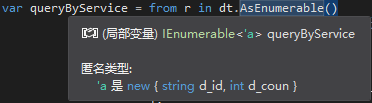

# BanSort

```c#
void BanSort(){
    //禁止排序，用于类列表和缺陷列表
    //dgvDefectObjectList.Columns[i].SortMode = DataGridViewColumnSortMode.NotSortable;
}
```


# pubSampleOpen

`打开样本库`按钮触发

```c#
private void pubSampleOpen(string tmpfp){
    //temfp:存放mdb文件的路径
    
    //显示缺陷列表dgvDefectObjectList
    //显示缺陷缩略图imagelistview
    //显示详细图PictureBox类
}
```

1. 调用`Process.cs`中的[`DataTable ReadAllData()`](Process#ReadAllData)读取mdb数据库。

2. 使用语言集成查询（Language Integrated Query）LINQ表达式对1中得到的DataTable进行条件查询。[LINQ官方教程](https://docs.microsoft.com/en-us/dotnet/csharp/programming-guide/concepts/linq/getting-started-with-linq)

   ```c#
   //返回IEnumerable<out T>对象，这里T为DataRow行对象，可迭代
   var queryByService = from r in dt.AsEnumerable()
                       group r by r.Field<string>("缺陷形状") into g
                       select new
                       {
                           d_id = g.Key,
                           d_coun = g.Count(p1 => p1.Field<string>("缺陷形状") == g.Key),
                       };
   ```

   首先是隐式类型`var`的使用，说白了就是不知道得到的结果是什么类型了，就用var。由编译器推断，可以看到推断出的类型：

   

   其次又设计lambda表达式，本身lambda表达式很好理解，实际上是匿名函数。但在C#中lambda函数作用有很多，详情戳：[Lambda Expressions (C# Programming Guide)](https://docs.microsoft.com/en-us/dotnet/csharp/programming-guide/statements-expressions-operators/lambda-expressions)

   > A lambda expression is an [anonymous function](https://docs.microsoft.com/en-us/dotnet/csharp/programming-guide/statements-expressions-operators/anonymous-methods) that you can use to create [delegates](https://docs.microsoft.com/en-us/dotnet/csharp/programming-guide/delegates/using-delegates) （委派函数）or [expression tree](https://docs.microsoft.com/en-us/dotnet/csharp/programming-guide/concepts/expression-trees/index)（不知道这表达树是啥）types.  

   也可以作为”函数参数“，经常用在Query中，查看[Lambdas with the Standard Query Operators一节](https://docs.microsoft.com/en-us/dotnet/csharp/programming-guide/statements-expressions-operators/lambda-expressions#lambdas-with-the-standard-query-operators)。Many Standard query operators have an input parameter whose type is one of the [`Func<T,TResult>`](https://docs.microsoft.com/en-us/dotnet/api/system.func-2)  family of generic **delegates**. 例如：

   ```c#
   int[] numbers = { 5, 4, 1, 3, 9, 8, 6, 7, 2, 0 };  
   int oddNumbers = numbers.Count(n => n % 2 == 1);//参数类型本该是Func<int,bool>
   
   //Func是委派函数，最后一个参数始终是返回值类型
   public delegate TResult Func<TArg0, TResult>(TArg0 arg0)  
   Func<int, bool> myFunc = x => x == 5;  
   bool result = myFunc(4); // returns false of course  
   ```

   最常用的是将lambda表达式用于LINQ查询，就像程序中用到的：

   >  Lambda expressions are particularly helpful for writing LINQ query expressions. 

   可以浏览[官方教程](https://docs.microsoft.com/zh-cn/dotnet/csharp/linq/query-a-collection-of-objects)简单了解一下，对于`group`+LINQ查询搞得我很懵逼。

   ```c#
   d_coun = g.Count(p1 => p1.Field<string>("缺陷形状") == g.Key)
   //可以改为下面这个吧
   d_coun = g.Count()
   //p1 => p1.Field<string>("缺陷形状") == g.Key 始终为正啊
   //g.Count()本身返回的就是分组后的元素数
   ```

# searchRect

   ```c#
   listRect = new List<Rectangle>();//查询之前要置空
   private void searchRect(string dss, string ddi, string dil){
       //dss:缺陷形状,ddi:dpu_id,dil:imageLabel
       //实际上为listRect赋值：一张图片上所有缺陷的矩形坐标（4个值）列表
   }
   ```

# ShowClearPic

```c#
void ShowClearPic(string path,PictureBox pb){
    //在pb中显示路径为path的图片
    //showROI
}
```

# showROI

4484没弄懂他是咋画的

```c#
private void showROI()
```


