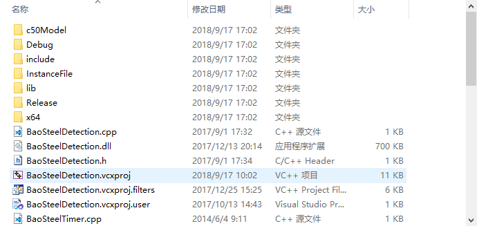
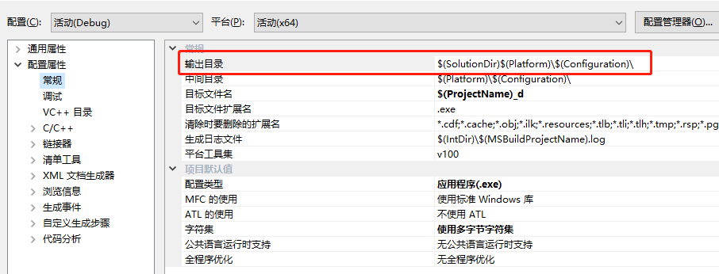
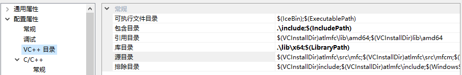
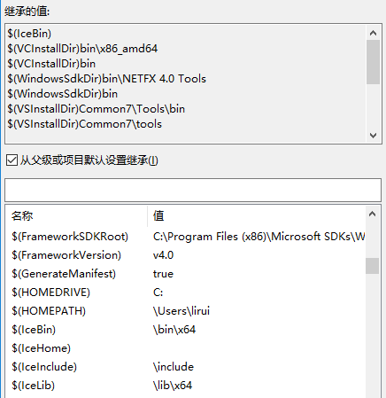
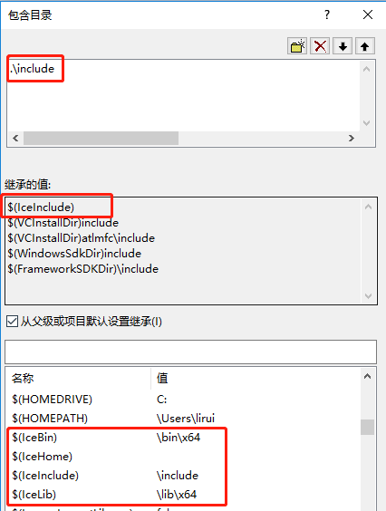
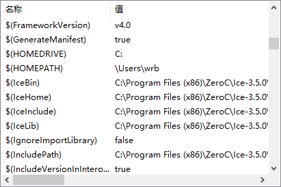
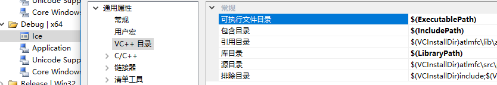
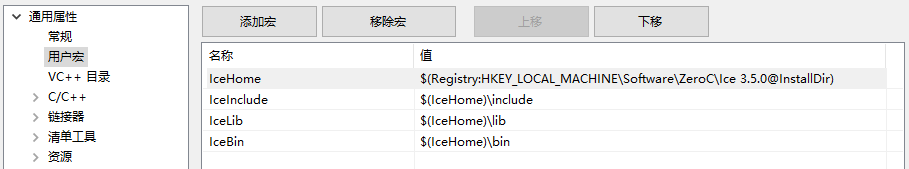

# 目录结构

我的路径：F:\BaoSteelDetection_dll0824\BaoSteelDetection_dll

+ c50Model存放特征名文件、缺陷id列表和xgb.model

+ InstanceFile目录下也是一些源文件。

+ include存放要用到的头文件，有opencv和xgboost（检测还用到xgboost？）

  

+ lib则放的是动态库，包括.dll和.lib文件。其中还有个x64文件夹，可能lib文件夹下是x86的吧。其中有：

  待续。。。。

+ **x64下也有Debug和Release目录**？图片中的Debug、Release目录是WIn32（x86）的？？？在上一级目录也有Debug、Release目录，不过是空的。。咋回事啊。

  

# 配置

## 一

1. 可执行文件目录：不知道这是啥。。。。。。。。

   

2. 包含目录：.\include，头文件。添加了项目中的.include目录和ICE的include目录。还用到了**宏**，如何添加用户自定义的宏呢，查看：[Visual Studio属性配置中使用宏](https://blog.csdn.net/raodotcong/article/details/9209591)。

   由于项目是从其他计算机拷过来的，路径变成了下面这个样子：

   

   原来的样子：

   

   其中，继承的值不能编辑，\$IceInclude是怎么添加到”继承的值“的呢？首先添加`新项目属性表`Ice配置用户宏，参考下一节。然后修改Ice表属性中的VC++目录，在这里添加是对全局起作用的（是在Microsoft.Cpp.Win32.user这里修改才是全局其作用吧，即对新建项目也起作用）：可执行文件目录\$(IceBin)、包含目录\$(IceInclude)、库目录$(IceLib)

   

3. 库目录：.\lib\x64，.lib文件。与包含目录配置道理一样。

插件如何定位你的Ice 安装位置? C:\Users\All Users\ZeroC\Ice.props中定义的几个宏 (\$(IceHome),\$(IceInclude),\$(IceBin),\$(IceLib))定义了几个路径的位置。 之后就可以编写server或者client程序，并编译了。 --------------------- 本文来自 骑在木马上的黑客 的CSDN 博客 ，全文地址请点击：https://blog.csdn.net/KnightOnHourse/article/details/80387656?utm_source=copy  

## 二

链接器>>>输入>>>附加依赖项，添加所用到的库

ice.lib
iceutil.lib
opencv_core246.lib
opencv_highgui246.lib
opencv_imgproc246.lib
opencv_ml246.lib
opencv_stitching246.lib
FreeImage.lib
rabit.lib
xgboost_wrapper.lib

## 三

dll怎么找到的？？？？？？

# Visual Studio属性配置中使用宏

视图>>>属性管理器（并不知道是干嘛的）>>>（右键）添加新项目属性表>>>用户宏。

检测项目中定义了ICE的宏：

这是什么鬼：`$(Registry:HKEY_LOCAL_MACHINE\Software\ZeroC\Ice 3.5.0@InstallDir)`

