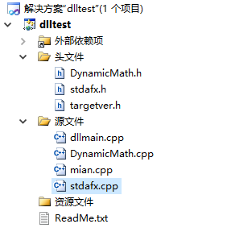
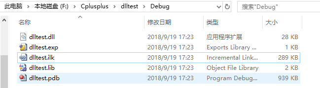
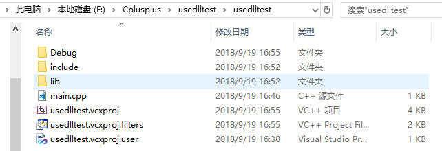

# VS2010中配置opencv库

遇到的问题：

+ 怎么配置？
+ .h .lib .dll文件之间的关系？
+ 静态库与动态库？
+ 静态库与动态库啥时候用？源代码到可执行文件经历了哪些经历？预处理、编译、汇编、链接 ？

## 配置

参考：

[OpenCV 2.4.9 +VS 开发环境配置](https://blog.csdn.net/poem_qianmo/article/details/19809337)

[VS配置OpenCV开发环境(c++)：How & Why](https://www.cnblogs.com/fourseas/p/6294256.html)

参考的博文用了两种不同的配置方法，对应下文的一二方法。

### 一方法

1. 第一种在项目右键`属性`中的`VC++目录`中增加`包含目录`和`库目录`。

    我理解的就是包含目录是opencv中的include底下的目录，有opencv、opencv2两个目录，包含的是.h、.hpp头文件。这里博文中添加了三个目录include本身及其opencv、opencv2两个子目录。PS：貌似添加一个include目录就好了。

    库目录则是包含.lib文件的目录，我的是D:\Program Files\opencv\build\x86\vc10\lib，其中x86对应WIn32，x64对应X64编译器。vcxx的版本要对应VS的版本：

    | IDE        | 编译器   |
    | ---------- | -------- |
    | VS2017     | VC15     |
    | VS2015     | VC14     |
    | VS2013     | VC12     |
    | VS2012     | VC11     |
    | **VS2010** | **VC10** |
    | VS2008     | VC9      |
    | VS2005     | VC8      |

2. 在项目右键`属性`中的`链接器`的`输入`中，添加`附加依赖项`。把要用到的.lib的文件名添加到这里来。不知道啥是啥的就全部添加进来。

    opencv_ml249d.lib
    opencv_calib3d249d.lib
    opencv_contrib249d.lib
    opencv_core249d.lib
    opencv_features2d249d.lib
    opencv_flann249d.lib
    opencv_gpu249d.lib
    opencv_highgui249d.lib
    opencv_imgproc249d.lib
    opencv_legacy249d.lib
    opencv_objdetect249d.lib
    opencv_ts249d.lib
    opencv_video249d.lib
    opencv_nonfree249d.lib
    opencv_ocl249d.lib
    opencv_photo249d.lib
    opencv_stitching249d.lib
    opencv_superres249d.lib
    opencv_videostab249d.lib

    

    opencv_objdetect249.lib
    opencv_ts249.lib
    opencv_video249.lib
    opencv_nonfree249.lib
    opencv_ocl249.lib
    opencv_photo249.lib
    opencv_stitching249.lib
    opencv_superres249.lib
    opencv_videostab249.lib
    opencv_calib3d249.lib
    opencv_contrib249.lib
    opencv_core249.lib
    opencv_features2d249.lib
    opencv_flann249.lib
    opencv_gpu249.lib
    opencv_highgui249.lib
    opencv_imgproc249.lib
    opencv_legacy249.lib
    opencv_ml249.lib

    

    **注意**：对于【OpenCV 3.0】，添加3.0版本的lib，新版的lib非常简单。想用debug版本的库，添加opencv_ts300d.lib、opencv_world300d.lib 这两个库即可。
    而想用release版本的库，添加opencv_ts300.lib、opencv_world300.lib即可。
    其实，对已经发行和未来即将发布的新版OpenCV，只需看opencv\build\x86\vc10\lib下的库是哪几个，添加成依赖项就可以了。

3. OpenCV动态链接库的配置

    问题就是如何能让可执行文件找到.dll文件。动态链接库的为目录：D:\Program Files\opencv\build\x86\vc10\bin，其中包含.dll文件。

    + 配置环境变量PATH，增加其.dll目录：D:\Program Files\opencv\build\x86\vc10\bin。这样做是在调用“**32位的、由vc10编译器生成的、动态链接库形式的**OpenCV库”，。需要重启，否则依然找不到.dll文件。（一方法用了这个，项目复制到其他计算机要重新配置dll）
    + 把相关的dll都拷贝到Windows操作系统的目录下 ：c:\Windows\System32 。PS:对于Windows 8，则要放在要在SysWOW64文件夹中。 （不推荐，想想也不清真）
    + 将bin下的.dll文件复制到本项目生成的exe文件所在目录中，如果没有Debug这个目录，那么先把项目生成/运行一遍就有了。 

    exe在运行时，会在特定的目录下寻找自己依赖的库 ，上述三个地方都会被搜索到。顺序不知道。

### 二方法

相对于一方法的第一步不同。

1. 是在`C/C++`的`常规`中的`附加包含目录`添加include文件夹路径。

   在`链接器`中`常规`的`附加库目录`中添加lib文件夹路径。

2. 与一方法一样。配置附加依赖项。文章中也这么说：

   > 本文在【附加依赖项】中填入了【opencv_ts300.lib】和【opencv_world300.lib】。很多教程在这里，针对程序的debug版本和release版本，填入了不同的内容：debug版本会在".lib"前，加上一个字母"d"。这是为了让程序在debug模式下，调用debug版本的OpenCV库。我认为，只要你不需要在调试代码的时候，进入OpenCV库函数里面一探究竟，就没必要做这一步，毕竟debug库速度不及release库。所以按照本文的配置，无论VS用debug还是release模式，调用的都是release库。 

   也可以以显示方法写在代码里：

   ```c++
   #pragma comment(lib,"E:\\ENV\\opencv-3.0\\build\\x86\\vc12\\lib\\opencv_ts300.lib")
   #pragma comment(lib,"E:\\ENV\\opencv-3.0\\build\\x86\\vc12\\lib\\opencv_world300.lib")
   ```

3. 动态链接库的配置，直接将.dll文件复制到exe所在文件夹下。

## C++静态库与动态库 

参考[C++静态库与动态库](http://www.cnblogs.com/skynet/p/3372855.html)

我们要知道如何在Windows~~/Linux~~下创建与使用动态库。使用工具为VS。

### 创建动态链接库dll

1. 创建Win32应用程序，把dll选项勾上，之后生成的就不是exe文件，而是dll。

2. 目录结构如下：（本来是生成dlltest.cpp，我给改成`DynamicMath.cpp`，忽略`main.cpp`）

  

  自动生成文件`dllmain.cpp`:

  ```c++
  // dllmain.cpp : 定义 DLL 应用程序的入口点。
  #include "stdafx.h"
  
  BOOL APIENTRY DllMain( HMODULE hModule,
                         DWORD  ul_reason_for_call,
                         LPVOID lpReserved
  					 )
  {
  	switch (ul_reason_for_call)
  	{
  	case DLL_PROCESS_ATTACH:
  	case DLL_THREAD_ATTACH:
  	case DLL_THREAD_DETACH:
  	case DLL_PROCESS_DETACH:
  		break;
  	}
  	return TRUE;
  }
  ```

  `DynamicMath.h`，我就只实验加法了，其他注释掉

  ```c++
  #pragma once
  class DynamicMath
  {
  public:
      __declspec(dllexport) DynamicMath(void);
  
      __declspec(dllexport) ~DynamicMath(void);
      
  
      static __declspec(dllexport) double add(double a, double b);//加法
  
      //static __declspec(dllexport) double sub(double a, double b);//减法
  
      //static __declspec(dllexport) double mul(double a, double b);//乘法
  
      //static __declspec(dllexport) double div(double a, double b);//除法
  
      __declspec(dllexport) void print();
  
  };
  ```

  `DynamicMath.cpp`

  ```c++
  #include "stdafx.h"
  #include "DynamicMath.h"
  
  double DynamicMath::add(double a, double b)
  {
  	return a+b;
  }
  ```

3. 生成就可以了，Debug目录下文件生成.dll和导入库.lib文件

   
### 使用dll

使用上一步骤提供的`DynamicMath.h`头文件，`dlltest.dll`和`dlltest.lib`动态库文件。

新建项目，可以新建include和lib文件夹，把头文件和.lib文件分别放入，.dll文件直接拷贝到exe所在目录下。



按照[配置](#配置)一节配置好路径即可。

可以运行`main.cpp`了：

```c++
#include "DynamicMath.h"
#include <iostream>
//将dlltest.dll复制到了exe所在目录下
int main()
{
	double a;
	a = DynamicMath::add(2.0,3.0);
	std::cout<<a<<std::endl;
	
	std::cin.get();
	return 0;
}
```

## 编译器

参考：

[C++ 编译器工作原理](https://github.com/xuelangZF/CS_Offer/blob/master/C%2B%2B/Compiler.md)
[编译：一个 C程序的艺术之旅](https://ring0.me/2014/11/c-compiler/)

先了解一下即可。