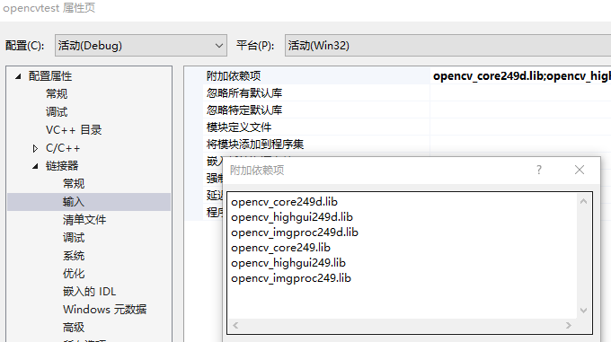

# 记录莫名奇妙的错误

### 1 未加载opencv_imgproc249d.pdb

```c++
vector<vector<Point> > contours;
	vector<Vec4i> hierarchy;
	findContours(canny_output, contours, hierarchy, CV_RETR_TREE, CV_CHAIN_APPROX_SIMPLE, Point(0, 0));

	cout << contours.size() << endl;
	vector<Moments> mu(contours.size());
	for (int i = 0; i < (int)contours.size(); i++)
	{
		mu[i] = moments(contours[i], false);  //这里报错
	}
```


因为测试只用debug模式，所以在下图添加的全都是\*d.lib。把\*.lib的添加上去就好了。。。。




一小时后，他妈的又报错。。。