 0 (black), 255 (white) 

检测算法用到的函数总结

## 结构体

### depth

```c++
#define CV_8U   0
#define CV_8S   1 
#define CV_16U  2
#define CV_16S  3
#define CV_32S  4
#define CV_32F  5
#define CV_64F  6
//多通道
#define CV_8UC4 CV_MAKETYPE(CV_8U,4)   //0+((4-1) << 3) == 24
```

[What are the differences between CV_8U and CV_32F](https://stackoverflow.com/questions/8377091/what-are-the-differences-between-cv-8u-and-cv-32f-and-what-should-i-worry-about)

需要知道：

+ `CV_8U`: 1-byte unsigned integer (`unsigned char`).
+ `CV_32S`: 4-byte signed integer (`int`).
+ `CV_32F`: 4-byte floating point (`float`).
+ `CV_64F`: 8-byte doublepoint (`double`).


### CvScalar

```c++
typedef struct CvScalar
{
    double val[4];
}
CvScalar;
```

### IplImage

```c++
typedef struct _IplImage
{
    int  nSize;             /* sizeof(IplImage) */
    int  ID;                /* version (=0)*/
    int  nChannels;         /* Most of OpenCV functions support 1,2,3 or 4 channels */
    int  alphaChannel;      /* Ignored by OpenCV */
    int  depth;             /* Pixel depth in bits: IPL_DEPTH_8U, IPL_DEPTH_8S, IPL_DEPTH_16S,
                               IPL_DEPTH_32S, IPL_DEPTH_32F and IPL_DEPTH_64F are supported.  */
    char colorModel[4];     /* Ignored by OpenCV */
    char channelSeq[4];     /* ditto */
    int  dataOrder;         /* 0 - interleaved color channels, 1 - separate color channels.
                               cvCreateImage can only create interleaved images */
    int  origin;            /* 0 - top-left origin,
                               1 - bottom-left origin (Windows bitmaps style).  */
    int  align;             /* Alignment of image rows (4 or 8).
                               OpenCV ignores it and uses widthStep instead.    */
    int  width;             /* Image width in pixels.                           */
    int  height;            /* Image height in pixels.                          */
    struct _IplROI *roi;    /* Image ROI. If NULL, the whole image is selected. */
    struct _IplImage *maskROI;      /* Must be NULL. */
    void  *imageId;                 /* "           " */
    struct _IplTileInfo *tileInfo;  /* "           " */
    int  imageSize;         /* Image data size in bytes
                               (==image->height*image->widthStep
                               in case of interleaved data)*/
    char *imageData;        /* Pointer to aligned image data.         */
    int  widthStep;         /* Size of aligned image row in bytes.    */
    int  BorderMode[4];     /* Ignored by OpenCV.                     */
    int  BorderConst[4];    /* Ditto.                                 */
    char *imageDataOrigin;  /* Pointer to very origin of image data
                               (not necessarily aligned) -
                               needed for correct deallocation */
}
IplImage;
```

貌似常用的只用int width、int heigth、char *imagedata、widthStep。

## 函数

### addWeighted

函数原型为：`dst = cv2.addWeighted(src1, alpha, src2, beta, gamma[, dst[, dtype]]) `

其中alpha是第一幅图片中元素的权重，beta是第二个的权重， gamma是加到最后结果上的一个值。

**功能：**实现以不同的权重将两幅图片叠加，对于不同的权重，叠加后的图像会有不同的透明度


### Canny

```c++
//接口
void Canny( InputArray image, OutputArray edges,
           double threshold1, double threshold2,
           int apertureSize=3, bool L2gradient=false );
/**
 * Parameters: 
 * image – single-channel 8-bit input image.
 * edges – output edge map; it has the same size and type as image .
 * threshold1 – first threshold for the hysteresis procedure.
 * threshold2 – second threshold for the hysteresis procedure.
 * apertureSize – aperture size for the Sobel() operator.
 * L2gradient – a flag, indicating whether a more accurate  L_2 norm = sqrt{(dI/dx)^2 + (dI/dy)^2} should be used to calculate the 
 * image gradient magnitude ( L2gradient=true ), or whether the default  
 *  L_1 norm  =|dI/dx|+|dI/dy| is enough ( L2gradient=false ).
 */
```

参考:

[Canny边缘检测算法原理及C语言实现详解](https://www.cnblogs.com/love6tao/p/5152020.html)]

[Canny算法原理及源码实现](http://yanghespace.com/2015/11/25/Canny%E7%AE%97%E6%B3%95%E5%8E%9F%E7%90%86%E5%8F%8A%E5%AE%9E%E7%8E%B0/)

Canny算法是John F.Canny在1986年提出的边缘检测算法[1]，但它仍然是目前十分流行的边缘检测算子。

JFC在论文中提到边缘最优边缘检测的三个标准：

+ 检测标准：不丢失重要的边缘，不应有虚假的边缘。
+ 定位标准：实际边缘与检测到的边缘位置之间的偏差最小。
+ 单响应标准：将多个响应降低为单个边缘响应。这一点被第一个标准部分地覆盖了。

第三个标准简单点说就是检测出来的边缘的边缘宽度应该为1。

步骤：

1. 平滑处理：将图像与尺度为σ的高斯函数做卷积（高斯滤波）。 

2. 边缘强度计算：计算图像的边缘幅度及方向（一般用sobel算子）。 

   + 边缘强度：g=dx2+dy2
   + 边缘方向：θ=atan2(dy,dx)  

   一般在算法实现中，为了效率边缘强度的计算会使用|dx|+|dy|表达。 

3. 非极大值抑制：只有局部极大值标记为边缘。 

4. 滞后阈值化处理。 


### convertScaleAbs

一般将经过Sobel处理后的深度为CV_16S（梯度是有符号的）的图像转化为CV_8U，否则将无法显示图像，而只是一副灰色的窗口。

```c++
#include <opencv2/core/core.hpp>
//! scales array elements, 
//computes absolute values and converts the results to 8-bit unsigned integers:
//dst(i)=saturate_cast<uchar>abs(src(i)*alpha+beta)
CV_EXPORTS_W void convertScaleAbs(InputArray src, OutputArray dst,
                                  double alpha=1,//乘数因子
                                  double beta=0);//偏移量
```

saturate_cast防止数据溢出 [0,255]。


### cvGet2D

示例代码：

取值

```c++
//unsigned char *data = img_gray.data; 
IplImage *test = &IplImage(img_gray);
double g;
g = cvGet2D(test, 1, 1).val[0];  //不能传入uchar类型的指针 data，必须是CvArr*类型
cout << g << endl;
```


```c++
//opencv\build\include\opencv2\core\core_c.h
CVAPI(CvScalar) cvGet2D( const CvArr* arr, int idx0, int idx1 );
```

```c++
/* CvArr* is used to pass arbitrary array-like data structures
 * into functions where the particular
 * array type is recognized at runtime:
 */
typedef void CvArr;  //array-like 数据类型。
```


### dilate（膨胀）

[OpenCV图像处理|1.10 膨胀与腐蚀](https://zhuanlan.zhihu.com/p/40326127)


### findContours

```c++
void findContours(InputOutputArray image, 
                  OutputArrayOfArrays contours, 
                  OutputArray hierarchy, 
                  int mode, 
                  int method, 
                  Point offset=Point())

void findContours(InputOutputArray image, 
                  OutputArrayOfArrays contours, 
                  int mode, 
                  int method, 
                  Point offset=Point())
```

+ **image** – Source, an 8-bit single-channel image. Non-zero pixels are treated as 1’s. Zero pixels remain 0’s, so the image is treated as `binary` . You can use `compare()` , `inRange()` , `threshold()`, `adaptiveThreshold()`, `Canny()`, and others to create a binary image out of a grayscale or color one. **The function modifies the `image`** while extracting the contours. If mode equals to `CV_RETR_CCOMP` or `CV_RETR_FLOODFILL`, the input can also be a 32-bit integer image of labels (`CV_32SC1`).

  将输入图像看作二值图, 在提取轮廓的过程中会改变图像.

+ **contours** – Detected contours. Each contour is stored as a vector of points.

  每个轮廓会存储为`vector<Point>`, 所以 contours 的类型为:`vector<vector<Point>> `.

+ **hierarchy** – Optional output vector, containing information about the image topology. It has as many elements as the number of contours. For each i-th contour `contours[i]` , the elements `hierarchy[i][0]` , `hiearchy[i][1]` , `hiearchy[i][2]` , and `hiearchy[i][3]` are set to 0-based indices in `contours` of the next and previous contours at the same hierarchical level, the first child contour and the parent contour, respectively. If for the contour `i` there are no next, previous, parent, or nested contours, the corresponding elements of `hierarchy[i]` will be negative.

  层次结构，可选的输出向量，包含关于图像的拓扑结构信息。其具有跟轮廓 数相同的元素个数,类型为:`vector<Vec4i>`. 分别保存同等级的下一个、上一个轮廓，和第一个子轮廓，以及父轮廓。

+ **mode** –Contour retrieval mode (if you use Python see also a note below).

  + **CV_RETR_EXTERNAL** retrieves only the extreme outer contours. It sets `hierarchy[i][2]=hierarchy[i][3]=-1` for all the contours.

    只提取外围轮廓，故无子轮廓和父轮廓。

  + **CV_RETR_LIST** retrieves all of the contours without establishing any hierarchical relationships.

    提取所有轮廓，但不建立层次关系？

  + **CV_RETR_CCOMP** retrieves all of the contours and organizes them into a two-level hierarchy. At the top level, there are external boundaries of the components. At the second level, there are boundaries of the holes. If there is another contour inside a hole of a connected component, it is still put at the top level.

    ？？？？？？？

  + **CV_RETR_TREE** retrieves all of the contours and reconstructs a full hierarchy of nested contours. This full hierarchy is built and shown in the OpenCV `contours.c` demo.

    

+ **method** –Contour approximation method.

  + **CV_CHAIN_APPROX_NONE** stores absolutely all the contour points. That is, any 2 subsequent points `(x1,y1)` and `(x2,y2)`of the contour will be either horizontal, vertical or diagonal neighbors, that is, `max(abs(x1-x2),abs(y2-y1))==1`.

    存储所有轮廓上的点，轮廓上两个连续的点在原图之上相邻。

  + **CV_CHAIN_APPROX_SIMPLE** compresses horizontal, vertical, and diagonal segments and leaves only their end points. For example, an up-right rectangular contour is encoded with 4 points.

    压缩轮廓，只存储垂直、水平、对角的末位point。

  + **CV_CHAIN_APPROX_TC89_L1,CV_CHAIN_APPROX_TC89_KCOS** applies one of the flavors of the Teh-Chin chain approximation algorithm. See [[TehChin89\]](https://docs.opencv.org/2.4/modules/imgproc/doc/structural_analysis_and_shape_descriptors.html#tehchin89) for details.

    近似算法？

  

+ **offset** – Optional offset by which every contour point is shifted. This is useful if the contours are extracted from the image ROI and then they should be analyzed in the whole image context. 

  可选偏移量，就是简单的平移，在做了ROI步骤之后特别有用。ps不知道哪里有用。

```c++
void drawContours( InputOutputArray image, InputArrayOfArrays contours,
                  int contourIdx, const Scalar& color,
                  int thickness=1, int lineType=8,
                  InputArray hierarchy=noArray(),
                  int maxLevel=INT_MAX, Point offset=Point() );
```


例子：

```c++
Mat m_fold = grad.clone();
vector<vector<Point>> contours;
cv::findContours(m_fold, contours, CV_RETR_EXTERNAL, CV_CHAIN_APPROX_NONE);
Mat sal_edge = Mat::zeros(m_fold.size(), CV_8UC1);
cout << contours.size() << endl;

for (auto it = contours.begin(); it != contours.end(); it++)
{
    int point_sum = (*it).size();  //point是-14了
    Rect rect = boundingRect(*it);  //坐标变成负数了。。
    if (point_sum > 40)
        m_fold(rect).copyTo(sal_edge(rect));
}

namedWindow("去小点");
imshow("去小点", sal_edge);
```


### flip

```c++
void cv::flip(
	cv::InputArray src, // 输入图像
	cv::OutputArray dst, // 输出
	int flipCode = 0 // 0: 沿y-轴翻转, 0: 沿x-轴翻转, <0: x、y轴同时翻转
);
```

+ **flipCode** – a flag to specify how to flip the array; **0 means flipping around the x-axis** and **positive value (for example, 1) means flipping around y-axis**. Negative value (for example, -1) means flipping around both axes (see the discussion below for the formulas).

其实搞不清的点是opencv里的坐标系，原点是哪个？哪个是x轴，哪个是y轴？

沿着x轴翻转是垂直翻转（Vertical flipping ），沿着y轴是水平翻转（Horizontal flipping ）。

应该是左上角（ top-left ）是原点。

### GaussianBlur

去噪以平滑图像（smooth images），当然也有其他方法平滑图像。 [原理](https://docs.opencv.org/2.4/doc/tutorials/imgproc/gausian_median_blur_bilateral_filter/gausian_median_blur_bilateral_filter.html) 以及 [API](https://docs.opencv.org/2.4/modules/imgproc/doc/filtering.html#gaussianblur)。

```c++
#include "opencv2/imgproc/imgproc.hpp
void GaussianBlur( InputArray src,//可以有多个channels，独立处理
                  OutputArray dst, Size ksize,
                  double sigmaX, double sigmaY=0,
                  int borderType=BORDER_DEFAULT );
```

+ src - depth 应该是以下类型`CV_8U`, `CV_16U`, `CV_16S`, `CV_32F` or `CV_64F`. 

+ ksize - 高斯核函数，`ksize.width` and `ksize.height` can differ，但必须是正数和奇数。也可以为0，然后根据 sigmaX 计算。In-place filtering is supported.

+ **sigmaX** – Gaussian kernel standard deviation in X direction. 高斯函数中有此参数。

+ **sigmaY** – Gaussian kernel standard deviation in Y direction;

   if `sigmaY` is zero, it is set to be equal to `sigmaX`。

  假如两个sigmas都是0，他们各自从核函数的宽、高来计算。

  为了完全控制结果而不考虑未来对语义的修改，建议指定所有ksize，sigmaX和sigmaY。

+ **borderType** – pixel extrapolation method。不了解

平滑公式：

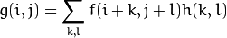

h(k,l) 是 kernel，只不过是过滤器的系数。

A 1D Gaussian kernel，可以想象2D的核函数：


 A 2D Gaussian can be represented as : 

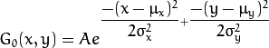

离散化二维高斯函数：

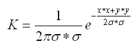 

μ 是平均值（峰值），σ 是标准差。(per each of the variables x and y)。A是？？？？

那么模板中每一个点的高斯系数可以由上面的公式计算，这样得到的是不是最终的模板呢？答案不是，需要归一化，也即是每一个点的系数要除以所有系数之和，这样才是最终的二维高斯模板 。

>  这个里面有个小知识点，要想计算上面的系数，需要知道高斯函数的标准差σ （sigma），还需要知道选3*3还是5*5的模板，也就是模板要多大，实际应用的时候，这两者是有关系的，根据数理统计的知识，高斯分布的特点就是数值分布在（μ—3σ,μ+3σ)中的概率为0.9974，也就是模板的大小其实就是6σ这么大就OK了，但是6σ可能不是奇数，因为我们一定要保证有核心。所以模板窗口的大小一般采用1+2\*ceil(3\*nSigma) ceil是向上取整函数，例如ceil(0.6)=1。 


### minMaxLoc

```c++
double gray_min, gray_max;
minMaxLoc(orgin_cut(r_max),&gray_min,&gray_max);
```


### rectangle

```c++
cv::rectangle(caibian,cvPoint(beginX,0),cvPoint(endX,height),cvScalar(255,255,255),1); 
cv::rectangle(m_orginal, cv::Rect(beginX,beginY,width,height), cv::Scalar(255));
```


### reduce


### Sobel

`#include "opencv2/imgproc/imgproc.hpp"`，[api](https://docs.opencv.org/2.4/modules/imgproc/doc/filtering.html#sobel)以及[例子](https://docs.opencv.org/2.4/doc/tutorials/imgproc/imgtrans/sobel_derivatives/sobel_derivatives.html)

```c++
void Sobel( InputArray src, OutputArray dst, int ddepth,
                         int dx, int dy, int ksize=3,
                         double scale=1, double delta=0,
                         int borderType=BORDER_DEFAULT );
```

+ **ddepth**：dst输出图像的深度。支持对应关系：

  + `src.depth()` = `CV_8U`, `ddepth` = -1/`CV_16S`/`CV_32F`/`CV_64F`
  + `src.depth()` = `CV_16U`/`CV_16S`, `ddepth` = -1/`CV_32F`/`CV_64F`
  + `src.depth()` = `CV_32F`, `ddepth` = -1/`CV_32F`/`CV_64F`
  + `src.depth()` = `CV_64F`, `ddepth` = -1/`CV_64F`

+ **dx** – 对x轴方向求导的阶数。

+ **dy** – order of the derivative y.

+ **ksize** – size of the extended Sobel kernel; it must be 1, 3, 5, or 7.

+ **scale** – optional scale factor for the computed derivative values; by default, no scaling is applied (see [`getDerivKernels()`](https://docs.opencv.org/2.4/modules/imgproc/doc/filtering.html#void%20getDerivKernels(OutputArray%20kx,%20OutputArray%20ky,%20int%20dx,%20int%20dy,%20int%20ksize,%20bool%20normalize,%20int%20ktype)) for details).  

  比例常数，默认情况下没有伸缩系数 。

+ **delta** – optional delta value that is added to the results prior to storing them in `dst`. 

  可选增量， 将会加到最终的dst中。

+ **borderType** – pixel extrapolation(外推) method (see [`borderInterpolate()`](https://docs.opencv.org/2.4/modules/imgproc/doc/filtering.html#int%20borderInterpolate(int%20p,%20int%20len,%20int%20borderType)) for details).

示例代码：

```c++
#include "opencv2/imgproc/imgproc.hpp"
#include "opencv2/highgui/highgui.hpp"
#include <stdlib.h>
#include <stdio.h>
using namespace cv;
int main( int argc, char** argv )
{
  Mat src, src_gray;
  Mat grad;
  int scale = 1;
  int delta = 0;
  int ddepth = CV_16S;

  int c;

  /// Load an image
  src = imread( argv[1] );
    
  if( !src.data )
  { return -1; }

  GaussianBlur( src, src, Size(3,3), 0, 0, BORDER_DEFAULT );
  /// 去噪后将其转化为灰度图
  cvtColor( src, src_gray, CV_BGR2GRAY );
  namedWindow( "sobel", CV_WINDOW_AUTOSIZE );
  /// Generate grad_x and grad_y
  Mat grad_x, grad_y;
  Mat abs_grad_x, abs_grad_y;

  /// Gradient X
  //Scharr( src_gray, grad_x, ddepth, 1, 0, scale, delta, BORDER_DEFAULT );
  Sobel( src_gray, grad_x, ddepth, 1, 0, 3, scale, delta, BORDER_DEFAULT );
  convertScaleAbs( grad_x, abs_grad_x );//We convert our partial results back to CV_8U
  /// Gradient Y
  //Scharr( src_gray, grad_y, ddepth, 0, 1, scale, delta, BORDER_DEFAULT );
  Sobel( src_gray, grad_y, ddepth, 0, 1, 3, scale, delta, BORDER_DEFAULT );
  convertScaleAbs( grad_y, abs_grad_y );

  //computing (half of) L1 gradient: "abs(x) + abs(y)", instead of L2: "sqrt(x^2 + y^2)" 
  addWeighted( abs_grad_x, 0.5, abs_grad_y, 0.5, 0, grad );

  imshow( "sobel", grad );
  waitKey(0);
  return 0;
  }
```

Most often, the function is called with ( `dx` = 1, `dy` = 0, `ksize` = 3) or ( dx= 0, dy= 1, `ksize` = 3) to calculate the first x- or y- image derivative. The first case corresponds to a kernel of: 

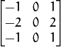

The second case corresponds to a kernel of: 

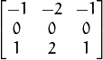

There is also the special value `ksize = CV_SCHARR` (-1) that corresponds to the  3×3   Scharr filter that may give more accurate results ：

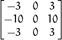

也可以在示例代码中去掉 Scharr 的注释。

### threshold

下面的代码应该解释的很清楚了

```c++
#include "opencv2/imgproc/imgproc.hpp"
double threshold( InputArray src, OutputArray dst,
                  double thresh, double maxval, int type );
```

```c++
/* Threshold types */
enum
{
    CV_THRESH_BINARY      =0,  /* value = value > threshold ? max_value : 0       */
    CV_THRESH_BINARY_INV  =1,  /* value = value > threshold ? 0 : max_value       */
    CV_THRESH_TRUNC       =2,  /* value = value > threshold ? threshold : value   */
    CV_THRESH_TOZERO      =3,  /* value = value > threshold ? value : 0           */
    CV_THRESH_TOZERO_INV  =4,  /* value = value > threshold ? 0 : value           */
    CV_THRESH_MASK        =7,  
    CV_THRESH_OTSU        =8  /* use Otsu algorithm to choose the optimal threshold value;
                                 combine the flag with one of the above CV_THRESH_* values */
};
```

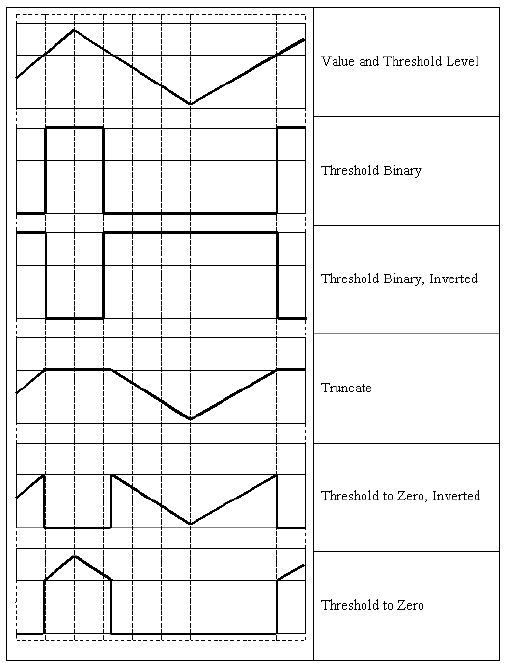

遗留问题：[How Otsu's Binarization Works?](https://docs.opencv.org/3.4.0/d7/d4d/tutorial_py_thresholding.html)。在页面的最下方。


### 矩

opencv中的图像矩有（空间矩，中心矩，归一化中心矩，Hu矩）

```c++
class Moments
{
public:
    Moments();
    Moments(double m00, double m10, double m01, double m20, double m11,
            double m02, double m30, double m21, double m12, double m03 );
    Moments( const CvMoments& moments );
    operator CvMoments() const;

    // spatial moments空间矩
    double  m00, m10, m01, m20, m11, m02, m30, m21, m12, m03;
    // central moments中心矩
    double  mu20, mu11, mu02, mu30, mu21, mu12, mu03;
    // central normalized moments归一化的中心矩
    double  nu20, nu11, nu02, nu30, nu21, nu12, nu03;
}
```

空间矩。实质为面积或者质量。可以通过一阶矩计算质心/重心。 m00实际对应轮廓边界点的数目。

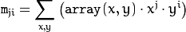

重心：

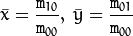 

中心矩，体现的是图像强度的最大和最小方向（中心矩可以构建图像的协方差矩阵），其只具有**平移不变性**，所以用中心矩做匹配效果不会很好： 

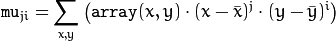

归一化的中心矩，具有尺度不变性：

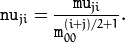

Hu矩由于具有尺度、旋转、平移不变性，由归一化的中心矩线性组合而成，可以用来做匹配：

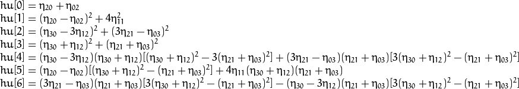


各种函数的总结稍后。

#### moments

```c++
//! computes moments of the rasterized shape or a vector of points
//计算栅格化形状或点矢量的矩
Moments moments( InputArray array, bool binaryImage=false );
```

