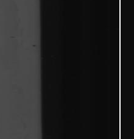
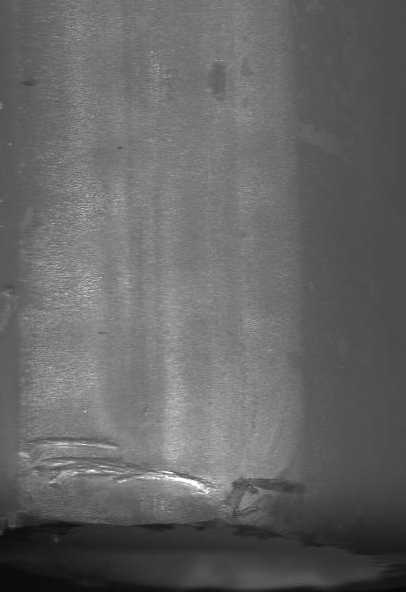
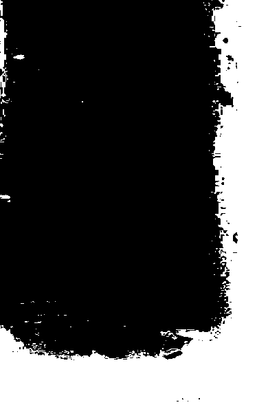
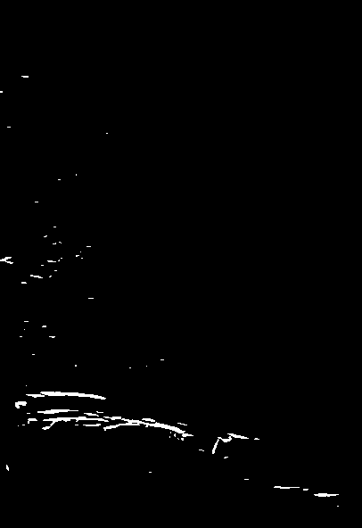
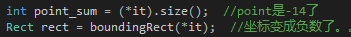

# 检测算法总结

## 读取参数文件

读取参数文件`params1.txt`，存入`vector<DPUParams> params`，结构体`struct DPUParams`定义在`DPUParams.h`，总共三组（有参数文件决定），可以用`params[i]`来访问。

涉及：输入流，字符串操作，字符串转数字。

```c++
cleanval=1:2:3:  //干净度，以？度量
Left_Coefficient=85:90:100:      //倾斜时更新beginX加上此值？
Right_Coefficient=135:130:130:   //倾斜时更新endX加上此值？
DropHeight=910:910:910:  //若钢条高度小于dropHeight则跳过检测
DropWidth=140:200:200:   //若钢条宽度小于dropWidth则跳过检测
clusterX=15:15:15:    //标记连通域用到
clusterY=100:100:50:
black_Intensity=0.8:0.8:0.85: //裁剪图BINARY_INV中二值图系数，在预处理一节
gaussSize_X_Left=11:11:9:
gaussSize_X_Right=5:5:5:
gaussSize_Y_Left=3:3:5:
gaussSize_Y_Right=11:11:9:
dilate_Intensity=3:3:3:
Oxide_GuiGe=0:12:15:
Oxide_Sobel_X=0:30:50:
Oxide_Sobel_Y=0:70:80:
Oxide_Gaussian_X_Left=0:11:9:
Oxide_Gaussian_X_Right=0:7:5:
Oxide_Gaussian_Y_Left=0:7:5:
Oxide_Gaussian_Y_Right=0:11:11:
sobel_X=40:50:55:
sobel_Y=40:55:100:
pointthres=16:20:40:
Oxide_pointthres=10:20:20:
proX_Size=1:1:0.27:
Black_Line=3:5:0:
RollSeam_High=1.8:1.21:1.72:
RollSeam_Low=0.84:0.72:0.66:
conutSum=450:20:20:
Oxide_Intensity=0:4000:5500:
Black_Coefficient=0.9:0.15:0:
PixelsMin=70:80:100:
Vertical_Resolution=0.3:0.3:0.3:
Horizaontal_Resolution=0.058:0.058:0.058:
cameraHeight=1000
cameraWidth=1024
[defectTHRE]

defectHeight=60:60:60:
defectWidth=60:60:60:
```

## 初始化DefectDetectionInstanceA类

```c++
DefectDetectionInstanceA detection(params); //用读取的参数初始化
```

其头文件如下，继承`DefectDetectionInstance`类：

```c++
class DLL_API DefectDetectionInstanceA : public DefectDetectionInstance
{
private:

	C5CalFeature *c5calfeature;//shangyufei 20161129
    BoosterHandle hBooster;
	vector<string> featureNameList;
	IceUtil::Monitor<IceUtil::Mutex>	_monitor;
	inline void readfeature(string path);
	inline int predict(list<double> featureList, int cols);
public:
	DefectDetectionInstanceA(void);
	DefectDetectionInstanceA(std::vector<DPUParams>& params);
	~DefectDetectionInstanceA(void);
	virtual bool detectionProcess(GlobalEntity::DPUImage* img, GlobalEntity::DefectObjectList& dol);
	void project_Img(int width,int height,unsigned char* pData);
	
};
```

继承于下面的`DefectDetectionInstance`类，一个缺陷处理虚函数、一个参数容器：

```c++
#pragma once
#include "GlobalEntity.h"
#include "DPUParams.h"
/*
 *	缺陷处理抽象类
 */
class DefectDetectionInstance
{
public:
	DefectDetectionInstance(){};
	/*==================================================================
	 * 函数名	：	detectionProcess   
	 * 功能		：  缺陷处理流程的接口
	 * 输入参数	：	GlobalEntity::DPUImage * img:输入图像
	 * 输入参数	：	GlobalEntity::DefectObjectList & dol:缺陷列表
	 * 返回值	：	bool：是否有缺陷
	/*==================================================================*/
	virtual bool detectionProcess(GlobalEntity::DPUImage* img, GlobalEntity::DefectObjectList& dol) = 0;
	~DefectDetectionInstance(void){};
public:
	std::vector<DPUParams> _dpuParams;
};

```

可以看到缺陷检测函数`detectionProcess()`的输入：

+ GlobalEntity::DPUImage * img：输入图像
+ GlobalEntity::DefectObjectList & dol：缺陷列表，未初始化。用于存储检测出来的缺陷。

两者定义在 GlobalEntity.h 头文件，这个是只读文件，由[`GlobalEntity.ice`](GlobalEntity.ice)文件（没找到？在跟main同一目录下）自动生成。这两个作为输入的结构体可以在ICE文件中找到。

## 读取img和构建目录结构

读取图片路径，并且创建一些用于保存结果的文件夹。

涉及：文件夹操作和遍历。

这些字符串直到用到才知道干什么的：

```c++
string str_src = "F:\\pic_test\\20180914 73.03-5.51-1124\\1\\1";

string label = "result09012_1";
//%s用来匹配图片名，作为文件通配符
string str_find = str_src + "\\*.*"; //去匹配*,用于搜索.图片？。下面四个都是fommat格式
string str_name = str_src +"\\%s";
string str_result = str_src + "\\"+label+"\\%s";
string str_without = str_src +"\\without\\%s";
```

这里用到啦：

```c++
sprintf(realpath,str_name.c_str(), FindFileData.cFileName);
sprintf(finalpath,str_result.c_str(), FindFileData.cFileName);
sprintf(withoutdetect,str_without.c_str(),FindFileData.cFileName);
```


文件夹或文件的访问看：[WIN32_FIND_DATA的使用](WIN32_FIND_DATA .md )。


初始化 GlobalEntity::DPUImage * img，下面是关键代码：

```c++
//1存入vector<byte> buffer;
src = cv::imread(realpath);
cvtColor( src, m_gray, CV_RGB2GRAY );
unsigned char* data = m_gray.data;
for(int i = 0;i< img->width*img->height ; i++)
{
	img->buffer.push_back(data[i]);  //vector<byte> buffer;
}
//2传输后
unsigned char* pData=img->buffer.data();
cv::Mat m_orginal = cv::Mat(height,width,CV_8U,pData);
```

不直接用opencv的图像格式，是因为图像采集那块没有使用opencv库。所以将图像储存为`vector<byte>`类型。

## detectionProcess

调用 detection.detectionProcess(&img, dol);	实现在`DefectDetectionInstanceA.cpp`中。

默认干净度为 3，cleanval = 3; 。

为什么翻转？？？

```c++
flip(m_orginal, m_orginal, 0);
```

### 裁边

```c++
m_sobelcut,    //Sobel计算x方向梯度
m_sobelcut_abs,//converts the Sobel result to 8-bit.
m_sobelcut_bin,//m_sobelcut_abs>6?64:0
m_gray;        //m_orginal>30?64:0，认为像素值大于30的为钢体,--->64
```

规格与长度的关系？与水平和垂直分辨率有关

实际长度转化为像素数公式：水平方向：实际/0.14=像素数，垂直：实际高度/0.5=像素数

```c++
float guige = 73;//img->sDou;
float length = guige * 7;//用钢管规格*7，用来判断裁边
```

横向纵向求和压缩（reduce），虽然reduce，但是维度没有减少到一维，访问`m_vertical.at<int>(0,i)` ，参数应该是(行, 列)，对应(y, x) 。

```c++
//将m_gray[0,64]压缩为列向量
Mat gray_horisobel; //水平
reduce(m_gray,gray_horisobel,1,CV_REDUCE_SUM,CV_32S);
//将原图m_orginal压缩为行向量
Mat m_vertical;  //垂直
reduce(m_orginal,m_vertical,0,CV_REDUCE_SUM,CV_32S);
```

如果 gray_horisobel 列向量某一位置的值超过 thrY ，那么认为有钢。**找到上下边界**。

```c++
long thrY = 50 * grayScale; //50,认为钢管最小宽度为50像素，阈值则为50*64
```

会得到：beginY、endY、height

**开始找左右边界**，主要介绍变量的含义：

```c++
Mat m_sumsobel,//m_sobelcut_bin[0,64],压缩为行向量
m_sumupsobel,  //m_sobelcut_bin 前10行，压缩为行向量Rect(0,0,width,10)
m_sumdownsobel;//m_sobelcut_bin 后十行压缩为行向量Rect(0,1014,width,10)，数值写死。。
```


```c++
vector<long> pixels;//对应上面的三个二值化梯度行向量，x方向的每20列为一个sum
vector<long> up_pixels;   //前十行
vector<long> down_pixels; //后十行

vector<long> gray_pixels;//对应m_vertical，原图压缩的行向量
```

判断条件，以左边为例：

```c++
long maxpixel = *max_element(begin(pixels),end(pixels));//double cut_ratio=0.1
long maxgray = *max_element(begin(gray_pixels),end(gray_pixels));
int pos = int(max_element(begin(pixels),end(pixels))-pixels.begin());//什么操作？
pixels[beginX] - pixels[beginX - 1]> cut_ratio * maxpixel && 20 * (pos - beginX) < length*1.1 
```

找到 beginX、endX（以20像素为一单位）

#### 疑问：

pixels只是 x 方向的梯度值啊，相邻20像素的差值能反映出边界嘛？？毕竟两边的梯度（钢板上、阴影里）都挺小的。

**wrb 20180906 新增针对阴影严重图裁边去除阴影影响**：

有些图像的背景当中夹杂着一缕缕模糊的白色云雾阴影，分辨率不高的显示屏甚至看不到。像下图（右侧）：



边界差值与钢管宽度对比，若裁到钢体外，则比较左右边界两边的灰度差值，差值小的一方肯定是阴影里的边界喽。通过另一边界和钢管宽度来更新其值。

**针对倾斜的钢管**

2592行，与 beginX、beginY同理，求出：

```c++
int up_beginX ,down_beginX, up_endX,down_endX;
```

倾斜：

up_beginX|-----------------|up_endX

​          beginX|-----------------|endX

​       down_beginX|-----------------|down_endX

更新：

```c++
beginX = (int)(((double)beginX/b_count+0.25)*20 + _dpuParams[paramIndex].left_coefficient);
endX = (int)(((double)endX/e_count - 1) *20 + _dpuParams[paramIndex].right_coefficient);
```

然后，两边各裁去 width 的十分之一，由于相机有重叠部分。

最后检验：

```c++
if(width <= _dpuParams[paramIndex].dropWidth || width >= 1200 
   || endX <=0 || beginX >= img->width)//_dpuParams[paramIndex].dropWidth
{
    return false;
}
```

裁剪：

```c++
Mat m_cut;
m_orginal(cv::Rect(beginX,beginY,width,height)).copyTo(m_cut);//m_orignal传入原图
Mat m_oricla = m_cut.clone();
cv::imwrite(filefolder+"\\cut\\"+filename+"_0.bmp",m_oricla );
```

裁边图：m_oricla

### 预处理

还是来看点变量，别弄乱。

```c++
Mat m_black;  //剪裁图大于一定灰度值？0黑：255白
double over_mean = 0.0;
over_mean = mean(m_cut)[0];
over_mean = over_mean*_dpuParams[paramIndex].black_Intensity;
threshold(m_cut,m_black,over_mean,255,CV_THRESH_BINARY_INV);
```

裁剪图：



**`m_black`** 效果，看到这里并不知道此二值图的作用，有啥用呢？



#### 光照均衡

```c++
Mat orgin_cut = m_cut.clone();
//光照均衡
project_Img(width,height,m_cut.data);
```

此操作之后 **`orgin_cut`** 保存的是原始裁剪图，**`m_cut`** 为光照均衡图。

```c++
void DefectDetectionInstanceA:: project_Img(int width,int height,unsigned char* pData)
{
	float* projection = new float[width]();//释放了
	float* scale = new float[width](); //释放了
	for (int j = 0; j < width; j++)
	{
		for (int i = 0; i < height; i++)
		{
			projection[j]+=pData[i*width+j];
		}
		projection[j]/=height;
	}
	for (int i = 0; i < width; i++)
	{
		float sum_t = 0;
		int	count_t = 0;
		for (int k = i - 9; k < i + 9; k++)
		{
			if (k >= 0 && k < width)
			{
				sum_t += projection[k];
				count_t++;
			}
		}
		float res = (float)sum_t/count_t;
		scale[i] = 128.0f / res;
	}
	for (int i = 0; i < height; i++)
	{
		for (int j = 0; j < width; j++)
		{
			float temp =(float)pData[i*width+j]*scale[j];
			pData[i*width+j]=unsigned char(temp>255?255:temp);
		}
	}
	delete[] projection;
	delete[] scale;
}
```

光照均衡思路：算出每一列（投影）的平均灰度，对每一列考察前后 9 列像素，求得的平均值除128得到伸缩系数。对每列应用伸缩系数。


### 求平均梯度&梯度(边缘图)

还是先看变量，以下都是对**光照均衡的`m_cut`**克隆的到，什么作用还得接着往下看：

```c++
Mat m_ori = m_cut.clone();
Mat sal_img = m_cut.clone(); //求梯度
Mat m_img = m_cut.clone();//计算图像平均梯度，最终为CV_64FC1类型
```

所以以下都是在光照均衡图中操作。

#### 平均梯度

+ 使用`m_img`求图像平均梯度，转变为`CV_64FC1`类型：

  So always make sure you use real conversion functions for converting between them, like `cv::convert` or `cv::Mat::convertTo`.  

```c++
m_img.convertTo(m_img,CV_64FC1);
double tmp = 0;
int rows = m_img.rows - 1;
int cols = m_img.cols - 1;
for (int i = 0; i < rows; i++) {
    for (int j = 0; j < cols; j++) {
        double dx = m_img.at<double>(i, j + 1) - m_img.at<double>(i, j);
        double dy = m_img.at<double>(i + 1, j) - m_img.at<double>(i, j);
        double ds = std::sqrt((dx*dx + dy*dy) / 2);
        tmp += ds;
    }
}
double imageAvG = tmp / (rows*cols);
```

#### 方向梯度

+ 使用`sal_img`求图像x、y方向梯度：

```c++
Mat kernel_sobelx = (Mat_<float>(3,3) << -1, -2, -1, 0, 0, 0, 1, 2, 1);//初始化Mat的一种方式
Mat kernel_sobely = (Mat_<float>(3,3) << -1, 0, 1, -2, 0, 2, -1, 0, 1);

//得到x方向边缘图
GaussianBlur(sal_img,grad_x,
		Size(_dpuParams[paramIndex].gaussSize_X_Left,  //9
             _dpuParams[paramIndex].gaussSize_X_Right), //5
         0,0);  //平滑去噪
filter2D(grad_x,grad_x,sal_img.depth(),kernel_sobelx);  //为啥不用Sobel
cv::convertScaleAbs( grad_x, grad_x );

//同理，得到y方向边缘图，省略
///合并x、y方向梯度
threshold(grad_x,Sobel_x_first,_dpuParams[paramIndex].sobel_X,255,CV_THRESH_BINARY);//55
threshold(grad_y,Sobel_y_first,_dpuParams[paramIndex].sobel_Y,255,CV_THRESH_BINARY);//100
//这里系数为1，不会超过255嘛？有限制、嗯。相当于两张二值图合并。
addWeighted(Sobel_x_first,1,Sobel_y_first,1,0.0,testgau);
```

最终得到梯度合并图，也叫做边缘图：**`testgau`**，如下图：



这里还有一个根据平均梯度和方向梯度选择干净度几的算法，不过我们默认使用 3 算法。

#### 疑问：

高斯核尺寸为什么选择9×5（x方向）、5×9（y方向）。sobel_X、sobel_Y阈值目前是55、100。

m_black有什么用？

### 去小点

就是去除小边缘，ps：但是有一些缺陷就是一个点啊。

这块，在我自己VS2017实现时，总是莫名崩溃。。衰(′д｀ )…彡…彡



**`Mat sal_edge`** 保存去小点后的图像：

```c++
	vector<vector<Point> > contours;
	Mat m_fold = testgau.clone();
	sal_edge = cv::Mat::zeros(testgau.size(),CV_8UC1);
	//检测物体轮廓的函数，CV_RETR_EXTERNAL表示只检测最外围轮廓，
	//CV_CHAIN_APPROX_NONE表示保存物体边界上所有连续的轮廓点到contours向量内
	cv::findContours(m_fold, contours, CV_RETR_EXTERNAL,CV_CHAIN_APPROX_NONE);
	
	for (auto it = contours.begin(); it != contours.end(); ++it)
	{
		int pointsum = (*it).size();
		//寻找最小包围矩形  
		cv::Rect rect = cv::boundingRect(*it);

		int pointthres = _dpuParams[paramIndex].pointthres;//40
			
		if(pointsum>pointthres)
			testgau(rect).copyTo(sal_edge(rect));//获得边缘二值图
	}
```

得到去小点图：sal_edge。

### 干净度三算法

1410行，入口，各种参数的作用目前还不知道，关键还有一样的图？

```c++
Mat cannyarea;
GlobalEntity::DefectObjectList tmpObjectList;
double GuiGe; //干净度三未用到
operator_clean3(m_ori,         //光照均衡图 的克隆 看#求平均灰度&梯度(边缘图)
                orgin_cut,     //原始裁边图，在m_cut光照均衡前复制
                m_oricla,      //原始裁边图，保存裁边图结果所用，跟orgin_cut没有任何区别啊？
                m_black,       //在#预处理中，将裁边图二值化，钢管为黑（0）
                m_cut,         //光照均衡图，克隆给m_ori，所以一样啊。。#求平均灰度&梯度(边缘图)
                testgau,  //合并梯度图，二值图，看#方向梯度
                sal_edge, //去小点图，二值图，看#去小点，通过testgau得到
                cannyarea,
                imageAvG, //平均梯度of光照均衡图
                _dpuParams[paramIndex],
                height,  //img->height;
                width,   //width;
                tmpObjectList);
```

#### DefectObjectLists

缺陷类列表：

```c++
struct DefectObject
{
    ::Ice::Long id;
    ::Ice::Int height;
    ::Ice::Int width;
    ::Ice::Int shape;
    ::Ice::Int subshape;
    ::Ice::Int level;
    ::Ice::Int pixelNum;
    ::Ice::Double area;
    ::Ice::Int posX;
    ::Ice::Int posY;
    ::Ice::Int counter;
    ::std::string dpuID;
    bool isDisplay;
    ::std::string imageLabel;
    ::Ice::Long matertialId;
    ::std::string iNMatNO;
};

typedef ::std::vector< ::GlobalEntity::DefectObject> DefectObjectList;
```


#### 算法流程

上来先看变量，作用的话继续往后看：

```c++
//都是去小点图后的边缘图的复制
Mat m_edge = sal_edge.clone();   //作用：得到连通域图
Mat tmp_edge = sal_edge.clone();
dilate(m_edge,m_edge,Mat(),Point(-1,-1),15);  //膨胀

cannyarea = m_edge.clone();  //没有用到？传过来仅仅给他赋了个膨胀值？
```


##### 1 标记连通域

对象是：m_edge，**膨胀后的去小点边缘图**，二值图，缺陷为白色(255)。其余像素为 0 值。

```c++
unsigned char* pData = m_edge.data;    
std::queue<myPoint> seedQueue;
int Mark = 0;  //可以把连通域里的像素值标记成Mark值哦。
//标记连通域
for (int i = 0; i < height; i++)     //行
{
    for (int j = 0; j < width; j++)  //列
    {
        if(pData[i*width+j] == 255)  //考察i行j列 像素值
        {
            Mark++;
            pData[i*width+j] = Mark;
            myPoint point;
            point.row = i;
            point.col = j;
            seedQueue.push(point);
            int clusterY = params.clusterY;  //15
            int clusterX = params.clusterX;  //50

            while(!seedQueue.empty())
            {
                myPoint currentPoint = seedQueue.front();
                seedQueue.pop();
                int row = currentPoint.row;
                int col = currentPoint.col;
                ///考察其周围像素值
                for (int m = row-clusterY; m <= row+clusterY; m++)
                {
                    if(m<0 || m>=height)
                        continue;
                    for (int n = col-clusterX; n <= col+clusterX; n++)
                    {
                        if(n<0 || n>=width)
                            continue;
                        if(pData[m*width+n] == 255)
                        {
                            pData[m*width+n] = Mark;
                            myPoint tempPoint;
                            tempPoint.row = m;
                            tempPoint.col = n;
                            seedQueue.push(tempPoint);
                        }
                    }
                }
            }
        }				
    }
}
```

基本思路：递归，用迭代实现，具体见代码注释。

考察每个值为255的像素及其周围100×30（由clusterX/Y 控制）范围内的像素值。若仍然为255，递归考察。

所以很好理解：连通域并不是严格意义上的连通域。

**m_edge** 现在为连通域图。0表示背景，大于0的地方是缺陷，从1开始。

##### 疑问：

大于255个缺陷，m_edge能不能表示？毕竟depth是CV_8U。

##### 2 统计缺陷

1. 开辟空间以及初始化，记得释放哦：

   ```c++
   defectRecord* mydefect = new defectRecord[Mark];
   for(int i=0;i<Mark;i++)//Mark
   	{
   		mydefect[i].pixelNum = 0;
   		mydefect[i].lu_x=1000000;    //左上角好大啊
   		mydefect[i].lu_y=1000000;
   		mydefect[i].rd_x=0;          //右下角好小哦
   		mydefect[i].rd_y=0;
   	}
   ```

   ```c++
   //DefectDetectionInstanceA.h
   typedef struct defectRecord
   {
   	int lu_x;   //left up
   	int lu_y;   
   	int rd_x;   //right down
   	int rd_y;
   	int pixelNum;  //顾名思义
   }defectRecord;
   ```

   统计缺陷要用到连通域图 m_edge ，以及指向它的指针`unsigned char* pData = m_edge.data;  `。

2. 寻找缺陷左右上下边缘位置

   遵循一个原则：遇到更左上的（x，y更小），更新左上角；遇到更右下的（x、y更大），更新右下角。

   ```c++
   for (int i = 0; i < width*height;i++)
   {
       if (pData[i] != 0)
       {
           int row = i / width;
           int col = i % width;
           int num = pData[i]-1;//第num个缺陷
           mydefect[num].pixelNum++;
           if(mydefect[num].lu_x > col)
               mydefect[num].lu_x = col;
           if(mydefect[num].lu_y > row)
               mydefect[num].lu_y = row;
           if(mydefect[num].rd_x < col)
               mydefect[num].rd_x = col;
           if(mydefect[num].rd_y < row)
               mydefect[num].rd_y = row;
       }
   }
   ```

    至此，缺陷信息保存在`mydefect`中，矩形及缺陷像素个数。

##### 3 处理每个连通域（算好多变量）

1. 各种框以及对每个Mark的处理

   ```c++
   for ( int i = 0; i < Mark ; i++)   //遍历每个mydefect[i]
   {
       int b_re = mydefect[i].lu_y, b_rs = mydefect[i].rd_y, 
           b_ce = mydefect[i].lu_x, b_cs = mydefect[i].rd_x;
   	
       //(b_ce,b_re)左上顶点，（b_cs,b_rs）右下顶点
   	Rect r_max = Rect(b_ce, b_re,b_cs-b_ce,b_rs-b_re);//当前正在处理的缺陷框
       //后续处理============================
   }
   ```

   得到的矩形框

   ```c++
   Rect r_max;        //原始矩形框
   Rect r_max_more;   //缺陷框画大一点
   Rect r_max_more1;  //按比例增加框的大小
   ```

   又出现变量，对应三个Rect：

   ```c++
   //这三个用来求平均梯度
   Mat m_img = orgin_cut(r_max).clone();  //原始裁边图
   
   Mat m_img_more = orgin_cut(r_max_more).clone();
   Mat m_img_more1 = orgin_cut(r_max_more1).clone();
   ```

   求框内平均梯度，算法与求[平均梯度](#平均梯度)一节一致，作用后面应该会知晓，ps猜测在去伪操作用到：

   ```c++
   double r_maxAvG;
   double r_maxAvG_more;
   double r_maxAvG_more1;
   ```

   ......不知道下面是为什么。

   ```c++
   double mean_gobel;
   mean_gobel = mean(orgin_cut)[0];
   if(mean_gobel > 58)
   	minMaxLoc(orgin_cut(r_max),&gray_min,&gray_max);  //在原裁剪图上找灰度最值
   else
   	minMaxLoc(m_ori(r_max),&gray_min,&gray_max);//光照均衡图
   ```

   求原始框均值、方差：

   ```c++
   Mat mean_,std_;
   double orgin_mean, orgin_std;
   
   meanStdDev(orgin_cut(r_max),mean_,std_);
   orgin_mean = mean_.at<double>(0);  //维度降低了？
   orgin_std = std_.at<double>(0);
   ```

   然后，太黑或太亮的图过滤掉，面积小&&最大灰度值小100的过滤掉。1696左右行，代码略。

   然后，又是一堆变量：

   ```c++
   int black_mean = 0,cut_mean = 0;  //这两个不知道是怎么回事！！！
   int writeSum = 0, blackSum = 0;//缺陷框中大于某值或小于某值的像素点个数，orgin_cut
   int orgin_sum = 0, orgin_num = 0;//边缘图中边缘区域 对应在原图中的像素点个数，tmp_edge
   int unorgin_sum = 0, unorgin_num = 0;//边缘图中非边缘区域 对应在原图中的像素点个数
   
   vector <int> proX;  //每一行缺陷的像素点(255)个数
   ```

   

   接下来的操作我看晕了，1758行左右，由 m_cut 求cut_mean、black_mean等操作。

   

   然后又是一堆变量，(′д｀ )…彡…彡，我调整了以下顺序，按组来分：

   ```c++
   //int lenX = 0,maxlenX = 0;//求两缺陷之间的纵向距离，根本没用到。。。
   int max_width = 0;//横向最大宽度，由proX最大值得到
   int sum_width = 0;//边缘图每行缺陷像素数总和，由proX相加得到
   double mean_width = 0;//
   
   ///注意，缺陷框内的缺陷 不是 严格意义上的连通域
   int tmp = 0;//(proX[vi] == 0)的行数，即没有有缺陷元素
   int gap = 0;//(proX[vi] != 0)的行数，即有缺陷元素
   
   int real_len = 0;         //gap总和，即有缺陷像素的行数总和
   int num_real_len = 0;     //一个缺陷框中缺陷数量，中间会有间断（只看行）
   int mean_real_len = 0;    //一个缺陷框中各缺陷长度均值，
   
   ///对应上一堆变量的 像素值总和 && 像素个数
   double orgin_mean_2 = 0;//边缘图对应原图中相应区域的灰度均值
   double unorgin_mean_2 = 0;//非边缘图对应原图中相应区域的灰度均值
   ```

   怎么求得：

   ```c++
   for (int vi = 0; vi < proX.size(); vi++)
   {
       if (proX[vi] == 0)
       {
           tmp++;
       }
       if (proX[vi] != 0)
       {
           gap++;
       }
       if (proX[vi] == 0 && gap > 0) //||vi==proX.size()-1 && gap>0
       {
           real_len = real_len + gap;  //少加一个gap
           gap = 0;
           num_real_len++; //这有点问题？如果最后几行都是有缺陷的。。岂不少+1
       }
       max_width = max_width > proX[vi] ? max_width : proX[vi];
       sum_width = sum_width + proX[vi];
   }
   mean_width = (double)sum_width/(proX.size()-tmp); //怪不得没有除以real_len
   orgin_mean_2 = (double)orgin_sum/orgin_num;
   unorgin_mean_2 =(double) unorgin_sum/unorgin_num;
   if(num_real_len == 1) real_len = proX.size()-tmp;
   if(num_real_len == 0) mean_real_len = 0;
   else mean_real_len = real_len/num_real_len;
   ```


##### 疑问：

由 m_cut 求cut_mean、由m_black求black_mean等操作。1772行左右。

```c++
if (m_edge.data[ii * width + jj] != 0  && m_black.data[ii * width + jj] != 0)
{
    countH++;//countH代表黑斑和缺陷的重叠像素点个数
}
```

m_black的作用

##### 4 去伪缺陷

接着第3步骤的循环，对此次的缺陷框经行去伪操作。1831行左右。

去伪缺陷需要大量实验，涉及到大量变量和阈值。

//2177行左右，去除边缘线 2018/7/8 

代码较多，省略。

##### 5 合并缺陷

mydefect 保存的缺陷框 是 有可能重合的。

```c++
unsigned char* cluster = new unsigned char[width*height]();
int finalMark = 0;
for(int m=0;m<Mark;m++)
{
    bool first = true;
    int tempMark = 0;
    for (int i = mydefect[m].lu_y; i <= mydefect[m].rd_y; i++)
    {
        for (int j = mydefect[m].lu_x; j <= mydefect[m].rd_x; j++)
        {
            if(cluster[i*width+j]!=0)  //第m个缺陷框已经被其他缺陷标记过，重叠
            {
                first = false;
                tempMark = cluster[i*width+j]; 
                break;
            }
        }
    }

    if(first)
    {
        finalMark++;
        tempMark = finalMark;
    }

    for (int i = mydefect[m].lu_y; i <= mydefect[m].rd_y; i++)  //就把其标记为前面缺陷的mark
        {
        for (int j = mydefect[m].lu_x; j <= mydefect[m].rd_x; j++)
        {
            cluster[i*width+j]=tempMark;
        }
    }
}
```

最终合并后的缺陷框数量是 finalMark 个。

再根据 cluster 更新 finalDefect 缺陷坐标:

```c++
for (int i = 0; i < width*height;i++)
	{
		if (cluster[i] != 0)
		{
			int row = i / width;
			int col = i % width;
			int num = cluster[i]-1;
			if(finalDefect[num].lu_x > col)
				finalDefect[num].lu_x = col;
			if(finalDefect[num].lu_y > row)
				finalDefect[num].lu_y = row;
			if(finalDefect[num].rd_x < col)
				finalDefect[num].rd_x = col;
			if(finalDefect[num].rd_y < row)
				finalDefect[num].rd_y = row;
		}
	}
```

最后，

```c++
	mydefect = finalDefect;
	Mark = finalMark;	
	GlobalEntity::DefectObjectList myList;
	for(int i=0;i<Mark;i++)
	{
		for (int m = mydefect[i].lu_y; m <= mydefect[i].rd_y; m++)
		{
			for (int n = mydefect[i].lu_x; n <= mydefect[i].rd_x; n++)
			{
				if(pData[m*width+n]!=0)
					mydefect[i].pixelNum++;     //更新pixelNum
			}
		}

		if(mydefect[i].pixelNum<params.PixelsMin)
			continue;
		GlobalEntity::DefectObject obj;
		obj.id = i+1;
		obj.pixelNum = mydefect[i].pixelNum;
		obj.posX = mydefect[i].lu_x;//+beginX;
		obj.posY = mydefect[i].lu_y;//+beginY;
		obj.width = mydefect[i].rd_x-mydefect[i].lu_x+1;
		obj.height = mydefect[i].rd_y-mydefect[i].lu_y+1;

		myList.push_back(obj);
	}
```

##### 6 其他

赋值给 传入干净度三的参数 `tmpObjectList`，至此干净度算法结束。

```c++
	int id = 0;
	vector<pair<double,int>> stdcomparelist;
	int allarea = height*width;
	for(int i = 0;i<myList.size();i++)
	{
		Mat tmproi ;
		Rect tmprect = Rect(myList[i].posX,myList[i].posY,myList[i].width,myList[i].height);
		m_oricla(tmprect).copyTo(tmproi);
		Mat tmpmean,tmpstd;
		double tmps;
		//meanStdDev(tmproi,tmpmean,tmpstd);
		//tmps = tmpstd.at<double>(0);
		tmps = tmprect.area();

		int roiarea = myList[i].width*myList[i].height;
		//if(roiarea<=allarea/3)
		stdcomparelist.push_back(make_pair(tmps,i));
	}
	std::sort(stdcomparelist.begin(),stdcomparelist.end(),std_compare);
	
	for (unsigned int i=0 ;i<myList.size();i++)
	{
		for(int j = 0;j<stdcomparelist.size() && j< 3;j++)
		{
			if(i == stdcomparelist[j].second)
			{
				GlobalEntity::DefectObject defectObj = myList.at(i);

				tmpObjectList.push_back(defectObj);
				break;
			}

		}
	}
```


### 分类

2018/10/28

暂且不聊

```c++
std::list<double> FeatureList = std::list<double>();
if(featureNameList.size()!= 0)
{
    //long long time1 = IceUtil::Time().now().toMilliSeconds();
    c5calfeature->CalcFeature(  tempMat,
                                edgemask,areamask,grad,gradx,grady,
                                FeatureList,featureNameList);
    int tmpshape = predict(FeatureList, FeatureList.size())+1;			
    obj.subshape = tmpshape;
}
```
predict

```c++
inline int DefectDetectionInstanceA::predict(list<double> featureList, int cols)
{
	//IceUtil::Monitor<IceUtil::Mutex>::Lock lock(_monitor);
	DMatrixHandle h_test;
	float* ff = new float[featureList.size()];
	int i = 0;
	for (list<double>::iterator it = featureList.begin(); it != featureList.end(); it++) {
		ff[i] = (float)*it;
		//cout<<ff[i]<<endl;
		i++;
	}
	XGDMatrixCreateFromMat(ff, 1, cols, -1, &h_test);
	// predict
	bst_ulong out_len = 1;
	const float *f;
	XGBoosterPredict(hBooster, h_test, 0, 0, &out_len, &f);
	XGDMatrixFree(h_test);

	int label = f[0];
	delete[] ff;
	ff = NULL;

	return label;
}
```

