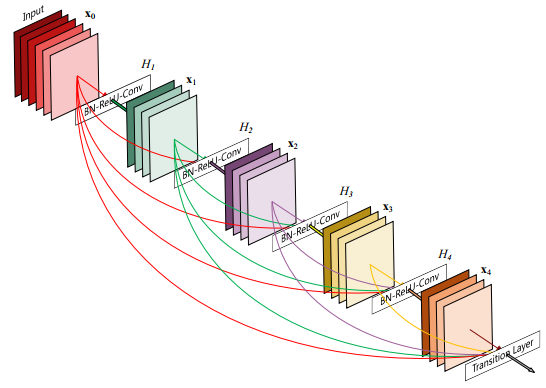

# Densely Connected Convolutional Networks

> CVPR 2017上，清华大学的Zhuang Liu、康奈尔大学的Gao Huang和Kilian Q.Weinberger，以及Facebook研究员Laurens van der Maaten 所作论文[*Densely Connected Convolutional Networks*](https://arxiv.org/abs/1608.06993)当选 ，与苹果的首篇公开论文[*Learning From Simulated and Unsupervised Images through Adversarial Training*](https://arxiv.org/abs/1612.07828)共同获得了2017 CVPR 最佳论文。 

来源：CSDN 
原文：https://blog.csdn.net/u014380165/article/details/75142664 

这篇文章是CVPR2017的oral，非常厉害。文章提出的DenseNet（Dense Convolutional Network）主要还是和ResNet及Inception网络做对比，思想上有借鉴，但却是全新的结构，网络结构并不复杂，却非常有效！众所周知，最近一两年卷积神经网络提高效果的方向，要么深（比如ResNet，解决了网络深时候的梯度消失问题）要么宽（比如GoogleNet的Inception），而作者则是从feature入手，通过对feature的极致利用达到更好的效果和更少的参数。博主虽然看过的文章不算很多，但是看完这篇感觉心潮澎湃，就像当年看完ResNet那篇文章一样！

**先列下DenseNet的几个优点，感受下它的强大：** 

**1、减轻了vanishing-gradient（梯度消失）**  

**2、加强了feature的传递**  

**3、更有效地利用了feature**  

**4、一定程度上较少了参数数量**

## 仿真DenseNet40

L=40，k=12.

一个block，5层，因该是4个H函数（BN-ReLU-Conv）加1个Transition Layer，

growth rate of k = 4.

可以看到特征图 x 都是4通道的，这是由 增长率k 来控制。

第 l 层的输入为前面所有特征图： x(l) = H(l)（[x0，x1，...， x(l-1)]）

+ Bottleneck layers 

  + 最初（Composite function）：BN-ReLU-3×3CONV

  + B结构：BN-ReLU-CONV(1×1)-BN-ReLU-CONV(3×3)，1×1卷积的目的是减少通道数.

    we let each 1×1 convolution produce 4k feature-maps.   输出通道设为 4k

+ Transition layers 

  是block与block之间的层，BN-1×1CONV-2×2 AVG pooling：

  > The transition layers  consist of **a batch normalization** layer and an **1×1 convolutional** layer followed by a **2×2 average pooling** layer.

  C结构：

  > we can reduce the number of feature-maps at transition layers.  If a dense block contains *m* feature-maps, we let the following transition layer generate *θm* output feature-maps,    
  >
  > 在过度层也能够减少通道数。叫做C结构

对于基本的DenseNet来说，实验了{L = 40; k = 12}, {L = 100; k = 12} and {L = 100; k = 24}. 

DenseNet40（k=12）

在block之前，给个卷积，变成16通道。

> On all datasets except ImageNet, the DenseNet used in our experiments has three dense blocks that each has an equal number of layers. Before entering the first dense block, a convolution with 16 (or twice the growth rate for DenseNet-BC) output channels is performed on the input images.  

3×3 卷积是SAME类型：

> For convolutional layers with kernel size 3×3, each side of the inputs is zero-padded by one pixel to keep the feature-map size fixed    