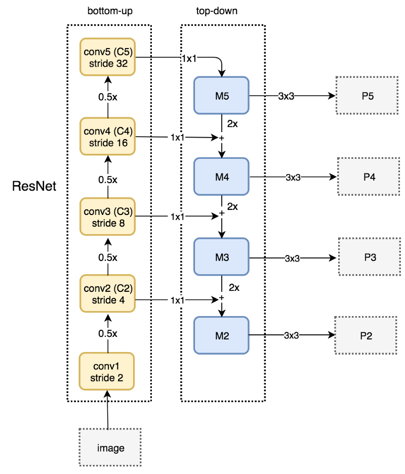
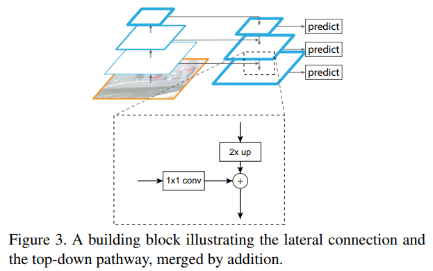
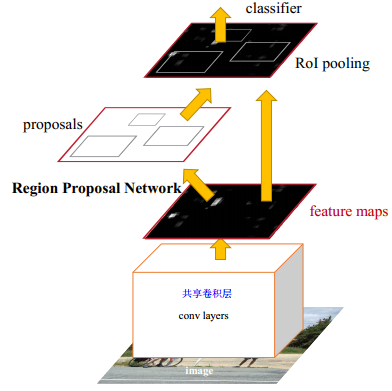
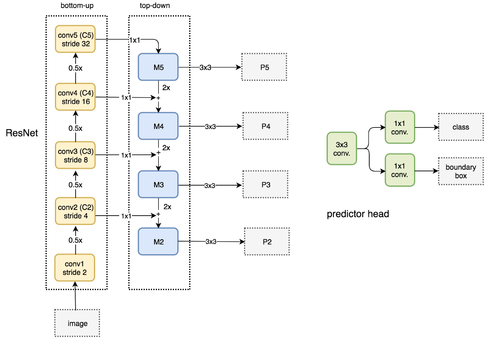
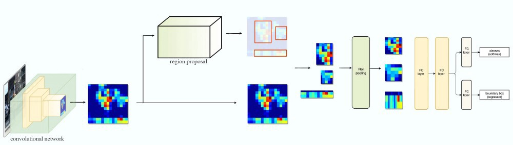
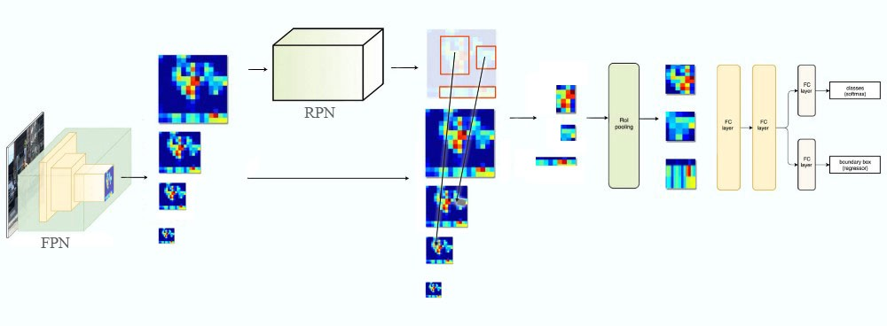
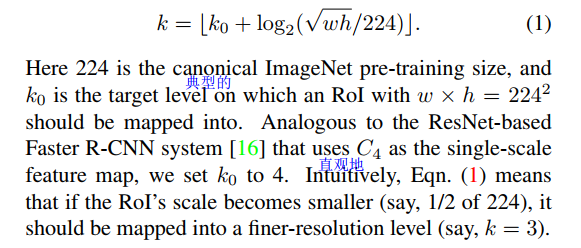

# Feature Pyramid Networks for Object Detection    

这里主要说一下FPN的结构以及如何与RPN、Fast RCNN or Faster RCNN来结合。文中使用ResNet作为backbone convolutional architecture。

图片主要来自 [Understanding  FPN](https://medium.com/@jonathan_hui/understanding-feature-pyramid-networks-for-object-detection-fpn-45b227b9106c)

## 3.Feature Pyramid Networks

> The construction of our pyramid involves a bottom-up pathway, a top-down pathway, and lateral connections, as introduced in the following.    

### Bottom-up pathway

通常，又许多卷积层有着同样的维度输出，那么选择从哪一层输出特征图呢？文中说：

> For our feature pyramid, we define one pyramid level for each stage. We choose the output of the last layer of each stage as our reference set of feature maps, which we will enrich to create our pyramid.

因为越深的层有着最丰富的特征。

上图解释如下：

> Specifically, for ResNets [16] we use the feature activations output by each stage’s last residual block. We denote the output of these last residual blocks as {C2, C3, C4, C5} for conv2, conv3, conv4, and conv5 outputs, and note that they have strides of {4, 8, 16, 32} pixels with respect to the input image. We do not include conv1 into the pyramid due to its large memory footprint    

### Top-down pathway

> we **upsample the spatial resolution** by a factor of 2 (using nearest neighbor upsampling for simplicity). The upsampled map is then **merged with** the corresponding bottom-up map (which undergoes **a 1×1 convolutional layer** to reduce channel dimensions) by element-wise addition.
>
> we append **a 3×3 convolution** on each merged map to generate the final feature map, which is **to reduce the aliasing(混淆、失真) effect of upsampling.** 

因为最后的输出的特征图使用同样的分类器/回归器，所以要保持维度（numbers of channels)一致，文中把所有额外的卷积层设置为256-channel的输出。

但是对于不同维度的特征图强行都设置为一样的输出会导致不一样的非线性变化，根据经验发现这造成很小的影响。

## 4.Applications

### Feature Pyramid Networks for RPN

RPN与基网络共享卷积层，在Faster RCNN中只利用了最后输出的特征图，这个feature maps同时作为RPN和RoI pooling的输入。

本文要对多个特征图上的anchor回归，取代单尺寸特征图。下图右侧RPN中的结构在文献中被称作 a network head：

> This is realized by a  3×3 convolutional layer followed by two sibling 1×1 convolutions for classification and regression, which we refer to as a network head.   

不同特征图可以共享head参数的原因是：金字塔特征共享相似的语义。

相比较Faster R-CNN中每个sliding window预测9个anchors（3种scale和3种aspect ratios），FPN中每个特征图只对应一种scale：

> Formally, we define the anchors to have areas of {32^2, 64^2, 128^2, 256^2, 512^2} pixels on {P2, P3, P4, P5, P6} respectively.1 As in [29] we also use anchors of multiple aspect ratios {1:2; 1:1,2:1}at each level. So in total there are 15 anchors over the pyramid.

#### RPN训练标签

> We assign training labels to the anchors based on their Intersection-over-Union (IoU) ratios with ground-truth bounding boxes as **in [29]Faster RCNN**. Formally, an anchor is assigned a positive label if it has the highest IoU for a given ground-truth box or an IoU over 0.7 with any ground-truth box, and a negative label if it has IoU lower than 0.3 for all ground-/truth boxes. 

### Feature Pyramid Networks for Fast R-CNN

Faster R-CNN：

FPN for Fast R-CNN：

> To use it with our FPN, we need to assign RoIs of different scales to the pyramid levels.
>
> 把不同尺度的RoIs分配给不同的金字塔特征图哦。如上图中间位置的表示。

Formally, we assign an RoI of width *w* and height *h* (on the input image to the network) to the level Pk of our feature pyramid by: 

后面的结构与FastRCNN类似：

+ we simply adopt RoI pooling to extract 7×7 features;
+ attach two hidden 1,024-d fully-connected (fc) layers (each followed by ReLU);
+ the final classification and bounding box regression layers;

