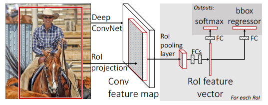
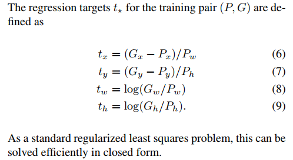
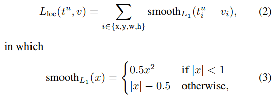

# Fast R-CNN

Ross Girshick (Microsoft Research rbg@microsoft.com )，把同在微软的何凯明的SPP-Net怼了回去。

## Problem：R-CNN and SPPnet

+ Training is a multi-stage pipeline

  三步走战略：训练ConvNet log loss、训练SVMs代替softmax、训练bounding-box。加上提取建议框，就是四步走战略了。

+ Training is expensive in space and time    

  每张图片的每一个object proposal（region proposal、candidate window）特征都需要写入磁盘。

+ Object detection is slow.    

  测试中，Detection with VGG16 takes 47s / image (on a GPU)。我靠，真慢。

## Contributions

+ Higher detection quality (mAP) than R-CNN, SPPnet 
+ Training is single-stage, using a multi-task loss 
+ Training can update all network layers, SPPnet只训练FC层。
+ No disk storage is required for feature caching    

划重点：多任务损失端到端训练，当然提取RoI还是与训练分开的。一步到位。损失函数顾做了改变，见下文。

速度：

> Fast R-CNN trains the very deep VGG16 network 9× faster than R-CNN, is 213× faster at test-time.
>
> Fast R-CNN trains VGG16 3× faster, tests 10× faster, and is more accurate, compared to SPPnet.    

## Architecture

### 网络转化

一个预训练的网络初始化一个Fast R-CCN网络，需要三个转换：

1. 最后一层最大池化层被一个ROI pooling层替代来和网络的第一个全连接层相容。
2. 最后一个全连接层和softmax层被前文所述的兄弟层替代。
3. 网络需要被修改成采用两个输入：一个图像列表和这些图像中的ROIs列表。ps：但是RoIs列表是从哪来的？？？？仍然按照RCNN、SPPnet？

### Process

1. 输入 an entire iamge and a set of object proposal

2. 经过几个卷积和pooling层输出 a conv feature map

3. 对每一个object proposal，RoI pooling 层提取固定长度的特征向量。

4. 将每一个特征向量（ps 应该是n(RoIs)×fixed-length vector一起送入全连接层吧，但图中右下角表明是For each RoI）输入到一系列全连接层，然后兵分两路送入到两个输出层，softmax是K+1的输出，bbox regressor输出 four real-valued numbers for each of the K object classes，那输出应该是4K长度的向量。插图介绍把这两个输出向量叫做：oftmax probabilities and per-class bounding-box regression offsets。 

   *我理解的是：本文中有128个RoIs，softmax输出128×20即1）对应某一类别每个RoI的得分，2）也可以理解为某个RoI对应每个类别的得分，因为要做NMS，是在某一类下对所有RoI进行操作，所以第一种解释比较好理解。bbox regressor输出128×4对应每个RoI的坐标偏移。*

### The RoI pooling layer

说白了，就是one-level spp pooling。把特征图分为H×W（e.g. 7×7 for VGG16）的grid cell。核大小核计算规则见SPPnet。

> Each RoI is defined by a four-tuple (r, c, h, w) that specifies its top-left corner (r, c) and its height and width (h, w) 

## Train

联合训练：jointly optimizes a softmax classifier and bounding-box regressors 。

### 输入

> stochastic gradient descent (SGD) mini-batches are sampled hierarchically, first by sampling N images and then by sampling R/N RoIs from each image    

其中选N=2 和 R=128。相当于每次输入2张图像，每张图形提取64个RoI。*怎么提取的呢？？？？？*

### 损失：Multi-task loss
我们定义
$$
p = (p_0,.... , p_K)
$$

由softmax计算，表示K+1类。
$$
t^k =( t_x^k,t_y^k , t_w^k,t_h^k)
$$
表示：第二个输出层对于每一个类都输出边框回归偏移，t 的定义在RCNN中定义，如下图。G表示ground truth，P表示预测框。

**每个RoI**的损失函数定义如下式：
$$
L(p, u,t^u, v) = L_{cls}(p, u) + λ[u ≥ 1]L_{loc}(t^u, v)
$$

其中，第一个是log loss：
$$
L_{cls}(p, u) = − log p_u
$$
Each training RoI is labeled with **a ground-truth class *u*** and a ground-truth **bounding-box regression target *v*** 。[u ≥ 1] evaluates to 1 when u ≥ 1 and 0 otherwise.    

第二个损失不针对背景，如果RoI标签是0，则忽略此损失：

smoothL1 is a robust L1 loss that is less sensitive to outliers than the L2 loss used in R-CNN and SPPnet. 

We normalize the ground-truth regression targets *vi* to **have zero mean and unit variance**. All experiments use λ = 1.    （ps，4个数也能正则化？？？？？）

### Mini-batch sampling 

+ 每次2张，每张采样64个RoI。
+ 取25% IoU>0.5的 RoI作为foreground object class，打上标签u≥1；IoU在[0.1,0.5)之间的那些RoI作为the background examples，u=0。
+ 数据增广，images are horizontally flipped with probability 0.5. No other data augmentation is used.

### 超参数

+ The fully connected layers used for softmax classification and bounding-box regression are initialized from zero-mean Gaussian distributions with standard deviations 0.01 and 0.001, respectively. Biases are initialized to 0. 
+ a global learning rate of 0,001
+ echo:When training on VOC07 or VOC12 trainval we run SGD for 30k mini-batch iterations, and then lower the learning rate to 0.0001 and train for another 10k iterations.    
+ A momentum of 0.9 and parameter decay of 0.0005 (on weights and biases) are used

## Design evaluation 

这是论文的第五部分。分析、实验、对比。娓娓道来，有理有据。人称RGB大神。