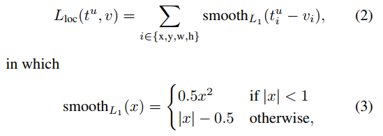
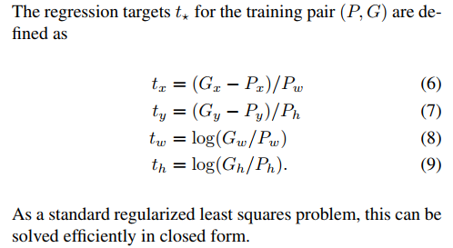
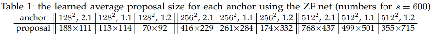

# Towards Real-Time Object Detection with Region Proposal Networks

我们回顾一下前几篇文章的作者

+ RCNN：**Ross Girshick**   Jeff Donahue   Trevor Darrell   Jitendra Malik    
+ SPPnet：**Kaiming He**, Xiangyu Zhang, **Shaoqing Ren**, and **Jian Sun**    
+ Fast R-CNN：**Ross Girshick**    
+ Faster R-CNN：**Shaoqing Ren, Kaiming He, Ross Girshick, and Jian Sun**    

他们好像在玩儿过家家。。

## Problem and Achievements

问题就一个，以前的区域建议生成需要大量时间，都提莫比检测时间多了。无论是SPPnet还是Fast R-CNN，区域建议都成为了制约整个检测时间的瓶颈。

然而，Faster R-CNN可以实现

+ 5fps (including all steps) on a GPU
+ state-of-the-art object detection accuracy on PASCAL VOC 2007, 2012

创新点：

+ RPN（Region Proposal Network）区域建议网络，这个网络即能输出建议框，还能给建议框打分哦。文中也提到了注意力机制。。

  > We further merge RPN and Fast R-CNN into a single network by sharing their convolutional features—using the recently popular terminology of neural networks with **“attention” mechanisms**, the RPN component tells the unified network where to look.    

+ ”anchor“ box

  

+ unified network。可以统一RPN和Fast R-CNN网络。

+ 共享卷积层参数

## Architecture

### 总体架构

### RPN结构

目的是代替Selective search算法，找出多个候选区域（本文叫anchor），RCNN提取2000个（region proposal）；SPPnet也是2000个，不过是将候选框（windows）映射在特征图上提取特征，一张图片一次卷积；Fast R-CNN sample R/N RoIs from each image ，128/2=64个RoIs，具体怎么采样64个没写。。。。本文是通过训练RPN网络，让网络自己学习找到建议框。

与SPPnet不同的是，SPPnet是将原图建议框坐标映射到特征图上，然后spp pooling特征图上的窗口。而Faster R-CNN中是在特征图上选好anchor，文中k=9——固定尺度变化（三种尺度），固定scale ratio变化（三种ratio） 然后映射到原图上，再根据ground truth打标签（ps：还是将ground truth映射到特征图上。。。。再计算IoU打标签。。。）。具体对应到VGG16是如下第二张图结构，注意是RPN是全卷积网络，features对于一幅大小为600×800的图像，通过VGG之后，conv5_3的大小为38×50×512，则总的anchor的个数为38×50×9。**下图中的silding window是不是3*3的卷积？？？没搞清楚，原文如下：**

> To generate region proposals, we slide a small network over the convolutional feature map output by the last shared convolutional layer. This small network takes as input an n × n spatial window of the input convolutional feature map. **Each sliding window is mapped to a lower-dimensional feature (256-d for ZF and 512-d for VGG, with ReLU [33] following)**. This feature is fed into two sibling fully-connected layers—a box-regression layer (reg) and a box-classification layer (cls). We use n = 3 in this paper, noting that the effective receptive field on the input image is large (171 and 228 pixels for ZF and VGG, respectively). This mini-network is illustrated at a single position in Figure 3 (left). Note that because the mini-network operates in a sliding-window fashion, the fully-connected layers are shared across all spatial locations. **This architecture is naturally implemented with an n×n convolutional layer** followed by two sibling 1 × 1 convolutional layers (for reg and cls, respectively).    

> As a result, our output layer has 2.8 × 10^4 parameters (512 × (4 + 2) × 9 for VGG-16)   
>
> 就是那两个1×1的卷积层。 
>
> Considering the feature projection layers, our proposal layers’ parameter count is 3 × 3 × 512 × 512 + 512 × 6 × 9 = 2.4 × 10^6    
>
> 再加上sliding window那一层卷积层。

注意上上面引用的加粗文字和上面的参数计算，对于VGG16，每个sliding window都会被映射到512-d的向量。这是怎么操作的。。。对于38×50×512的向量，经过sliding window也就是3×3的卷积，得到的数据大小还是38×50×512啊？？？难道只是看作是（38×50）×512-d的结构，这样就可以看作对于38×50个滑动窗口中的每一个都映射到一个512-d的向量。然后送入兄弟网络，经过1×1的卷积分别得到38×50×（2×9）、38×50×（4×9）的数据。比如右边的边框回归层 reg layer层，输出：[batch, 38, 50, 36] ？？在第四维度上的36个数值代表了9个框的偏移量，每个框4个值。

## 训练

### RPN训练

#### 标签

> For training RPNs, we assign **a binary class label (of being an object or not)** to each anchor. We assign a positive label to two kinds of anchors: (i) the anchor/anchors with the highest Intersection-over Union (IoU) overlap with a ground-truth box, or (ii) an anchor that has an IoU overlap higher than 0.7 with any ground-truth box. Note that a single ground-truth box may assign positive labels to multiple anchors. Usually the second condition is sufficient to determine the positive samples; but we still adopt the first condition for the reason that in some rare cases the second condition may find no positive sample. We assign a negative label to a non-positive anchor if its IoU ratio is lower than 0.3 for all ground-truth boxes. **Anchors that are neither positive nor negative do not contribute to the training objective**    

二分类，是个东西（positive label）或不是个东西（negative label）。

**对每一个anchor**按照以下规则打标签：

+ 正：1）与任意一个ground-truth box的IoU大于0.7，就标记为正标签。2）当然，前一种情况也有很小可能不发生，这时，对于每个ground-truth，哪个anchor与之的IoU最大，就标记为正。
+ 负：一个anchor与所有的ground-truth box的IoU都小于0.3，则标记为负标签。
+ 不正不负，除正负以外，其他。不参与训练。
+ 越界的去掉：The anchor boxes that cross image boundaries need to be handled with care. During training, we ignore all cross-boundary anchors     

#### 损失

$$
L(\{p_i\},\{t_i\})=\frac{1}{N_{cls}}\sum_i{L_{cls}(p_i,p_i^*)}+λ\frac{1}{N_{reg}}\sum_i{p_i^*L_{reg}(t_i,t_i^*)}
$$

其中  *i*  是在一次mini-batch，anchor的index。λ = 10。

Pi  表示anchor  i 是物体的概率。

Pi*是标签，0或1，表示anchor i 里面是不是个东西。

文中：N_cls是mini-batch size=256，N_reg是the number of anchor locations，H×W=~2400。

+ **注意**：这里2400到底是特征图的尺寸H×W，还是anchor的数量。。。。文中有下面一句：

  > For a convolutional feature map of a size W × H (typically ∼2,400), there are W Hk anchors in total    

L_cls is log loss over two classes (object vs. not object)。

L_reg(ti, ti* ) = R(ti -,ti* ) where R is the robust loss function (smooth L1) defined in Fast R-CNN（叫location 损失，如下图）。

t的定义在RCNN中，与RCNN中用到pooling5层中输出的特征用于回归，Fast Faster R-CNN都是直接用smooth函数计算损失，实质一样，这里的 t 也是卷积特征图算出来的，只不过不是pooloing5层罢了，用于回归：

#### 训练

端到端哦

##### 输入

> Each mini-batch arises from a single image that contains many positive and negative example anchors.    

每个batch输入一张图像？？？

> we **randomly sample** 256 anchors in an image to compute the loss function of a mini-batch, where the sampled positive and negative anchors have a ratio of up to 1:1. If there are fewer than 128 positive samples in an image, we pad the mini-batch with negative ones.    

那就是输入一张图像，卷积后输出特征图，比如38×50×512，那就是38×50×9个anchors中只有256个anchor被采样，用来计算损失。正负样本1：1。再比如cls回归输出30×50×（2×9），只有2×256的数被利用。再细节一节中提到大约有6000个anchor可以用于训练。

##### 初始化

+ initialize all new layers by drawing weights from a zero-mean Gaussian distribution with standard deviation 0.01    
+ All other layers (i.e., the shared convolutional layers) are initialized by pretraining a model for ImageNet classification    

##### 其他

+ 微调：We tune all layers of the ZF net, and conv3 1 and up for the VGG net to conserve memory
+ learning rate：0.001  60k mini-batch；0.0001 next 20k
+ We use a momentum of 0.9 and a weight decay of 0.0005

### 整体训练

上面介绍了RPN训练用于region proposal generation，那怎么利用呢？ps：对啊，HW4k个坐标，HW2k个是不是物体的信息，综合一下也输出好多带物体的好多框坐标信息。还是直接全部使用？？全部使用也太多了吧。。

检测网络用Fast RCNN。参考Fast RCNN。

Alternating training：此方法其实就是一个不断迭代的训练过程，既然分别训练RPN和Fast-RCNN可能让网络朝不同的方向收敛，a)那么我们可以先独立训练RPN，然后用这个RPN的网络权重对Fast-RCNN网络进行初始化并且用之前RPN输出proposal作为此时Fast-RCNN的输入训练Fast R-CNN。b) 用Fast R-CNN的网络参数去初始化RPN。之后不断迭代这个过程，即循环训练RPN、Fast-RCNN。

上面说完了三种可能的训练方法，可非常神奇的是作者发布的源代码里却用了另外一种叫做4-Step Alternating Training的方法，思路和迭代的Alternating training有点类似，但是细节有点差别：

> In the first step, we train the RPN as described in Section 3.1.3. This network is initialized with an ImageNet-pre-trained model and fine-tuned end-to-end for the region proposal task. In the second step, we train a separate detection network by Fast R-CNN using the proposals generated by the step-1 RPN. This detection net work is also initialized by the ImageNet-pre-trained model. At this point the two networks do not share convolutional layers. In the third step, we use the detector network to initialize RPN training, but we fix the shared convolutional layers and only fine-tune the layers unique to RPN. Now the two networks share convolutional layers. Finally, keeping the shared convolutional layers fixed, we fine-tune the unique layers of Fast R-CNN. As such, both networks share the same convolutional layers and form a unified network. A similar alternating training can be run for more iterations, but we have observed negligible improvements.    

1. 第一步：用ImageNet模型初始化，独立训练一个RPN网络；
2. 第二步：仍然用ImageNet模型初始化，但是使用上一步RPN网络产生的proposal作为输入，训练一个Fast-RCNN网络，至此，两个网络每一层的参数完全不共享；
3. 第三步：使用第二步的Fast-RCNN网络参数初始化一个新的RPN网络，但是把RPN、Fast-RCNN共享的那些卷积层的learning rate设置为0，也就是不更新，仅仅更新RPN特有的那些网络层，重新训练，此时，两个网络已经共享了所有公共的卷积层；
4. 第四步：仍然固定共享的那些网络层，把Fast-RCNN特有的网络层也加入进来，形成一个unified network，继续训练，fine tune Fast-RCNN特有的网络层，此时，该网络已经实现我们设想的目标，即网络内部预测proposal并实现检测的功能。

## 其他细节

+ 单尺度训练和测试，We re-scale the images such that their shorter side is s = 600 pixel。
+ For anchors, we use 3 scales with box areas of 128×,128 256×256, and 512×512 pixels, and 3 aspect ratios of 1:1, 1:2, and 2:1.     

+ For a typical 1000 × 600 image, there will be roughly 20000 (≈ 60 × 40 × 9) anchors in total. With the cross-boundary anchors ignored, there are about 6000 anchors per image for training.
+ During testing, however, we still apply the fully convolutional RPN to the entire image. This may generate cross-boundary proposal boxes, which we clip to the image boundary. 
+ Some RPN proposals highly overlap with each other. To reduce redundancy, we **adopt non-maximum suppression (NMS) on the proposal regions based on their cls scores.** We fix the IoU threshold for NMS at **0.7**, which **leaves us about 2000 proposal regions per image**. As we will show, NMS does not harm the ultimate detection accuracy, but substantially reduces the number of proposals. **After NMS, we use the top-N ranked proposal regions for detection**. In the following, **we train Fast R-CNN using 2000 RPN proposals**, but evaluate different numbers of proposals at test-time. 

