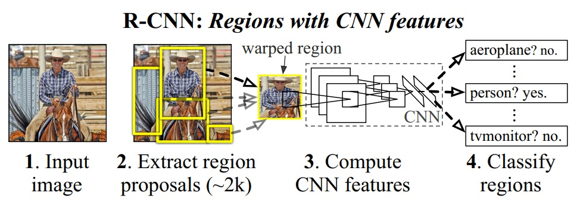

# RCNN (Regions with CNN features) 2014
>Since our system combines region proposals with CNNs,we dub the method R-CNN: **Regions with CNN features**
## Problem
* Object detection performance, as measured on the
canonical PASCAL VOC dataset, has plateaued in the last
few years.
    >检测问题停滞不前。

* The central issue can be distilled to the following: To what extent do the CNN classification results on ImageNet generalize to object detection results on the PASCAL VOC Challenge?
    >CNN分类这么火，能否将CNN用于检测。

##  Focus 
>we focused on two problems: localizing objects with a deep network and training a high-capacity model with only a small quantity of annotated detection data
* CNN网络提取特征。
* 采用大样本下(ILSVRC)有监督预训练+小样本(PASCAL)微调的方式解决小样本难以训练甚至过拟合等问题。

## Structure

上述图片给出的是测试流程，上图少画了一个过程：对于SVM分好类的region proposal做边框回归（bounding-box regression)，边框回归是对region proposal进行纠正的线性回归算法，为了让region proposal提取到的窗口跟目标真实窗口更吻合。因为region proposal提取到的窗口不可能跟人手工标记那么准，如果region proposal跟目标位置偏移较大，即便是分类正确了，但是由于IoU(region proposal与Ground Truth的窗口的交集比并集的比值)低于0.5，那么相当于目标还是没有检测到。 实际训练流程应该分为以下四步：

1. 一张图像生成~2k个候选区域(region proposal)，采用Selective Search方法。
2. 对每个region proposal，CNN提取特征。
3. 特征送送入SVM，训练/测试：判断是否属于该类。由于SVM是二分类，有多少类就有多少个SVM？？
4. 使用bounding-box regression method精细修正候选框位置。

#### 1、Extracrt region proposal Selective Search方法 

J. Uijlings, K. van de Sande, T. Gevers, and A. Smeulders. Selective search for object recognition. IJCV, 2013.    

步骤：

1. 使用一种过分割手段，将图像分割成小区域 (1k~2k 个)。

2. 查看现有小区域，按照合并规则合并可能性最高的相邻两个区域。重复直到整张图像合并成一个区域位置。

   合并规则如下：

   + 颜色（颜色直方图）相近的 
   + 纹理（梯度直方图）相近的 
   + 合并后总面积小的： 保证合并操作的尺度较为均匀，避免一个大区域陆续“吃掉”其他小区域 （例：设有区域a-b-c-d-e-f-g-h。较好的合并方式是：ab-cd-ef-gh -> abcd-efgh -> abcdefgh。 不好的合并方法是：ab-c-d-e-f-g-h ->abcd-e-f-g-h ->abcdef-gh -> abcdefgh）
   + 合并后，总面积在其BBOX中所占比例大的： 保证合并后形状规则。

3. 输出所有曾经存在过的区域，所谓候选区域。

#### 2、Cmopute CNN Features

##### 网络结构：

+ AlexNet 58.5%
+ VGG16 66%
+ +20 SVM？？？

以AlexNet为例，应该是去掉最后一层分类层fc8 1000，然后用剩下的网络提取一个4096维的向量。每次输入2000个侯选款图像，The feature matrix is typically 2000×4096 and the SVM weight matrix is 4096×N, where N is the number of classes。

##### 细节处理：

候选框尺寸问题，For detection, we consider object proposals that are *arbitrary image rectangles*. We evaluated two approaches for transforming object proposals into valid CNN inputs （227*227）：

1. 各项异性缩放（wrap）

   直接resize

2. 各向同性缩放 

   + tightest square with context    

     先在原图上扩充后裁剪

   + tightest square without context    

     先裁剪后扩充

注意:

> Prior to warping, we dilate the tight bounding box so that at the warped size there are exactly p pixels of warped image context around the original box (we use p = 16)
>
> 是在每个建议框周围加上16个像素值为建议框像素平均值的边框 ？
>
> 还是变形前先进行边界像素填充padding处理，即向外扩展建议框边界 ？应该是这个。

> In all methods, if the source rectangle extends beyond the image, the missing data is replaced with the image mean (**which is then subtracted before inputing the image into the CNN**)

最后采用padding=16、各向异性缩放的精度最高。 

##### 训练：

1. 有监督预训练（Supervised pre-training），采用**迁移学习**，在ILSVRC2012这个训练数据库（这是一个图片分类训练数据库），先进行网络图片分类训练 。

2. Domain-specific fine-tuning ，为了适应new task (detection) and the new domain (warped proposal windows)    
   + 将最后一层分类层替换为 a randomly initialized (**N + 1**)-way classification layer (where N is the number of object classes, plus 1 for background)

   + stochastic gradient descent (SGD) ，We start SGD at a learning rate of 0.001 (1/10th of the initial pre-training rate)。

     > In each SGD iteration, we uniformly sample 32 positive windows (over all classes) and 96 background windows to construct a mini-batch of size 128. We bias the sampling towards positive windows because they are extremely rare compared to background.    
     >
     > 一张照片我们得到了2000个候选框。然而人工标注的数据一张图片中就只标注了正确的bounding box，我们搜索出来的2000个矩形框也不可能会出现一个与人工标注完全匹配的候选框。因此在CNN阶段我们需要用IOU为2000个bounding box打标签。如果用selective search挑选出来的候选框与物体的人工标注矩形框（PASCAL VOC的图片都有人工标注）的重叠区域IoU大于0.5，那么我们就把这个候选框标注成物体类别（正样本），否则我们就把它当做背景类别（负样本） 

3. 标签，正负样本。We treat all region proposals with ≥ 0.5 IoU overlap with **a ground-truth box** as positives **for that box’s class** and the rest as negatives.

   | 样本 | 规则            |
   | ---- | --------------- |
   | 正   | IoU>0.5         |
   | 负   | IoU≤0.5的建议框 |

4. LOSS

   论文中没有提到，应该是交叉熵。

#### 3、Classify regions:Object category classifiers

##### 训练阶段：

Once features are extracted and training labels are applied, we optimize one linear SVM **per class**    

~~SVM是怎么训练的，是直接4096*20嘛，那不是跟全连接层一样了，想不明白~~

| 特征       | 参数     | 输出     |
| ---------- | -------- | -------- |
| 2000\*4096 | 4096\*20 | 2000\*20 |

2000×20维矩阵表示**每个**建议框是**某个**物体类别的**得分**，然后根据2000个标签进行训练。如何训练SVM呢？？？标签怎么打？与训练CNN一样选择IoU≥0.5嘛？？

##### 测试阶段：

对于2000×20的矩阵，1）对矩阵中每一列即每一类2000个框进行非极大值抑制剔除重叠建议框，再剔除分数太低的（文中没提到，若没有这步，可能会让其他类别展示出来），得到该列即该类中得分最高的一些建议框；2）然后分别用20个回归器对上述20个类别中剩余的建议框进行回归操作，最终得到每个类别的修正后的得分最高的bounding box。（回归器也需要单独训练） 

| 样本 | 规则             |
| ---- | ---------------- |
| 正   | Ground Truth     |
| 负   | IoU<0.3 的建议框 |

##### 边框回归（Bounding-box regression）：

> We use a simple bounding-box regression stage to improve localization performance. After scoring each selective search proposal with a class-specific detection SVM, we predict a new bounding box for the detection using a class-specific bounding-box regressor. This is similar in spirit to the bounding-box regression used in deformable part models [17]. The primary difference between the two approaches is that here **we regress from features computed by the CNN, rather than from geometric features computed on the inferred DPM part locations**.    

上述引用的最后一句话匪夷所思。。。。。。。。。。。。看loss公式就明白了。。。。。。。

找到一种映射关系（线性回归）使P转化到G’，并且使G‘≈G。但是，

> if P is far from all ground-truth boxes, then the task of transforming P to a ground-truth box G does not make sense.     
>
> P要与G接近，不然不接近线性回归。make no sense。
>
> 具体看[ 边框回归(Bounding Box Regression)详解 ](https://blog.csdn.net/zijin0802034/article/details/77685438)

推倒过程如下：每个d(P)与pooling5的输出特征有关（这是个假设吧，但是6×6×256？？，w与φ(P)的乘积能是一个数？？？），学习的目的是让d(P)与 t 无限接近，学习的参数是下图中的w。P=（Px，Py，Pw，Ph），(x，y)是候选框P的中心点坐标。

λ=1000

