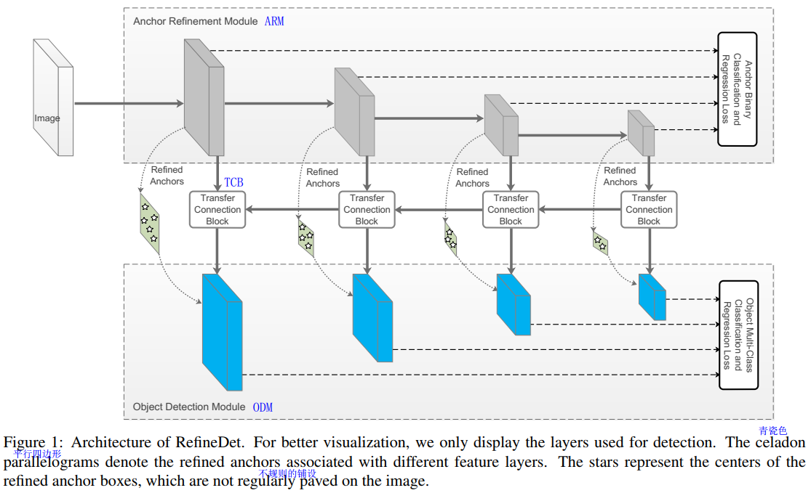
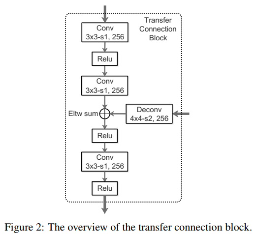
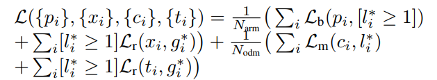
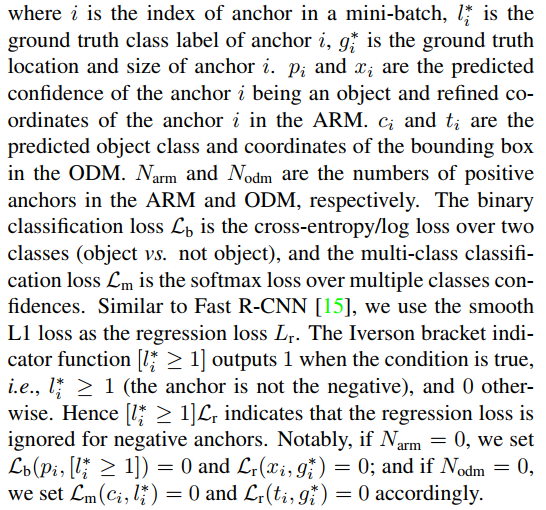

# Single-Shot Refinement Neural Network for Object Detection

## Abstract

主要说了我们要兼顾两阶段训练（准）和单阶段（快）的优势，RefineDet实现了更好的准确率和差不多的效率。

两个内联模块：the anchor refinement module and the object detection module。

还有一个a transfer connection block：To transfer the features in the anchor refinement module to predict locations, sizes and class labels of objects in the object detection module.  

Code is available at [https: //github.com/sfzhang15/RefineDet](https://github.com/sfzhang15/RefineDet).

## 1.Introduction

the two-stage approach：RCNN，Fast RCNN，**FPN**(接下来读读这篇)，

[3] Z. Cai, Q. Fan, R. S. Feris, and N. Vasconcelos. A unified multi-scale deep convolutional neural network for fast object detection. In ECCV, pages 354–370, 2016. 

[41] A. Shrivastava, A. Gupta, and R. B. Girshick. Training region-based object detectors with online hard example mining. In CVPR, pages 761–769, 2016. 

the one-stage approach：SDD，YOLO9000。

单阶段的准确率往往赶不上两阶段的：one of the main reasons being due to the class imbalance problem。然后提到了一些其他学者的解决方法，都没听说过。。。

两阶段优势：

+ (1) using two-stage structure with sampling heuristics to handle class imbalance;
+  (2) using two-step cascade to regress the object box parameters; 
+ (3) using two-stage features to describe the objects.

### Architecture of RefineDet：

文章中是这么夸自己的：

> In this work, we design a novel object detection framework, called RefineDet, to inherit the merits of the two approaches (i.e., one-stage and two-stage approaches) and overcome their shortcomings. 

以特征提取网络为ResNet101，输入图像大小为320为例，在Anchor Refinement Module部分的4个灰色矩形块（feature map）的size分别是40×40,20×20,10×10,5×5。细节看[anchors design and matching](#anchors-design-and-matching)。

#### Backbone Network in 4

> we convert fc6 and fc7 of VGG-16 to convolution layers conv fc6 and conv fc7 via subsampling parameters. Since conv4 3 and conv5 3 have different feature scales compared to other layers, we use L2 normalization [31] to scale the feature norms in conv4_3 and conv5_3 to 10 and 8.
>
> we also add two extra convolution layers (i.e., conv6_1 and conv6_2) to the end of the truncated VGG-16 and one extra residual block (i.e., res6) to the end of the truncated ResNet- 101, respectively.    

We use the “xavier” method [17] to randomly initialize the parameters in the two extra added convolution layers (i.e., conv6_1 and conv6_2) of VGG-16 based RefineDet, and draw the parameters from a zero-mean Gaussian distribution with standard deviation 0:01 for the extra residual block (i.e., res6) of ResNet-101 based RefineDet.

#### ARM

>  the ARM is designed to (1) identify and **remove negative anchors** to reduce search space for the classifier, and (2) **coarsely adjust the locations and sizes of anchors** to provide better initialization for the subsequent regressor. 

+ 过滤negative anchors。
+ 粗糙地调整anchor的位置和尺寸。

#### ODM

> The ODM takes the refined anchors as the input from the former to further improve the regression and predict multi-class labels. 

进一步改进/提高回归和预测多类标签。

#### TCB

> The features in the ARM focus on distinguishing positive anchors from background. We design the TCB to transfer the features in the ARM to handle the more challenging tasks in the ODM, i.e., predict accurate object locations, sizes and multi-class labels.

不懂这个模块的作用。后面应该有实验来证明它吧。。。

### Contributions 

+ (1) We introduce a novel one-stage framework for object detection, composed of two inter-connected modules, i.e., the ARM and the ODM. This leads to performance better than the two-stage approach while maintaining high efficiency of the one-stage approach. 

+ (2) To ensure the effectiveness, we design the TCB to transfer the features in the ARM to **handle more challenging tasks,** i.e., predict accurate object locations, sizes and class labels, in the ODM. 

+ (3) RefineDet achieves the latest state-of-the-art results on generic object detection (i.e., PASCAL VOC 2007 [10], PASCAL VOC 2012 [11] and MS COCO [29])    

  > + 85:8% and 86:8% mAPs on VOC 2007 and 2012, with VGG-16 network. 
  > + it runs at 40.2 FPS and 24.1 FPS on a NVIDIA Titan X GPU with the input sizes 320 × 320 and 512 × 512 in inference.    

## 2.Related Work

首先提到**Classical Object Detectors**，Haar feature and AdaBoost，DPM。

然后深度学习方法，分两类，两阶段方法和单阶段方法。

+ 两阶段：R-CNN，SPPnet，Fast R-CNN，Faster R-CNN以及一些改进方法：

  > After that, numerous effective techniques are proposed to further improve the performance, such as architecture diagram [5, 26, 54], training strategy [41, 48], contextual reasoning [1, 14, 40, 50] and multiple layers exploiting [3, 25, 27 FPN, 42].    

  都没读过。。。

+ 单阶段：YOLO，YOLOv2；SSD，DSSD，DSOD。以及一些解决类不平衡问题：重新设计损失函数或分类策略。

## 3.Network Architecture

> Similar to SSD [30], RefineDet is based on a feedforward convolutional network that produces a fixed number of bounding boxes and the scores indicating the presence of different classes of objects in those boxes, followed by the non-maximum suppression to produce the final result    
>
> 应该是每一个box最终预测坐标（4个值）和类别分数（类别数+背景）

### ARM

> ARM is constructed by **removing the classification layers** and adding **some auxiliary structures** of two base networks (i.e., VGG-16 [43] and ResNet-101 [19] pretrained on ImageNet [37]) to meet our needs.

### ODM

> The ODM is composed of the outputs of TCBs followed by the prediction layers (i.e., the convolution layers with 3 × 3 kernel size), which generates the scores for object classes and shape offsets relative to the refined anchor box coordinates    

应该是类似SSD，卷积核大小是3×3×（num_box × （4+classes））,但要注意SSD中anchor是人为规定的的，排列是规则的，所以可以按部就班地滑动卷积；而RefineDet的ancor是怎么来的呢？还要接着阅读。。。

### TCB（Transfer Connection Block）

文献中说，ARM模块侧重于从背景中区分positive anchors，TCB是要转化一下ARM提取出来的特征以便处理ODM中更具挑战性的任务（predict locations, sizes, and class labels of objects）**。这部分其实和FPN算法的特征融合很像，FPN也是这样的upsample后融合的思想。**

作用：

+ convert features of different layers from the ARM, into the form required by the ODM, so that the ODM can share features from the ARM.    
+ to integrate large-scale context [13, 27] by adding the high-level features to the transferred features to improve detection accuracy. 

为了匹配维度，使用反卷积操作。

### Two-Step Cascaded Regression

1. we use the ARM to first adjust the locations and sizes of anchors to provide better initialization for the regression in the ODM.

   每个规则划分的单元格 cell 关联 n 个anchor boxes，起初的每个anchor box位置与相应的cell 有关。

   > At each feature map cell, we predict four offsets of the refined anchor boxes relative to the original tiled anchors and two confidence scores indicating the presence of foreground objects in those boxes.

   **没明白这段**，每个cell中，要为每个anchor box预测4个偏移量成为refined box，并预测两个是否是前景的置信分数。最后，在每个feature map cell上生成 n 个refined anchor boxes。

2. the ODM takes the refined anchor boxes as input for further detection，把refined anchor boxes映射到ODM的特征图上，此处ODM的特征图和ARM对应位置上的有着同样的维度，最后，为每个box，生成 c+4 个outputs，用于检测任务。

   过程与SSD的default box的预测相似，不同的是RefinedDet是two-step strategy，并且anchor不是SSD中规则平铺的，而是refined。

### Negative Anchor Filtering

> in training phase, for a refined anchor box, if its negative confidence is larger than a preset threshold θ (i.e., set θ = 0.99 empirically), we will discard it in training the ODM.
>
> Meanwhile, in the inference phase, if a refined anchor box is assigned with a negative confidence larger than θ, it will be discarded in the ODM for detection.

负置信分数大于0.99的refined box 直接抛弃。

## 4.Training and Inference

### data augmentation

请参考SSD。。。。。。。SSD的这块我就没咋看懂。

### anchors design and matching

> To handle different scales of objects, we select four feature layers **with the total stride sizes 8, 16, 32, and 64 pixels** for both VGG-16 and ResNet- 1015, associated with several different scales of anchors for prediction    

> For the VGG-16 base network, the conv4 3, conv5 3, conv fc7, and conv6 2 feature layers are used to predict the locations, sizes and confidences of objects. While for the ResNet-101 base network, res3b3, res4b22, res5c, and res6 are used for prediction    

+ scale：the scale is 4 times of the total stride size of the corresponding layer，We follow the design of anchor scales over different layers in [53], which ensures that different scales of anchors have the same tiling density [51, 52] on the image.
+ aspect：three aspect ratios (i.e., 0.5, 1.0, and 2.0).  

最后一段话是**正负样本的界定**：, we first match each ground truth to the anchor box with the best overlap score, and then match the anchor boxes to any ground truth with overlap higher than 0.5.

### Hard Negative Mining

经过ARM中的[Negative Anchor Filtering](#negative-anchor-filtering)和上一步的mathcing，负样本还是巨多。。

Similar to SSD：

> we use hard negative mining to mitigate the extreme foreground-background class imbalance, i.e., we select some negative anchor boxes with top loss values to make the ratio between the negatives and positives below 3 : 1, instead of using all negative anchors or randomly selecting the negative anchors in training.    

按loss values（那么问题是这个值是哪来的）给负样本排序，选靠前的负样本。

### Loss Function

两部分组成：the loss in the ARM and the loss in the ODM.

> For the ARM, we assign a binary class label (of being an object or not) to each anchor and regress its location and size simultaneously to get the refined anchor. After that, **we pass the refined anchors with the negative confidence less than the threshold to the ODM** to further predict object categories and accurate object locations and sizes.    

ARM：对于每个refined anchor box，回归两方面损失：是或者不是一个物体的二分类和位置偏移。

ODM：predict object categories and accurate object locations and sizes.

**自己的理解**：上段引用中的黑体字中**negative confidence**就表示二分类中的负分吧。直接丢弃大于0.99的anchor box，再输入到ODM网络中，然后再使用根据这**负分**使用Hard Negative Mining平衡正负样本。

### Optimization

> Then, the whole network is fine-tuned using SGD with 0:9 momentum and 0.0005 weight decay. We set the initial learning rate to 10e-3, and use slightly different learning rate decay policy for different dataset, which will be described in details later.

### Inference

> At inference phase, the ARM first filters out the regularly tiled anchors with the negative confidence scores larger than the threshold θ, and then refines the locations and sizes of remaining anchors. After that, the ODM takes over these refined anchors, and outputs top 400 high confident detections per image. Finally, we apply the non-maximum suppression with jaccard overlap of 0.45 per class and retain the top 200 high confident detections per image to produce the final detection results.    

**自己的理解**：网络最后输出应该是：每个anchor输出 c+4 维向量，代表类别分数和坐标偏移量。然后对于每一类（每个框框都有对于这一类的置信分），对得分在前400的abchor box使用the non-maximum suppression算法；待完成20类的非极大值抑制后，保留top 200 confident detections。ps：然后呢，直接给出阈值，得到最后几个框框？？？？