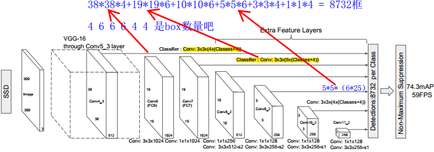

[TOC]
# Single Shot MultiBox Detector

## Achievement

> This paper presents the first deep network based object detector that does **not resample pixels or features for bounding box hypotheses** and and is as accurate as approaches that do. This results in a significant improvement in speed for high-accuracy detection(59 FPS with mAP 74.3% on VOC2007 test, vs. Faster R-CNN 7 FPS with mAP 73.2% or YOLO 45 FPS with mAP 63.4%)
>
> 没有采样假定的bounding box，使用anchor，Faster RCNN也使用anchor，但是是在RPN网络种使用，目的还是提前假定一些bounding box。同YOLO一样一波带走，没有使用**bounding box proposals** and **the subsequent pixel or feature resampling stage**（这个的意思是，采样预测框的对应特征区域吧），所以速度快了。  

+ 比YOLO更快更准，当然，比那些使用region-based的方法也准，比如Faster R-CNN

+ The core of SSD is predicting category scores and box offsets for a fixed set of default bounding boxes using **small convolutional filters** applied to feature maps.

  使用小的卷积核，预测一系列固定的bounding boxs的类别分数和位置偏移量。

+ To achieve high detection accuracy we produce predictions of different scales **from feature maps of different scales**, and explicitly separate predictions by aspect ratio. 

  这句话目前不理解。。。。Gooooogle：为了获得高检测精度，我们从不同尺度的特征图产生不同尺度的预测，并通过纵横比明确地分开预测。

+ 端到端训练，高准确率同样适用低分辨率的图像，further improving the speed vs accuracy trade-off 。

## Model

> The SSD approach is based on a feed-forward convolutional network that produces / a fixed-size collection of /bounding boxes / and / scores for the presence of object class instances / in those boxes, followed by a non-maximum suppression step to produce the final detections.     
>
> 是真的难以翻译。。上面"/"是用来断句。

SSD方法基于前馈卷积网络，该网络生成**固定尺寸的边界框集合**以及在**这些框中存在对象类实例的分数**，然后是非最大抑制步骤以产生最终检测。

整体=基网络+后面的卷积层（These layers decrease in size progressively and allow predictions of detections at multiple scales)+箭头上的分类器卷积层，文中使用的是VGG16作为基础网络。从图上可以看到如下信息：

+ 通过3×3的卷积核对不同尺度feature maps做卷积。图中向右的箭头表示这一操作，通过箭头上的算式Classifier : Conv: 3x3x(**4**x(Classes+4)) ，可以看到每个卷积核的数量由每个格子对应的default box的数量和类别数量决定的，有的是4个box，有的则是6个box。**ps：**此处，不知道Classes的数量包不包括背景，看下图Fig.1的题注好像不包括。
+ 8732是怎么得出来的，看图。应该是8732个box。**但是不明白文字含义：Detections:8732 per Class**。
+ Box是如何选择的在MODEL图中看不出来，再看下图。

图+题注给出如下信息：

+ 图中举例8×8和4×4特征图，我就搞笑了，Model的图中没有这两个大小的特征图啊！！这例子举的。服。
+ **对于每一default box**，要预测the shape offset relative to the default box coordinates. ~~应该就是（x，y，w，h）~~，应该是前几篇文章中的（tx，ty，tw，th），图中画的是（cx，cy，w，h）是box坐标吧，还要预测 the confidences for all object categories ((c1,c2, · · · , cp))，所以对于每个box要预测4+Classses个值，那么对于特征图上每个location（就是每个像素点吧），要预测4×（4+Classses）个值。**正好对应Model图上的3×3卷积通道数**。综上，m×n的特征图，最后输出 (c+4)kmn outputs。ps：所以通道数的设计，要看你要想要得到什么。
+ **标签**，训练就得标标签，图中两个蓝色box匹配了猫，一个红的box匹配了狗，其他都是负样本。ps：感觉这样有点过分啊，就3个正样本。怎么匹配这正样本的框框呢。。[ctrl+单击 matching-strategy](#matching-strategy)     <a href="#matching-strategy">ctrl+单击 跳转</a>
+ **损失Loss**，The model loss is a weighted sum between localization loss (e.g. Smooth L1 [6]) and confidence loss (e.g. Softmax).    具体损失函数往下看。

## Training

### Matching strategy

> For each ground truth box we are selecting from default boxes that vary over location, aspect ratio, and scale. We begin by matching each ground truth box to the default box with the best jaccard overlap (as in MultiBox [7]). Unlike MultiBox, we then match default boxes to any ground truth with jaccard overlap higher than a threshold (0.5).  
>
> 使用the best jaccard overlap (as in MultiBox)策略，不了解。。。。。还要去看MultBox，哇。

1. 首先，寻找与每一个ground truth有最大的IoU的default box，这样就能保证ground truth至少有default box匹配；
2. SSD之后又将剩余还没有配对的default box与任意一个ground truth尝试配对，只要两者之间的IoU大于阈值（SSD 300 阈值为0.5），就认为match；
3. 配对到ground truth的default box就是positive，没有配对的default box就是negative。

### 损失Loss

>  The SSD training objective is derived from the MultiBox objective[7,8] 
>
> ？？？？从哪来的，直接放图了，各种参数不好打。。。

N时匹配上的默认框，N=0，我们令loss=0。

有必要解释一下$x_{ij}^p=\{1，0\}$的含义，它是第 i 个default box与类别为 p 的第 j 个ground truth box匹配的标志，就是正样本的意思吧，应该是，看求和中 i 的范围为Pos哦。**ps：**$i\in{Pos}$，$x_{ij}^p$不一定是 1，还要看 j 。

它在式（2）和（3）中都有出现，式（2）计算边框损失，只计算正样本的，忽略负样本的。式（3）计算类别的softmax损失，正负样本都考虑。

但发现一个奇怪的事情，就是$j$是怎么取得，看公式中好像是定值，但计算损失时不应该只考虑一个 j 的值啊？！

### scales and aspect ratios

对于不同尺度的feature map 上使用不同的Default boxes 。文中使用了m=6个不同的特征图，38×38，19×19，10×10，5×5，3×3，1×1六个不同尺寸的特征图。对于**不同特征图使用不同的scale生成默认框**，公式如下：
$$
s_k=s_{min}+\frac{s_{max}-s_{min}}{m-1}(k-1),\ \ \ \ \ \ k\in[1,m]
$$

我计算了一下：对用尺度分别为[0.2，0.34，0.48，0.62，0.76，0.9]。这意味着越是低级的特征图，越负责检测小的物体。

aspect ratios for the default boxes：{1，2，3，1/2，1/3}

### Hard Negative Mining

用于预测的 feature map 上的每个点都对应有 6 个不同的 default box，绝大部分的 default box 都是负样本，导致了正负样本不平衡。在训练过程中，采用了 Hard Negative Mining 的策略（**根据confidence loss对所有的box进行排序，使正负例的比例保持在1:3**） 来平衡正负样本的比率。这样做能提高4%左右。ps：那怎么算confidence loss呢？

### 数据增强

同于Faster-rcnn，SSD算法使用了多种数据增强的方法，**包括水平翻转、裁剪、放大和缩小等**。**论文明确指出，数据增强可以明显的提高算法的性能。**主要的目的是为了使得该算法对输入的不同大小和不同形状的目标具有更好的鲁棒性。直观的理解是通过这个数据增强操作可以增加训练样本的个数，同时构造出更多的不同形状和大小的目标，将其输入到网络中，可以使得网络学习到更加鲁棒的特征。

+ 使用整张图片
+ 使用IOU和目标物体为0.1, 0.3，0.5, 0.7, 0.9的patch （这些 patch 在原图的大小的 [0.1,1] 之间， 相应的宽高比在[1/2,2]之间）
+ 随机采取一个patch

当 ground truth box 的 中心（center）在采样的 patch 中时，我们保留重叠部分。在这些采样步骤之后，每一个采样的 patch 被 **resize** 到固定的大小，并且以 0.5 的概率随机的 水平翻转（horizontally flipped）。用数据增益通过实验证明，能够将数据mAP增加8.8%。 

### 基网络和超参数

+ VGG16，fc6 and fc7 变为卷积层，改变pool5 2×2/s2变为3×3/s1，由于步长由2变为1，则使用**atrous algorithm** （参考[SSD里的atrous algorithm](https://blog.csdn.net/z1102252970/article/details/70548412)）to fill the ”holes”（空洞卷积的意思？）.  in A real-time algorithm for signal analysis with the help of the wavelet transform. In: Wavelets. Springer (1990) 。移除所有dropout层和fc8层。
+ We fine-tune the resulting model using SGD with initial learning rate 10^-3, 0.9 momentum, 0.0005 weight decay, and batch size 32. 
+ The learning rate decay policy is slightly different for each dataset, and we will describe details later    

## I dont know

+ 匹配默认框的the best jaccard overlap策略

+ Hard negative mining ，让负正样本比最多为3：1是怎么操作的。

+ Model示意图中，Detections:8732 per Class到底是个什么玩意，怎样的数据结构？？

+ atrous algorithm算法是什么？

  由于pooling5的步长由2变为1，输出也变多一倍，若还是按照卷积来，后面层的感受野将改变，因此也不能用原来网络的参数进行finetune，。所以采用空洞卷积。

## 参考

[SSD里的atrous algorithm](https://blog.csdn.net/z1102252970/article/details/70548412)

[SSD](https://zhuanlan.zhihu.com/p/24954433)