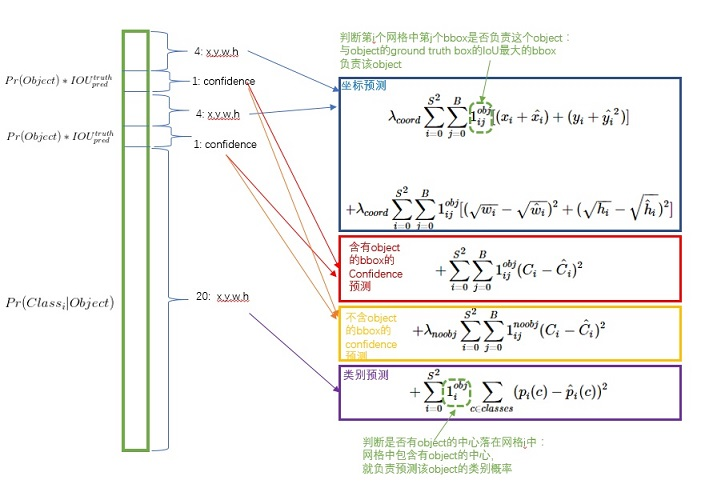

# You Only Look Once: Unified, Real-Time Object Detection

我们再次回顾一下前几篇文章的作者

+ RCNN：**Ross Girshick**   Jeff Donahue   Trevor Darrell   Jitendra Malik    
+ SPPnet：**Kaiming He**, Xiangyu Zhang, **Shaoqing Ren**, and **Jian Sun**    
+ Fast R-CNN：**Ross Girshick**    
+ Faster R-CNN：**Shaoqing Ren, Kaiming He, Ross Girshick, and Jian Sun**    
+ YOLO：Joseph Redmon, Santosh Divvala, **Ross Girshick**, Ali Farhadi

他们好像在玩儿过家家。。。

## Problem and Achievements

文中在introduction部分提到了DPM（deformable parts models）和R-CNN，都是各部分独立训练。当然SPPnet也是独立训练，只不过不是将图片分成2000个区域输入网络，而是在特征图上做spp pooling操作；而Fast RCNN和Faster RCNN把特征提取、分类训练、定位训练放在一起，但是仍然需要给出区域建议框。只不过Faster RCNN是训练RPN网络，让RPN网络自己给出建议框。

> We reframe object detection as a single regression problem, straight from image pixels to bounding box coordinates and class probabilities.

+ extremely fast. **45fps on a Tirtan GPU**；150 fps using a fast version.

+ Furthermore, YOLO achieves more than twice the mean average precision of other real-time systems.

  注意，这里是与其他实时系统相比。

+ 全局推理，带有上下文信息，因为YOLO没有使用sliding window和region proposal技术。对比Fast RCNN，对于背景判断错误的数量降低了一半。

+ 高度归纳，YOLO learns generalizable representations of objects. 当进入一个新领域，不容易挂。

总体来说，网络简单，训练简单一次性回归，对小物体检测不准，但速度变快。

## Network

说实话，网络结构没搞清楚。。。。。后面是两个Conn layer。。。只知道~~一顿操作~~一张448×448×3的图像输出为7×7×30的特征图。那么这个7×7×30的特征图包含了哪些信息呢，或者说，作者要假设这些数值代表什么含义，又或者说，作者想让每个数值朝着哪个信息拟合。在文中第2节作者给出了答案。在此梳理一下：

> Our network uses features from the entire image to predict each bounding box.    

> Our system divides the input image into an S × S grid. If the center of an object falls into a grid cell, that grid cell is responsible for detecting that object    

文中是将整张图片分成7×7的grid。而Each grid cell predicts **B bounding boxes** and **confidence scores** for those boxes。文中每个格子只预测 B=2 两个box。

所以，每个格子需要预测（x，y，w，h，confidence）5个值，那么两个格子就是10个值，再加上每个格子也要预测C=20（文中VOC数据集C=20）个conditional class probabilities：即Pr(Class_i|Object) ，一共要预测30个值，注意：

>  We only predict one set of class probabilities per grid cell, **regardless of the number of boxes B**.
>
> 也就是说，不是对每个Box都预测类别概率哦。

那么置信度分数和类别概率作者又是怎么定义的呢？

+ confidence score：Pr(Object) ×IOU，就表示这个box包含没包含物体，和认为它预测的有多准确。从公式可以看到，假如cell里没有物体，就是0，否则就是predicted box和ground truth的IOU。
+ class prob：Pr(Class_i|Object) ，以网格包含物体作为条件，条件概率。

测试时，把两个分数乘起来：
$$
Pr(Class_i|Object) ∗ Pr(Object) ∗ IOU^{truth}_{ pred} = Pr(Class_i) ∗ IOU^{truth}_{ pred}
$$

> which gives us **class-specific confidence scores for each box**. These scores encode both the probability of that class appearing in the box and how well the predicted box fits the object.
>
> 编码了：box类别概率，和，框的准不准。

所以，**最后输出S × S × (B ∗ 5 + C) tensor来编码那些信息。即7×7×30。其中，每个1×1×30的tensor编码了一个cell的信息**。

## Train

### 预训练

预训练在ImageNet数据集上，前20层+最大池化层+1000fc层。

预训练完成后，去掉最大池化层和全连接层，换上four convolutional layers and two fully connected layers with randomly initialized weights. 

### 输入

> Detection often requires fine-grained visual information so we increase the input resolution of the network from 224 × 224 to 448 × 448。

### 正则化

> We normalize the bounding box **width and height** by the image width and height so that they fall between 0 and 1. We parametrize the bounding box **x and y** coordinates to be offsets of a particular grid cell location so they are also bounded between 0 and 1.

这里对于x和y的正则化，不知道怎么搞得。。。。。。。。。是对应自己所在grid cell坐标的偏移？

### 激活函数

We use a linear activation function for the final layer and all other layers use the following leaky rectified linear activation:    
$$
φ(x) = 
\begin{cases}
x& if \ {x>0}\\
0.1x& otherwise
\end{cases}
$$

### LOSS

其中：

$1_i^{obj}$ denotes if object appears in cell i. 

 $1^{obj}_{ij}$denotes that the jth bounding box predictor in cell i is “responsible” for that prediction.

λcoord = 5 and λnoobj = 0.5    

文中还提到：

> YOLO predicts multiple bounding boxes per grid cell. At training time we only want one bounding box predictor to be responsible for each object. We assign one predictor to be “responsible” for predicting an object based on which prediction has the highest current IOU with the ground truth. This leads to specialization between the bounding box predictors. Each predictor gets better at predicting certain sizes, aspect ratios, or classes of object, improving overall recall    

$1^{obj}_{ij}$：一个网格预测多个bounding box，在训练时我们希望每个object（ground true box）只有一个bounding box专门负责（一个object 一个bbox）。具体做法是与ground true box（object）的IOU最大的bounding box 负责该ground true box(object)的预测。这种做法称作bounding box predictor的specialization(专职化)。每个预测器会对特定（sizes,aspect ratio or classed of object）的ground true box预测的越来越好。

对于w和h，开根号是因为大小框对应相同差值有着不一样的影响：

> Sum-squared error also equally weights errors in large boxes and small boxes. Our error metric should reflect that small deviations in large boxes matter less than in small boxes. To partially address this we predict the square root of the bounding box width and height instead of the width and height directly    

