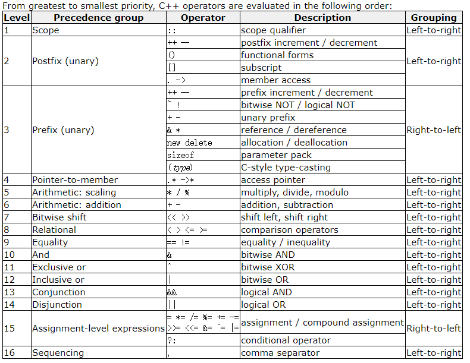

## using namespace std

> Both ways of accessing(访问) the elements of the `std` namespace (explicit qualification and *using*  declarations) are valid in C++ and produce the exact same behavior. For simplicity, and to improve readability, the examples in these tutorials will more often use this latter approach with  *using*  declarations

```c++
#include<iostream> 
//STanDard library,
using namespace std;
int main()
{
	//STandarD Character OUTput device (usually, this is the computer screen),std::cout
	cout << "Hello World"<<endl;
	return 0;
}
```

> **Note that *explicit qualification* is the only way to guarantee that name collisions never happen.** 

## Identifiers

+ A valid identifier is a sequence of one or more letters, digits, or underscore characters(`_`).

+ Spaces, punctuation(标点符号) marks, and symbols **cannot be** part of an identifier. 

+ In addition, identifiers shall always begin with a letter.

  (以下划线开头的用于编译器关键字或为外部标识符保留)

+ **In no case can they begin with a digit！！！**

+ The standard reserved keywords that cannot be used for programmer.

## Fundamental data types

+ Character type
  + char：Exactly one byte in size. At least 8 bits. 
  + char16_t：Not smaller than `char`. At least 16 bits. 
  + char32_t： Not smaller than `char16_t`. At least 32 bits. 
  + wchar_t：Can represent the largest supported character set. 

+ Numerical integer type
  + signed char：Same size as `char`. At least 8 bits. 
  + signed short int： Not smaller than `char`. At least 16 bits. 
  + signed int： Not smaller than `short`. At least 16 bits. 
  + signed long int： Not smaller than `int`. At least 32 bits. 
  + signed long long int：Not smaller than `long`. At least 64 bits. 
  + unsigned：与有符号的一样

+ Floating-point type
  + float
  + double
  + long double
+ Boolean type：bool
+ Void type：void,  identifies the lack of type 
+ Null pointer：decltype（nullptr）

The names of certain integer types can be abbreviated without their `signed` and `int` components.

### initialization of variables

```c++
int a=5;               // initial value: 5
int b(3);              // initial value: 3
int c{2};              // this was introduced by the revision of the C++ standard, in 2011
int result;            // initial value undetermined

// Type deduction: auto and decltype
int foo = 0;
auto bar = foo;  // the same as: int bar = foo;初始化了

int foo = 0;
decltype(foo) bar;  // the same as: int bar;没初始化
```

## Compound types

### string

```c++
#include <string> //include the header where the type is defined within the standard library

string mystring;
string mystring = "This is a string";
string mystring ("This is a string");
string mystring {"This is a string"};
```

我们可以修改字符串的值。

## Constants

### Literals

#### integer numerals

```c++
75         // decimal
0113       // octal
0x4b       // hexadecimal
//u和l的使用，大小写不敏感    
75         // int
75u        // unsigned int
75l        // long
75ul       // unsigned long 
75lu       // unsigned long
```

#### Floating Point Numerals

```c++
3.14159    // 3.14159
6.02e23    // 6.02 x 10^23
1.6e-19    // 1.6 x 10^-19
3.0        // 3.0 
//The default type for floating-point literals is double.
3.14159L   // long double
6.02e23f   // float 
```

#### Character and string literals

Character and string literals are enclosed in quotes: 

```C++
'z'  //single-character literals, 
"Hello world"
"How do you do?"  // string literals 
```

> **Notice that** to represent a single character, we enclose it between single quotes (`'`), and to express a string (which generally consists of more than one character), we enclose the characters between double quotes (`"`) 

Here you have a list of the single character escape codes(转义码)：

| Escape code | Description              |
| ----------- | ------------------------ |
| `\n`        | newline                  |
| `\r`        | carriage return          |
| `\t`        | tab                      |
| `\v`        | vertical(垂直的) tab     |
| `\b`        | backspace(退格)          |
| `\f`        | form feed (page feed)    |
| `\a`        | alert (beep（ 嘟嘟响 ）) |
| `\'`        | single quote (`'`)       |
| `\"`        | double quote (`"`)       |
| `\?`        | question mark (`?`)      |
| `\\`        | backslash (反斜杠)(`\`)  |

 其他：

+ ASCII码表示字符，\\+octal或者\\x+hex

+ Several string literals can be concatenated to form a single string literal simply by separating them by one or more blank spaces, including tabs, newlines, and other valid blank characters. 

  ```
  "this forms" "a single"     " string "
  "of characters"
  //相等
  "this formsa single string of characters"
  ```

+ In C++, a backslash (`\`) at the end of line is considered a *line-continuation* character ：

  ```
  x = "string expressed in \
  two lines"
  //相等
  x = "string expressed in two lines"
  ```


+ char：不想字符，这里的前缀大小写敏感（*case sensitive*）

  | Prefix | Character type |
  | ------ | -------------- |
  | `u`    | `char16_t`     |
  | `U`    | `char32_t`     |
  | `L`    | `wchar_t`      |

+ string：apart from the above `u`, `U`, and `L`, two additional prefixes exist: 

  | Prefix | Description                                                 |
  | ------ | ----------------------------------------------------------- |
  | `u8`   | The string literal is encoded in the executable using UTF-8 |
  | `R`    | The string literal is a raw string，与Python的 r 作用类似   |

#### Other literals

Three keyword literals exist in C++: `true`, `false` and `nullptr`: 

+ `true` and `false` are the two possible values for variables of type `bool`.
+ `nullptr` is the *null pointer* value.

 ```c++
bool foo = true;
bool bar = false;
int* p = nullptr;
 ```

### Typed constant expressions

键入的常量表达式？可以使用他们直接代替定义的常量：

```c++
const double pi = 3.1415926;
const char tab = '\t';
```

### Preprocessor definitions (#define)

语法：`#define identifier replacement`  

```
#define PI 3.14159
```

由预处理处理替换操作，在编译之前，thus causing a sort of blind replacement: the validity of the types or syntax involved is not checked in any way. 

> Note that the `#define` lines are preprocessor directives, and as such are single-line instructions that -unlike C++ statements- **do not require semicolons (;) at the end**; the directive extends automatically until the end of the line. If a semicolon is included in the line, it is part of the replacement sequence and is also included in all replaced occurrences. 

## Operators

### Assignment operator (=)

分配操作符，叫做等于其实有点偏离本意了。一些操作：

assigns the value on the right-hand to the variable on its left

```c++
x = 5;
y = 2 + (x = 5);
x = y = z = 5;
```

### Arithmetic operators 

( +, -, *, /, % )

[ə'rɪθmətɪk] 

| operator | description    |
| -------- | -------------- |
| `+`      | addition       |
| `-`      | subtraction    |
| `*`      | multiplication |
| `/`      | division       |
| `%`      | modulo(取余)   |

### Compound assignment (+=, -=,)

+=, -=, *=, /=, %=, >>=, <<=, &=, ^=, |=

### Increment and decrement (++, --)

++x 与 x++ 的区别

### Relational and comparison operators(==,>)

( ==, !=, >, <, >=, <= )

### Logical operators ( !, &&, || )

| operator | short-circuit(短路操作)                                      |
| -------- | :----------------------------------------------------------- |
| `&&`(与) | if the left-hand side expression is `false`, the combined result is `false` (the right-hand side expression is never evaluated). |
| `||`(或) | if the left-hand side expression is `true`, the combined result is `true` (the right-hand side expression is never evaluated). |

### Conditional ternary(三元) operator ( ? )

`condition ? result1 : result2`  

If `condition` is `true`, the entire expression evaluates to `result1`, and otherwise to `result2`. 

```c++
 c = (a>b) ? a : b;
```

### Comma(逗号) operator ( , )

```c++
a = (b=3, b+2);  //b=3,a=5
```

would first assign the value 3 to `b`, and then assign `b+2` to variable `a`. So, at the end, variable `a` would contain the value 5 while variable `b` would contain value 3. 

### Bitwise operators ( &, |, ^, ~, <<, >> )

按位操作符

| operator | asm equivalent | description                      |
| -------- | -------------- | -------------------------------- |
| `&`      | `AND`          | Bitwise AND                      |
| `|`      | `OR`           | Bitwise inclusive OR             |
| `^`      | `XOR`          | Bitwise exclusive OR（异或）     |
| `~`      | `NOT`          | Unary complement (bit inversion) |
| `<<`     | `SHL`          | Shift bits left                  |
| `>>`     | `SHR`          | Shift bits right                 |

### Explicit type casting operator

+ C，继承于C

  ```c++
  int i;
  float f = 3.14;
  i = (int) f;
  ```

+ C++

  ```
  i = int (f);
  ```

### sizeof

```c++
x = sizeof (char);  //1 ，1bytes
```

> The value returned by `sizeof` is a **compile-time constant**, so it is always determined before program execution. 

### 操作符优先级 Precedence of operators

为了可读性，最好还是在不清楚的情况下用括号吧，这样也可以增加可读性。

> Enclosing all sub-statements in parentheses (even those unnecessary because of their precedence) improves code readability.



## Basic Input/Output

> All we need to know is that streams are a source/destination of characters, and that these characters are provided/accepted sequentially (i.e., one after another).  

| stream | description                                                  |
| -------| --------------------------------------------------------- |
| `cin`  | standard input stream                                        |
| `cout` | standard output stream                                       |
| `cerr` | standard error (output) stream , essentially work like `cout`, |
| `clog` | standard logging (output) stream                             |

### Standard output (cout)

the C++ stream object defined to access it(Standard output) is `cout`. On most program environments, the standard output by default is the screen 

```c++
cout << "This " << " is a " << "single C++ statement";
```

```c++
cout << "I am " << age << " years old and my zipcode is " << zipcode;
//newline
cout << "First sentence." << endl;
```

> endl操纵器产生换行符，就像插入'\ n'一样; 但它还有一个额外的行为：流的缓冲区（如果有的话）被刷新，这意味着请求输出physically写入设备，如果它还没有。 这主要影响完全缓冲(a *fully buffered* )的流，而cout（通常）不是完全缓冲的流。 尽管如此，通常只有在刷新流是一个feature时才使用endl，而当它不是时会使用'\ n'。 请记住，冲洗操作会产生一定的开销，并且在某些设备上可能会产生延迟。

### Standard input (cin)

In most program environments, the standard input by default is the keyboard, and the C++ stream object defined to access it is `cin`. 

Only very simple programs should rely on values extracted directly from `cin` without further checking. A little later we will see how ***stringstreams*** can be used to have better control over user input.

```c++
cin >> a >> b;
//This is equivalent to:
cin >> a;
cin >> b;
```

#### 字符串输入 ：

>  `cin` extraction always **considers spaces (whitespaces, tabs, new-line...) as terminating** the value being extracted, and thus extracting a string means to always **extract a single word**, not a phrase or an entire sentence. 

使用`getline`函数：

```c++
#include <iostream>
#include <string>
using namespace std;

int main ()
{
  string mystr;
  cout << "What's your name? ";
  getline (cin, mystr);
  
  cout << "Hello " << mystr << ".\n";
  cout << "What is your favorite team? ";
  getline (cin, mystr);
  cout << "I like " << mystr << " too!\n";
  return 0;
}
```

### stringstream

The standard header `<sstream>` defines a type called `stringstream` that **allows a string to be treated as a stream**，and thus allowing extraction or insertion operations from/to strings in the same way as they are performed on `cin` and `cout`. This feature is most useful to **convert strings to numerical values** and vice versa，for example：

```c++
string mystr ("1204");
int myint;
stringstream(mystr) >> myint;
```

