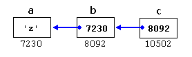

# Arrays

## 初始化

```c++
int foo[5];
int foo [5] = { 16, 2, 77, 40, 12071 }; 
int foo [5] = { 10, 20, 30 };  //其余默认为0
int foo [] = { 16, 2, 77, 40, 12071 };  //当确定的数组值被提供，允许不指定大小

int foo[] { 10, 20, 30 };   //universal initialization also for arrays.可以省略等号。
// int []  foo;  //不可以这样吧 java可以
int baz [5] = { };  //,默认全是0

```

## 多维数组

实际上还是一块连续的内存分配，只不过编译器自动记忆数组每一维度的深度。

> At the end, multidimensional arrays are just an abstraction for programmers, since the same results can be achieved with a simple array, by multiplying its indices. With the only difference that with multidimensional arrays, the compiler automatically remembers the depth of each imaginary dimension 

多维数组初始化呢？

## 数组作为参数

```c++
void procedure (int arg[])  //调用时传数组名字就可以，实际上传的使pointer
void procedure (int myarray[][3][4])  //多维数组
```

> In a way, passing an array as argument always loses a dimension. The reason behind is that, for historical reasons, arrays cannot be directly copied, and thus what is really passed is a pointer. 
>
> 在某种程度上，将数组作为参数传递总是会丢失一个维度???????? 其背后的原因是，由于历史原因，数组不能直接复制，因此实际传递的是指针。

## Library arrays

为了克服一些问题，C++ provides an alternative array type as a standard **container**. It is a type template (a **class template**, in fact) defined in header `<array>`：`#include <array>`

> Suffice it to say that they operate in a similar way to built-in arrays, except that they allow being copied (an actually expensive operation that copies the entire block of memory, and thus to use with care) and decay into pointers only when explicitly told to do so (by means of its member data).
>
> 可以说它们以类似于内置数组的方式运行，除了它们允许被复制（实际上是昂贵的操作，复制整个内存块，因此要小心使用）并且仅在明确被告知这样做时才会衰减成指针（通过其成员数据）。

例子：

```c++
#include <iostream>
#include <array>
using namespace std;

int main()
{
  array<int,3> myarray {10,20,30};

  for (int i=0; i<myarray.size(); ++i)
    ++myarray[i];

  for (int elem : myarray)
    cout << elem << '\n';
}
```

# Character sequences

## 初始化

```c++
char foo [20];
char myword[] = { 'H', 'e', 'l', 'l', 'o', '\0' }; //null character ('\0')
char myword[] = "Hello";  // '\0' is appended automatically.
//不能直接全部修改，但可以对每个元素修改
myword[0] = 'B';
myword[1] = 'y';
myword[2] = 'e';
myword[3] = '\0';
```

### Strings and null-terminated character sequences

```c++
char question1[] = "What is your name? "; //C-sring
string question2 = "Where do you live? "; // library strings，#include <string>是对象
```

> Arrays have a fixed size that needs to be specified either implicit or explicitly when declared,  while strings are simply strings, no size is specified. This is due to the fact that strings have a dynamic size **determined during runtime**, while the size of arrays is **determined on compilation**, before the program runs. 

C++常常使用指针来处理字符串。

# Pointers

## Address-of operator (&)

## Dereference operator (*)

## Declaring pointers

```c++
int * number;
char * character;
double * decimals;
	
int * p1, * p2;  //也可以这样
```

where `type` is **the data type pointed to by the pointer**. This type is not the type of the pointer itself, but the type of the data the pointer points to 

## Pointers and arrays

Actually, an array can always be implicitly converted to the pointer of the proper type:

```c++
int a [20];
int * b;
b = a; //唯一的不同就是a不能被赋值了。

a[5] = 0;       // a [offset of 5] = 0
*(a+5) = 0;     // pointed to by (a+5) = 0
```

These two expressions are equivalent and valid, not only if `a` is a pointer, but also if `a` is an array. Remember that if an array, **its name can be used just like a pointer to its first element**. 

## Pointer initialization

```c++
int myvar;
int * myptr;
myptr = &myvar;
```

而下面是无效的：

```c++
int myvar;
int * myptr;
*myptr = &myvar;
```

## Pointer arithmetics

只有加减操作，不能乘除。But both addition and subtraction have a slightly different behavior with pointers, according to the size of the data type to which they point. 

```c++
char *mychar;
short *myshort;
long *mylong;
```

效果如下，when adding one to a pointer, the pointer is made to point to the following element of the same type,


体会下面四种的不同：

```c++
*p++   // same as *(p++): increment pointer, and dereference unincremented address
*++p   // same as *(++p): increment pointer, and dereference incremented address
++*p   // same as ++(*p): dereference pointer, and increment the value it points to
(*p)++ // dereference pointer, and post-increment the value it points to 
```


```c++
*p++ = *q++;
```

## Pointers and const

指针可以用来访问也可以用来修改，但也可以让指针只能访问内存不能修改变量值。将指针指向的类型限定为const。 

```c++
int x;
int y = 10;
const int * p = &y;
x = *p;          // ok: reading p
*p = x;          // error: modifying p, which is const-qualified
```

当然，Pointers can also be themselves const. And this is specified by appending const to the pointed type (after the asterisk(星号)): 

```c++
int x;
      int *       p1 = &x;  // non-const pointer to non-const int
const int *       p2 = &x;  // non-const pointer to const int
      int * const p3 = &x;  // const pointer to non-const int
const int * const p4 = &x;  // const pointer to const int 
```

> The syntax with `const` and pointers is definitely tricky, and recognizing the cases that best suit each use tends to require some experience. 
>
> 语法`const`和指针绝对是棘手的，并且认识到最适合每种用法的情况往往需要一些经验。 

the `const` qualifier can either precede or follow the pointed type:

```c++
const int * p2a = &x;  //      non-const pointer to const int
int const * p2b = &x;  // also non-const pointer to const int 
```

风格问题。

## Pointers and string literals

```c++
const char * foo = "hello"; 
```

不能修改。想象成下图：


访问：

```c++
*(foo+4)
foo[4]
```

## Pointers to pointers

C++ allows the use of pointers that point to pointers. 服气！

```c++
char a;
char * b;
char ** c;
a = 'z';
b = &a;
c = &b;
```



+ `c` is of type `char**` and a value of `8092`
+ `*c` is of type `char*` and a value of `7230`
+ `**c` is of type `char` and a value of `'z'`

## void pointers

> This gives `void` pointers a great **flexibility**, by being able to **point to any data type**, from an integer value or a float to a string of characters. In exchange, they have a great limitation: the data pointed to by them **cannot be directly dereferenced** (which is logical, since we have no type to dereference to), and for that reason, any address in a `void`pointer needs to be transformed into some other pointer type that points to a concrete data type before being dereferenced. 

One of its possible uses may be to **pass generic parameters** to a function. For example:  

```c++
// increaser
#include <iostream>
using namespace std;

void increase (void* data, int psize)
{
  if ( psize == sizeof(char) )
  { char* pchar; 
   pchar=(char*)data;  //转化为确定的指针类型
   ++(*pchar); }
  else if (psize == sizeof(int) )
  { int* pint; pint=(int*)data; ++(*pint); }
}

int main ()
{
  char a = 'x';
  int b = 1602;
  increase (&a,sizeof(a));
  increase (&b,sizeof(b));
  cout << a << ", " << b << '\n';
  return 0;
}
```

要访问记得要转换类型 `pint=(int*)data;`

## Invalid pointers and null pointers

invalid pointer：

```c++
int * p;               // uninitialized pointer (local variable)

int myarray[10];
int * q = myarray+20;  // element out of bounds 
```

 null pointers：

```c++
int * p = 0;
int * q = nullptr;
```

Here, both `p` and `q` are *null pointers*, meaning that they explicitly point to **nowhere** 

## Pointers to functions

```c++
// pointer to functions
#include <iostream>
using namespace std;

int addition (int a, int b)
{ return (a+b); }

int subtraction (int a, int b)
{ return (a-b); }

int operation (int x, int y, int (*functocall)(int,int))
{
  int g;
  g = (*functocall)(x,y);
  return (g);
}

int main ()
{
  int m,n;
  int (*minus)(int,int) = subtraction;

  m = operation (7, 5, addition);
  n = operation (20, m, minus);
  cout <<n;
  return 0;
}
```

the name of the function is enclosed between parentheses () and an asterisk (`*`) is inserted before the name: 

```c++
int (*minus)(int,int) = subtraction;
```


# Dynamic memory

> There may be cases where the memory needs of a program can only be determined during runtime. For example, when the memory needed depends on user input. On these cases, programs need to dynamically allocate memory, for which the C++ language integrates the operators `new` and `delete`. 

## Operators new and new[]

返回指针：

```c++
pointer = new type  //one single element of type `type`
pointer = new type [number_of_elements]//allocate a block (an array) of elements of type 'type'
```

> There is a substantial difference between declaring a normal array and allocating dynamic memory for a block of memory using `new`. 
>
> The most important difference is that 
>
> + the size of a regular array needs to be a ***constant expression***, and thus its size has to be determined at the moment of designing the program, before it is run, 
> + whereas the dynamic memory allocation performed by `new` allows to assign memory during runtime using **any variable value** as size. 

### 异常`bad_alloc `

```c++
foo = new int [5];  // if allocation fails, an exception is thrown  
```

### nothrow 

This method can be specified by using a special object called `nothrow`, declared in header `<new>` 

如果分配失败，返回 *null pointer*：

```c++
int * foo;
foo = new (nothrow) int [5];
if (foo == nullptr) {
  // error assigning memory. Take measures.
}
```

## Operators delete and delete[]

语法：

```c++
delete pointer;
delete[] pointer;
```

+ The first statement releases the memory of a single element allocated using `new`, 

+   the second one releases the memory allocated for arrays of elements using new and a size in brackets (`[]`).  

注意使用对象：

The value passed as argument to `delete` shall be either a pointer to a memory block previously allocated with `new`, or a *null pointer* (in the case of a *null pointer*, `delete` produces no effect). 

```c++
int i = 5；
p= new (nothrow) int[i];
//....
delete[] p;
```

## Dynamic memory in C

不了解哇！

C++ integrates the operators `new` and `delete` for allocating dynamic memory. But these were not available in the C language; instead, it used a library solution, with the functions `malloc`, `calloc`, `realloc` and `free`, defined in the header `<cstdlib>` (known as `<stdlib.h>` in C). The functions are also available in C++ and can also be used to allocate and deallocate dynamic memory.  

# Data structures

## Data structures

语法：

```c++
struct type_name {
member_type1 member_name1;
member_type2 member_name2;
member_type3 member_name3;
.
.
} [object_names];  //可选，有分号
```

例如：

```c++
struct product {
  int weight;
  double price;
} ;

product apple;
product banana, melon;

//the optional field object_names can be used to 
//directly declare objects of the structure type.
struct product {
  int weight;
  double price;
} apple, banana, melon;
```

## Pointers to structures

stucture是用户自定义的数据类型，同其他数据类型一样，也可以被它自己类型的指针指出。

```c++
struct movies_t {
  string title;
  int year;
};

movies_t amovie;
movies_t * pmovie;
```

这带来了一个新结构：the arrow operator (`->`): 

```c++
pmovie->title
//is, for all purposes, equivalent to: 
(*pmovie).title
// It is definitely something different than:
*pmovie.title
//which is rather equivalent to:
*(pmovie.title)
```

区别：

| Expression | What is evaluated                            | Equivalent |
| ---------- | -------------------------------------------- | ---------- |
| `a.b`      | Member `b` of object `a`                     |            |
| `a->b`     | Member `b` of object pointed to by `a`       | `(*a).b`   |
| `*a.b`     | Value pointed to by member `b` of object `a` | `*(a.b)`   |

## Nesting(嵌套) structures

```c++
struct movies_t {
  string title;
  int year;
};

struct friends_t {
  string name;
  string email;
  movies_t favorite_movie;
} charlie, maria;

friends_t * pfriends = &charlie;
```

# Other data types

## Type aliases (typedef / using)

+ typedef  inherited from the C language

  ```c++
  typedef char C;
  typedef unsigned int WORD;
  typedef char * pChar;
  typedef char field [50]; 
  ```

+ using

  ```c++
  using C = char;
  using WORD = unsigned int;
  using pChar = char *;
  using field = char [50]; 
  ```

## Unions

待定

## Anonymous unions

待定

## Enumerated types (enum)

```c++
enum colors_t {black, blue, green, cyan, red, purple, yellow, white};
```

Values of *enumerated types* declared with `enum` are implicitly convertible to an integer type, and vice versa.(反之亦然) 。

If it is not specified otherwise, the integer value equivalent to the first possible value is `0`, the equivalent to the second is `1`, to the third is `2`, and so on...  

```c++
enum colors_t {black=1, blue, green, cyan, red, purple, yellow, white};
```

从1开始了，而不是0

例子：

```c++
colors_t mycolor;
 
mycolor = blue;
if (mycolor == green) mycolor = red; 
```

## Enumerated types with enum class

> But, in C++, it is possible to create real `enum` types that are neither implicitly convertible to `int` and that neither have enumerator values of type `int`, but of the `enum` type itself, thus preserving type safety. They are declared with `enum class`(or `enum struct`) instead of just `enum`: 
>
> 但是，在C ++中，可以创建既不能隐式转换为int又不具有int类型的枚举值的实际枚举类型，而是枚举类型本身的枚举值，从而保留了类型安全性。 它们用`enum class `（或`enum struct `）声明，而不仅仅是枚举：

例子：

```c++
Colors mycolor;
 
mycolor = Colors::blue;
if (mycolor == Colors::green) mycolor = Colors::red
```

还有：it may be any integral data type, such as `char`, `short` or `unsigned int`

```c++
enum class EyeColor : char {blue, green, brown};
```
