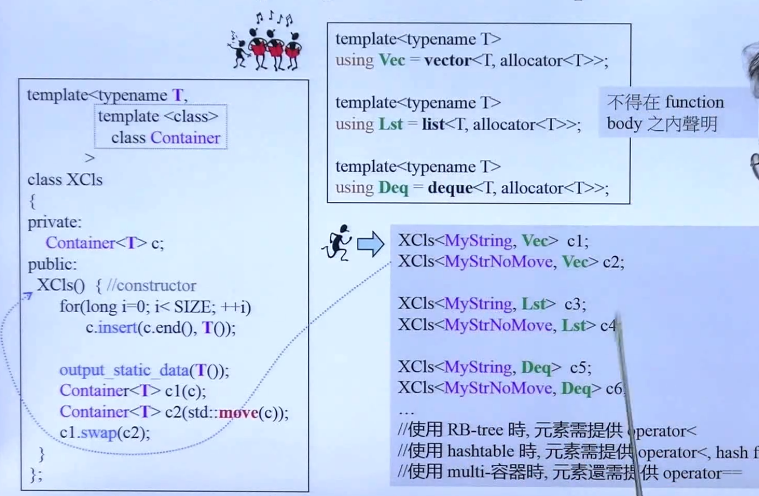

# using

+ using 命令，命名空间或命名空间的成员
+ using declarations对于类成员

+ 模板模板参数+模板别名

  

+ 类型别名

  ```c++
  typedef void (*func)(int,int);
  using func = void(*)(int,int);
  //两者之间没有任何的不同（no difference）
  typedef basic_string<char> string;
  ```


# noexcept

你必须告诉C++（尤其是vector）你的移动构造函数和析构函数不会抛出异常。在vector grows时，移动构造将要被调用。假如构造器不是noexcept，std::vector不敢使用它，因为不知道发生异常怎么办。

vector是怎么grows的？？

# override

应用在虚函数上。

把你的心意告诉编译器，防止一不小心写错。

# final

```c++
struct Base1 final{};

struct Base2 {
    virtual void f() final;
};
```

# decltype

 使用这个关键字，你可以让编译器找出一个表达式的类型。这是typeof特性的实现，然而typeof的实现时不完整和不一致的。因此，c++11引入这个关键子。

+ 声明返回类型

  ```c++
  template<typename T1,typename T2>
  decltype(x+y) add(T1 x, T2 y);
  ```

  这是不可能的在c++11之前，返回表达式使用的对象（x，y）还没有在作用域内引入。

  ```c++
  template<typename T1,typename T2>
  auto add(T1 x, T2 y)-> decltype(x+y);
  ```

   这里与lambda表达式的尾置返回类型很像。

+ 元编程，模板相关？

+ 传递lambda的类型

  ```c++
  auto cmp = [](const Person& p1,const Person& p2){
      
      
  };
  
  std::set<Person,decltype(cmp)> coll(cmp);
  ```

  这里decltype必须被使用。然后将lambda object传给set的构造函数。如果不传递，那么调用cmp类型的默认构造函数，可惜，lamdba没有默认构造函数。因此，将cmp写成一个可调用类更易用。 


# lambdas

是个匿名的函数对象

```c++
[]()mutable throwSpec -> retType {}
```

例子：

```c++
std::vector<int> vi {5,8,96,36,85,12};
int x = 30;
int y = 100;
vi.erase(remove_if(vi.begin(),vi.end(),
				[x,y](int n){return x<n && n<y}	
				),
        vi.end());
```


# initializer_list\<T\>

```c++
{}
```

背后是array容器

# Variadic Templates

新的关键字`...`

可以写出递归的函数

```c++
void func(){}

template<typename T, typename... Types>
void func(cosnt T& firstArg，const Types&... args)
{
    //处理firstArg
    func(args...);
}
```


```c++
template<typename... Types>
void func(const Types&... args)
{
    /*...*/
}
```

上述两个func模板函数，能并存吗？可以。谁比较特化？第一个。

用`sizeof...`可以得到参数包的数量。


