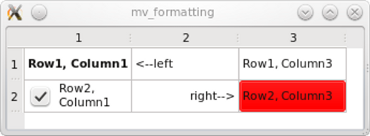

# 注意

1. 所有的信号声明都是公共的，所以Qt规定不能在signals前面加public,private, protected。 
2. 所有的信号都没有返回值，所以返回值都用void。 
3. 所有的信号都不需要定义。 
4. 必须直接或间接继承自QOBject类，并且开头私有声明包含Q_OBJECT。 
5. 当一个信号发出时，会立即执行其槽函数，等待槽函数执行完毕后，才会执行后面的代码，如果一个信号链接了多个槽，那么会等所有的槽函数执行完毕后才执行后面的代码，槽函数的执行顺序是按照它们链接时的顺序执行的。 
6. 在链接信号和槽时，可以设置链接方式为：在发出信号后，不需要等待槽函数执行完，而是直接执行后面的代码。 
7. 发出信号使用emit关键字。 
8. 信号参数的个数不得少于槽参数的个数。 

# 控件随着窗口变化

一定要有顶级布局！！！！

点击设计页面的空白处，或者对象查看其中的QMainWindows，设置布局。

# 信号槽连接

1）Qt4和Qt5都可以使用这种连接方式

```c++
static QMetaObject::Connection connect(
    const QObject *sender, //信号发送对象指针
    const char *signal,    //信号函数字符串，使用SIGNAL()
    const QObject *receiver, //槽函数对象指针
    const char *member, //槽函数字符串，使用SLOT()
    Qt::ConnectionType = Qt::AutoConnection//连接类型，一般默认即可
);

//例如
connect(pushButton, SIGNAL(clicked()), dialog,  SLOT(close()));
```

2）Qt5，Qt5新增这种连接方式，这使得在编译期间就可以进行拼写检查，参数检查，类型检查，并且支持相容参数的兼容性转换。 

```c++
static QMetaObject::Connection connect(
    const QObject *sender, //信号发送对象指针
    const QMetaMethod &signal,//信号函数地址
    const QObject *receiver, //槽函数对象指针
    const QMetaMethod &method,//槽函数地址
    Qt::ConnectionType type = Qt::AutoConnection//连接类型，一般默认即可
);

//例如
connect(pushButton, QPushButton::clicked, dialog,  QDialog::close);
```

# QT中的Model/View

All item models are based on the [QAbstractItemModel](https://doc.qt.io/qt-5/qabstractitemmodel.html) class.   all subclasses of `QAbstractItemModel ` represent the data as a hierarchical structure containing **tables of items**.


QAbstractItemModel提供了一个数据接口，该接口足够灵活，可以处理以表，列表和树形式表示数据的视图。但是，在为列表和类似表的数据结构实现新模型时，QAbstractListModel和QAbstractTableModel类是更好的起点，因为它们提供了常用函数的适当默认实现。

In the model/view architecture, the model provides **a standard interface** that views and delegates use to access data. 

## 名词解释

+ Model indexes：To obtain a model index that corresponds to an item of data, three properties must be specified to the model: **a row number, a column number, and the model index of a parent item**. 

+ Rows(行) and columns

  ```c++
  QModelIndex indexC = model->index(2, 1, QModelIndex());
  ```

  Top level items in a model are always referenced by specifying `QModelIndex()` as their parent item. 


## view->setModel(model);

```c++
#include <QApplication>
#include <QTableView>
#include "mymodel.h"

int main(int argc, char *argv[])
{
    QApplication a(argc, argv);
    QTableView tableView;
    MyModel myModel;
    tableView.setModel(&myModel);
    tableView.show();
    return a.exec();
}
```

Here is the interesting part: We create an instance of MyModel and use tableView.setModel(&myModel); to pass a pointer of it to tableView. tableView will invoke the methods of the pointer it has received to find out two things调用它收到的指针的方法来找出两件事：

+ How many rows and columns should be displayed.
+ What content should be printed into each cell.

该模型需要一些代码响应这一点。

```c++
// mymodel.h
#include <QAbstractTableModel>

class MyModel : public QAbstractTableModel
{
    Q_OBJECT
public:
    MyModel(QObject *parent = nullptr);
    int rowCount(const QModelIndex &parent = QModelIndex()) const override;
    int columnCount(const QModelIndex &parent = QModelIndex()) const override;
    QVariant data(const QModelIndex &index, int role = Qt::DisplayRole) const override;
};
```

[QAbstractTableModel](https://doc.qt.io/qt-5/qabstracttablemodel.html) requires the implementation of three abstract methods. 

## data()

```c++
// mymodel.cpp
#include "mymodel.h"

MyModel::MyModel(QObject *parent)
    : QAbstractTableModel(parent)
{
}

int MyModel::rowCount(const QModelIndex & /*parent*/) const
{
   return 2;
}

int MyModel::columnCount(const QModelIndex & /*parent*/) const
{
    return 3;
}

QVariant MyModel::data(const QModelIndex &index, int role) const
{
    if (role == Qt::DisplayRole)
       return QString("Row%1, Column%2")
                   .arg(index.row() + 1)
                   .arg(index.column() +1);

    return QVariant();
}
```

在实际的应用程序中，`MyModel`将有一个被调用的成员`MyData`，它作为所有读写操作的目标。 

行和列的数量由MyModel :: rowCount（）和MyModel :: columnCount（）提供。当视图必须知道单元格的文本是什么时，它会调用方法MyModel :: data（）。使用参数指定行和列信息index，并将角色设置为Qt :: DisplayRole。

除了控制视图显示的文本外，模型(Model)还控制文本的外观。当我们稍微改变模型时，我们得到以下结果：




设置字体，背景颜色，对齐方式和复选框。下面是生成上面显示的结果的[data（）](https://doc.qt.io/qt-5/qabstractitemmodel.html#data)方法。 这次我们使用参数int role根据其值返回不同的信息。 

```c++
// mymodel.cpp
QVariant MyModel::data(const QModelIndex &index, int role) const
{
    int row = index.row();
    int col = index.column();
    // generate a log message when this method gets called
    qDebug() << QString("row %1, col%2, role %3")
            .arg(row).arg(col).arg(role);

    switch (role) {
    case Qt::DisplayRole:
        if (row == 0 && col == 1) return QString("<--left");
        if (row == 1 && col == 1) return QString("right-->");

        return QString("Row%1, Column%2")
                .arg(row + 1)
                .arg(col +1);
    case Qt::FontRole:
        if (row == 0 && col == 0) { //change font only for cell(0,0)
            QFont boldFont;
            boldFont.setBold(true);
            return boldFont;
        }
        break;
    case Qt::BackgroundRole:
        if (row == 1 && col == 2)  //change background only for cell(1,2)
            return QBrush(Qt::red);
        break;
    case Qt::TextAlignmentRole:
        if (row == 1 && col == 1) //change text alignment only for cell(1,1)
            return Qt::AlignRight + Qt::AlignVCenter;
        break;
    case Qt::CheckStateRole:
        if (row == 1 && col == 0) //add a checkbox to cell(1,0)
            return Qt::Checked;
        break;
    }
    return QVariant();
}
```

## 设置Headers for Columns and Rows

通过View 方法隐藏垂直标题：

```c++
 tableView->verticalHeader()->hide();
```

但是，标题内容是通过模型设置的，因此我们重新实现了[headerData（）](https://doc.qt.io/qt-5/qabstractitemmodel.html#headerData)方法 ：

```c++
QVariant MyModel::headerData(int section, Qt::Orientation orientation, int role) const
{
    if (role == Qt::DisplayRole && orientation == Qt::Horizontal) {
        switch (section) {
        case 0:
            return QString("first");
        case 1:
            return QString("second");
        case 2:
            return QString("third");
        }
    }
    return QVariant();
}
```

## 编辑

模型决定编辑功能是否可用。我们只需要修改模型，以便启用可用的编辑功能。这是通过重新实现以下虚拟方法来完成的：[setData（）](https://doc.qt.io/qt-5/qabstractitemmodel.html#setData)和[flags（）](https://doc.qt.io/qt-5/qabstractitemmodel.html#flags)。 

## 更换View

您可以将上面的示例转换为具有树视图的应用程序。只需用QTreeView替换QTableView，即可生成读/写树。不需要对模型进行任何更改。树将没有任何层次结构，因为模型本身没有任何层次结构。

## Delegates

数据在单元格中显示为文本或复选框，并作为文本或复选框进行编辑。提供这些演示和编辑服务的组件称为*委托*。 View使用一个默认的委托。

需要重写：

```c++
  void paint(QPainter *painter, const QStyleOptionViewItem &option,
               const QModelIndex &index) const override;
```

The [paint()](https://doc.qt.io/qt-5/qabstractitemdelegate.html#paint) function is reimplemented from [QItemDelegate](https://doc.qt.io/qt-5/qitemdelegate.html) and is called whenever the view needs to repaint an item. The function **is invoked once for each item**, represented by a [QModelIndex](https://doc.qt.io/qt-5/qmodelindex.html) object from the model.

```c++
QWidget *createEditor(QWidget *parent,
									const QStyleOptionViewItem &option,
									const QModelIndex &index) const override;
```

The [createEditor()](https://doc.qt.io/qt-5/qabstractitemdelegate.html#createEditor) function is called when the user **starts editing** an item. return a editor.

```c++
void setEditorData(QWidget *editor, const QModelIndex &index) const override;
```

The [setEditorData()](https://doc.qt.io/qt-5/qabstractitemdelegate.html#setEditorData) function is called when an editor is created to **initialize it** with data from the model.

```c++
void setModelData(QWidget *editor, 
                  QAbstractItemModel *model, 
                  const QModelIndex &index) const override;
```

The [setModelData()](https://doc.qt.io/qt-5/qabstractitemdelegate.html#setModelData) function is called to commit data from the editor **to the model** when editing is finished.

```c++
QSize sizeHint(const QStyleOptionViewItem &option, const QModelIndex &index) const override;
```

The `sizeHint()` function returns an **item's preferred size**.


