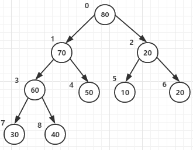

[冒泡排序](#冒泡排序)：每次遍历，都选出最大值，像冒泡一样。

[选择排序](#选择排序)：每次遍历，选择最小值，与前面的元素交换。

[直接插入排序](直接插入排序)：默认第一个元素为有序序列，将之后元素依次插入这个有序序列，并得到新的有序序列。

[希尔排序](希尔排序)：解释不清楚。

[快速排序](快速排序)：选出基数值，根据其他元素大小将他们放在小或大的一侧。然后递归其两侧序列。

[堆排序](#堆排序)：构造大顶堆，根节点（第一个）与尾节点（最后一个）交换，（也就是找出了最大值，放到了最后）。

[归并排序](#归并排序)：分治策略

# 冒泡排序

```c++
vector<int> bubbleSort(vector<int> list)
{
	for (int i = 0; i < list.size()-1; i++) {
		cout << "第" << i + 1 << "次冒泡排序:" << endl;
		bool exchange = false; //用于优化，是否在本次排序中交换了数据

		//for (int j = 0; j < list.size()-1; j++) {       //这样也可以，后面就多余了
		for (int j = 0; j < list.size()-1-i; j++) {       //这里加上：size()-1-i
			if (list[j] > list[j + 1]) {
				int temp = list[j];
				list[j] = list[j + 1];
				list[j + 1] = temp;
				exchange = true;
			}
            
         cout << "sort result:"<<endl;
		for (int s = 0; s < list.size(); s++) {
			cout << list[s] << " ";
		}
		cout << endl;
		if (!exchange) break;
	}
	return list;
}
```

边界问题：

i表示第几次遍历，也可以理解为找到第i+1大（i 从0开始）的数。每一次遍历都会把第i+1大（这里只会考虑正序）的元素找到放到最后。那就需要遍历（length-1）次，剩余最后一个自然不用冒泡了。

j为要对比的数组下标，也可以理解为要比较的次数。由于每次遍历都会找到一个最大值排好，所以其上边界是（size()-1）-i。

第1次（i=0）遍历，把最大值放到下标为size-1的位置，就是最后，倒数第一。j边界为j<size-1。**也可以说要比较size-1次，好像这样更好理解。**

第2次（i=1）遍历，把最大值放到下标为size-2的位置。j边界为j<size-2。为什么不是<=，因为比较时有j+1下标。

...

第n次遍历，把最大值放到下标为size-n的位置,size - 1-i

可以发现，顺数与倒数两个元素的下标加起来等于size-1

# 选择排序

每次找到最小（标记位置）的往前放（交换）。


```c++
vector<int> selectSort(vector<int> list) {
	for (int i = 0; i < list.size(); i++) {
		int mix=i;
		for (int j = i+1; j < list.size(); j++) {
			if (list[j] < list[mix]) {
				mix = j;
			}
		}
		int temp = list[i];
		list[i] = list[mix];
		list[mix] = temp;
	}
	return list;
}
```


# 直接插入排序


假设有一组无序序列 R0, R1, ... , RN-1。

(1) **我们先将这个序列中下标为 0 的元素视为元素个数为 1 的有序序列**。

(2) 然后，我们要依次把 R1, R2, ... , RN-1 插入到这个有序序列中。所以，我们需要一个**外部循环**，从下标 1 扫描到 N-1 。

(3) 接下来描述插入过程。假设这是要将 Ri 插入到前面有序的序列中。由前面所述，我们可知，插入Ri时，前 i 个数肯定已经是有序了。

所以我们需要将Ri 和R0 ~ Ri-1 进行比较，确定要插入的合适位置。这就需要一个**内部循环**，我们一般是从后往前比较，即从下标 i-1 开始向 0 进行扫描。

我竟然这么写：

```c++
	for (int i = 1; i < list_size; i++) {
		for (int j = i; j >0; j--) {
			if (list[j - 1] > list[j]) {   //我这里又去挨个对比大小去了，没有把list[i]取出来
				int temp = list[j];		  //下次比较的就是list[i-1]了
				list[j] = list[j-1];
				list[j -1] = temp;
			}
		}
	}
```

看图：是把第 i 个元素取出来，然后用这个元素去做对比。

```c++
vector<int> insertSort(vector<int> list) {
	if (list.empty()) {
		return list;
	}
	int list_size = list.size();
	for (int i = 1; i < list_size; i++) {   //对应（2）
		int temp = list[i];     //取出来
		int insert_index = i;         //用blank记录空白位置，初始化其为被取出元素的i位置
		for (int j = i-1; j >= 0; j--) {    
			if (list[j] > temp) {
				list[j + 1] = list[j];
				insert_index = j;
			}
			else {
				break;
			}
		}
        list[blank] = temp;
        //======================================================
      	for (int i = 1; i < result.size(); i++){
		// 取出第i个数，和前i-1个数比较后，插入合适位置
		int temp = result[i]；
		int j = i - 1;           //这里使用j+1来确定空白位置
         for (j; j >= 0 && result[j] > temp; j--){   //把条件放在循环条件中
             result[j + 1] = result[j];    //元素后移，空出来一个空白位置
         }
		result[j + 1] = temp;    //空白位置坐标是j+1，这里的j可能是-1
	    }
        //=======================================================
		
		cout << i <<"sort result:" << endl;
		for (int s = 0; s < list.size(); s++) {
			cout << list[s] << " ";
		}
		cout << endl;

	}
	return list;
}
```

优化：

可以用二分查找法查找要插入的位置。

```c++
int BinarySearch(vector<int> list, int n, int value){
	int left = 0;
	int right = n - 1;
 
	while (left <= right){
		int middle = left + ((right - left) >> 1);
 
		if (list[middle] >= value){  //这里的二分查找是要找插入的位置，等于的话跟大于一起处理？
			right = middle - 1;
		}
		else{
			left = middle + 1;
		}
	}
	return (left < n) ? left : -1;
}
 
vector<int> BinaryInsertSort(vector<int> list){
	vector<int> result = list;
	for (int i = 1; i < result.size(); i++){
		int insert_index = BinarySearch(result, i, result[i]);
		if (insert_index != -1){
			int temp = result[i];
			int j = i - 1;
			while (j >= insert_index){
				result[j + 1] = result[j];
				j--;
			}
			result[j + 1] = temp;
		}
		printf("第 %d 趟： ", i);
		for (int i = 0; i < result.size(); i++){
			cout << result[i] << " ";
		}
		cout << endl;
	}
	return result;
}
```

# 希尔排序


```c++
vector<int> ShellSort(vector<int> list){
	vector<int> result = list;
	int n = result.size();
	for (int gap = n >> 1; gap > 0; gap >>= 1){
        //===================这块相当于插入排序了========================
		for (int i = gap; i < n; i++){     //这里就不按照分组去循环了。直接按元素循环，同样效果
			int temp = result[i];
			int j = i - gap;
			while (j >= 0 && result[j] > temp){
				result[j + gap] = result[j];
				j -= gap;
			}
			result[j + gap] = temp;
		}
        //===========================================================
		for (int i = 0; i < result.size(); i++){
			cout << result[i] << " ";
		}
		cout << endl;
	}
	return result;
}
```


# 快速排序


```c++
int division(vector<int> &list, int left, int right) {
	int base = list[left]; //以其为基准，此时这里相当于空白位置
	while (left < right) {
		while (left < right && list[right] >= base) { right--; }  //第二步
		list[left] = list[right];
		while (left < right && list[left] <= base) { left++; }   //第三步
		list[right] = list[left];
	}
	list[left] = base;    //第四步
	return left;
}

vector<int> quickSort(vector<int> &list, int left, int right) {
	if (left < right) {
		int base = division(list, left, right);
		quickSort(list, left, base - 1);
		quickSort(list, base + 1, right);
	}
	return list;
}
```

我写的：

```c++
while (list[right] >= base) { right--; }
		list[left] = list[right];
while (list[left] <= base) { left++; }//没有判断left < right；left可能一直++
		list[right] = list[left];
```

# 堆排序

参考：https://www.cnblogs.com/MOBIN/p/5374217.html

堆排序是一种树形选择排序，

一往无前釜山行 拨开云雾见光明？恭喜IG拍死KT。2018/10/20

当每个节点都大于等于它的两个子节点时，就称为大顶堆 （有序堆）：



这里以数组方式存储堆。可以看到，图中对应数组的下标按层从左到右排列。


算法思想(以大顶堆为例，排序完是正序)：

1. 构造堆：将长度为n的待排序的数组进行堆有序化构造成一个大顶堆。

2. 将根节点与尾节点交换并输出此时的尾节点（**按数组来看，就是移动到数组最后面**）

3. 将剩余的n -1个节点重新进行堆有序化。

4. 重复步骤2，步骤3直至构造成一个有序序列。

   


搞了两小时：

```c++
void swap(vector<int> &list, int i, int j) {
	int temp = list[i];
	list[i] = list[j];
	list[j] = temp;
}

void heapAdjust(vector<int> &list, int parent, int len) {  //把第i个元素（根节点）下拉到正确位置
	int left, right, larger;
	left = 2*parent+1;
	//right = left + 1;  //我尼玛把它放这？？？不更新??这里调了半小时bug
	while (left < len) {
		cout << left << "小于" << len <<endl;
		right = left + 1;
		larger = left;
		if (right<len && list[right]>list[left]) {
			larger = right;
		}
		cout << "  根节点为" << parent << "  larfer为" << larger << endl;

		if (list[larger] > list[parent]) {
			swap(list, parent, larger);
			cout << "  根节点从" << parent << "->" << larger<<endl;
		}
		else
		{
			break;
		}

		parent = larger;
		left = 2*parent+1;
		cout << "  更新" << "parent:" << parent << "   left:" <<left << endl;
		cout << endl;
	}

}

vector<int> heapSort(vector<int> &list) {
	int len = list.size();
	for (int i = len / 2-1; i >= 0; i--) { //堆构造，只有len/2-1个不是叶子节点
		cout << "下拉根结点：" << i<<endl;
		heapAdjust(list, i, len);
	}

	cout << "==========开始排序==========" << endl;
	while (len-1 > 0) {
		swap(list, 0, len-1);    //将堆顶元素与尾节点交换后，长度减1，尾元素最大
		heapAdjust(list, 0, len-1);    //再次对堆进行调整
		len -= 1;

		cout << "第" << len << "趟排序:";
		for (int i = 0; i < list.size(); i++) {
			cout << list[i] << " ";
		}
		cout << endl;
	}
	return list;
}
```

在上面的代码中`heapAdjust`函数，每次将父节点与子节点交换位置。

而下面的`HeapAdjust`，将父节点的值记录下来。像插入排序那样，循环结束后，将值赋给最终位置。

**就是用空间换取交换的时间**。

```c++
void HeapAdjust(vector<int> &list, int parent, int length){
	int temp = list[parent];					// temp保存当前父节点
	int child = 2 * parent + 1;					// 先获得左孩子
 
	while (child < length){
		// 如果有右孩子结点，并且右孩子结点的值大于左孩子结点，则选取右孩子结点
		if (child + 1 < length && list[child] < list[child + 1]){
			child++;
		}
 
		// 如果有右孩子结点，并且右孩子结点的值大于左孩子结点，则选取右孩子结点
		if (temp >= list[child]){
			break;
		}
 
		// 把孩子结点的值赋给父结点
		list[parent] = list[child];
 
		// 选取孩子结点的左孩子结点,继续向下筛选
		parent = child;
		child = 2 * parent + 1;
	}
	list[parent] = temp;
}
```

# 归并排序

参考：https://www.cnblogs.com/chengxiao/p/6194356.html

```c++
//==============================归并排序===============================================
void Merge(vector<int> &input, int left, int mid, int right, vector<int> temp) {
	int i = left;
	int j = mid + 1;
	int k=0;

	while (i <= mid && j <= right) {
		if (input[i] < input[j]) {
			temp[k++] = input[i++];
		}
		else {
			temp[k++] = input[j++];
		}
	}
	while (i <=mid) {
		temp[k++] = input[i++];
	}
	while (j <=right) {
		temp[k++] = input[j++];
	}

	k = 0;
	// 将合并序列复制到原始序列中
	while (left <= right) {
		input[left++] = temp[k++];
	}
}


void MergeSort(vector<int> &input, int left, int right, vector<int> temp) {
	if (left < right) {
		int mid = (right + left) >> 1;
		MergeSort(input, left, mid, temp);
		MergeSort(input, mid + 1, right, temp);
		Merge(input, left, mid, right, temp);
	}
}

void mergesort(vector<int> &input) {
	// 在排序前，先建好一个长度等于原数组长度的临时数组，避免递归中频繁开辟空间
	vector<int> temp(input.size());
	MergeSort(input, 0, input.size() - 1, temp);
}
```


# 基数排序

待