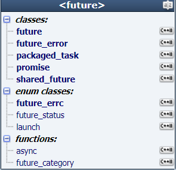

# 概念

[始终博客 程序员自我修养一节](https://liam.page/series/#程序员的自我修养)

## 并发

单核cpu，某一时刻执行一个任务。并发假象：由操作系统调度，进行任务切换（上下文切换，有时间开销）。

多处理器，能实现真正的并行多任务（硬件并发）。

多进程并发，服务器进程之间的进程。同一计算机通信（管道、文件、消息队列、共享内存），不同计算机。

多线程并发，一个进程的所有线程共享地址空间（共享内存），全局变量、指针、引用可以在线程之间传递。带来数据一致性问题。

## 进程

可执行程序的运行

## 线程

每个进程都有一个主线程，这个主线程是唯一的。主线程与进程唇齿相依。主线程随着进程启动并运行。

我们也可以创建其他线程，每个线程，都需要一个**独立的堆栈空间**，线程之间的切换要保存很多中间状态。切换会消耗本该属于运行的时间。

## c++11新标准

以前，

+ windows：CreatThread（），临界区，互斥量。不能跨平台
+ linux：pthread_create()
+ POSIX，thread（pthread）：跨平台，但是需要参数配置。

c++11新标准为多线程引入库：

+ \<atomic\>
+ \<mutex>
+ \<thread\>
+ \<condition_variable\>
+ \<future\>

# Thread

## thread类

标准库的类

进程是否执行完毕的标志是：主线程是否执行完毕。如果主线程执行完了，就代表整个进程执行完毕，其他子线程会被操作系统强行终止。如果想保持子线程，那么就需要让主线程保持运行状态（有例外！）

自己创建的线程也要从一个函数（初始函数）开始。

## join()

线程类的方法，阻塞主线程，让主线程等待子线程执行完毕，然后子线程与主线程汇合。

## detach()

传统多线程主线程需要等待子线程执行完毕，然后退出。

detach：分离，你走你的阳关道，我走我的独木桥。主线程可以提前结束，不必等待子线程。子线程驻留后台（守护线程），运行完毕后，由运行时库释放资源。

一旦调用detach()，不能再调用join()。

## joinable()

判断是否可以成功使用join()和detach()。

## 创建线程方法

可调用对象：函数、类operator() (){ }、lambda表达式

```c++
template <class Fn, class... Args>
explicit thread (Fn&& fn, Args&&... args);
```

## 坑

~~如果子线程使用了主线程中局部变量的引用，且子线程调用`detach()`方法，在主线程结束后，局部变量被销毁，子线程仍然再使用其引用，这将带来不可预料的后果。~~

 如果子线程是可调用类初始化的，在这个类中构造函数使用了主线程中局部变量的引用（比如，此类也持有一个引用成员），且子线程调用`detach()`方法，在主线程结束后，局部变量被销毁，子线程仍然再使用其引用，这将带来不可预料的后果。


疑问：如果以主线程中的局部类对象构造thread对象，当主线程结束后，局部类对象被销毁。那么子线程还能调用这个类的线程函数吗？？？
可以，主线中的对象的确被销毁了，但此对象是被拷贝到了子线程。

# 线程传参

## 临时对象传参：坑

例子：

```c++
void myprint(const int & i, char *mybuf)
{
    cout << i << endl;
    cout << mybuf <<endl;
  	return;
}

int main()
{
    int a = 1;
    int &mya = a;
    char mybuf[] = "this is a test!";
    
    thread myThread(myprint,mya,mybuf);
    
    myThread.detach();
    
    return 0;
}
```

传递临时对象作为线程参数，`detach()`陷阱

+ 给线程函数传递引用，实际并不是 a 的引用，实际是值传递。所以传引用实际上是传值。是因为大家有不同的栈空间，我的引用不能引用到你的栈空间。
+ 传递指针会有问题，主线程结束销毁，子线程再使用的话会不可预料。

如果修改myprint

```c++
void myprint(const int & i, const string &mybuf)
{
    cout << i << endl;
    cout << mybuf.c_str() <<endl;
  	return;
}
```

将char数组隐式转化成字符串。看似没问题了，但是detach() 可能导致主线程结束，mybuf数组 在 转化成 string 之前就被销毁了。构造函数在子线程中执行，即string mybuf在子线程通过 char数组构造。


再次修改：

```c++
thread myThread(myprint,mya,string(mybuf));
```

这样就没问题了，传临时对象。如果这样的话也应该有上述的问题啊？此时，main函数执行结束之前，已经构造出临时对象作为参数了。这里临时对象、线程函数参数都在主线程中分别构造、拷贝出来了。

所以，传值避免使用引用，传对象避免隐式转换（这里用引用来传递，少拷贝一次，只需要两次，创建临时对象一次，拷贝一次）。

## 线程Id

std::this_thread::get_id()的到当前线程id

## std::ref

正真的引用传递，需要使用`std::ref`。

## 智能指针作为参数

```c++
void myprint(unique_ptr<int> pint)
{
    
}

unique_ptr<int> myvar(new int(10));//用std::move传
```


## 成员函数创建线程

```c++
std::thread myThread(&A::run, A, arg); //主线程拷贝类A，使用detach安全
std::thread myThread(&A::run, std::ref(A), arg);//引用
std::thread myThread(&A::run, &A, arg);//引用
```

# 多个线程

可将多个线程放入容器中。

线程之间的运行顺序是不确定的。

## 数据共享

+ 只读，随便读，不需要特殊处理
+ 读写，诡异的事情会发生。用互斥量。

## 互斥量(mutex)

<http://www.cplusplus.com/reference/mutex/mutex/lock/> 

也可以叫互斥锁

类对象，理解成一把锁，多个线程尝试用lock()成员函数来 锁这把锁 ，只有一个线程能锁了这把锁。

同时读写数据的多线程使用。

## lock unlock

mutex类成员函数，成对使用。很难排查是否成对使用。

lock()：

+ 假如这个`mutex`没有被任何线程lock，当前线程lock它（直到这个mutex的`unlock()`被调用，当前线程拥有此`mutex`）
+ 假如这个`mutex`被另一个线程锁住，则当前调用线程被阻塞，直到互斥量被其他线程`unlock()`
+ 如果互斥锁当前被调用此函数的同一线程锁定，则会产生死锁（具有未定义的行为）。

## std::lock_guard

类模板，构造函数执行lock，析构函数unlock。没有自己使用lock unlock解锁。

可以自己加入大括号限制范围。

## std::lock函数模板

两个以上的互斥量可以用。

std::lock(mutex1,mutex2)，不会产生死锁。需要unlock释放锁。

其中锁一把锁失败，就会解锁其他锁。保证同时锁，或不锁。

# unique_lock

类模板。

unique_lock可以取代lock_guard，一般用lock_guard（推荐）。

unique_lock更加灵活。不能复制，只能移动所有权（std::move）。

## 第二个参数

std::adopt_lock，表示互斥量已经lock了，必须已经被lock了，否则报异常。

std::try_to_lock，尝试用mutex的lock()加锁，如果没有成功，也会立刻返回，不会阻塞。

std::defer_lock，并没有给mutex加锁：初始化一个没有加锁的mutex。手动调用unique_lock的lock函数，不需要自己unlock。

## 成员函数

+ lock，当有defer_lock第二个参数时，不会自动加锁。
+ unlock，可以临时解锁去处理一些非共享代码。
+ try_lcok，字面意思。非阻塞。
+ release，返回它所管理的mutex对象指针，并释放所有权。也就是说unique_lock和mutex不再有关系。

# 单例设计模式共享数据分析

1、首先什么时单例模式？

声明：构造函数私有，不能在外部通过new来创建对象，禁止复制。

```c++
class ConfigContainer
{
public:
	~ConfigContainer();
	
    static ConfigContainer & getInstance();
    ConfigContainer & operator=(const ConfigContainer &) = delete;
    ConfigContainer & operator=(ConfigContainer &&) = delete;
private:
	ConfigContainer();
};

static auto Config = std::function<ConfigContainer &()>(ConfigContainer::getInstance);
```

定义：

```c++
ConfigContainer::ConfigContainer()
{
    //...
}


ConfigContainer & ConfigContainer::getInstance()
{
    //在修饰变量的时候，static 修饰的静态局部变量只执行初始化一次，
    //之后使用都是上一次的状态
    //而且延长了局部变量的生命周期，直到程序运行结束以后才释放。
	static ConfigContainer container;
	return container;
}
```

注意：

+ 该代码可能在c++11之前的版本导致多次构造函数的调用，所以只能在较新的编译器上使用。 
+ 局部静态变量初始化具有线程安全性。
+ 解决了接下来要提到的单例模式存在的两个问题，一个是多线程的情况下可能会出现new两次的情况。另外一个是程序退出后没有运行析构函数。 下面采用了静态对象来解决。 


以往的单例模式：

```c++
class Singleton
{
  private:
    static Singleton *local_instance;
    static std::mutex resource_mutex;//2

    Singleton(){};

  public:
    static Singleton *getInstance()
    {
        std::unique_lock<std::mutex> mylock(resource_mutex);//2
        if (local_instance == nullptr)
        {
            local_instance = new Singleton();//怎么delete
            static CGarHuiShou CGar1;
        }
        return local_instance;
    }
    
    
   class CGarHuiShou //1
   {
       public:
           ~CGarHuiShou()
       {
           if(Singleton::local_instance)
           {
               delete Singleton::local_instance;
               Singleton::local_instance = nullptr;
           }
       }
   };
    
};

//类静态变量初始化
Singleton * Singleton::local_instance = nullptr;
std::mutex Singleton::resource_mutex; //2

int main()
{
    Singleton * s = Singleton::getInstance();
    return 0;
}
```

如果不加锁，这样的代码在多线程中可能会被new多次实例。

2、多个线程同时调用`getInstance()`方法。怎么办？互斥量加锁。

刚刚的代码中有两个问题，一个是多线程的情况下可能会出现new多次的情况。另外一个是程序退出后没有delete分配的内存（通过添加内部类解决）。多次new通过代码解决，代码中注释为2的地方。 

```c++
static std::mutex resource_mutex;//2
std::unique_lock<std::mutex> mylock(resource_mutex);//2

std::mutex Singleton::resource_mutex;//2
```

这个版本使用了mutex以及静态成员来析构单例。该方案的劣处在于锁导致速度慢，效率低。但是至少是正确的。


回收静态对象也可以声明为一个为类成员。

```c++
static CGarHuiShou CGar1;//单例类内部类类成员

Singleton::CGarHuiShou Singleton::CGar1;//初始化
```


3、只为防止第一次创建此类时发生错误，而牺牲之后每次调用getInstance()都会次次加锁，效率太低。

解决方法：双重检查。

```c++
static Singleton *getInstance()
{
    if (local_instance == nullptr) {  //不是NULL的时候就不用加锁了，直接返回。

        std::unique_lock<std::mutex> mylock(resource_mutex);

        if (local_instance == nullptr)
        {
            local_instance = new Singleton();
            static CGarHuiShou c1;
        }
    }
    return local_instance;
}
```

但是：由于CPU乱序执行，可能导致访问到未经初始化的对象的引用。

假如线程A进入锁内并分配对象的空间，但是由于指令可能乱序，实际上导致local_instance被先指向一块未被分配的内存，然后再在这块内存上进程初始化。但是在指向后，未初始化前，另一线程B可能通过getInstance获取到这个指针。 

解决方法：<https://www.jianshu.com/p/69eef7651667> 

+ 不优雅的使用volatile来解决指令乱序在双检查锁中出现的问题
+ 大杀器——内存栅栏，在新的标准中，atomic类实现了内存栅栏，使得多个核心访问内存时可控。这利用了c++11的内存访问顺序可控。 
+ 使用pthread_once 或者call_once

4、使用std::call_once()，c++11引入，来自std::atomic库，需要与std::once_flag结合使用。

可以保证函数只调用一次。具备互斥量的能力，比互斥量消耗的资源更少。

```c++
struct once_flag
	{	// opaque data structure for call_once()
	constexpr once_flag() noexcept
		: _Opaque(nullptr)
		{	// default construct
		}

	once_flag(const once_flag&) = delete;
	once_flag& operator=(const once_flag&) = delete;

	void *_Opaque;
	};

```

最终代码：

```c++
#include <iostream>
#include <thread>
#include <mutex>

class Singleton
{
	
private:
	static Singleton *local_instance;
	static std::mutex resource_mutex;

	static std::once_flag g_flag;

	Singleton() {};

	static void createInstance()
	{
		std::chrono::milliseconds t(5000);
		std::this_thread::sleep_for(t);

		local_instance = new Singleton();
		static CGarHuiShou c1;
	}


public:
	static Singleton *getInstance()
	{

		if (local_instance == nullptr) {

			std::unique_lock<std::mutex> mylock(resource_mutex);

			if (local_instance == nullptr)
			{
				//local_instance = new Singleton();
				//static CGarHuiShou c1;
				std::call_once(g_flag, createInstance);
			}
		}
		return local_instance;
	}

	class CGarHuiShou
	{
	public:
			~CGarHuiShou()
		{
			if (Singleton::local_instance)
			{
				delete Singleton::local_instance;
				Singleton::local_instance = nullptr;
			}
		}
	};
};

//定义
Singleton * Singleton::local_instance = nullptr;
std::mutex Singleton::resource_mutex;
std::once_flag  Singleton::g_flag;

void run()
{
	std::cout << "thread id:" << std::this_thread::get_id() << std::endl;
	Singleton * s = Singleton::getInstance();
	std::cout << "thread id:" << std::this_thread::get_id() << " end " << std::endl;
	return;
}


int main()
{
	std::thread t1(run);
	std::thread t2(run);

	t1.join();
	t2.join();

	//Singleton * s = Singleton::getInstance();

	return 0;
}
```

# condition_variable

条件变量。与互斥量配合工作。

生产者-消费者。两个线程。消费者不断取数据，可以死循环，并且每次判断队列是否为空，来进行消费。消费过程需要加锁。防止读写异常发生。

有了条件变量，可以等待条件发生，不必每次去判断。

## wait()

The execution of the current thread (which shall have locked lck's *mutex*) is blocked until *notified*. 

当前线程（已经获得锁）会被阻塞，直到被notified。

```c++
void wait (unique_lock<mutex>& lck);
```

+ 在阻塞时，函数自动调用`lck.unlock()`，允许其他线程继续。注意此线程不会去竞争锁了。
+ 一旦*notified*，函数unblocks，并且调用`lck.lock()`，leaving `lck` in the same state as when the function was called. 然后函数返回 (注意：当调用`lck.lock()`，还可能在wait返回前再次阻塞，此时阻塞会在其他线程调用unlock后竞争锁）。

```c++
template <class Predicate>
void wait (unique_lock<mutex>& lck, Predicate pred);

//看起来像，条件不成立，则wait
while (!pred()) wait(lck);
```

+ pred返回false时，则阻塞本行，函数将自动解锁互斥量（lck.unlock()），允许其他被锁的线程继续。
+ notifications can only unblock the thread when it becomes true
  + 如果被通知，wait函数被unblock，但没有成功获得锁，则阻塞在`lck.lock()`，等待其他线程unblock此锁🔒。
  + 如果被通知，wait函数被unblock，成功拿到锁，则判断条件是否成立：
    + 条件不成立，再次wait()阻塞线程。
    + 成立，执行之后的代码。

~~???到底是阻塞，还是不断尝试获取锁。如果是不断尝试获取锁，那还用个屁的通知啊。。。~~

## notify_one()

...

<https://stackoverflow.com/questions/37026/java-notify-vs-notifyall-all-over-again> ：314回答。

# future



## future类模板

希望得到线程的返回结果。

一些常见用法：

## async函数

+ std::thread，如果系统资源紧张，线程创建会失败，程序报异常。想得到线程返回值不容易。
+ async创建一个异步任务，有时候不创建新线程（同步），与第一个参数有关（std::launch），通过future类很容易拿到返回值。

```c++
		// ENUM launch
enum class launch {	// names for launch options passed to async
	async = 0x1,    //强制异步任务在新线程执行
	deferred = 0x2 //延迟调用，不调用get()则不执行。主线程中执行
	};

//async | deferred  //一起用，可能是创建新线程立即执行，或者没有创建新线程，延迟调用。系统决定
//不带launch参数，默认值是async | deferred
```


```c++
int run()
{
	cout << "thread start," << "thread id :" << this_thread::get_id() << endl;
	chrono::milliseconds dura(5000);
	this_thread::sleep_for(dura);
	cout << "thread end," << "thread id :" << this_thread::get_id() << endl;
	return 555;
}

std::future<int> result = std::async(run);//run 函数，异步，创建子线程
def = result.get(); //blocked
```

## packaged_task类模板

模板参数是：可调用对象，将各种可调用对象包装起来。方便将来作为线程入口函数。

本身也相当于可调用对象。可以扔到（std::move，拷贝可以吗？？不可以，已delete）容器中，等之后取出来运行。。。。也可以用于创建线程。

```c++
std::packaged_task<int(void)> mypack(run);

std::thread t1(std::ref(mypack));//传引用
t1.join();
std::future<int> result2 = mypack.get_future()
int r = result2.get();
```


## promise类模板

我们能够在某个线程中给它赋值，然后从其他线程取出。

```c++
void mythread(std::promise<int> &temp, int calc)
{
	calc++;
	chrono::milliseconds dura(5000);
	this_thread::sleep_for(dura);

	int result = calc;

	temp.set_value(result);//结果保存到promise对象中
}


int main()
{
	cout << "main," << "thread id :" << this_thread::get_id() << endl;
	std::promise<int> myprom;

	std::thread t1(mythread, std::ref(myprom), 150);
	t1.join();
	
	std::future<int> f = myprom.get_future();

	return 0;
}
```


## share_future

+ future的`get()`方法是移动语义
+ share_future的`get()`方法是拷贝，可以调用多次。


# atomic

互斥量：多线程，操作共享数据。可加锁一块代码。

原子量，多线程对一个变量做读写操作。

加锁解锁效率比较低，原子操作，一般指不可分割的操作。

不支持：`atomic = atomic + 1;`

支持 `+=`

```c++
cout<<atomic;//这行代码不是原子操作。
```

构造、拷贝被禁用。使用load、store函数。

```c++
atomic<int> atm2(atm1.load());
atm2.store(12);
```


# 临界区

windows临界区

```c++
#include <windows.h>
CRITICAL_SECTION my_winsec;

InitializeCriticalSection(&my_winsec);
EnterCriticalSection(&my_winsec);
//......
LeaveCriticalSection(&my_winsec);
```

同一线程可以多次进入临界区，进多少次出多少次。

mutex 不能锁多次。

## recursive_mutex 

递归独占互斥量，允许同一线程多次lock。效率上比mutex低。递归次数据说有限制，多了会报异常。

## 带超时的mutex

+ std::timed_mutex
+ std::recursive_timed_mutex 


接口：

+ try_lock_for()，参数是多长时间
+ try_lock_until()，参数是未来时间点，时间到了就继续程序。

# 虚假唤醒

```c++
std::unique_lock<std::mutex> mylock(_mutex);

//wait被唤醒，但是队列中为空，虚假唤醒
//如果消费者线程多，notify_all，只能有一个获得锁
_cv.wait(mylock, [this]() {
    if (!_chickens.empty())
        return true;
    return false;
});
```

# 线程数量问题

+ 2000个线程就是极限了 。
+ 建议线程数量   = cpu数量，cpu×2，cpu×2+2
+ 操作系统调度线程，开的太多了，时间都花在调度上了。运行时间少了。

# 线程池

场景设想：

服务器：每来一个客户端链接，就创建一个线程为其服务。

问题：

+ 用户多，十万，几十万。不可能创建那么多线程。
+ 程序稳定性，可能创建线程失败。

线程池：

+ 一次性创建好一定数量的线程。
+ 程序运行中，不会再创建销毁线程。

# 对notify_one与notify_all的一点疑惑


