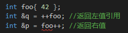

# _T

```c++
CString strTemp=_T("MFC Tutorial");
```

_T是什么意思？

当工程是Unicode编码时，_T将括号内的字符串以Unicode方式保存；

当工程是多字节编码时，_T将括号内的字符串以ANSI方式保存。

关键字“L”，则是不管编码环境是什么，都是将其后面的字符串以Unicode方式保存。

Unicode字符是LPCWSTR

ASCII字符是LPCSTR

通过强制转换是无法完成的，需要用_T()和L()来完成转换

# 数组与指针

```c++
int arr[10];        // arr 是一个数组，长度是 10，元素类型是 int 型
int *parr[10];      // parr 是一个数组，长度是 10，元素类型是 int *，也就是数组中存的是指针
int (*p)[10] = &arr;
                    // p 是一个指针，它指向一个长度是 10 元素类型是 int 型的数组
```

这样一来，就不难构造返回数组的指针的函数定义了。 

```c++
int *(func(param_list))[10];
                    // 错误：func 是一个函数，param_list 是它的参数
                    // 它尝试返回一个长度为 10，元素类型为 int * 的数组
                    // 而数组是无法返回的
int (*func(param_list))[10];
                    // 正确：func 是一个函数，param_list 是它的参数
                    // 它返回的是一个指针
                    // 这个指针指向了一个长度为 10 元素类型是 int 型的数组
```

# 动态数组

Primer5：p101、p423

+ new分配一个数组，我们并没有得到一个数组类型的对象，而是得到一个**数组元素类型的指针**。。
  不能使用数组维度来返回元素指针，所以不能使用**范围for语句**来处理动态数组中的元素。
+ 动态数组不是数组类型的

```c++
int *pia = new int[10];  //默认初始化，10个未初始化的int
int *pia = new int[10]();//值初始化，10个初始化值为0的int
string *psa = new string[10];   //10个空string
string *psa = new string[10]();   //10个空string
```


# 智能指针

[一文说尽C++智能指针的点点滴滴](https://www.itcodemonkey.com/article/10733.html)

# =delete

[C++11 标准新特性：Defaulted 和 Deleted函数](https://www.ibm.com/developerworks/cn/aix/library/1212_lufang_c11new/index.html)


# 信号量

Semaphore是旗语的意思，在Windows中，Semaphore对象用来控制对资源的并发访问数。Semaphore对象具有一个计数值，当值大于0时，**Semaphore被置信号**，当计数值等于0时，Semaphore被清除信号。每次针对Semaphore的wait functions返回时，计数值被减1，调用ReleaseSemaphore可以将计数值增加 lReleaseCount 参数值指定的值。 

1）创建信号量：

```c++
HANDLE CreateSemaphore(
  LPSECURITY_ATTRIBUTES lpSemaphoreAttributes,
  LONG lInitialCount,
  LONG lMaximumCount,
  LPCTSTR lpName
);
```

函数说明：

第一个参数表示安全控制，一般直接传入NULL。

第二个参数表示初始资源数量。

第三个参数表示最大并发数量。

第四个参数表示信号量的名称，传入NULL表示匿名信号量。

2）打开信号量：

```c++
HANDLE OpenSemaphore(
  DWORD dwDesiredAccess,
  BOOL bInheritHandle,
  LPCTSTR lpName
);
```

函数说明：

第一个参数表示访问权限，对一般传入SEMAPHORE_ALL_ACCESS。详细解释可以查看MSDN文档。

第二个参数表示信号量句柄继承性，一般传入TRUE即可。

第三个参数表示名称，不同进程中的各线程可以通过名称来确保它们访问同一个信号量。

3）ReleaseSemaphore :

```c++
BOOL ReleaseSemaphore(
  HANDLE hSemaphore,
  LONG lReleaseCount, 
  LPLONG lpPreviousCount
);
```

函数说明：

第一个参数是信号量的句柄。

第二个参数表示增加个数，必须大于0且不超过最大资源数量。

第三个参数可以用来传出先前的资源计数，设为NULL表示不需要传出。

4）信号量的清理与销毁 :

由于信号量是内核对象，因此使用CloseHandle()就可以完成清理与销毁了。 

# 线程 WINAPI CreateThread

CreateThread

```c++
HANDLE WINAPI CreateThread(
    LPSECURITY_ATTRIBUTES   lpThreadAttributes, //线程安全相关的属性，常置为NULL
    SIZE_T                  dwStackSize,        //新线程的初始化栈大小，可设置为0
    LPTHREAD_START_ROUTINE  lpStartAddress,     //被线程执行的回调函数，也称为线程函数
    LPVOID                  lpParameter,        //传入线程函数的参数，不需传递参数时为NULL
    DWORD                   dwCreationFlags,    //控制线程创建的标志
    LPDWORD                 lpThreadId          //传出参数，用于获得线程ID，如果为NULL则不返回线程
);
```

dwCreationFlags：表示创建线程的运行状态，其中CREATE_SUSPEND表示挂起当前创建的线程，而0表示立即执行当前创建的进程； 

如果函数调用成功，则返回新线程的句柄，调用WaitForSingleObject函数等待所创建线程的运行结束。函数的格式如下： 

```c++
DWORD WaitForSingleObject(
                          HANDLE hHandle,
                          DWORD dwMilliseconds
                         );
```

# c++多线程头文件

C++11 新标准中引入了四个头文件来支持多线程编程，他们分别是：

```c++
<atomic> ,<thread>,<mutex>,<condition_variable>和<future>。 
```

+ `atomic`：该头文主要声明了两个类, std::atomic 和 std::atomic_flag，另外还声明了一套 C 风格的原子类型和与 C 兼容的原子操作的函数。
+ `thread`：该头文件主要声明了 std::thread 类，另外 std::this_thread 命名空间也在该头文件中。
+ `mutex`：该头文件主要声明了与互斥量(mutex)相关的类，包括 std::mutex 系列类，std::lock_guard, std::unique_lock, 以及其他的类型和函数。
+ `condition_variable`：该头文件主要声明了与条件变量相关的类，包括 std::condition_variable 和 std::condition_variable_any。
+ `future`：该头文件主要声明了 std::promise, std::package_task 两个 Provider 类，以及 std::future 和 std::shared_future 两个 Future 类，另外还有一些与之相关的类型和函数，std::async() 函数就声明在此头文件中。

不明觉厉。。。。。。。。。。。。

# atomic\<T\>

<http://www.cnblogs.com/haippy/p/3301408.html> 

```c++
template <class T> struct atomic;
```

原子类型对象的主要特点就是从不同线程访问不会导致**数据竞争**(data race)。因此从不同线程访问某个原子对象是良性 (*well-defined*) 行为，而通常对于非原子类型而言，并发访问某个对象（如果不做任何同步操作）会导致未定义 (*undifined*) 行为发生。 

原子操作：针对原子类型操作要不一步完成，要么不做，不可能出现操作一半被切换CPU，这样防止由于多线程指令交叉执行带来的可能错误。非原子操作下，某个线程可能看见的是一个其它线程操作未完成的数据。 

atomic<T>编译器通常会使用一个内部锁保护， 

还提供针对整形(integal)的特化 ，针对指针的特化

## 构造函数

由默认构造函数创建的 std::atomic 对象处于未初始化(uninitialized)状态，对处于未初始化(uninitialized)状态 std::atomic对象可以由 atomic_init 函数进行初始化。 

| default (1)        | `          atomic() noexcept = default; ` |
| ------------------ | ----------------------------------------- |
| initialization (2) | `constexpr atomic (T val) noexcept; `     |
| copy [deleted] (3) | atomic (const atomic&) = delete;`         |


## store/load

我们知道 std::atomic 是模板类，一个模板类型为 T 的原子对象中封装了一个类型为 T 的值。 

+ store

  修改被封装的值，std::atomic::store 函数将类型为 T 的参数 val 复制给原子对象所封装的值。 

+ load

  读取被封装的值。

# mutex

`std::thread`用于创建一个执行的线程实例，所以它是一切并发编程的基础，使用时需要包含头文件，它提供了很多基本的线程操作，例如`get_id()`来获取所创建线程的线程 ID，例如使用`join()`来加入一个线程等。 

使用std::mutex创建互斥体，std::unique_lock上锁。由于C++保证了所有栈对象在声明周期结束时会被销毁，所以这样的代码是异常安全的。无论发生异常还是正常结束，都会自动调用unlock()。 

```c++
#include <thread>
#include <mutex>

std::mutex mtx;
//使用
void block_area() {
    std::unique_lock<std::mutex> lock(mtx);
    //...临界区，共享内存的读写,std::cout也专用等等
}

int main() {
    std::thread thd1(block_area);
    thd1.join();

    return 0;
}
```


## Lock 类（两种）

+ std::lock_guard，与 Mutex RAII 相关，方便线程对互斥量上锁。
+ std::unique_lock，与 Mutex RAII 相关，方便线程对互斥量上锁，但提供了更好的上锁和解锁控制。

# condition_variable

```c++
std::condition_variable cond;

cond.notify_all();//?
cond.wait(lock, [this]() {return !tasks.empty(); });//?
```

condition.wait(lock,bool)，当bool为false的时候，线程将会被堵塞挂起，被堵塞时需要notify_one来唤醒线程才能继续执行 


std::condition_variable 是条件变量。条件变量是啥？？

 wait 函数被调用的时候，它使用 std::unique_lock(通过 std::mutex) 来锁住当前线程。当前线程会一直被阻塞，直到另外一个线程在相同的 std::condition_variable 对象上调用了 notification 函数来唤醒当前线程。 

实例代码：

```c++
#include <iostream>                // std::cout
#include <thread>                // std::thread
#include <mutex>                // std::mutex, std::unique_lock
#include <condition_variable>    // std::condition_variable

std::mutex mtx; // 全局互斥锁.
std::condition_variable cv; // 全局条件变量.
bool ready = false; // 全局标志位.

void do_print_id(int id)
{
    std::unique_lock <std::mutex> lck(mtx);
    while (!ready) // 如果标志位不为 true, 则等待...
        cv.wait(lck); // 当前线程被阻塞, 当全局标志位变为 true 之后,
    // 线程被唤醒, 继续往下执行打印线程编号id.
    std::cout << "thread " << id << '\n';
}

void go()
{
    std::unique_lock <std::mutex> lck(mtx);
    ready = true; // 设置全局标志位为 true. 
    cv.notify_all(); // 唤醒所有线程.
    //如果不讲ready设置为true，唤醒可以吗?
}

int main()
{
    std::thread threads[10];
    // spawn 10 threads:
    for (int i = 0; i < 10; ++i)
        threads[i] = std::thread(do_print_id, i);

    std::cout << "10 threads ready to race...\n";
    go(); // go!

  for (auto & th:threads)
        th.join();

    return 0;
}
```


# future

一些看不懂的代码

共享状态是什么。

```c++
template<class F, class ... Args>
auto commitOnce(F && f, int priority = NORMAL, Args &&... args) -> std::future<decltype(f(args...))>
	{
		if (stop.load())
			throw std::runtime_error("task container has closed commit.");

		if (priority < HIGHEST) priority = HIGHEST;
		else if (priority > LOWEST) priority = LOWEST;

		using ResType = decltype(f(args...));

		auto bind_f = std::bind(std::forward<F>(f), std::forward<Args>(args)...);
		auto task = std::make_shared<std::packaged_task<ResType()>>(std::move(bind_f));

		{
			std::unique_lock<std::mutex> lock{ mutex };
			tasks.emplace(PriorityTask{priority, [task]() {(*task)(); } });
		}

		cond.notify_all();
		//可以通过 get_future 来获取与该 promise 对象相关联的 future 对象，
		//调用该函数之后，两个对象共享相同的共享状态(shared state)
		std::future<ResType> future = task->get_future();
		return future;
	}
```


future 头文件中包含了以下几个类和函数：

+ Providers 类：std::promise, std::package_task ，模板类，通常模板实例化参数是任务函数(callable object)。 
+ Futures 类：std::future, shared_future.
+ Providers 函数：std::async()，模板函数 
+ 其他类型：std::future_error, std::future_errc, std::future_status, std::launch.

例子：

## async

1） async+future简单用法 

假设计算任务 int task(string x); 

下面所用的task即上述函数的函数指针。

```c++
future<int> myFuture=async(task,10)//这里future的模板参数要和任务task返回类型一致为int
```

这里async自动创建一个后台线程(可以选取一个空闲的线程)执行任务task函数，并将计算结果保存在myFuture中 。

怎样获得任务结果呢？ 答：通常原来的线程(即创建myFuture的线程记为A，不是async执行task那个线程)可以执行其它操作，直到其想要获取task的结果时调用int x=myFuture.get()即可获得task的执行结果并保存至x中。注意若task没有执行完就调用了myFuture.get()那么线程A将会阻塞直到task完成。

## packaged_task

2）packaged_task+future简单用法 

```c++
packaged_task<int(int)> myPackaged(task); //return callable object
future<int> myFuture=myPackaged.get_future();
thread myThread(move(myPackaged),"hello world");
//这里主线程可以做其它的操作
int x=myFuture.get();//线程还可以在执行一些其它操作，直到其想获取task的结果时调用此语句
```

1. 首先创建packaged_task对象myPackaged其内部创建一个函数task和一个共享状态(用于返回task的结果)
2. 通过packaged_task::get_future()返回一个future对象myFuture用于获取task的任务结果
3. 创建一个线程执行task任务，这里注意move语义强制将左值转为右值使用**因为packaged_task禁止copy constructor**，可以不创建线程，那么task任务的执行将和future结果的获取在同一个线程，这样就不叫异步了。

## promise

3）promise+future简单用法，摘自cplusplus的范例： 

可用于线程间传递值。

```c++
#include <iostream>       // std::cout
#include <functional>     // std::ref
#include <thread>         // std::thread
#include <future>         // std::promise, std::future
void print_int (std::future<int>& fut) {
  int x = fut.get();
  //当promise::set_value()设置了promise的共享状态值后，fut将会通过future::get()获得该共享状态值，
  //若promise没有设置该值那么fut.get()将会阻塞线程直到共享状态值被promise设置
  std::cout << "value: " << x << '\n';    //输出：value: 10
}
int main ()
{
  std::promise<int> prom;                      //创建一个promise对象
  std::future<int> fut = prom.get_future();    //获取promise内部的future，fut将和promise共享promise中的共享状态，该共享状态用于返回计算结果
  std::thread th1 (print_int, std::ref(fut));  //创建一个线程，并通过引用方式将fut传到print_int中
  prom.set_value (10);                         //设置共享状态值
                                               //
  th1.join();//等待子线程
  return 0;
}
```

## 分析

将主线程即需要task结果的线程称为provider，称执行任务task或上面print_int的线程为executor(这里只是为了后面表述方便，没有科学考证的) 。

+ async通过创建或者选取一个当前空闲线程执行任务，然后将计算结果保存至与此async相关的future中，期间只有存取结果值，没有其它的交互，并且是provider持有future，executor执行任务。
+ packaged_task是一个对象其内部持有callable object，provider创建一个下线程executor执行任务，最后provider通过相关的future获取任务计算结果。和async差不多。只有任务结果的存取，没有其它交互。
+ promise是provider持有，executor持有相关的future，然后provider通过promise设定共享状态的值，future获取该共享值后执行某些任务。~~形式上和前面两个有点相反~~。

## 线程池相关

通常线程池采用模板实现时各线程执行的都是相同类型的任务，**若采用packaged_task可以将不同类型的函数对象封转在其内部，每个线程取走一个packaged_task执行，那么线程池执行的任务可以不同**。 

下面是一个GUI中一个线程专门接收用户任务并压入任务队列，另一个线程专门执行用户任务：

```c++
std::mutex m;
std::deque<std::packaged_task<void()> > tasks;
bool gui_shutdown_message_received();
void get_and_process_gui_message();
void gui_thread()
{
   while(!gui_shutdown_message_received())//不断获取用户任务
   {
      get_and_process_gui_message();
      std::packaged_task<void()> task;
      {
          std::lock_guard<std::mutex> lk(m);
          if(tasks.empty())
              continue;
          task=std::move(tasks.front());  //参数没传啊？？2019/4/9 
          //参数在构造task对象的时候就传了
          tasks.pop_front();
      }
      task();
   }
}
std::thread gui_bg_thread(gui_thread);
template<typename Func>
std::future<void> post_task_for_gui_thread(Func f)//添加任务
{
   std::packaged_task<void()> task(f);  //
   std::future<void> res=task.get_future();
   std::lock_guard<std::mutex> lk(m);
   tasks.push_back(std::move(task));//
   return res;
}
```


# thread

| default (1)        | `thread() noexcept; `                                        |
| ------------------ | ------------------------------------------------------------ |
| initialization (2) | `template <class Fn, class... Args> explicit thread (Fn&& fn, Args&&... args); ` |
| copy [deleted] (3) | `thread (const thread&) = delete; `                          |
| move (4)           | `thread (thread&& x) noexcept;`                              |

+ (1). 默认构造函数，创建一个空的 thread 执行对象。

+ (2). 初始化构造函数，创建一个 thread对象，该 thread对象可被 joinable，新产生的线程会调用 fn 函数，该函数的参数由 args 给出。例如：

  ```c++
  _thread = thread(&Thread::run, this);//再查一下
  ```

  这里的`this`是成员函数中隐式传入的参数，懂吧。run方法本身没有参数。

+ (3). 拷贝构造函数(被禁用)，意味着 thread 不可被拷贝构造。
+ (4). move 构造函数，move 构造函数，调用成功之后 x 不代表任何 thread 执行对象。
+ 注意：可被 joinable 的 thread 对象必须在他们销毁之前被主线程 join 或者将其设置为 detached.

## 初始化例子

```c++
void f1(int n)
{
    for (int i = 0; i < 5; ++i) {
        std::cout << "Thread " << n << " executing\n";
        std::this_thread::sleep_for(std::chrono::milliseconds(10));
    }
}
 
void f2(int& n)
{
    for (int i = 0; i < 5; ++i) {
        std::cout << "Thread 2 executing\n";
        ++n;
        std::this_thread::sleep_for(std::chrono::milliseconds(10));
    }
}
 
int main()
{
    int n = 0;
    std::thread t1; // t1 is not a thread
    std::thread t2(f1, n + 1); // pass by value
    std::thread t3(f2, std::ref(n)); // pass by reference
    std::thread t4(std::move(t3)); // t4 is now running f2(). t3 is no longer a thread
    t2.join();
    t4.join();
    std::cout << "Final value of n is " << n << '\n';
}
```

## move赋值操作

| move (1)           | `thread& operator= (thread&& rhs) noexcept; ` |
| ------------------ | --------------------------------------------- |
| copy [deleted] (2) | `thread& operator= (const thread&) = delete;` |

+ (1)move 赋值操作，如果当前对象不可 joinable，需要传递一个右值引用(rhs)给 move 赋值操作；如果当前对象可被 joinable，则 terminate() 报错。
+ (2)拷贝赋值操作被禁用，thread 对象不可被拷贝。

## 成员函数join detach

+ join

The function returns when the thread execution has completed. 这会阻止调用此函数的线程的执行，直到这个函数返回为止。基本上，这是一种可以用来知道一个线程已结束的机制。当thread::join()返回时，OS的执行的线程已经完成，C++线程对象可以被销毁。
After a call to this function, the [thread](http://www.cplusplus.com/thread) object becomes non-*joinable* and can be *destroyed* safely.

thread::join()是个简单暴力的方法，主线程等待子进程期间什么都不能做 

+ detach

当`thread::detach()`函数被调用后，执行的线程从线程对象中被分离，已不再被一个线程对象所表达--这是两个独立的事情。C++线程对象可以被销毁，同时OS执行的线程可以继续。如果程序想要知道执行的线程何时结束，就需要一些其它的机制。join()函数在那个thread对象上不能再被调用，因为它已经不再和一个执行的线程相关联。所以变成*non-joinable*
After a call to this function, the [thread](http://www.cplusplus.com/thread) object becomes *non-joinable* and can be *destroyed* safely. 

表示子线程无需和主线程会合，也就是相分离的，这种情况下，子线程一旦进入终止状态，这种方式常用在线程数较多的情况下，有时让主线程逐个等待子线程结束，或者让主线程安排每个子线程结束的等待顺序，是很困难或不可能的，所以在并发子线程较多的情况下，这种方式也会经常使用。 

+ 注意

  去销毁一个仍然可以“joinable”的C++线程对象会被认为是一种错误。为了销毁一个C++线程对象，约么join()函数需要被调用（并结束），要么detach()函数被调用。如果一个C++线程对象当销毁时仍然可以被join，异常会被抛出。

啥时候是unjoinable？？

+ **默认构造**的线程对象不表达为执行的线程，所以是unjoinable。
+ 被移开的(detach)线程将不表达为执行的线程，所以是unjoinable。

# thread传递引用

```c++
#include <thread>
#include<iostream>
#include <functional>
using namespace std;

void update(int a, int& b) {
	b = a;
}

int main()
{
	int init = 1;
    
	thread t(update, 100, init);  //编译就报错错误	“std::invoke”: 未找到匹配的重载函数
    //网上好些例子能运行，但在VS2017下编译不通过

	t.join();
	cout << init << endl;
	system("pause");
	return 0;
}
```

我们就需要知道，一个进程中的多个线程时共用相同的地址空间，但是它们拥有各自独立的栈空间，一个线程时不能直接访问另外一个线程的栈空间的。以上例子中，线程执行函数update中，实际上是在新的线程栈空间。而我们想要修改的init的实际地址是在主线程的栈上。因此，当线程在update函数中执行时，它并不能访问到原始的init，所以只能采用拷贝的方式。

由于线程执行体的参数需要采用拷贝构造函数，因此如果与一个对象是不可拷贝的，那它不能以引用或是值的形式作为执行体的参数。对于一些不可拷贝的类型，我们需要准备好移动语义——在传参的时候，使用  `std::move()`   得到右值，传递给 `std::thread` 的构造函数。 

+ 1）直接使用引用传递不能达到预期目的，需要使用std::ref来封装需要引用传递的对象；
+ 2）使用指针可以达到我们期望的目的，此时就是地址的拷贝。

# priority_queue

# **volatile**

[C/C++ Volatile关键词深度剖析](http://hedengcheng.com/?p=725)

# 左值右值

[谈谈 C++ 中的右值引用](https://liam.page/2016/12/11/rvalue-reference-in-Cpp/)

# ++



# std::forward

# move语义

```c++
#include <iostream>
#include <string>

class Container {
private:
	typedef std::string Resource;

public:
	Container() {
		resource_ = new Resource;
		std::cout << "default constructor." << std::endl;
	}
	explicit Container(const Resource& resource) {
		resource_ = new Resource(resource);
		std::cout << "explicit constructor." << std::endl;
	}
	~Container() {
		delete resource_;
		std::cout << "destructor" << std::endl;
	}
	Container(const Container& rhs) {
		resource_ = new Resource(*(rhs.resource_));
		std::cout << "copy constructor." << std::endl;
	}
	Container& operator=(const Container& rhs) {
		delete resource_;
		resource_ = new Resource(*(rhs.resource_));
		std::cout << "copy assignment." << std::endl;
		return *this;
	}

//move语义
	Container(Container&& rhs) : resource_(rhs.resource_) {
		rhs.resource_ = nullptr;
		std::cout << "move constructor." << std::endl;
	}
	Container& operator=(Container&& rhs) {
		Resource* tmp = resource_; resource_ = rhs.resource_; rhs.resource_ = tmp;
		std::cout << "move assignment." << std::endl;
		return *this;
	}

private:
	Resource* resource_ = nullptr;
};

Container get() {
	Container ret("tag");//2.explicit constructor.
	return ret; 
    //3.copy constructor.将ret拷贝到临时对象
    //4.destructor，销毁foo中的资源
}

int main() {
	Container foo;  //1.默认构造函数
	foo = get();  //5.copy assignment，将临时变量的资源拷贝一份给foo中的资源
    //6.destructor，销毁临时变量
    
	/*如果没有移动构造函数和移动赋值函数，输出为：
	default constructor.
	explicit constructor.
	copy constructor.
	destructor
	copy assignment.
	destructor
	请按任意键继续. . .
	destructor
	*/
	system("pause");
    //7.销毁foo
	return 0;
}
```

仔细想想你会发现，销毁 `foo` 中的资源，再从临时对象中复制相应的资源，这件事情完全没有必要。我们最好能直接抛弃 `foo` 中的资源而后直接接管 `get` 返回的临时对象。这就是 move 语义。 

+ 从函数返回值中得到临时对象 `rhs`；
+ 交换 `foo.resource_` 和 `rhs.resource_` 两个指针的值；
+ 销毁 `rhs` 这一临时对象。

这相当于我们将临时对象 `rhs` 中的资源「移动」到了 `foo` 当中，避免了销毁资源再拷贝赋值的开销。 

此时输出

```
default constructor.
explicit constructor.
move constructor.    //将返回值移动构造到临时变量
destructor
move assignment.     // = 移动赋值
destructor
请按任意键继续. . .
destructor
```

# string move例子

例子1：

```c++
int main()
{
	std::string a = "lirui";      //&a:0x000000467911f5c8 "lirui"
	std::string b = std::move(a); //&b:0x000000467911f608 "lirui"   &a:0x000000467911f5c8 ""

	b = "chdkfkjdsf";             //0x000000467911f608 "chdkfkjdsf"

	std::cout << b << std::endl;  //chdkfkjdsf
	std::cout << a << std::endl;  //
}
```

可以发现，在`std::string b = std::move(a);`由于右侧是a的右值引用，所以调用了string的移动构造操作，b则将a的资源”偷“走。

例子2：

```c++
std::string &&a = "lirui";    //0x000000826034f938 "lirui"

std::string b = a;            //0x000000826034f978 "lirui"

std::cout << b << std::endl;  //lirui
std::cout << a << std::endl;  //lirui
```

这个怎么没有偷呢？？？？？

## 20190620 我终于知道了：

a是右值引用，但它是左值。此时问题变成：匹配string的哪一个构造函数呢？是拷贝构造函数，还是移动构造函数。这就要看优先绑定哪一个参数了。

1. 常量值只能绑定到常量引用上，不能绑定到非常量引用上。             
2. 左值优先绑定到左值引用上，右值优先绑定到右值引用上。             
3. 非常量值优先绑定到非常量引用上。 

右值引用不能绑定到左值哦，所以a是左值，不能绑定到移动构造函数上。

例子3：

```c++
std::string &&a = "lirui";    
std::string b(std::move(a));//&b:0x000000f7ad8ffaa8 "lirui"  &a:0x000000f7ad8ffa48 ""
```

这个偷了。。。。

用了vector实验也是与例子2 3一样。。。。

>  一个需要注意的地方是，拷贝构造函数可以通过直接调用\*this = s来实现，但move构造函数却不能。这是因为在move构造函数中，s虽然是一个非常量右值引用，但其本身却是一个左值（是持久对象，可以对其取地址），因此调用\*this = s时，会使用拷贝赋值函数而不是move赋值函数，而这已与move构造函数的语义不相符。要使语义正确，我们需要将左值绑定到非常量右值引用上，C++ 11提供了move函数来实现这种转换，因此我们可以修改为*this = move(s)，这样move构造函数就会调用move赋值函数。

# explicit关键字

[C++笔记（1）explicit构造函数](https://www.cnblogs.com/cutepig/archive/2009/01/14/1375917.html)

禁止隐式转换。

# 从硬编码的数组中初始化 vector 容器

```c++
#include <vector>
using std::vector;

int main () {
    const int arr[] = {16,2,77,29};
    vector<int> vec (arr, arr + sizeof(arr) / sizeof(arr[0]));
    return 0;
}
```

# C++ typename

Two uses:

1. As a template argument keyword (instead of 'class')
2. A typename keyword tells the compiler that an identifier is a type (rather than a static member variable)

```c++
using ValueType = typename std::pair<CoilPtr, DefectDataManager>
```

[typename起源与用法](http://feihu.me/blog/2014/the-origin-and-usage-of-typename/)

[Officially, what is typename for?](https://stackoverflow.com/questions/1600936/officially-what-is-typename-for)

类作用域

在类外部访问类中的名称时，可以使用类作用域操作符，形如`MyClass::name`的调用通常存在三种：静态数据成员、静态成员函数和嵌套类型： 

```c++
struct MyClass {
    static int A;
    static int B();
    typedef int C;
}
```

`MyClass::A`, `MyClass::B`, `MyClass::C`分别对应着上面三种。 

像`T::iterator`这样呢？`T`是模板中的类型参数，它只有等到模板实例化时才会知道是哪种类型，更不用说内部的`iterator`。通过前面类作用域一节的介绍，我们可以知道，`T::iterator`实际上可以是以下三种中的任何一种类型： 

+ 静态数据成员
+ 静态成员函数
+ 嵌套类型

`T::iterator * iter; `不能确定是 iterator 类型还是静态成员（这样就成了乘法表达式了），同一行代码能以两种完全不同的方式解释，而且在模板实例化之前，完全没有办法来区分它们， 员会决定引入一个新的关键字，这就是`typename`。 

The keyword typename was introduced to specify that the identifier that follows is a type .

因此，如果你想直接告诉编译器`T::iterator`是类型而不是变量，只需用`typename`修饰：

```
template <class T>
void foo() {
    typename T::iterator * iter;
    // ...
}
```

这样编译器就可以确定`T::iterator`是一个类型，而不再需要等到实例化时期才能确定，因此消除了前面提到的歧义。

# using/typedef

```c++
//typedef void (*func)(int, int);
using func = void (*) (int, int);
// the name 'func' now denotes a pointer to function:
void example(int, int) {}
func f = example;
```

+ 定义**一般类型**的别名没区别。
+ 定义**模板**的别名，只能使用**using** 

```c++
template <typename T>
using Vec = MyVector<T, MyAlloc<T>>;
 
// usage
Vec<int> vec;
```

那么，若你使用typedef来做这一切：

```c++
template <typename T>
typedef MyVector<T, MyAlloc<T>> Vec;

// usage
Vec<int> vec;
```

当你使用编译器编译的时候，将会得到类似：error: a typedef cannot be a template的错误信息。

# 函数指针

# std::bind

```c++
auto newCallable = bind(callable, arg_list)
```


# std::function

```c++
static auto Config = std::function<ConfigContainer & ()>(ConfigContainer::getInstance);
```

\<functional\>

+ std::function 是一个可调用对象包装器，是一个类模板，可以容纳除了类成员函数指针之外??的所有**可调用对象**，它可以用统一的方式处理函数、函数对象、函数指针，并允许保存和延迟它们的执行。
+ 定义格式：std::function<函数类型>。
+ std::function可以**取代**函数指针的作用，因为它可以延迟函数的执行，特别适合作为回调函数使用。它比普通函数指针更加的灵活和便利。

可调用对象：

```c++
// 普通函数
int add(int a, int b){return a+b;} 

// lambda表达式
auto mod = [](int a, int b){ return a % b;}

// 函数对象类
struct divide{
    int operator()(int denominator, int divisor){
        return denominator/divisor;
    }
};
```

```c++
std::function<int(int ,int)>  a = add; 
std::function<int(int ,int)>  b = mod ; 
std::function<int(int ,int)>  c = divide(); 
```

# const

+ 值不能改变，任何赋值操作将引发错误。
+ const对象必须初始化
+ 经常用的是const引用：对常量的引用。
+ 指向常量的指针：“自以为是”指向了常量
+ 常量指针

`const double *const px = &x`，在这条语句中，靠右的是顶层，靠左的是底层：

+ 顶层const表示指针本身是个常量，也可以表示任意对象是常量：

  ```c++
  int i = 0;
  int *const p1 = &i;
  const int ci = 42;
  ```

+ 底层const表示指针所指向的对象是个常量

+ 执行对象的拷贝操作时，是否时顶层const无所谓，要看底层const。

# 常量表达式及constexpr

指**1）值不会改变，且2）在编译过程就能得到计算结果的表达式**。

+ 字面值：`200`
+ 用常量表达式初始化的const对象也是常量表达式：`const int max = 200`，`const int limit = max+1`

不是的：

```c++
int max = 200;
const int sz = get_size();
```


如果你认定变量是一个常量表达式，就把他声明为constexpr，编译器来验证变量是否是一个常量表达式。


# static

分类：

+ 全局static变量
+ 类static成员变量
+ static局部变量（函数中、成员函数中）

初始化——定义：

如我们在一个循环中，定义了一个静态局部变量并进行初始化，循环过程中，编译器怎么知道当前的静态局部变量已经初始化过了呢？ 

在C++中，编译器会在编译器分配内存后，在全局区域（当前静态局部变量的地址）**附近**同样分配一块空间，进行记录变量是否已经进行过初始化。之所以说附近是根据编译器不同，处理方式不同导致的 。一般会在当前变量后面的一个字节进行改变。

+ **类static成员变量必须在类class的外部定义**。

  + 如果不增加int A::count = 0 ; //变量定义，在编译的时候将会报出：‘A::count’未定义的引用”错误。这是因为静态成员变量count未定义，也就是还没有分配内存，显然是不可以访问的。 
  + 因为静态成员属于整个类，而不属于某个对象，如果在类内初始化，会导致每个对象都包含该静态成员，这是矛盾的。 

+ 静态局部变量（函数中）。当省略时，变量会被自动初始化为0（值初始化，P262），如果变量为类对象，那么会调用无参构造函数进行初始化。注意：静态局部变量的生命周期为整个程序的运行周期。在整个生命周期中，初始化只执行一次，如第一次进入函数，对象值为初始化值。之后每次进入函数时，对象值保持上次函数退出时的值。标准关于局部静态变量初始化，有这么几点要求：

  1、变量在代码第一次执行到变量声明的地方时初始化。
  2、初始化过程中发生异常的话视为未完成初始化，未完成初始化的话，需要下次有代码执行到相同位置时再次初始化。
  3、在当前线程执行到需要初始化变量的地方时，如果有其他线程正在初始化该变量，则阻塞当前线程，直到初始化完成为止。

  4、如果初始化过程中发生了对初始化的递归调用，则视为未定义行为。

  

# 内联inline

我将内联函数定义在了cpp文件，然后报链接错误。

所谓内联函数，就是编译器将函数定义（{...}之间的内容）在函数调用处展开，藉此来免去函数调用的开销。如果这个函数定义在头文件中，所有include该头文件的编译单元都可以正确找到函数定义。然而，如果内联函数fun()定义在某个编译单元A中，那么其他编译单元中调用fun()的地方将无法解析该符号，因为在编译单元A生成目标文件A.obj后，内联函数fun()已经被替换掉，A.obj中不再有fun这个符号，链接器自然无法解析。 

# 共用全局变量

[C++全局变量在多个源代码文件中的使用](https://blog.csdn.net/jiadebin890724/article/details/40509333 )

[C++ ：static和extern的用法总结](https://blog.csdn.net/wfei101/article/details/82764705)

<https://blog.csdn.net/wangqing_12345/article/details/51970451> 

+ 头文件中应使用extern关键字声明全局变量（不定义），如果这个变量有多个文件用到，可以新建一个cpp，在其中定义，把这个cpp加入工程即可。头文件请不要定义任何变量，那是非常业余的行为……
+ 一般在头文件中申明，用extern。在cpp中定义。 如果在头文件中定义，如果这个头文件被多个cpp引用，会造成重复定义的链接错误。
+ 头文件只能申明全局变量（extern），不可定义（不推荐使用）    .cpp里，在最外层定义即可（int gi），直接引用
+ 如果在.cpp里使用static定义，则该变量只在当前cpp文件中有效，在别的文件中无效
+ 在.h里使用static定义，不会进行编译（.h文件不编译），只会在其每个include的cpp文件中包含编译，相当于在.cpp里使用static定义。

# 初始化

内置类型，最佳处理办法，在使用之前将他初始化。

## 类成员初始化

至于内置类型以外的任何其他东西，初始化责任落在构造函数( constructors) 身上。规则很简单:确保每一个构造函数都将对象的每一个成员初始化 。

C++ 规 定，对象的成员变量的初始化动作发生在进入构造函数本体之前。

构造函数里的不是初始化，而是赋值。

如果成员变量是 const 或 ref注rences. 它们就 -定需要初值，不能被赋值 。

C++ 有着十分固定的"成员初始化次序"。是的，次序总是相同: base class咽 更早于其 derived classes 被初始化(见条款 12) ，而 class 的成员变量总是以其声明 次序被初始化。    

## non-local static 对象初始化顺序

函数内的 static 对象称为 local static 对象(因为它们对函数而言是 local) ，其他 static 对象称为 non-local static 对象。

条款4：

+ 为内置型对象进行手工初始化，因为 C++不保证初始化它们。 
+ 构造函数最好使用成员初值列 (member initialization list) ，而不要在构造函数 本体内使用赋值操作(assignment) 。初值列列出的成员变量，其排列次序应该 和它们在 class 中的声明次序相同。 
+ 为免除"跨编译单元之初始化次序"问题，请以local static 对象替换 non-local static 对象。    

虚析构函数

析构函数的运作方式是，最深层派生(most derived) 的那个 class 其析构函数最 先被调用，然后是其每一个base class 的析构函数被调用。编译器会在AWOV 的 derived classes 的析构函数中创建一个对 -AWOV 的调用动作，所以你必须为这个函数提供一 份定义。如果不这样做，连接器会发出抱怨。    