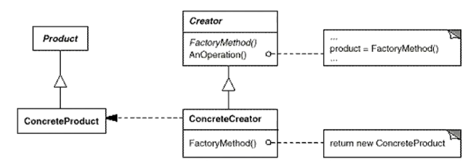

# 工厂方法（Factory Method Pattern）

工厂方法模式(Factory Method Pattern)：定义一个用于创建对象的接口，让子类决定将哪一个类实例化。工厂方法模式让一个类的实例化延迟到其子类。工厂方法模式又简称为工厂模式(Factory Pattern)，又可称作虚拟构造器模式(Virtual Constructor Pattern)或多态工厂模式(Polymorphic Factory Pattern)。工厂方法模式是一种类创建型模式。

## 例子

有如下代码：

```c++
class ISplitter
{
    virtual void split() = 0;
    virtual ~ISplitter(){}
};

class TxtSplitter : public ISplitter{};
class PicSplitter : public ISplitter{};
class VideoSplitter : public ISplitter{};
```

客户端：

```c++
class MainGui
{
    void button1_click()
	{
        ISplitter* splitter = new TxtSplitter(); //依赖了具体类
        splitter.split();
	}
};
```

如果是在运行时才知道分割器的格式该怎么办，依赖了具体类可不是个好征兆？这样的紧耦合关系（new）会导致软件的脆弱。必须将对象（Splitter）的使用者和具体类型之间的耦合关系隔离开。

### 简单工厂方法

（Simple Factory Pattern）

简单工厂模式并不属于GoF 23个经典设计模式，它的设计思想很简单，也是我们看到 “工厂方法模式” 这个标题就可能想到的第一个方法，其基本流程如下： 

```c++
class ChartFactory {
//静态工厂方法
public：
 	static ISplitter getSplitter(String type) {
		ISplitter splitter = nullptr;
		if (type.equalsIgnoreCase("txt")) {
			//new
		}
		else if (type.equalsIgnoreCase("picture")) {
			
		}
		else if (type.equalsIgnoreCase("video")) {
			
		}
		return splitter;
	}
};
```

### 简单工厂的问题

这样的解决方案并不完美，客户端虽然免除了直接创建对象的责任，但是却将职责推给了工厂类，过多的if else语句依然不利于系统的扩展和维护。违反“开闭原则”。

## 从简单工厂回到工厂方法

简单工厂模式虽然简单，但存在一个很严重的问题。当系统中需要引入新产品时，由于静态工厂方法通过所传入参数的不同来创建不同的产品，这必定要修改工厂类的源代码，将违背“开闭原则”，如何实现增加新产品而不影响已有代码？将工厂也抽象化。

上一个去掉if else的语句是策略模式。

在工厂方法模式中，我们**不再提供一个统一的工厂类来创建所有的产品对象，而是针对不同的产品提供不同的工厂，系统提供一个与产品等级结构对应的工厂等级结构** 。

```c++
class SplitterFactory
{
public:
    virtual  ISplitter* creatSplitter();
    virtual  ~SplitterFactory(){}
};

class TxtSplitterFactory : public SplitterFactory{};
class PicSplitterFactory : public SplitterFactory{};
class VideoSplitterFactory : public SplitterFactory{};
```

使用具体的工厂对象来创建具体的Product对象，那么问题来了：**具体的工厂创建岂不是又是陷入最开始的问题，毕竟具体的工厂创建依然需要依赖具体**。

回答这个问题需要我们再次看一下我们的代码，现在我们的代码是这样了：

```c++
class MainGui
{
	SplitterFactory* sp;
pubilc:
    
    setSplitterFactory(SplitterFactory* s);
    
    void button1_click()
	{
        ISplitter* splitter = sp->creatSplitter();
        splitter.split();
	}
};
```

单单盯着这一个MainGui类来看，其实已经全部依赖抽象了，剩下的交给MainGui的使用者去处理。

答：工厂的创建那就不归我管了，反正在我这里全部依赖抽象了。

**把变化关到笼子里，而不是消灭变化。**

此外，将对象的创建和使用分离还有一个好处：**防止用来实例化一个类的数据和代码在多个类中到处都是，可以将有关创建的知识搬移到一个工厂类中**，这在Joshua Kerievsky的《重构与模式》一书中有专门的一节来进行介绍。因为有时候我们创建一个对象不只是简单调用其构造函数，还需要设置一些参数，可能还需要配置环境，如果将这些代码散落在每一个创建对象的客户类中，势必会出现代码重复、创建蔓延的问题，而这些客户类其实无须承担对象的创建工作，它们只需使用已创建好的对象就可以了。此时，可以引入工厂类来封装对象的创建逻辑和客户代码的实例化/配置选项。

看到一个问题又给我整懵了：

```c++
//老师您好，既然客户明确知道自己要那个具体产品，为啥不直接new 一个呢，引入工厂去创建的好处在哪里呢？ 工厂模式： 
Factory factory = new PieFactory(); 
factory.getChart().show(); 
//直接实例化： 
new PieChart().show(); 
//这样看直接new 不是更方便吗？
```

我觉着是例子的问题。。这个例子不能与实际相结合。factory与product在同一层代码里，确实直接实例化Product更加方便。

## 结构




