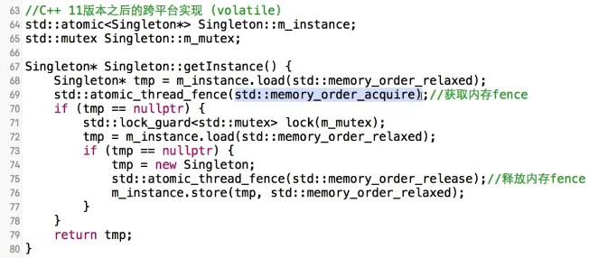

# 单例模式

经常有一些特殊的类，必须保证他们在系统中只存在一个实例。

必须有一个或者无需多个。

1. 构造器和拷贝构造函数设置为私有的。不写的话编译器会自动生成。

   ```c++
   //static 函数
   Singleton* Singleton::getInstance()
   {
   	if(singleton == nullptr)
   		singleton = new Singleton;
   	return singleton; //成员变量
   }
   ```

2. 上述线程不安全，很好理解，有可能多个线程同时判断singleton为nullptr了。

   线程安全版本，加锁。效率不高，因为每次都需要加锁，即使已经创建了对象。

   ```c++
   Singleton* Singleton::getInstance()
   {
       Lock lock；
       if(singleton == nullptr)
           singleton = new Singleton;
       return singleton; 
   }
   ```

3. 双锁检查，但是由于内存读写reorder，会导致双锁失效。

   ```c++
   Singleton* Singleton::getInstance()
   {
       if(singleton == nullptr)
       {
           Lock lock;
           if(singleton == nullptr)
   			singleton = new Singleton;
       }
   	return singleton; 
   }
   ```

   reorder会在cpu指令集上进行优化，比如singleton = new Singleton();这行代码，一般来说1分配地址2调用构造函数初始化那块地址3返回地址给singleton。但很也可能以找132的顺序执行，考虑有一个线程按照132的顺序执行到3，这是另一个线程正好到达第一判断，此时不为空，直接返回singleton，但其地址中的内容并没有初始化。

4. c++11后

   ```c++
   
   ```

   

   

5. C++11中可以保证static变量时多线程安全的，在底层实现了加锁操作，所以不需要像以前那样自己写加锁操作。 

   可以将构造函数，赋值函数全部delete

   ```c++
   Singleton & Singleton::getInstance()
   {
       static Singleton container;
       return container;
   }
   ```

   