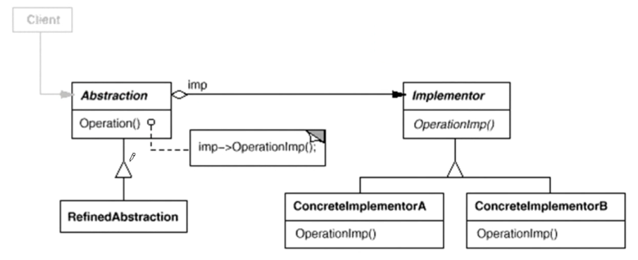
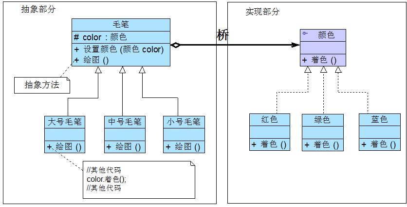
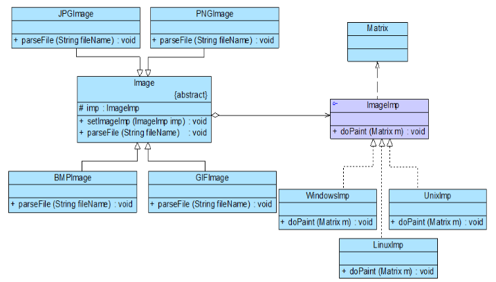

## 处理多维度的变化——桥接模式

使用继承，子类会急剧膨胀，大量重复代码，比如两种文具，大家来品一品：

摘自：[处理多维度变化——桥接模式（一二三四）](<https://blog.csdn.net/lovelion/article/details/7464183> )

在正式介绍桥接模式之前，我先跟大家谈谈两种常见文具的区别，它们是毛笔和蜡笔。假如我们需要大中小3种型号的画笔，能够绘制12种不同的颜色，如果使用蜡笔，需要准备3×12 = 36支，但如果使用毛笔的话，只需要提供3种型号的毛笔，外加12个颜料盒即可，涉及到的对象个数仅为 3 + 12 = 15，远小于36，却能实现与36支蜡笔同样的功能。

**处理多维度的变化。**

桥接模式(Bridge Pattern)：将抽象部分（业务功能）与它的实现部分（平台实现）分离，使它们都可以独立地变化。它是一种对象结构型模式，又称为柄体(Handle and Body)模式或接口(Interface)模式。

这鬼定义，什么抽象部分与实现部分分离。。。。

+ RefinedAbstraction（扩充抽象类）：扩充由Abstraction定义的接口，通常情况下它不再是抽象类而是具体类，它实现了在Abstraction中声明的抽象业务方法，在RefinedAbstraction中可以调用在Implementor中定义的业务方法。 

## 举个例子

没有实际使用过，这里举几个例子大家体会一下。

+ 毛笔的例子（不得不说，相当传神）。

  

+ 跨平台多格式的图像浏览系统。 

  

+ 数据转文件，多种文件格式，多种数据库。

+ 大型交友平台（校园、年轻人、老年人）（漂流瓶、摇一摇、在附近、系统匹配）。。。。

## 与适配器模式的联用

适配器模式通常用于现有系统与第三方产品功能的集成，采用增加适配器的方式将第三方类集成到系统中。 

桥接模式则不同，用户可以通过接口继承或类继承的方式来对系统进行扩展。 

实习部分可能用到第三方库，或由其他厂商提供的API，这时需要使用适配器模式来将功能集成到系统。