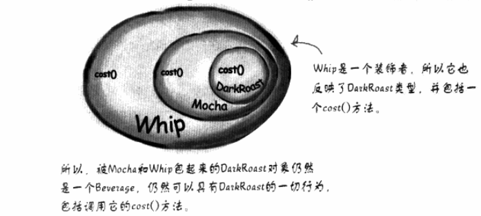
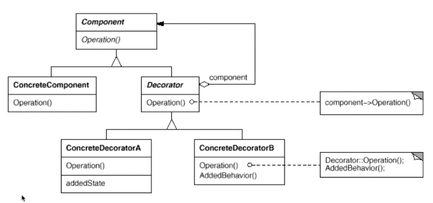
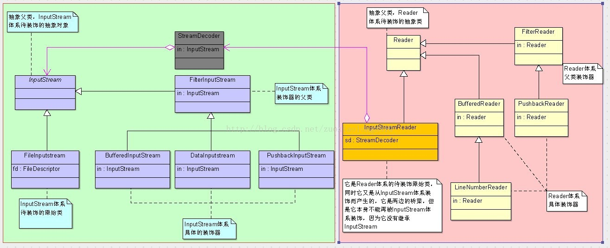

## 装饰模式（Decorator）

Head First的一张图很好的诠释了装饰模式，一层又一层的外衣：




动态（组合）地给一个对象增加一些额外的职责。就增加功能而言，Decorator模式比生成子类（继承）更为灵活（消 除重复代码 & 减少子类个数）。饰模式是一种对象结构型模式。如果都使用继承会有结构上的重复。



Decorator（抽象装饰类）：它也是抽象构件类（Component）的子类，用于给具体构件增加职责，**但是具体职责在其子类中实现**。它维护一个指向抽象构件对象的引用，通过该引用可以调用装饰之前构件对象的方法，并通过其子类扩展该方法，以达到装饰的目的。

需要注意的是在Decorator中并未真正实现operation()方法，而只是调用原有component对象的operation()方法，它没有真正实施装饰，而是提供一个统一的接口，将具体装饰过程交给子类完成。 

## 实际应用

JAVA I/O流。下图取自博客：<https://www.cnblogs.com/zuoxiaolong/p/pattern11.html> 

 

其中左半部分就是InputStream的装饰体系，右半部分就是Reader的装饰体系，并且他们之间的桥梁是InputStreamReader，他们每一个装饰体系都与上面标准的装饰器模式类图极其相似，各位可以自己看一下，感受一下，尤其是InputStreamReader，它的位置比较特殊。 

## 问题

如果客户端希望单独调用具体装饰类新增的方法，而不想通过抽象构件中声明的方法来调用新增方法时将遇到一些麻烦。那么我们就不能将具体的装饰器类声明为它的基类Component，因为一旦将其声明为基类Component类型，那么就调用不到它新增的方法了。

在实际使用过程中，由于新增行为可能需要单独调用，因此这种形式的装饰模式也经常出现，这种装饰模式被称为**半透明(Semi-transparent)装饰模式**，而标准的装饰模式是**透明(Transparent)装饰模式**。 

## 透明装饰

在透明装饰模式中，要求客户端完全针对抽象编程，客户端应该全部声明为抽象构件类型。对于客户端而言，具体构件对象和具体装饰对象没有任何区别。也就是应该使用如下代码：

```java
Component  c, c1; //使用抽象构件类型定义对象
c = new ConcreteComponent()；
c1 = new ConcreteDecorator (c)；
```

在实现透明装饰模式时，要求具体装饰类的operation()方法覆盖抽象装饰类的operation()方法，除了调用原有对象的operation()外还需要调用新增的addedBehavior()方法来增加新行为.

## 半透明装饰模式

为了能够调用到新增方法，用具体装饰类型来定义装饰之后的对象，而具体构件类型还是可以使用抽象构件类型来定义，这种装饰模式即为半透明装饰模式。

## 缺点：

来自<https://blog.csdn.net/lovelion/article/details/7425873> 

(1) 使用装饰模式进行系统设计时将产生很多小对象，这些对象的区别在于它们之间相互连接的方式有所不同，而不是它们的类或者属性值有所不同，大量小对象的产生势必会占用更多的系统资源，在一定程序上影响程序的性能。

(2) 装饰模式提供了一种比继承更加灵活机动的解决方案，但同时也意味着比继承更加易于出错，排错也很困难，对于多次装饰的对象，调试时寻找错误可能需要逐级排查，较为繁琐。
