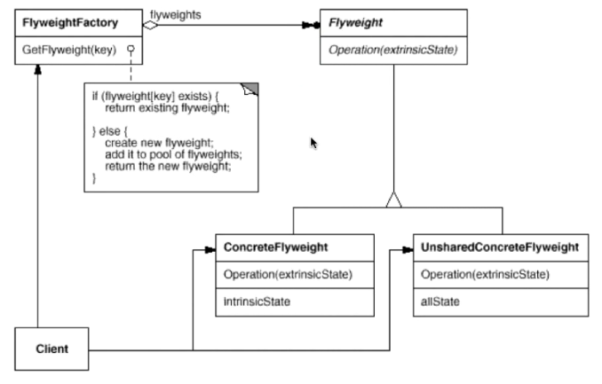

# 享元模式Flyweight Pattern 

## 实现对象的复用

 运用共享技术有效地支持大量细粒度的对象。解决性能问题。


字符串、线程池。

对象池。

map\<key, object\>

这些对象出去最好是只读的，不然被改了那其他地方使用的也被改了。


享元模式结构较为复杂，一般结合工厂模式一起使用，在它的结构图中包含了一个享元工厂类 ：



具体享元类有两种，一种是共享的，一种是非共享的：

 (1)  内部状态是存储在享元对象内部并且不会随环境改变而改变的状态，内部状态可以共享。如字符的内容，不会随外部环境的变化而变化，无论在任何环境下字符“a”始终是“a”，都不会变成“b”。

 (2)  外部状态是随环境改变而改变的、不可以共享的状态。享元对象的外部状态通常由客户端保存，并在享元对象被创建之后，需要使用的时候再传入到享元对象内部。一个外部状态与另一个外部状态之间是相互独立的。如字符的颜色，可以在不同的地方有不同的颜色，例如有的“a”是红色的，有的“a”是绿色的，字符的大小也是如此，有的“a”是五号字，有的“a”是四号字。而且字符的颜色和大小是两个独立的外部状态，它们可以独立变化，相互之间没有影响，客户端可以在使用时将外部状态注入享元对象中。

正因为区分了内部状态和外部状态，我们可以**将具有相同内部状态的对象存储在享元池中**，享元池中的对象是可以实现共享的，需要的时候就将对象从享元池中取出，实现对象的复用。通过向取出的对象注入不同的外部状态，可以得到一系列相似的对象，而这些对象在内存中实际上只存储一份。 

## 与其他模式的联用

  享元模式通常需要和其他模式一起联用，几种常见的联用方式如下：

(1)在享元模式的享元工厂类中通常提供一个静态的工厂方法用于返回享元对象，使用**简单工厂模式**来生成享元对象。

(2)在一个系统中，通常只有唯一一个享元工厂，因此可以使用**单例模式**进行享元工厂类的设计。

(3)享元模式可以结合**组合模式**形成复合享元模式，统一对多个享元对象设置外部状态。

## Java Stirng

在JAVA语言中，String类型就是使用了享元模式。String对象是final类型，对象一旦创建就不可改变。在JAVA中字符串常量都是存在常量池中的，JAVA会确保一个字符串常量在常量池中只有一个拷贝。String a="abc"，其中"abc"就是一个字符串常量。 

```java
class Demo {

       public  static void main(String args[]) {

              String  str1 = "abcd";
              String  str2 = "abcd";
              String  str3 = "ab" + "cd";
              String  str4 = "ab";

              str4  += "cd";          

              System.out.println(str1  == str2);  //true
              System.out.println(str1  == str3);  //true
              System.out.println(str1  == str4);  //false

              str2  += "e";

              System.out.println(str1  == str2);  //false
       }
}
```

