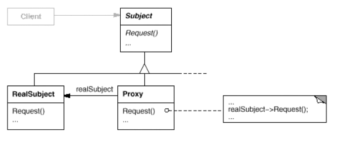

# 代理模式Proxy

为其他对象提供一种代理以控制（隔离，使用接口）对这个对象的访问。

真正的代理模式可能很复杂。

安全控制、性能提升、分布式

保护代理、远程代理、虚拟代理、缓冲代理等

常用的几种代理：

  	(1) 远程代理(Remote Proxy)：为一个位于不同的地址空间的对象提供一个本地的代理对象，这个不同的地址空间可以是在同一台主机中，也可是在另一台主机中，远程代理又称为大使(Ambassador)。

       (2) 虚拟代理(Virtual Proxy)：如果需要创建一个资源消耗较大的对象，先创建一个消耗相对较小的对象来表示，真实对象只在需要时才会被真正创建。

       (3) 保护代理(Protect Proxy)：控制对一个对象的访问，可以给不同的用户提供不同级别的使用权限。

       (4) 缓冲代理(Cache Proxy)：为某一个目标操作的结果提供临时的存储空间，以便多个客户端可以共享这些结果。

       (5) 智能引用代理(Smart Reference Proxy)：当一个对象被引用时，提供一些额外的操作，例如将对象被调用的次数记录下来等。

有些框架会自动生成代理类，比如远程调用的中间件（控制所有网络访问的细节，。封装了底层网络通信和对远程对象的调用，实现复杂）。

