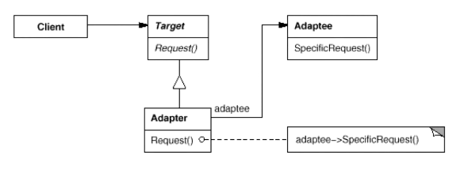

适配器（Adapter）

一个接口转换成客户希望的另一个接口，使接口不兼容的那些类可以一起工作，其别名为包装器(Wrapper)。适配器模式既可以作为类结构型模式，也可以作为对象结构型模式。

遗留代码复用、类库迁移。老接口变新街口。

+ Target：目标抽象类，定义用户所需接口。
+ Adapter：适配器类，通过继承Target并关联一个Apaptee对象使二者产生联系
+ Adaptee：适配者类，定义了已经存在的接口（老的接口），或者其他库，某些情况下没有源码。

