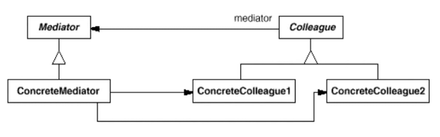

# 中介者模式 Mediator

## 定义

用一个中介对象（中介者）来封装一系列的对象交互（封装变化），中介者使各对象不需要显式地相互引用（编译时依赖->运行时依赖），从而使其耦合松散（管理变化），而且可以独立地改变它们之间的交互。中介者模式又称为调停者模式，它是一种对象行为型模式。

结构没看懂。

抽象同事类：维持一个对抽象中介者类的引用。

具体同事类：不再互相引用，而是每一个同事在需要和其他同时通信时，先与中介者通信。

## 与其他设计模式的关系

外观模式解决的是系统外和系统内之间的关系。

中介者是解决系统内多个对象有复杂引用关系。

## 我遇到的问题

模型管理客户端中，用户可以增加、删除类别，同时，筛选框（Checkbox）和编辑类别时选择组合框（ComboBox）都要相应地增加删除类别。

可以使用观察者模式（信号槽），一旦类别增加、删除、修改后，通知其他观察者。

由于不是互相引用关系，故可以不用中介者。

## 缺点

不同的组件类（即不同的同事类）所拥有的方法并不完全相同，因此中介者类没有针对抽象同事类编程，导致在具体中介者类中需要维持对具体同事类的引用，客户端代码无法完全透明地对待所有同事类和中介者类。在某些情况下，如果设计得当，可以在客户端透明地对同事类和中介者类编程，这样系统将具有更好的灵活性和可扩展性。

在具体中介者类中包含了大量同事之间的交互细节，可能会导致具体中介者类非常复杂，使得系统难以维护。