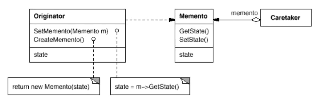

# 撤销功能的实现——备忘录Memento

要求程序能够回溯到对象之前处于某个点时的状态。

定义：在不破坏封装性的前提下，捕获一个对象的内部状态，并在该对象之外保存这个状态。这样以后就可以将该对象恢复到原先保存的状态。

## 现在的方法 

现在往往采取效率更高的方法，深拷贝遇到复杂对象会很难实现，比如：指针套指针。。

+ 序列化
+ 编码

## 我遇到过的问题：

图像缺陷框的“撤销编辑”岂不就是最简单的备忘录。

