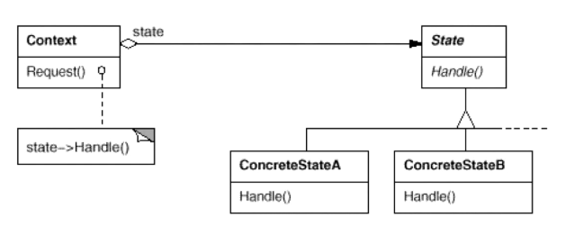

# 状态模式State

允许一个对象在其内部状态改变时改变它的行为，对象看起来似乎修改了其行为。其别名为状态对象(Objects for States)，状态模式是一种对象行为型模式。

## 结构

和策略模式很像。大量的if...else...去判断状态，不同的状态有不同的行为。



环境类维持一个对抽象状态类的引用，1）通过setState()方法可以向环境类注入不同的状态对象，再在环境类的业务方法（Requset()）中调用状态对象的方法。

环境类Context与抽象状态类State之间存在单向关联关系，在Context中定义了一个State对象。在实际使用时，它们之间可能存在更为复杂的关系，State与Context之间可能也存在依赖或者双向关联关系。

如果状态类需要操作Context成员变量，可通过持有Context引用，或者在Handle()方法中传递Context指针。

>state不应该持有对context的引用。在实际中context和state都应该声明为实现一个业务接口（比如叫IAccountOperations吧），每个业务方法的第一个参数都是对context的引用，这样在context类的业务接口实现中，调用方法是state.deposit(this， amount)。abstractState的业务实现中，所有业务方法都声明为virtual，并抛出invalid operation异常，然后在concreteState的实现业务接口。这样当转换到不能进行某项操作的状态时，强行操作就会引发invalid operation，起到安全保护作用。 状态的转换不一定非要在state的业务逻辑中实现，例子中确实是这样做的，实际中也确实可行。但是稍许会引起代码可读性问题，因为想弄明白整个状态转换逻辑需要通读所有state的所有业务逻辑。清晰起见，可以专门写一个负责状态转换的类，根据喜好可以叫XXStateManager、XXStateMachine、XXWorkflow之类的名字，state可以持有对它的引用（这个引用是必要的，因为本身转换逻辑就是从state里抽离的，抽离之后还要保持关联性）。负责状态转换的类，进行状态转换判断时只需要传入context对象就可以了，在里面调用context的changeState方法即可。


## 怎么状态转化

+  (1) 统一由环境类来负责状态之间的转换，此时，充当状态管理器的角色。1）在业务方法中判断，或者2）提供一个专门的方法来判断。
+  (2) 由具体状态类来负责状态之间的转换，通过调用环境类Context的setState()方法。

在环境类中作统一的判断说明状态的转换逻辑是一致的，比如举例中的账户，状态变化标准对每种状态都是一样的；分别在每一种具体状态中作转换判断，适合于一些状态变化条件因状态不同而不同的情况。

## 我遇到的一些问题

模型管理系统有分类和判级等状态，状态不同，菜单开关（功能）不同。某些对象对于每种状态可能有不同的处理（调用不同的函数）。

```c++
enum DataType
{
    Init,
    ClassifySearch,
    ClassifySample,
    JudgmentSearch,
    JudgmentSample,
};
```

类别管理界面有许多状态：{只修改中文，只修改英文，...，或者新建}等状态。

```c++
enum ModifiedStatus
{
    CNing,
    ENing,
    Seving,
    Dising,
    Alling,
    None,
};
```

目前我只是单纯的if....else....

### 问题：

是否将来会添加状态？导致客户必须每次去更改代码if...else...来判断状态去执行不同的功能。违背开闭原则。


## 共享状态

+ 在有些情况下，多个环境对象（Object）可能需要共享同一个状态，如果希望在系统中实现多个环境对象共享一个或多个状态对象，那么需要将这些状态对象**定义为环境类的静态成员对象**。


+ 我的项目中，整个的系统状态，可能多个类（Class）共享，比如：主页面，RPC，查询窗口。都需要根据系统状态来改变行为。将状态定义为单例类，或者全局static变量。

## 几点注意

+ 谁控制状态转换
+ 状态模式对“开闭原则”的支持并不太好，增加新的状态类需要修改那些负责状态转换的源代码，否则无法转换到新增状态；而且修改某个状态类的行为也需修改对应类的源代码。 