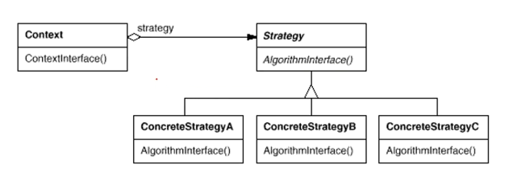

## 策略模式（Strategy Pattern）

定义一系列算法类，将每一个算法封装起来，并让它们可以相互替换，策略模式让算法独立于使用它的客户而变化，也称为政策模式(Policy)。策略模式是一种对象行为型模式。

增加新的具体策略类也很方便。**策略模式提供了一种可插入式(Pluggable)算法的实现方案**。 

**将算法的定义和使用分离**，这就是策略模式所要解决的问题。

## 我用到过吗

好像没有用到过。

代码中出现较长的**if...else...**的语句时，可考虑应用策略模式。

Context可维持一个Strategy的引用，在运行时动态装配具体的策略类。

策略类的等级结构定义了一个算法或行为族，恰当使用继承可以把公共的代码移到抽象策略类中，从而避免重复的代码。 

## 实际应用

对于容器Widget都持有一个布局管理器，在程序运行期间由客户端动态决定一个Widget对象如何布局，也就是使用哪种布局策略。这就需要某一个具体的布局对象。

|---QObject
|      |---QLayout
|      |      |---QGridLayout
|      |      |---QToolLayout
|      |      |---QMainWindowLayout
|      |      |---QBoxLayout
|      |      |        |---QHBoxLayout
|      |      |        |---QVBoxLayout

## 主要缺点

摘自：https://blog.csdn.net/lovelion/article/details/7819266

 (1) 客户端必须知道所有的策略类，并自行决定使用哪一个策略类。这就意味着客户端必须理解这些算法的区别，以便适时选择恰当的算法。换言之，策略模式只适用于客户端知道所有的算法或行为的情况。

(2) 策略模式将造成系统产生很多具体策略类，任何细小的变化都将导致系统要增加一个新的具体策略类。

(3) 无法同时在客户端使用多个策略类，也就是说，在使用策略模式时，客户端每次只能使用一个策略类，不支持使用一个策略类完成部分功能后再使用另一个策略类来完成剩余功能的情况。
