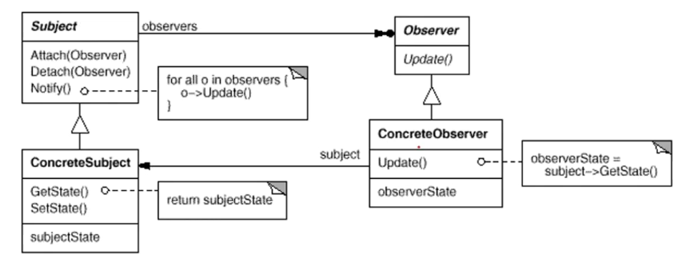

## 观察者模式

20191030

定义对象间的一种一对多（变化）的依赖关系，以便当一个对象（Subject）的状态发生改变时，所有依赖于它的对象都得到通知并自动更新。

## 遇到的问题

主页面中包含一个Model对象和一个状态栏对象。当勾选/修改Model中的一条信息后需要通知状态栏更新对应的勾选数量/修改数量。这里状态栏是一个观察者，Model是一个变化的对象。

```c++
bool isSucceed = defectManager.addSelectedDefect(defectId);
if (isSucceed)
{
    dataChanged(index, index);
    emit defectSelected(1);
}
return isSucceed;
```

我是通过信号传递增/减的数量，到主页面槽函数，然后调用状态栏对象。

```c++
//MainGui
void MainGui::on_defect_selected(int count)
{
	sbContainer.addSelectItem(count);
}
```

以上是我的解决方法。其实跟观察者模式是一样的吧。

```c++
//MainGui
connect(&classifyDefectTableModel, &DefectTableModel::defectSelected,
		this, &MainGui::on_defect_selected);
//这里不就相当于在为subject添加观察者嘛，只不过需要实现对应槽函数
```

## 我这种方法的缺点

发出的信号是增加了或者减少了多少数量，而不是直接通知当前数量。这在批量操作时有点蹩脚。

因为批量操作时，要想办法统计增加或减少的数量，远不如操作完成后直接获得最终的挑选数量来的方便。

## 不使用信号槽呢

需要将观察者（最好是抽象的，抽象基类提供update函数，毕竟这次是状态栏，下次就是控制台展示了，这就用到了依赖倒置的原则）注入到Model类中，将发信号的部分改为通知函数。




如果直接注入具体状态栏的类则违背了依赖倒置原则（Dependency Inversion  Principle, DIP）。什么是依赖倒置原则？

<https://blog.csdn.net/lovelion/article/details/7562783> 

## 哪里违背了此原则

依赖倒转原则要求我们在程序代码中传递参数时或在关联关系中，尽量引用层次高的抽象层类，即使用接口和抽象类进行变量类型声明、参数类型声明、方法返回类型声明，以及数据类型的转换等，而不要用具体类来做这些事情。