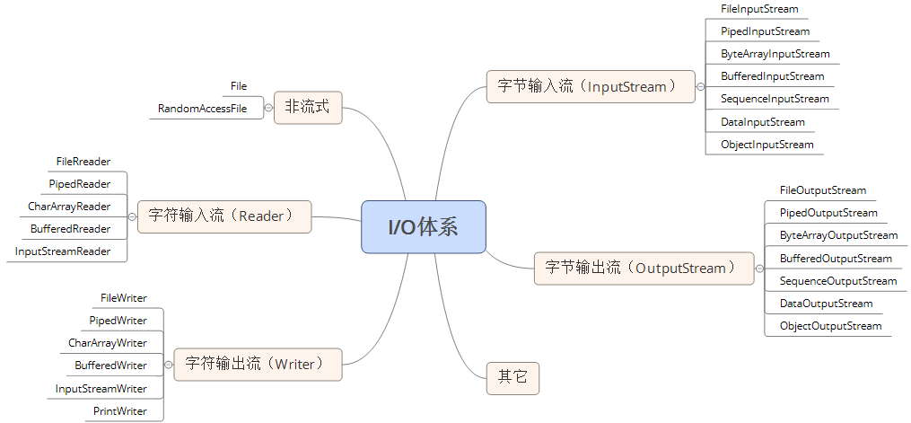

I/O流

参考：

[以设计模式讲解的](https://my.oschina.net/gao0516/blog/136103)

[Java 的 I/O 类库的基本架构](https://www.ibm.com/developerworks/cn/java/j-lo-javaio/)

[Java-IO包-源码解析](https://zhuanlan.zhihu.com/p/27931572)

有好多问题

+ 输入输出怎么定义？有时候的确很乱。从键盘输入，输出到控制？从文件输入，输出到控制台？从字符数组输入，输出到文件？

  将数据冲外存中读取到内存中的称为输入流，将数据从内存写入外存中的称为输出流。

  输入流：程序从输入流读取数据源。数据源包括外界(键盘、文件、网络…)，即是将数据源读入到程序的通信通道。 

  输出流：程序向输出流写入数据。将程序中的数据输出到外界（显示器、打印机、文件、网络…）的通信通道。 

+ 各种各样的输入输出流，脑壳疼。

  前两天看了装饰器设计模式，知道JAVA的I/O的设计用到了此模式，按功能划分Stream。我们可以动态装配这些 Stream，以便获得自己需要的功能。

  

  下面这张图不太好，没有类之间的关系，也没有反应出装饰者：




不管是磁盘还是网络传输，最小的存储单元都是字节，而不是字符，所以 I/O 操作的都是字节而不是字符，但是为啥有操作字符的 I/O 接口呢？这是因为我们的程序中通常操作的数据都是以字符形式，为了操作方便当然要提供一个直接写字符的 I/O 接口，如此而已。我们知道字符到字节必须要经过编码转换，而这个编码又非常耗时，而且还会经常出现乱码问题，所以 I/O 的编码问题经常是让人头疼的问题。 关于 I/O 编码问题请参考另一篇文章 [《深入分析](http://www.ibm.com/developerworks/cn/java/j-lo-chinesecoding/)[Java](http://www.ibm.com/developerworks/cn/java/j-lo-chinesecoding/)[中的中文编码问题](http://www.ibm.com/developerworks/cn/java/j-lo-chinesecoding/)：


额

在java语言的标准库 java I/O 里面，有一个InputStreamReader类叫做桥梁（bridge）类。InputStreamReader是从byte流到char流的一个桥梁，它读入byte数据并根据指定的编码将之翻译成char数据。
InputStreamReader虽然叫“桥梁”，但它不是桥梁模式，是适配器模式的应用。

下图以装饰者模式对I/O流分类，分为原始流和装饰流：


虽然 Socket 类并不在 java.io 包下 ，`SocketInputStream`继承自`FileInputStream`。

流最终写到什么地方必须要指定，要么是写到磁盘要么是写到网络中，其实从上面的类图中我们发现，写网络实际上也是写文件，只不过写网络还有一步需要处理就是底层操作系统再将数据传送到其它地方而不是本地磁盘。 

字节与字符的转化接口

另外数据持久化或网络传输都是以字节进行的，所以必须要有字符到字节或字节到字符的转化。字符到字节需要转化，其中读的转化过程如下图所示： 


```java
try { 
           StringBuffer str = new StringBuffer(); 
           char[] buf = new char[1024]; 
           FileReader f = new FileReader("file"); 
           while(f.read(buf)>0){ 
               str.append(buf); 
           } 
           str.toString(); 
} catch (IOException e) {}
```

FileReader 类就是按照上面的工作方式读取文件的，FileReader 是继承了 InputStreamReader 类，实际上是读取文件流，然后通过 StreamDecoder 解码成 char，只不过这里的解码字符集是默认字符集。 s