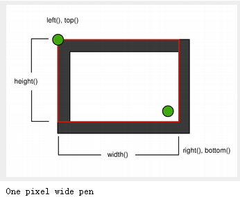
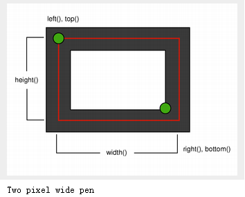
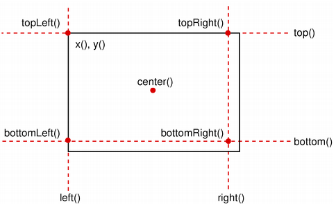
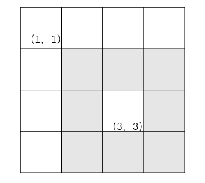

# 20190429

## 1、重写调用运算符，实现隐式转化：

`EDefect::Defect defect = (*defectPair.second)();`

需求：当从本地实体类转化到服务器实体类的时候，调用。

```c++
class DefectEntity : private EDefect::Defect //私有继承后不能直接隐式转化。
{
	EDefect::Defect operator()();
}

EDefect::Defect DefectEntity::operator()()
{
	EDefect::Defect defect;

	defect.id =				this->id;
	defect.coilId =			this->coilId;
	defect.defectId =		this->defectId;
	
    return defect;
}

```


# 20190507

## 1、QT中，单击也触发了mouseMoveEvent函数？？？

有时候正常：

鼠标操作：移动移动单击单击：

```c++
2.moveEvent
=====mouseEvent and not down
2.moveEvent
=====mouseEvent and not down
1.pressEvent
3.release
release after:
181 132 230 145
1.pressEvent
3.release
release after:
181 132 230 145
```

有时候不正常，单击也触发move事件，导致画出宽高为0的矩形，打印如下：

```c++
1.pressEvent
2.moveEvent
move event and isLbtnDown
movePoint:
106 330
3.release
release after:
106 330 0 0
```

#### 解决办法：

1、`if(event->buttons()&Qt::LeftButton) `，鼠标左键按下的同时移动鼠标。不起作用

2、如果宽高都是0，就是无效操作。采用

```c++
pathfinderRect.setRect(pressPoint.x(), pressPoint.y(), moveW, moveH);
if (!pathfinderRect.isNull())
{
    //操作
}
```

3、判断movingPoint以及pressPoint是不是一个点。是就没移动。

```c++
int moveW = movingPoint.x() - pressPoint.x();
		int moveH = movingPoint.y() - pressPoint.y();

		if (moveW == 0 && moveH == 0)
		{
			qDebug() << "00000000000";
			return;
		}
```

输出：

```
1.pressEvent
2.moveEvent================================
move event and ===============isLbtnDown
00000000000
3.release
```

经过尝试：确实是没移动就触发了moveEvent。

怎么发生的这个问题：

+ 快速移动鼠标然后单击。
+ 点击其他应用程序后，回来再单击。

## 2、矩形右侧靠边界时不能显示

判断矩形是否在图像label内部：

```c++
bool ImageLabel::rectInLabel(const QRect & rect)
{
	QRect labelRect(0, 0, size().width(), size().height());
	return labelRect.contains(rect, false);
}
```

由于渲染原因，当矩形靠近图像右侧和底部，判断为ture，但是右侧和底部的渲染不能显示。



解决方法：

1、绘制为2个像素，应该可以



2、`QRect labelRect(0, 0, size().width()-1, size().height()-1);` 这样的话，实际上矩形的右边界不能与Label边界重合（相差一像素）。上、左边界可以重合：都为0。

# 20190508

## 1、阅读了QRect文档，一些点值得注意。



+ 渲染问题。

+ set函数改变一些东西  move函数不改变宽高。

+ The `isEmpty()` function returns true if left() > right() or top() > bottom(). Note that an empty rectangle is not valid: 

  The `isValid()` function returns true if left() <= right() and top() <= bottom(). 

  A null rectangle (`isNull() == true`) on the other hand, has both width and height set to 0. 就是right() == left() - 1 and bottom() == top() - 1). A null rectangle is also empty, and hence is not valid.

+ translate()、translated()、adjust、adjusted、normalized函数功能。

  平移，调整，纠正宽高为负的矩形。

## 2、绘制矩形注意，已知起点、终点

例如方格表示像素，起点和终点已给出，注意如何计算宽高，以及图像如何渲染。



# 20190509

1、双缓冲需要了解（没有用到）

2、删除矩形框（删除按钮）

实际删除的是缺陷

# 20190510

1、Qt的坐标系统

## 2、放大功能一些想法

+ QPainter的

+ 放大QPainter坐标系统QPainter::scale() 。重新用QPainter绘制时就按照新的坐标系统绘制。

  就本功能而言，当Label放大时，放大QPainter的坐标系统来绘制矩形框。

  当新建矩形框时，单击得到的坐标是放大后Label的，而不是正常尺寸下的，所以新建的矩形框的时候，坐标也要转化。

+ resize控件本身，绘制矩形框时按照正常尺寸和伸缩因子重新计算坐标。

# 20190520

1、label.setPixmap() 仍然不显示图像！！！

+ 本想作为调试程序的setText()会导致设置的Pixmap为空。导致label大小异常，本应该与图像一样大，adjustSize()来调整尺寸去适应内容。
+ 删除setText()后还是没有显示图像，此时pixmap()不为空，但是没有显示图像。

## 2、**卧槽 我忘了调用父类QLabel的paint事件**。

```c++
void ImageLabel::paintEvent(QPaintEvent * event)
{
	QLabel::paintEvent(event);//!!!!!!!!!!!!!!!
    
	QPainter painter(this);
	painter.setPen(QPen(Qt::red, 2));
	for (auto &defectRect : defectRectList)
	{
		painter.drawRect(defectRect.rect);
	}
}
```

3、增加编辑、修改、新建开关。为什么要增加开关：防止用户错误操作。

# 20190524

## 1、返回局部变量指针

```c++
std::vector<DefectPtr> ActionManager::searchDefectbyTime(long long startTime, long long endTime)
{
	auto items = defectMock.searchDefectbyTime(startTime, startTime); //server interface

	std::vector<DefectPtr> datas;
	for (auto & item : items) 
		datas.emplace_back(std::make_shared<DefectEntity>(item));

	return datas;
}
```

上述例子，先从服务器查询缺陷列表，然后将每个缺陷的智能指针，保存到vector中。返回这个vector。

我们知道，不能返回局部变量的指针。**为什么这里返回了？？？？？**

# 20190526

## 1、多缺陷框模拟

缺陷与图像：多对一。一个缺陷对应一个图像，一个图像对应多个缺陷。

主要是数据。

## 2、样本空间列表UI

未完成，怎样设计？可按照类别查看。

# 20190527

## 1、DefectEntity与DefectSample如何协调

由于之前都使用的是DefectEntity，有许多样本并不关心的信息。对于新建缺陷样本，以及要提交到样本空间的缺陷样本信息，需要的是DefectSample的类。

还是在服务器一查询下来就变为DefectSample类。

# 20190530

## 1、模型Index创建

在手动编辑缺陷框后，希望利用proxy模型的setData()函数来修改底层数据，这样也可以像修改类别一样将用户编辑的item展示为红色。

20190601 发现，protected成员函数不能在其他类MainGui中访问！！！！！额

setData中咋创建这个index呢。

```c++
QModelIndex topLeft = this->index(0, getColumnOfHeader("classType"));//QAbstractTableModel
```


## 2、QTabelView切换行

默认响应单击：

```c++
ui.classifyDefectTableView->scrollTo(proxyIndex);
ui.classifyDefectTableView->selectRow(proxyIndex.row());//这个是
//emit ui.classifyDefectTableView->clicked(proxyIndex);
```

# 20190601

## 1、this不能在常量表达式中使用？

```c++
switch (index.column())
{
    case getNum(): //error
        
        break;
}
```

## 2、protected成员函数不可访问？

内部类提供接口调用保护方法。

## 3、QLabel没有单击事件clicked

## 4、将新建Rect改为只能新建一个

用布尔变量变量`isNewStatus`控制，新建状态下（newEnable==true），当绘制新矩形时，通过isNewStatus来控制在真正拖动鼠标新建时添加 新的Rect。而不是点击新建按钮时就创建新的Rect，因为用户可能不去新建 。。

```c++
if (!isNewStatus)
{
    //添加时id怎么计算,置为负数？？
    DefectSample newD = DefectSample(-defectRectList.size(), 15,
                                     selectDefectRect->getImageLabel(), newrect);
    defectRectList.emplace_back(newD);
    selectDefectRect = &defectRectList.at(defectRectList.size() - 1);
    isNewStatus = true;
    qDebug() << "===============start draw";
}
else
{
    //selectDefectRect->rect = newrect;
    selectDefectRect->setRect(newrect);
}
```

当用户点击提交时，再将isNewStatus置为false。

# 20190602

# 1、新建缺陷的问题

Id及类别Id在哪里初始化？？

暂时考虑id为负数，类别由ImageWidget提供。

# 21090603

## 1、线程池，模板实现

模板：

+ 非类型模板参数的模板实参必须是常量表达式
+ 模板直到实例化才会生成代码
+ ？与非模板函数不同，**为了生成一个实例化版本**，编译器需要掌握函数模板或类模板成员函数的定义。因此，与非模板代码相同，模板的头文件通常既包括声明也包括定义。


+ 默认情况下，对于一个已经实例化的类模板，其成员只有在使用时才被实例化。这一特性是的即使某种类型不能完全符合模板操作的要求，我们仍能使用该模板。
+ 类模板不是类型！！


+ static 成员，T::A
+ 类型成员，T::A


+ 声明与定义
+ 实例化声明与实例化定义

线程池中用到的：

+ 函数模板
+ 右值引用参数
+ 参数转发
+ 函数参数包
+ 后置返回类型
+ future-promise特性
+ thread取任务
+ queue任务队列

# 20190604

## 1、map的插入操作

+ insert，有则什么也不做
+ 下标操作，返回一个左值，可读写。没有则新建

# 20190614

## QListView的使用

# 20170615

## 反走样

# 20190618

## QGraphicsItem 怎么使用

## QMetaType 是什么东西

# 20190619

## moveToThread() 


## connect第五个参数

enum Qt::ConnectionType 的含义

```c++
 enum ConnectionType {
        AutoConnection,
        DirectConnection,
        QueuedConnection,
        BlockingQueuedConnection,
        UniqueConnection =  0x80
    };
```

+ AutoConnection，0 默认，当信号和槽不是同个线程，会使用第三种QT::QueueConnection的链接方式。如果信号和槽是同个线程，调用第二种Qt::DirectConnection链接方式。注意：是信号而不是信号所在的类。

+ DirectConnection，1，The slot is invoked immediately when the signal is emitted. The slot is executed in the signalling thread. 

  也就是只要信号发出直接就到槽去执行，无论槽函数所属对象在哪个线程，槽函数都在发射信号的线程内执行 

+ QueuedConnection，2，The slot is invoked when control returns to the event loop of the receiver's thread. The slot is executed in the receiver's thread.

  在接收对象的线程中执行，并且是按照队列顺序执行。当线程停止，就会等待下一次启动线程时再按队列顺序执行  ，等待QApplication::exec()或者线程的QThread::exec()才执行相应的槽。

+ Qt::BlockingQueuedConnection是Same as Qt::QueuedConnection, （必须信号和曹在不同线程中，否则直接产生死锁）这个是完全同步队列只有槽线程执行完才会返回，否则发送线程也会等待，相当于是不同的线程可以同步起来执行。

+ UniqueConnection，This is a flag that can be combined with any one of the above connection types, using a bitwise OR. When Qt::UniqueConnection is set, QObject::connect() will fail if the connection already exists (i.e. if the same signal is already connected to the same slot for the same pair of objects

太绕了？不是么（要彻底理解这几句话，你可能需要看Qt meta-object系统和Qt event系统）。。

+ QThread 是用来管理线程的，它所依附的线程和它管理的线程并不是同一个东西
+ QThread 所依附的线程，就是执行 QThread t(0) 或 QThread * t=new QThread(0) 的线程。也就是咱们这儿的主线程
+ QThread 管理的线程，就是 run 启动的线程。也就是次线程
+ 因为QThread的对象依附在主线程中，所以他的slot函数会在主线程中执行，而不是次线程。除非：
  + QThread 对象依附到次线程中(通过movetoThread)
  + slot 和信号是直接连接，且信号在次线程中发射
+ 但上两种解决方法都不好，因为QThread不是这么用的(Bradley T. Hughes)(moveToThread(this))..

一个比较好而且能够得到相同结果的做法是将“工作”部分从“控制”部分剥离出来，也就是说，写一个QObject子类并使用QObject::moveToThread()方法来改变它的线程依附性： 

```c++
class Worker : public QObject
{
    Q_OBJECT
    public slots:
        void doWork() {
        /* ... */
    }
};

/* ... */
QThread thread;
Worker worker;
connect(obj, SIGNAL(workReady()), &worker, SLOT(doWork()));
worker.moveToThread(&thread);
thread.start();
```

> [事件循环与线程 二](https://blog.csdn.net/changsheng230/article/details/6153449)
>
> 我应该什么时候使用线程：
>
> 1. 当你不得不使用一个阻塞式API时，比如地址解析方法、Qt中的图像装载和放大。QImageReader 和QImage仅仅提供了阻塞式方法来从一个设备读取图像，或者放大图像到一个不同的分辨率。如果你正在处理一个非常大的图像，这些处理会持续数（十)秒。
>
> 什么时候不需要线程：
>
> 1. 计时器（使用QTimer）
> 2. 网络编程是异步的设计，状态机(信号事件驱动)


QThread的子类一般不定义槽函数，这是不安全的，可能造成主线程和子线程同时访问它，除非使用mutex保护。 但可以定义signal，而且可以在run函数中发射， 因为信号发射是线程安全的。 

## 处理异步执行与事件循环

### 一 事件循环

情景：你有一个按钮widget，它被按下时会emit一个信号；还有一个我们下面定义的Worker对象连接了这个信号，而且这个对象的槽做了很多耗时的事情。当你点击完这个按钮后，从上之下的函数调用栈如下所示： 

收集自 [事件循环与线程](https://www.cnblogs.com/findumars/p/5355523.html)。

```c++
main(int, char **)  
QApplication::exec()  //开启了事件循环
[...]  
QWidget::event(QEvent *)  
Button::mousePressEvent(QMouseEvent *)  
Button::clicked()  
[...]  
Worker::doWork()  
```

1. 开启了事件循环
2. 视窗管理者发送了鼠标点击事件，该事件被Qt内核捕获，并转换成QMouseEvent ，随后通过QApplication::notify() （notify并没有在上述代码里显示）发送到我们的widget的event()方法中（第4行）
3. 因为Button并没有重载event()，它的基类QWidget方法得以调用。 QWidget::event() 检测出传入的事件是一个鼠标点击，并调用其专有的事件处理器，即Button::mousePressEvent() (第5行)。 
4. 我们重载了 mousePressEvent方法，并发射了Button::clicked()信号（第6行） 
5. 激活了worker对象中十分耗时的Worker::doWork()槽（第8行） 

> 当worker对象在繁忙的工作时，事件循环在做什么呢？ 你也许猜到了答案：什么也没做！它分发了鼠标点击事件，并且因等待event handler返回而被阻塞。我们**阻塞了事件循环，**也就是说，在我们的doWork()槽（第8行）干完活之前再不会有事件被派发了 。
>
> 当事件派发被就此卡住时，**widgets 也将不会再刷新自己（**QPaintEvent对象将在事件队列里静候），**也不能有进一步地与widgets交互的事件发生**，计时器也不会在开始计时，**网络通讯也将变得迟钝、停滞**。更严重的是，许多视窗管理程序会检测到你的应用不再处理事件，从而**告诉用户你的程序不再有响应（not responding）**. 这就是为什么快速的响应事件并尽可能快的返回事件循环如此重要的原因 

那么，对于需要长时间运行的任务，我们应该怎么做才会不阻塞事件循环？  

+ 将这个任务移动到另一个线程

+ 另一个可能的方案在我们的受阻塞的任务中，通过调用QCoreApplication::processEvents() 人工地强迫事件循环运行。QCoreApplication::processEvents() 将处理所有事件队列中的事件并返回给调用者。

  ```c++
  QTime t;  
  t.start();  
  while(t.elapsed()<1000) //休眠 
  	QCoreApplication::processEvents();
  ```

  

+ 另一个可选的强制地重入事件的方案是使用QEventLoop 类，通过调用QEventLoop::exec() ，我们重入了事件循环，而且我们可以把信号连接到QEventLoop::quit() 槽上使得事件循环退出。

  ```c++
   QNetworkAccessManager qnam;  
   QNetworkReply *reply = qnam.get(QNetworkRequest(QUrl(...)));  
   QEventLoop loop;  
   QObject::connect(reply, SIGNAL(finished()), &loop, SLOT(quit()));  
   loop.exec();  
   /* reply has finished, use it */  
  ```

  

### 二 线程间通信

> 摘录自QT文档
>
> To place an invocation in an event loop, make a queued signal-slot connection. Whenever the signal is emitted, its arguments will be recorded by the event system. The thread that the signal receiver lives in will then run the slot. Alternatively, call **QMetaObject::invokeMethod()** to achieve the same effect without signals. In both cases, a **queued connection** must be used because a direct connection bypasses the event system and runs the method immediately in the current thread.

一种获得一个工作线程的结果的方法是等待线程终止。在许多情况下，一个阻塞等待是不可接受的。

阻塞等待的替代方法是异步的结果通过posted事件或者queued信号槽进行传递。由于操作的结果不会出现在源代码的下一行而是在位于源文件其他部分的一个槽中，这会产生一定的开销，因为，但在位于源文件中其他地方的槽。 Qt开发人员习惯于使用这种异步行为工作，因为它非常相似于GUI程序中使用的的事件驱动编程。

```c++
QEventLoop loop;

auto future = threadPoolManager.addTask([this, &loop, startTime, endTime]() {
    auto datas = ActionManager::searchDefectbyTime(startTime, endTime);
    QMetaObject::invokeMethod(&loop, "quit", Qt::QueuedConnection);
    return datas;
});

loop.exec();

auto defects = future.get();
```

+ 信号/槽。connect的时候以队列的方式连接，这样子线程和主线程各自执行各的，主线程就不会阻塞了。 可以把子线程的finish信号绑定到主程序的slot上。 

+ 如果一定要让主线程等待子线程执行完，可以在主线程中加QEventLoop事件循环等待子线程执行完再推出事件循环。 

  例子1：

  ```c++
  connect(thread, SIGNAL(finished()),&_loop, SLOT(quit()));
  QMetaObject::invokeMethod(&loop, "quit", Qt::QueuedConnection);
  //invokeMethod这一机制依赖Qt内省机制，
  //所以只有信号、槽、带Q_INVOKABLE关键字的成员函数才能使用此方法。
  //只能传递内建数据类型，否则，需要我们在类的声明之后调用宏Q_DECLARE_METATYPE(MyClass)，
  //当然前提是该类提供了公有的构造函数、拷贝构造函数和析构函数，
  //并且要在跨线程通信前使用函数 qRegisterMetaType<MyClass>("MyClass")来注册这个类型。
  ```

  例子2，让主线程等待100s。

  ```c++
  QEventLoop loop;
  QTimer::singleShot(100, &loop, SLOT(quit()));
  loop.exec();
  ```

  例子3，dialog不使用exec()循环

  ```c++
  1 void ****::mySLot{
  2     QDialog dlg;
  3     dlg.show();
  4     QEventLoop loop;
  5     connect(&dlg, SIGNAL(finished(int)), &loop, SLOT(quit()));
  6     loop.exec(QEventLoop::ExcludeUserInputEvents);
  7 }
  ```

  

+ 增加一个静态成员函数，做个QWaitCondition。。

### 三 moveToThread分离线程与任务

摘自：[Qt中多线程的使用（一）](https://blog.csdn.net/yao5hed/article/details/81108507)。

> 一个QObject的线程依附性（thread affinity）是指该对象驻足(live in)在某个线程内。在任何时间都可以通过调用QObject::thread()来查询线程依附性，它适用于在QThread对象构造函数中构建的对象。
>
> 一个线程的事件循环为驻足在该线程中的所有QObjects派发了所有事件，其中包括在这个线程中创建的所有对象，或是移植到这个线程中的对象。一个QThread的局部事件循环可以通过调用QThread::exec() 来开启（它包含在run()方法的内部）
>
> 将计算任务和线程管理分离，即在一个 QObject 中处理任务，并使用 QObject::moveToThread 改变QObject的依附性。因为QObject不是线程安全的，我们必须在对象所驻足的线程(一般是GUI线程)中使用此函数`moveToThread() `；也就是说，你只能将对象从它所驻足的线程中推送到其他线程中，而不能从其他线程中拉回来。 
> QThread**所依附的线程，就是执行QThread * t=new QThread() 的线程，一般就是GUI线程。QThread管理的线程**，就是 run 启动的线程，也就是子线程。线程ID只能在run()函数中调用QThread::currentThreadId()查看。
>
> 此外，Qt要求一个QObject的孩子必须与它们的父对象驻足在同一个线程中。这意味着：不能使用QObject::moveToThread()作用于有父对象的对象； 千万不要在一个线程中创建对象的同时把QThread对象自己作为它的父对象。比如这种做法是错的，MyThread对象在GUI线程，而obj在子线程。 
>
> ```c++
> class MyThread : public QThread {
>     void run() {
>         QObject* obj = new QObject(this);
> 	} 
> };
> ```
>
> moveToThread底层是依赖Qt事件循环实现的（QCoreApplication::postEvent），所以使用moveToThread必须是在开启Qt事件循环的程序中，就是main函数中调用QCoreApplication::exec的程序。 

例子：

```c++
class MyObj : public QObject
{
    Q_OBJECT
public:
    MyObj();
signals:
    void toLine(QString line);
private slots:
    void doWork();
};

//定义
void MyObj::doWork()
{
    QFile* file = new QFile("E:\qtgui.index");
    file->open(QIODevice::ReadOnly);
    QTextStream *stream = new QTextStream(file);
    qDebug()<<"do work's thread:"<<QThread::currentThread();
    while(!stream->atEnd())
    {
        QString line = stream->readLine();
        emit toLine(line);//子线程中以信号方式发送到GUI线程
        QThread::msleep(15);
    }
}
```

mainwindow.cpp

```c++
 t = new QThread();      //QThread
obj = new MyObj();
obj->moveToThread(t);
qDebug()<<"main thread:"<<QThread::currentThread();

connect(t,SIGNAL(started()), obj, SLOT(doWork()));
connect(obj,SIGNAL(toLine(QString)),this,SLOT(appendText(QString) ) );
connect(t,SIGNAL(finished()), obj, SLOT(deleteLater()) );

//connect(this,SIGNAL(closeMe()), t, SLOT(terminate()) );
t->start();
```

# 20190620

钢卷视图功能：

+ 按照等级过滤
+ 按照钢卷等级排序
+ 统计数量

## 有关排序的函数

QSortFilterProxyModel：

```c++
m_proxyModel->setFilterRole(Qt::UserRole);
m_proxyModel->setDynamicSortFilter(true);

m_proxyModel->setFilterFixedString(QString::number(S_RED));//根据字符串过滤
m_proxyModel->setFilterRegExp(QRegExp("^[0|2]$")); //根据正则表达式过滤
```


QTableView：QAbstractItemView

```c++
setSortingEnabled(true); //点击表头可排序
```


过滤：

```c++
proxyModel->setFilterRegExp(QRegExp(".png", Qt::CaseInsensitive,
                                    QRegExp::FixedString));
proxyModel->setFilterKeyColumn(1);
```


    sourceView->setRootIsDecorated(false);
    sourceView->setAlternatingRowColors(true);//？？？
# 20190625

## ICE Hello World

[例子](ICE.md)

# 20190702

## 怎么删除Model中不连续的行呢？

```c++
QModelIndexList indexs = ui.sampleSpaceListView->selectionModel()->selectedIndexes();
while (!indexs.empty())
{
    QModelIndex index = indexs.first();
    model.removeRow(index.row());
    indexs = ui.sampleSpaceListView->selectionModel()->selectedIndexes();
}
```

# 20190704

要添加GUIInvoke发出信号给主界面做动作。

IceUtil::HandleBase<Ice::Communicator> = {_ptr=0x000001989d1a1990 <无可用信息，未为 ice37d.dll 加载任何符号> }


# 20190707

添加Monitor类，用户订阅


# 20190723

## 中文乱码

```c++
QString str2qstr(const string str)  
{  
    return QString::fromLocal8Bit(str.data());  
}  
  
string qstr2str(const QString qstr)  
{  
    QByteArray cdata = qstr.toLocal8Bit();  
    return string(cdata);  
}  
```


# 20190807

## 线程池残留线程

主页面关闭，线程池中还有正在执行得任务。此时进程不会关闭。

若是线程中还涉及到页面组件的操作：则会报错。页面已经析构。