# C++

## 容器基础知识

容器的复习见：[containerFun.md](./containerFun.md)，set、map的底层实现红黑树并不会。

[STL源码剖析---红黑树原理详解上 - Hackbuteer1的专栏 - CSDN博客](http://m.blog.csdn.net/hackbuteer1/article/details/7740956)、

说实话，左旋右旋搞清楚就好了，至于什么时候左旋什么时候右旋，懵逼了。

（父亲结点为红色，进入while）黑色的话即插入成功。
（祖父结点位置的情况？即伯父结点的位置情况，在父亲的左边还是右边？）
（伯父结点的颜色情况，R or B）

当叔父结点为红色时，无需进行旋转操作，只要将父和叔结点变为黑色，将祖父结点变为红色即可，再次循环祖父结点。
当叔父为黑色时：（当前结点(红色)的位置情况，是左子节点还是右子结点）

## C++内存管理？

物理内存与虚拟内存的区别
malloc与new的区别？野指针？内存泄漏？
不同编译器分配内存、内存管理的方式？

内存管理是 malloc/free，资源管理是 智能指针和 RAII。

以下来自侯捷课程：源码之前，了无秘密？。

所有的内存管理最终都跑到malloc，

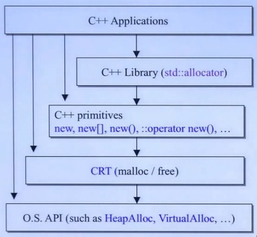

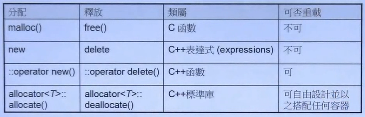

### new/delete表达式

new expression，不可重载，分配内存、调用类的构造函数。。类似如下代码：

```c++
Complex *pc;
try{
    void* mem = operator new(sizeof(Complex)); //allocate，可重载
    pc = static_cast<Complex*>(mem);
    pc->Complex::Complex(1,2); //construct
}
catch(std::bad_alloc){
    //allocation fail, 不执行构造函数
}
```

#### operator new

`void* operator new()` 实现gcc下，可重载，在哪重载？类成员函数？：

```c++
using std::new_handler;
using std::bad_alloc;// using 声明
#if _GLIBCXX_HOSTED// 如果 有这个宏使用 std的malloc
using std::malloc;
#else// 没有则使用c语言的malloc
// A freestanding C runtime may not provide "malloc" -- but there is no
// other reasonable way to implement "operator new".
extern "C" void *malloc (std::size_t);
#endif

_GLIBCXX_WEAK_DEFINITION void *
operator new (std::size_t sz) _GLIBCXX_THROW (std::bad_alloc)
{
  void *p;
  // new_handler 以后说明，但是可以看出首先我们根据入口参数 sz的大小分配内存， 
  // 如果sz为0 则令其为1 ，然后在while循环中调用malloc申请内存
  // 直到 申请成功 或者 抛出异常或者 abort
  /* malloc (0) is unpredictable; avoid it.  */
  if (sz == 0)
    sz = 1;

  while (__builtin_expect ((p = malloc (sz)) == 0, false))
    {
      new_handler handler = std::get_new_handler ();
      if (! handler)
      _GLIBCXX_THROW_OR_ABORT(bad_alloc());
      handler();
    }

  return p;
}

```

new_handler可调用object，让更多的memory可用，调用abort() 或者 exit()，比如以下简单例子：

```c++
void noMoeMemory()
{
    cerr << "out of memory";
    abort();//若没调用abort，则会一直尝试调用handler
}

std::set_new_handler(noMoreMemory);
```


delete 类似：

```c++
pc->~Complex();
operator delete(pc); //调用free(p)
```


### array new,array delete

```c++
Complex* pca = new Complex[3]; //无法由参数给与初值，默认构造函数

delete[] pca;//调用3次dtor 正反顺序由编译器决定
//===================================
int* pi = new int[10]; //sizeof(pi):4
delete pi;  //对int来说，没析构函数

int ia[10]; //from stack but not heap
cout << sizeof(ia); //40
```

### placement new

new(),delete()，可重载，放一个指针的版本是标准库写好了的

```c++
//作用在已经分配好的内存,没有分配内存,不存在placement new
#include <new>
char* buf = new char[sizeof(Complex)*3];
Complex* pc = new(buf)Complex(1,2);

delete[] buf;
```

操作相当于：

```c++
Complex *pc;
try{
    void *mem = operator new(sizeof(Complex), buf);//两个参数的
    pc = static_cast<Complex*>(mem);
    pc->Complex::Complex(1,2);
}
catch(std::bad_alloc){
    
}

void* operator new(size_t, void* loc)
{return loc;}
```

### 容器分配内存途径

new/delete表达式的途径：

```c++
new->operator new->::operator new->malloc
```

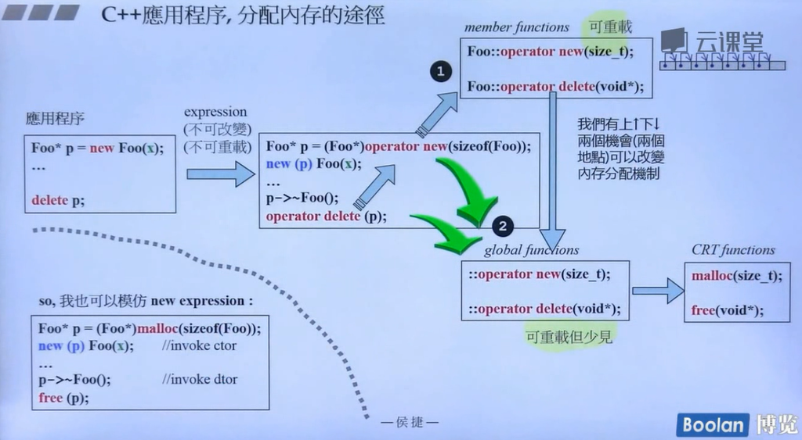

容器`Container<T>`

```c++
T* p = allocate(); //std::allocator等->::opreator new(size_t)->malloc(size_t)
consturct();

destroy();
deallocate p;
```

### 重载

必须是static函数，因为在调用operator new的时候对象正在创建。

为甚么没有写，大概因为编译器默认是了吧。

```c++
class Foo{
    void* operator new(size_t);
    void operator delete(void*,size_t); //size_t optional
};

Foo* p = ::new Foo(7);// 强迫使用全局operator new
```

placement new()，重载参数第一个必须是size_t，basic_string类里重载了new()

```c++
inline static void* operator new(size_t s, size_t extra)
{
    //多分配了点
    return Allocator::allocate(s + extra*sizeof(charT));
}
```

### 小型内存管理

速度+空间利用率，c++ primer有例子。Effective c++ item10例子。

如果有多次new，是否可以一次malloc一大块内存。

分配一大块，做切割，形成链表？

```c++
//重载operator new/delete
//next指针 c++ primer有例子,版本一。
//union 中的next指针? Effective c++ item10例子，版本二
```

可以把这种内存管理抽象出来，做成一个`allocator`类。

```c++
//版本三
class allocator
{
private:
    struct obj
    {
        //借用这个对象的前四个字节
        struct obj* next;//embedded poioner
    };
public:
    void* allocate(size_t);
    void deallocate(void*, size_t);
private:
    obj* freeStore = nullptr;
    const int CHUNK = 5;
};
```

函数实现，直接调用malloc分配一大块内存：

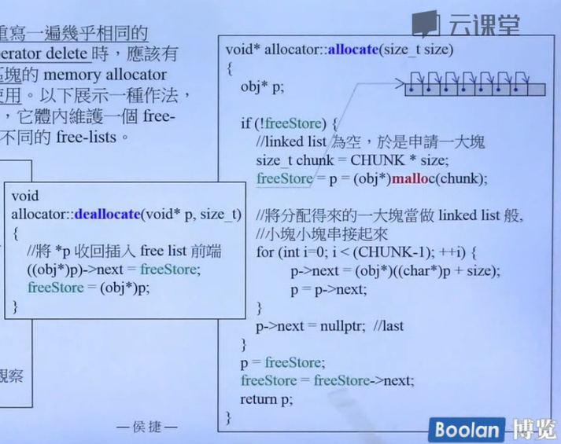

其用法，作为类中的静态变量，注意静态变量的初始化，per class allocator。

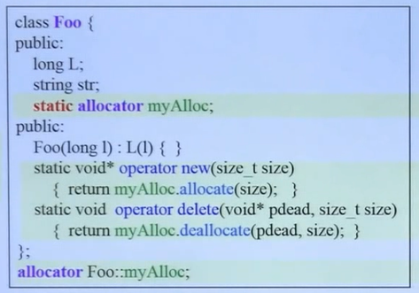

Class A，B，C，D都是这么写？固定制式，能不能优化？

```c++
//macro for static allcator 宏

```

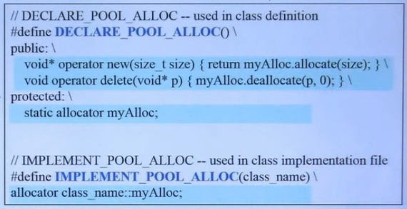

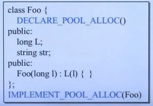


## 分配器

### std::allocator VC6

上一节每个类有一个allocator，标准库的std::alloc针对所有类来服务。标准库又是怎么做的呢？

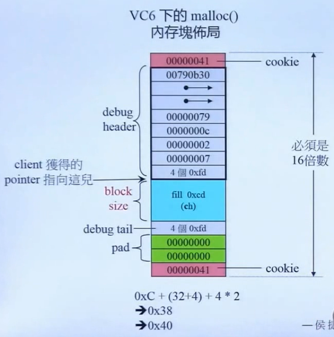


malloc得到的内存块，前后有cookie（4个字节？记录块大小），占用8个字节。总占用必须是16的倍数。

VC6下的实现，内部只是简单的调用operator new/delete，没有特殊的设计：

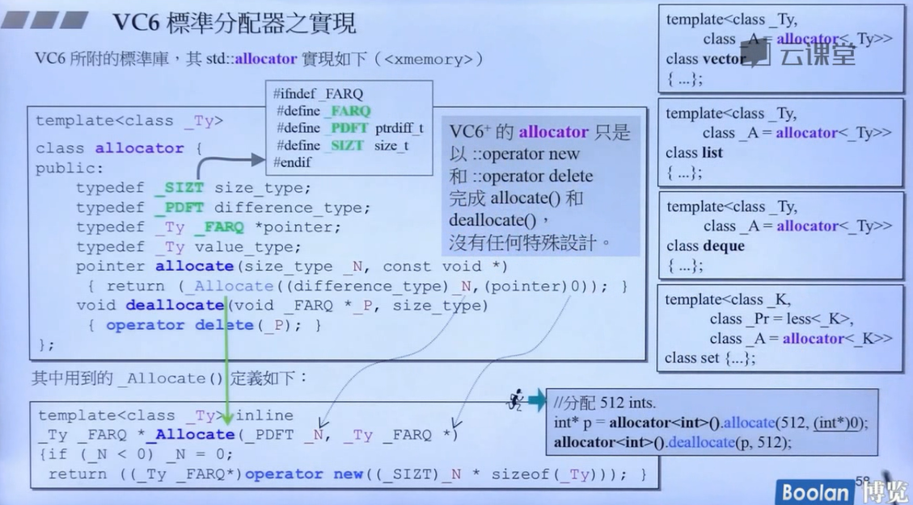

### std::allocator G4.9标准分配器

G4.9的std::allocator也是没有任何特殊设计，只是调用operator new/delete完成allocate/deallocate

为什么不设计得更好呢？不知道。。。。

### std::alloc G2.9

G2.9的`std::alloc`到G4.9变成了编制外的`__guu_cxx::__pool_alloc`，假设分配一百万个元素，可以省去中间类前后的cookie（100万×8字节）。像是上一节第三版的分配器实现，体现了pool这个单词。

`vector<int>`假如使用这个分配器，那么元素之间相差8字节（32位int），不然就相差16字节。

为小区块服务，负责128字节之内大小的object的分配，间隔为8字节，16种大小的链表，`free_list[16]`，如果超过128字节，那么就交给malloc分配，那么就会带cookie。


带有嵌入式指针：object小于4字节怎么办，嵌入式指针没地放了。。

```c++
struct obj{
    obj* free_list_link;
}
```

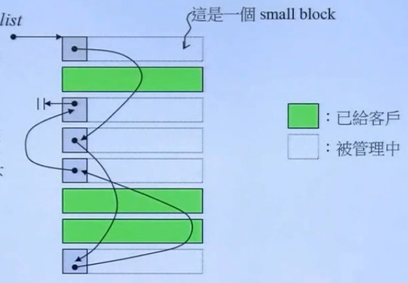


如何分配内存：

```c++
//如果当前#id链表有余，则分配出去
//如果链表空或者当前链表没余，则在战备池pool里分配内存（最大20个）
//pool分配一个都不够，则重新分配：sizeof(Object)*20*2 + RoundUp(累计申请量<<4)
//一半作为链表，一半当作pool战备池
```

我有问题：

问题一：为什么每次把第一个链表头返回出去，free_list指向了第二个？？是这样`vector<int>(1)`???

问题二：当pool大小不够了，这部分pool回收嘛？然后重新分配内存。答：碎片处理，怎么处理？比如有80字节的碎片，那就把这块内存挂在#9号链表中，因为#9号链表管理80字节大小的链表。

问题三：没内存了怎么办？答：向后一个链表去借一块内存。。如果后边都没有资源了，那么分配失败。
不往前看一看嘛，有很多内存未被使用。答：太复杂，好多链表，而且链表不知道长度。
非要分配20个吗，万一系统还能分配1个或者 几个object呢？


源代码分析课程未看。先去看第三讲malloc/free部分。

## malloc/free

C的，分配内存最后终归到malloc，源代码太复杂了。。先不去看课程了。

## malloc底层实现


## 问题：new 与 malloc的区别

 C语言提供了malloc和free两个系统函数，完成对堆内存的申请和释放。而C++则提供了两个关键字new和delete；

new分配的内存是虚拟内存还是物理内存？
内存泄漏？什么情况容易出现内存泄漏？如何避免内存泄漏？

[malloc和free函数详解](https://www.cnblogs.com/hanyonglu/archive/2011/04/28/2031271.html)

[new与malloc的区别及使用时注意的问题](https://blog.csdn.net/qq_26816591/article/details/52214313) 两个值得注意的问题，并涉及[C/C++堆、栈及静态数据区详解](https://www.cnblogs.com/hanyonglu/archive/2011/04/12/2014212.html)

[C++ new和malloc的区别](https://blog.csdn.net/nyist_zxp/article/details/80810742) 比较详细。

核心区别就是返回类型、内存区域。new底层调用malloc来分配内存。

## memset


## C++内存分区

五大内存分区：在C++中，内存分成5个区，他们分别是堆、栈、自由存储区？、全局/静态存储区和常量存储区。

```c++
//栈,由编译器在需要的时候分配，在不需要的时候自动清除的变量的存储区。里面的变量通常是局部变量、函数参数等。
int a = 1;
//堆,由new分配的内存块,用户负责delete，如果用户没有释放掉，那么在程序结束后，操作系统会自动回收。
int *p = new int[2]; //指针p依然保存在栈中，p指向的内存在堆中分配

//自由存储区，由mallloc分配的内存块，和堆十分相似?????

//全局/静态存储区static，又叫数据段？
//全局变量和静态变量被分配到同一块内存中,他们共同占用同一块内存区（未初始化的变量都被初始化成0或空串）
//全局静态变量、静态成员变量、局部静态变量。

//常量存储区
//他们里面存放的是常量，不允许修改（当然，你要通过非正当手段也可以修改，而且方法很多）
10;
"abcd";
const int a = 5;
```

栈与堆区别：

1、管理方式不同：对于栈来讲，是由编译器自动管理，无需我们手工控制；对于堆来说，释放工作由程序员控制，容易产生memory leak。
2、空间大小不同，堆内存可达到物理内存大小，而栈有一定空间大小（几M？）可以被设置大小。
3、堆会产生碎片。
4、堆向上，即内存地址增加的方向增长。栈则相反。

static前来捣乱，static用来控制变量的存储方式和可见性。注意的问题是：static成员变量什么时候分配内存，以及什么时候被初始化呢？？？

```c++
//可能位置1：头文件中，在类声明的外部，写上：
int Foo::a = 1;//error 如果多个include该头文件，会造成重复定义
//准确来说，在头文件内初始化一个类内【非const】的static成员变量是非法的。
//注意：前面不加static，以免与一般的静态变量混淆

//可能位置2：头文件声明，cpp文件中定义
// Foo.cpp
#include "Foo.cpp"
int Foo::a = 1;  //OK

//const static 成员变量，头文件中声明+定义
const static int MAX_SIZE = 0xFFFF;
//注意：不能在头文件内声明const static成员变量，而在具体源cpp文件内实现其初始化。
//那如果这么做了呢?? 若实际应用中没有相应的实现文件(源cpp文件)来对这个成员变量实现初始化，编译器会拒绝。
//那如果有一个对其初始化了呢？ 不知道。。
```

其他注意：

> (1)类的静态成员函数是属于整个类而非类的对象，所以它没有this指针，这就导致了它仅能访问类的静态数据和静态成员函数。
>
> (2)不能将静态成员函数定义为虚函数。
>
> (7)静态数据成员是静态存储的，所以必须对它进行初始化。
>
> (9) 为了防止父类的影响，可以在子类定义一个与父类相同的静态变量，以屏蔽父类的影响。这里有一点需要注意：我们说静态成员为父类和子类共享，但 我们有重复定义了静态成员，这会不会引起错误呢？不会，我们的编译器采用了一种绝妙的手法：name-mangling 用以生成唯一的标志。


至于new分配的内存是虚拟内存还是物理内存？啊，虚拟内存和物理内存。。。网上看到一些答案，不知道对错。

>malloc是在进程的地址空间中分配的，申请的动态内存。
>
>malloc只管在当前进程堆上分配内存,是C library,当前进程堆内存不够时会用系统调用向OS申请,至于申请的是什么内存,OS决定.
>
>一般程序编译时会指定自己的堆有多大,malloc在堆中申请,如果超过堆的尺寸会申请失败;程序在启动时,向操作系统申请堆空间,一般不会是在运行时才申请堆空间的.
>
>应该这么说，你申请的是虚拟内存，但是虚拟内存会映射到物理内存，所以，你的数据最后肯定都是存储在物理内存里的。
>
>[C++内存管理（一）虚拟内存和物理内存区别](https://blog.csdn.net/weixin_43796685/article/details/102843667)

## c++中内存四区

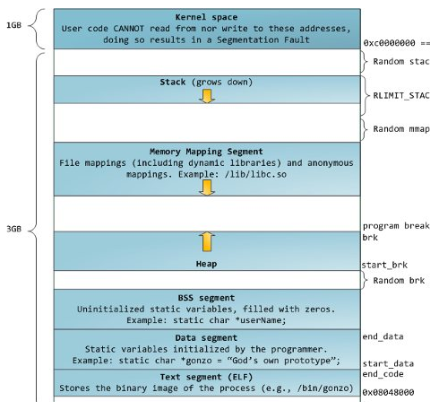

<https://zhuanlan.zhihu.com/p/120997610> 

1. 代码区，存放函数体的二进制代码，由操作系统进行管理 

2. 全局区，全局静态存储区。这部分可以细分为data区和bss区，全局变量静态变量常量。程序编译完成后，生成可执行文件后，未执行程序前分配（这句话没明白，现在还编译什么？）

   **2.1 data区**

   data区里主要存放的是已经初始化的全局变量、静态变量和常量

   **2.2 bss区**

   bss区主要存放的是未初始化的全局变量、静态变量，这些未初始化的数据在程序执行前会自动被系统初始化为0或者NULL

   **2.3 常量区**

   常量区是全局区中划分的一个小区域，里面存放的是常量，如const修饰的全局变量、字符串常量等

3. 栈区，栈是一种先进后出的内存结构，由编译器自动分配释放，存放函数的参数值、返回值、局部变量等。在程序运行过程中实时加载和释放，因此，局部变量的生存周期为申请到释放该段栈空间。 
   比如：局部变量、const修饰的局部变量

4. 堆区，用于动态内存分配。堆在内存中位于BSS区和栈区之间。一般由程序员分配和释放，若程序员不释放，程序结束时由操作系统回收。 


总结：全局区存放的是全局变量、静态变量和常量

在程序运行后由产生了两个区域，栈区和堆区


## 智能指针C++11

智能指针(shared_ptr、weak_ptr、unique_ptr)？0、手撕shared_ptr？

我所想到的：1、RAII技术（咋翻译来着），2、unique_ptr与shared_ptr的区别：不可拷贝？？？还是说拷贝完完了后，前者失效？？weak_ptr是share_ptr的辅助，不计入引用计数，还可用其判断share_ptr的引用计数，万一为0了，就代表对象被销毁了。只能想到这些了。。3、还有就是怎么初始化，还记得吗？好像是下面这样吧，能不能用指针初始化？用指针初始化，然后delete指针会发生什么？4、共享指针在copy时，引用计数加一，退出作用域，析构时引用技术减一，为0时释放资源。那这个计数是怎么计的呢，忘了。。因为如果每个对象持有一个普通计数成员，那么不会共享。如何让一些对象共享一个计数呢？？？我记得是也是用指针指向这个引用计数，或者是引用计数对象。

5、如何让智能指针指向已有对象？下面的是调用构造函数吧。

6、被智能指针接管的对象，如果出了作用域不会被析构吧？？这其实问的是new出来的会吗？，new出来的不会被释放。这又回到第5，7个问题。

7、智能指针必须管理new创建的对象，动态对象？？栈对象可以吗？？

```c++
#include <memory>
using std;
shared_ptr<Foo> pf = make_shared<Foo>(args...);//调用构造函数构造

Foo f;
shared_ptr<Foo> pf2 = &f; //这样可以吗？？

//看看智能指针的构造函数就知道了
```


答：

3、接受指针参数的智能指针是explicit的，因此我们不能将一个内置指针隐式转换为一个智能指针，必须直接初始化形式来初始化一个智能指针。

2、由于一个unique_ptr拥有它指向的对象，因此unique_ptr不支持普通的拷贝或赋值操作。只能移动unique_ptr，即对资源管理权限可以实现转移。不能拷贝unique_ptr有一个例外：我们可以拷贝或赋值一个将要被销毁的unique_ptr.最常见的例子是从函数返回一个临时对象unique_ptr，还可以返回一个局部对象的拷贝：。为啥会有这个例外？右移操作，移动拷贝函数？？

```c++
auto ptrA = make_unique<string>("dable");
auto ptrB = std::move(ptrA);

unique_ptr<string> p2(ptrA.release());
```

2、weak_ptr它的最大作用在于协助 shared_ptr 工作，可获得资源的观测权，像旁观者那样观测资源的使用情况。观察者意味着 weak_ptr 只对 shared_ptr 进行引用，而不改变其引用计数，当被观察的 shared_ptr 失效后，相应的 weak_ptr 也相应失效。使用 weak_ptr 的成员函数 use_count() 可以观测资源的引用计数，另一个成员函数 expired() 的功能等价于 use_count()==0，但更快，表示被观测的资源(也就是shared_ptr管理的资源)已经不复存在。weak_ptr可以使用一个非常重要的成员函数lock()从被观测的 shared_ptr 获得一个可用的 shared_ptr 管理的对象， 从而操作资源。但当 expired()==true 的时候，lock() 函数将返回一个存储空指针的 shared_ptr。总的来说，weak_ptr的基本用法总结如下：

```c++
weak_ptr<T> w;	 	//创建空 weak_ptr，可以指向类型为 T 的对象。
weak_ptr<T> w(sp);	//与 shared_ptr 指向相同的对象，shared_ptr 引用计数不变。T必须能转换为 sp 指向的类型。
w=p;				//p 可以是 shared_ptr 或 weak_ptr，赋值后 w 与 p 共享对象。
w.reset();			//将 w 置空。
w.use_count();		//返回与 w 共享对象的 shared_ptr 的数量。
w.expired();		//若 w.use_count() 为 0，返回 true，否则返回 false。
w.lock();			//如果 expired() 为 true，返回一个空 shared_ptr，否则返回非空 shared_ptr。
```

使用弱引用的智能指针打破这种**循环引用**。

4、shared_ptr 对象除了包括一个所拥有对象的指针外，还必须包括一个引用计数代理对象的指针；最主要的是这个代理对象如何设计。

0、考虑的事情：

>（a）当创建智能指针类的新对象时，初始化指针，并将引用计数设置为1；
>（b）当智能指针类对象作为另一个对象的副本时，拷贝构造函数复制副本的指向辅助类对象的指针，并增加辅助类对象对基础类对象的引用计数（加1）；
>（c）使用赋值操作符对一个智能指针类对象进行赋值时，处理复杂一点：先使左操作数的引用计数减 1（为何减 1：因为指针已经指向别的地方），如果减1后引用计数为 0，则释放指针所指对象内存。然后增加右操作数所指对象的引用计数（为何增加：因为此时左操作数指向了右操作数指向的对象）；
>（d）完成析构函数：调用析构函数时，析构函数先使引用计数减 1，如果减至 0 则 delete 对象。


5、7、可以传给spr指针，但如果这个指针指向的对象不是new出来的话，那么在退出作用域spr会delete这个指针，从而抛出异常。

```c++
int a = 1;
std::shared_ptr<int>spr(&a);

cout << *spr << endl;
```

- 实际上对全部三种智能指针都应避免的一点：

```c++
string vacation("I wandered lonely as a cloud.");
shared_ptr<string> pvac(&vacation);   // No
```

pvac过期时，程序将把delete运算符用于非堆内存，这是错误的。


## C++多态，虚函数？

C++中的虚函数的作用主要是实现了多态的机制。关于多态，简而言之就是用父类型别的指针指向其子类的实例，然后通过父类的指针或引用调用实际子类的成员函数。这种技术可以让父类的指针有“多种形态”，这是一种泛型技术。

虚函数的使用方法：

 [C++虚函数表解析](https://coolshell.cn/articles/12165.html)，[C++对象的内存布局](https://coolshell.cn/articles/12176.html)


构造函数、析构函数，能不能定义为虚函数？？

1.只有类的成员函数才能说明为虚函数，因为虚函数仅适合用与有继承关系的类对象，所以普通函数不能说明为虚函数。 

2.静态成员函数不能是虚函数,因为静态成员函数的特点是不受限制于某个对象，也没有this指针。 

3.内联(inline)函数不能是虚函数，因为内联函数不能在运行中动态确定位置。即使虚函数在类的内部定义定义，但是在编译的时候系统仍然将它看做是非内联的。 

4.构造函数不能是虚函数，因为构造的时候，对象还是一片位定型的空间，只有构造完成后，对象才是具体类的实例。 

5.析构函数可以是虚函数,而且通常声名为虚函数。如果不是虚函数，它会只去调用基类类型的析构函数，这显然不是我们所需要的。而平常派生类的析构函数在执行完后，会自动执行基类的析构函数。


## static、extern、const、volatile关键字？

不晓得extern和volatile关键字。虽然看过。
extern声明这个变量是外部的？？？然后就去外边找吗？外边好几个怎么办？


## C++异常机制

[C++的异常处理](https://blog.csdn.net/daheiantian/article/details/6530318)


