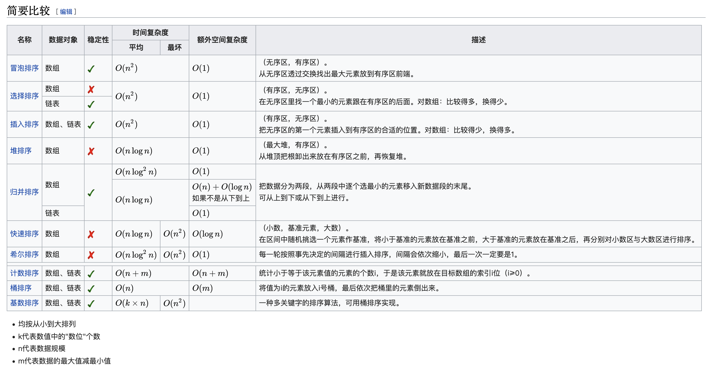

我想到的：

冒泡排序：每次挑一个最小的“冒泡”到最上面？

插入排序：当前元素之前都是已经排好序的了。将此元素依次向前插入到正确位置。

归并排序：典型的分治策略，自底向上合并已排序数组。注意对并的时候两个指针中一个到达末尾的情况。

快速排序：递归实现？自顶向下，选出“分割数”（有许多策略），左边小右边大，继续递归。

桶排序：？？

希尔排序：？？？

堆排序：最大值堆，需要实现重要函数：“下拉当前元素”，重要假设：当前元素左右子树都已经是堆。

想不出来了。。。。。。

维基百科，人家描述的为什么这么清楚，我的就是shit：




冒泡排序与选择排序的思想是一样的，按照【有序区[0,i)、无序区[i, N-1)】来讲，冒泡排序是从后往前通过不断交换找到最小值到有序区后面，即填充`idx = i`，不断交换像是“冒泡”；而选择排序是通过比较来找到最小值所在的idx，然后交换到有序区后面。

## 归并排序

```c++
void mergeSort(vector<int>& nums, int left, int right)
{
    if(left >= right) return;

    int mid = (left+right)/2;

    mergeSort(nums, left, mid);
    mergeSort(nums,mid+1, right);

    int L = left, R = mid+1;
    int curr = left; //tmp数组
    while(L<=mid && R<=right)
    {
        if(nums[L] > nums[R]) temp[curr++] = nums[R++];
        else temp[curr++] = nums[L++];
    }

    while(L<=mid) temp[curr++] = nums[L++];
    while(R<=right) temp[curr++] = nums[R++];

    for(int i = left; i <=right; i++) nums[i] = temp[i];
}
```


## 快排

```c++
 //快速排序
void quickSort(vector<int>& nums, int low, int high)
{
    if(low >= high) return;

    int pos = partition(nums, low, high);
    quickSort(nums, low, pos-1);
    quickSort(nums, pos+1, high);

}

int partition(vector<int>& nums, int low, int high)
{
    int pivot = nums[high];

    while(low < high)
    {
        while(low < high && nums[low] <= pivot) ++low;
        nums[high] = nums[low];
        while(low < high && nums[high] >= pivot) --high;
        nums[low] = nums[high]; 
    }

    nums[low] = pivot;

    return low;
}
```

partition另一种写法

```java
private int partition(int[] nums, int left, int right) {
    int randomIndex = RANDOM.nextInt(right - left + 1) + left;
    swap(nums, left, randomIndex);

    // 基准值
    int pivot = nums[left];
    int lt = left;
    // 循环不变量：
    // all in [left + 1, lt] < pivot
    // all in [lt + 1, i) >= pivot
    for (int i = left + 1; i <= right; i++) {
        if (nums[i] < pivot) {
            lt++;
            swap(nums, i, lt);
        }
    }
    swap(nums, left, lt);
    return lt;
}
```


## LC912.排序数组：

```c++
class Solution {
    vector<int> temp;
public:
    vector<int> sortArray(vector<int>& nums) {
        //temp.assign(nums.size(), 0);
        //mergeSort(nums, 0, nums.size()-1)

        quickSort(nums, 0, nums.size()-1);
        return nums;
    }

    //冒泡选择超时
    void bubbleSort(vector<int>& nums)
    {
        int N = nums.size();

        for(int i = 0; i < N -1; ++i)
        {
            //[0,i)有序区
            for(int j = N-1; j > i; --j)
            {
                //[i,j]无序区，通过交换使[0, i]有序
                if(nums[j-1] > nums[j])
                {
                    swap(nums[j-1],nums[j]);
                }
            }
        }

    }

    void bubbleSortWithFlag(vector<int>& nums)
    {
        int N = nums.size();

        for(int i = 0; i < N -1; ++i)
        {
            bool flag = false;
            for(int j = N-1; j > i; --j)
            {
                if(nums[j-1] > nums[j])
                {
                    swap(nums[j-1],nums[j]);
                    flag = true;
                }
            }

            if(flag == false) return;
        }

    }

    void selectSort(vector<int>& nums)
    {
        int N = nums.size();
        for(int i = 0; i < N-1; i++)
        {
            //[0,i)有序区
            int idx = i;

            for(int j = i+1; j < N; j++)
            {
                if(nums[j] < nums[idx]) idx = j;
            }

            if(idx != i) swap(nums[i], nums[idx]);
        }
    }

    //插入排序,超时
    void insertSort(vector<int>& nums)
    {
        int N = nums.size();
        for(int i = 1; i < N; i++)
        {
            for(int j = i-1; j >=0; j--)
            {
                if(nums[j] > nums[j+1])
                {
                    swap(nums[j], nums[j+1]);
                }
                else
                {
                    break;
                }
            }
        }
    }

    //插入排序，交换少，超时
    void insertSort2(vector<int>& nums)
    {
        int N = nums.size();
        for(int i = 1; i < N; i++) // 0 已经有序
        {
            int temp = nums[i];
            //找插入位置，while循环更好一点
            int j = i-1;
            for(; j >=0; j--)
            {
                if(nums[j] > temp)
                {
                    nums[j+1] = nums[j];
                }
                else
                {
                    break;
                }
            }
            nums[j+1] = temp;
        }
    }

    //二分查找插入，超时。。。。
    void hInsertSort(vector<int>& nums)
    {
        int N = nums.size();
        for(int i = 1; i < N; i++)
        {
            int currVal = nums[i];
            int left  = 0, right = i; //[left,right)
            while(left < right)
            {
                int mid = (left+right)/2;
                //找第一个大于等于currVal的位置，即插入位置。
                if(nums[mid] < currVal)
                {
                    left = mid+1;
                }
                else
                {
                    right = mid;
                }
            }

            for(int j = i - 1; j >=right; j--)
            {
                nums[j+1] = nums[j];
            }
            nums[right] = currVal;
        }
    }


    //归并排序
    void mergeSort(vector<int>& nums, int left, int right)
    {
        if(left >= right) return;

        int mid = (left+right)/2;

        mergeSort(nums, left, mid);
        mergeSort(nums,mid+1, right);

        int L = left, R = mid+1;
        int curr = left; //tmp数组
        while(L<=mid && R<=right)
        {
            if(nums[L] > nums[R]) temp[curr++] = nums[R++];
            else temp[curr++] = nums[L++];
        }

        while(L<=mid) temp[curr++] = nums[L++];
        while(R<=right) temp[curr++] = nums[R++];

        for(int i = left; i <=right; i++) nums[i] = temp[i];
    }

    //快速排序
    void quickSort(vector<int>& nums, int low, int high)
    {
        if(low >= high) return;

        int pos = partition(nums, low, high);
        quickSort(nums, low, pos-1);
        quickSort(nums, pos+1, high);

    }

    int partition(vector<int>& nums, int low, int high)
    {
        int pivot = nums[high];

        while(low < high)
        {
            while(low < high && nums[low] <= pivot) ++low;
            nums[high] = nums[low];
            while(low < high && nums[high] >= pivot) --high;
            nums[low] = nums[high]; 
        }

        nums[low] = pivot;

        return low;
    }

};
```

