TCP/IP三次握手(为什么三次)、四次挥手(为什么四次)、滑动窗口、流量控制、拥塞控制？等等等


[从URL输入到页面展现到底发生什么？](https://segmentfault.com/a/1190000017184701)

与计算机网络相关的是哪些？DNS解析，建立TCP连接，断开TCP连接，然后七层模型，报文都经过哪些关卡，路由器如何映射端口的，到了局域网又是如何找到计算机的。

都忘求了，TCP连接应该是互相发送TCP报文，那之后的传输数据呢？？？是什么报文格式来着？？哦？是TCP报文中的数据段。

[一篇文章看明白 TCP/IP，TCP，UDP，IP，Socket之间的关系](https://blog.csdn.net/freekiteyu/article/details/72236734)

视频教程

[**湖科大教书匠**](https://space.bilibili.com/360996402/channel/index)，图片截屏来源于此，PPT做的好6。

[https://www.bilibili.com/video/BV1Mx411v7rJ](https://www.bilibili.com/video/BV1Mx411v7rJ)


# 七层网络模型

应用层，链路层。。。。忘了

**OSI七层模型和TCP/IP五层模型**，我觉着较为复杂的是传输层、网络层。涉及到TCP/UDP，以及IP寻址，路由等算法。

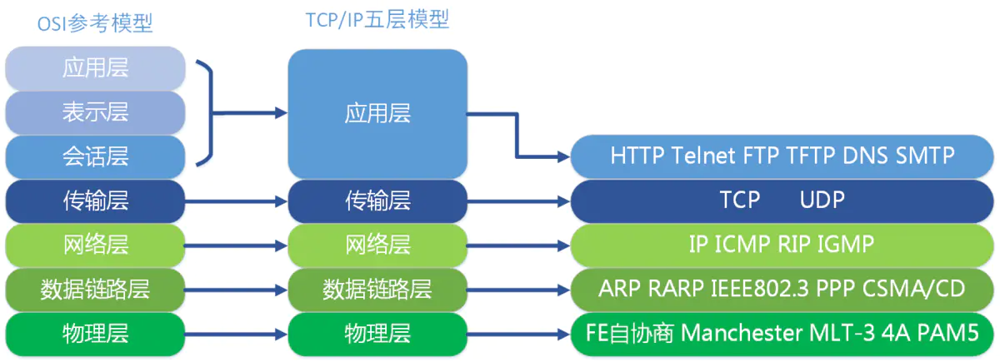

从应用层到另一台电脑的应用层的数据被层层包装：

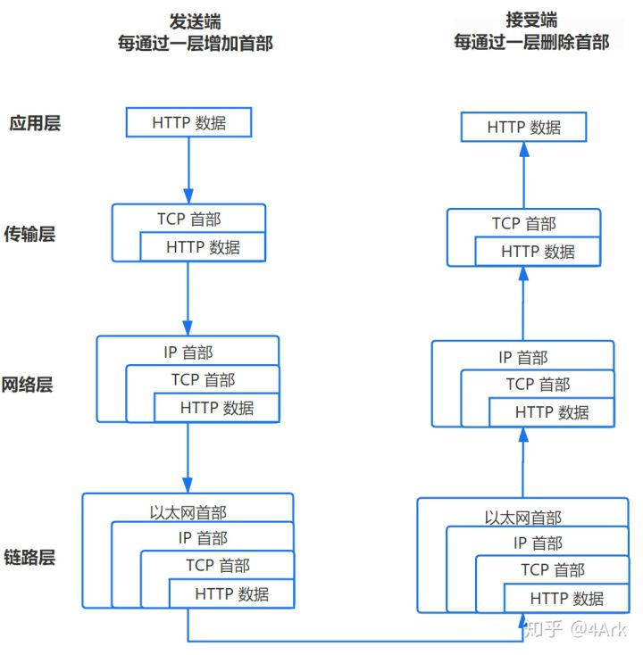

# TCP功能

疑问：

TCP首部中的源端口、和目的端口是在什么时候、谁给加上去的？应该是应用程序加的吧？毕竟端口号是进序的。

那IP报头中的源IP地址、目的IP地址呢，是啥时候加上去的？？也是应用程序嘛？

## 首部格式

TCP是由：首部+数据载荷，组成，**其实TCP的全部功能体现在首部中各个字段的作用**，了解了各个字段的作用，就能更好的学习TCP所拥有的功能。

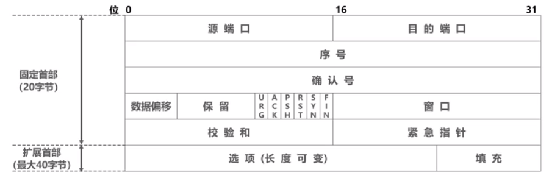

+ 保留位，6bit，保留为今后使用，但至今未使用，应置为0
+ 校验和，老师上课说没用，校验整个TCP报文段。
+ RST，复位标志位，为1时，则表明连接异常，必须释放连接，然后重新建立连接。
+ URG、紧急指针：紧急标志位URG为1时，紧急指针字段有效，可插队到发送缓存的最前面。指出了数据载荷中的紧急数据大小（以字节为单位），后面是正常数据。
+ 填充，保证头部大小被4字节整除，这也呼应了数据偏移字段的单位。

### 端口

例如：浏览器访问web服务，源端口：49152，目的端口：80

端口号最大为65535，即0-65535总共65536个端口号，65536是2 的 16次方，即一个端口号要个它预留16位的空间才能支持这么多端口号，那么源端口和目的端口总共需要占32位，我们填到第一行。

不同操作系统有不同格式的进程标识符，那么网络通信之间（TCP/IP体系）使用端口号来区分应用层的不同进程。

+ 熟知端口号，0到1023，例如FTP：21/20，HTTP：80，DNS：53
+ 登记端口号，1024到49151，为没有熟知的应用程序使用，必须在IANA按照规定手续等级，比如微软远程桌面使用的端口号是3389
+ 短暂端口号，49152到65535，留给客户进程选择暂时使用

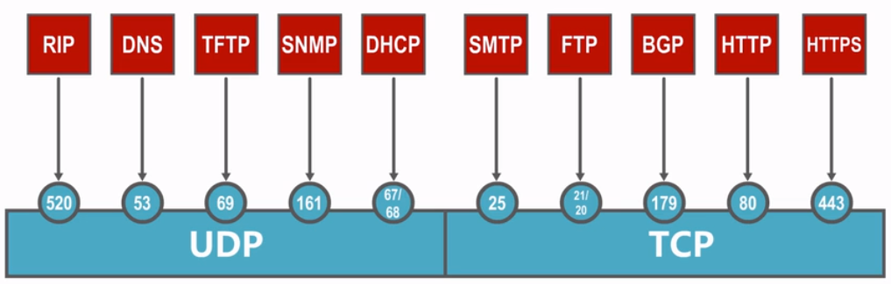

### 序号确认号、ACK

序号和确认号都是32bit，取值[0, 2^32-1]，序号增加到最好一个后，下一个序号又回到0，这样不会出问题吧？？？

序号：TCP报文段数据载荷的第一个字节的序号。初始序号随机。
确认号：期望收到下一个TCP报文段数据载荷的第一个字节的序号，同时也是对之前收到的所有数据的确认。加入为n，则代表n-1以及之前的字节已经全部收到。
ACK：取值为1，则确认号有效。表示此报文段是确认报文段。

### 数据偏移

占4比特，并以4**字节为单位**，为什么以4字节为单位呢？如果首部长度为20字节，则值为0101，如果加上最大40字节的扩展首部，则长度为60字节，值为1111

望文生义：指出数据载荷起始处距离首部起始处有多远。实际上是指出了TCP报文段的首部长度。

### 窗口rwnd（流量控制）

16比特，以字节为单位。指出发送本报文段的一方的接收窗口。其功能见流量控制。

### SYN（TCP连接）

表示此报文段是TCP连接请求报文段，前两次握手不携带数据，仅有首部。第三次可以携带也可以不携带。具体参见TCP三次握手连接。

### FIN

终止标志位FIN：用来释放TCP连接。四报文挥手。

## 流量控制（滑动窗口）

为什么需要流量控制：

路由器缓存？？？好像不是此因素，路由器直接丢弃就完事了。再者说，传输层协议对下层协议透明。接受方窗口Rwnd大小？？？忘了。。。反正目的就是让接受方来得及接收。

滑动窗口机制进行流量控制。接收者又是根据什么来调整接收窗口大小的呢？？

发送方A收到0窗口报文，则开启一个持续计时器，超时后，A发送0窗口探测报文来打破0窗口死锁。

实际上，发送窗口取拥塞窗口、接收窗口的最小值。


## 可靠传输（滑动窗口）

TCP可靠传输的实现，基于以字节为单位的滑动窗口。

假设单向发送：发送方的发送窗口---------->接受方的接收窗口

发送窗口中的数据才允许发送，【已发送的等待确认，未发送的可以发送】，滑动窗口前的数据是已经被确认的数据，滑动窗口后的数据是目前不允许发送的数据。

可用三指针表示数据发送情况和滑动窗口大小：P1、P2、P3，`[P1,P3)`表示滑动窗口区间，那么`[:P1]`则表示已发送并且已收到确认的部分。`[P1,P2)`表示已经发送但尚未收到确认的字节数；自然，`[P2,P3)`表示允许发送但尚未发送的字节数（又称为可用窗口）。

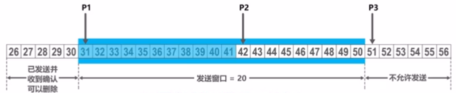

注意：

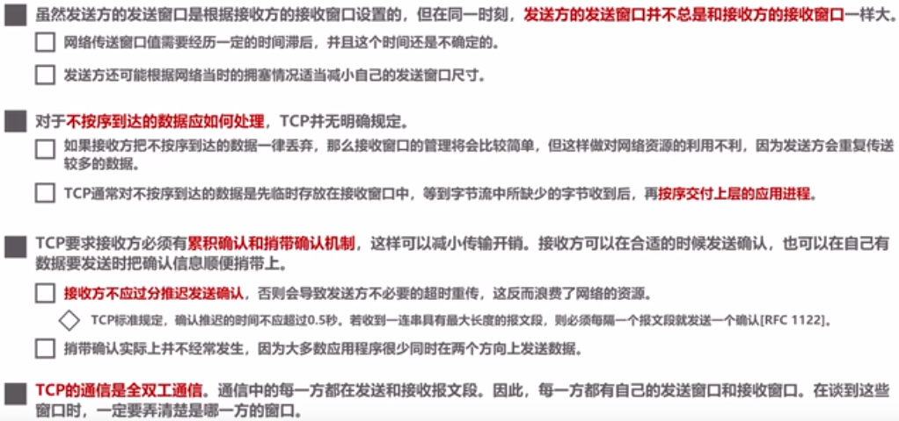

## 可靠传输（超时重传，时间选择）

报文段往返时间RTT，超时重传时间RTO，

RTO < RTT铁定不可以，如果RTO >>RTT，那么浪费时间，所以RTO理论上要稍大于RTT就可以。

但是RTT对于每个报文段是不确定的，所以不能只计算某一个RTT，要加权平均往返时间RTTs：

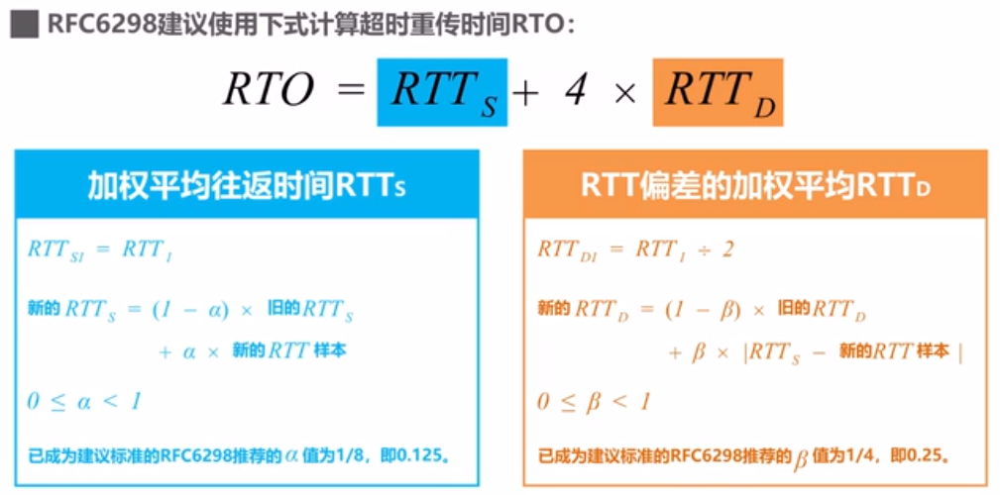

但是！往返时间RTT的测量比较复杂，1）对于（丢失）引起超时，并重传报文段的情况，收到一个确认，发送方不能确定这个确认报文是确定哪一个报文段的，进而无法确认RTT往返时间。2）确认报文段由于网络拥塞没有在一定时间返回，导致发送方超时重传，重传后收到确认报文，此时，发送发也无法分清确认的哪个报文。

针对以上情况：如果有重传的情况，新RTO = 2倍的旧RTO，收到确认报文后，由于无法确定此报文确定的是哪个报文，因此不去按照公式计算RTTs，RTTd，RTO


## 拥塞控制（四种）

（一）三个概念
1.拥塞是什么
2.拥塞窗口 cwnd (拥塞窗口的单位是什么？）
3.慢开始门限值 ssthread

（二）两幅图
1.输入负载与吞吐量之间的关系 （理想的拥塞控制、实际的拥塞控制、没有拥塞控制三者之间的曲线对比）
2.传输轮次与拥塞窗口的关系 （对应的四种拥塞控制的方法 以及 cwnd 和 ssthresh 之间的变化）

（三）四种控制算法与两个版本
（1）TCP tahoe 【慢开始 拥塞避免】
（2）TCP Reno 【快重传、快恢复 】（解决了前者的什么问题？ cwnd 和 ssthresh变化和之前的区别在哪）


计算机网络中：链路容量（带宽）、交换节点中的缓存都是网络的资源，当资源的需求超过了资源的可用部分，网络性能就要变坏。。

以下假设接受方接收窗口无限大。

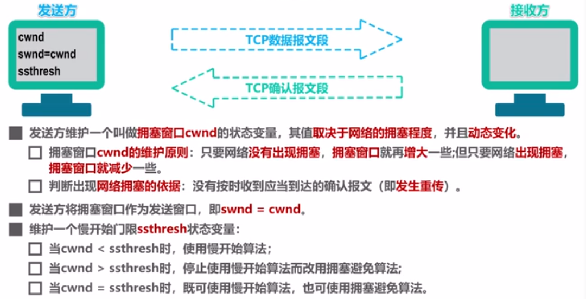

### 慢开始,拥塞避免,Tahoe版本

“慢开始”是指一开始发送的报文段少，而不是cwnd的增长速度慢！！
“拥塞避免”也并非能完全避免拥塞，而是使网络比较不容易出现拥塞。

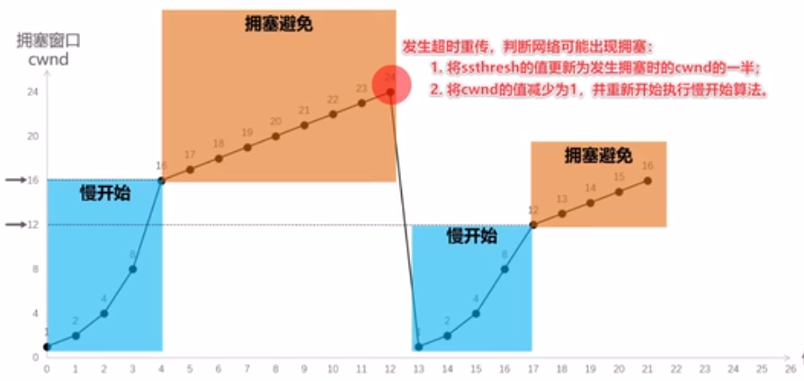

```c++
//以下假设接收窗口无限大，则swnd = cwnd
//TCP Tahoe版本的伪代码如下：
int cwnd = 1;
int ssthresh = 16;//慢开始门限值

while(true){
    if(ACK && cwnd < ssthresh){
    cwnd = cwnd * 2;//慢开始
    }
    else if(ACK && cwnd >= ssthresh){//拥塞避免
        cwnd += 1;
    }
    else if(TIME_OUT){
        ssthresh = cwnd / 2;
        cwnd = 1；
    }
}
```

### 快重传,快恢复,Reno版本

报文段丢失也可能不是因为网络拥塞导致，加入**快重传**算法。

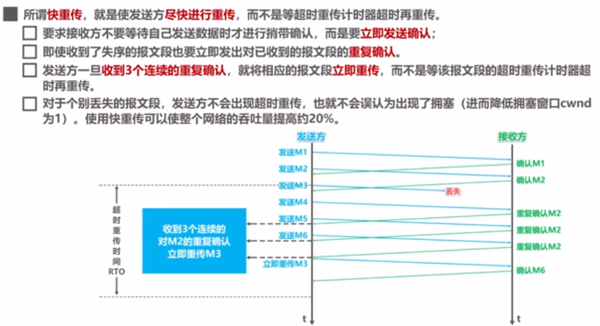

**快恢复算法**：当收到“3个重复确认时”，执行快重传；如果没有此算法，那么只能等到“超时”重传。。

```c++
int cwnd;
int ssthresh;

if(收到相同的3个ACK){
    ssthresh =  cwnd/2;
    cwnd = ssthresh;
}
```


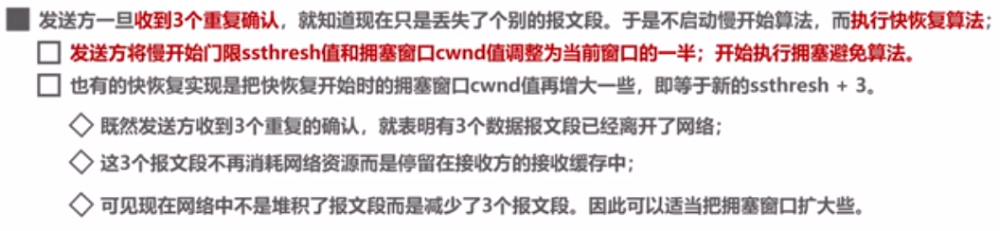

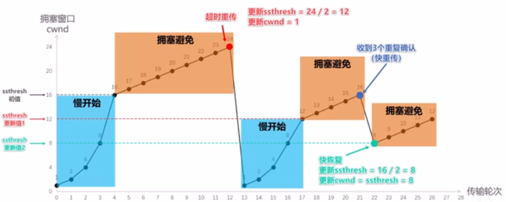

# TCP连接管理（重要）

1建立连接、2数据传送、3释放连接。

## 三次握手

SYN = 1的报文不能携带数据，但是要消耗一个序号，比如前两次握手。而普通报文，如果不挟带数据，则不消耗序号，比如第三次握手。

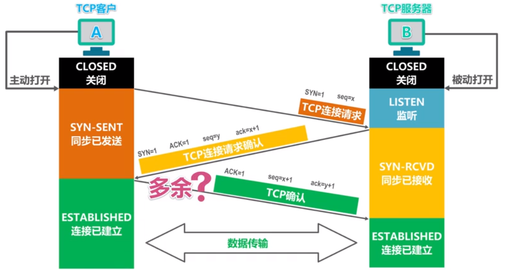

如果两次握手，可能发生以下情况：

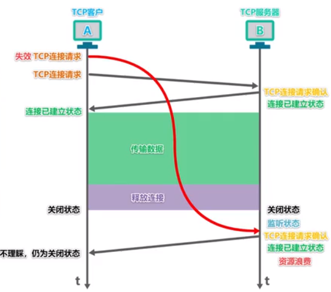

## 四次挥手

为啥要四次呢？时间等待状态作用（是个计时器）？？


## TCP保活计时器

可能一方出现故障，

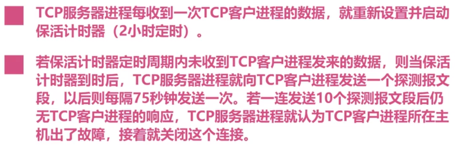

