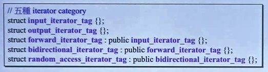
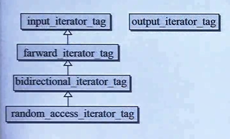
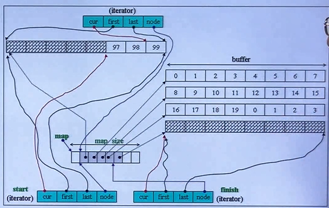

## 常用算法

```c++
include <numeric>

sort(res.begin(), res.end());
accumulate(res.begin(), res.end(), 0);
```


## Iterator

Iterator必须提供五种associated types：

```
iterator_category
value_type
pointer：没用过
reference：没用过
difference_type
```

## Iterator Traits

算法需要询问“迭代器（可能是指针，native piointer）”，这五种类型。但指针无法回答问题。需要提供中间层：萃取剂，Iterator Traits。

```c++
template<typename I>
void algorithm()
{
    typename iterator_traits<I>::value_type vl;
}
```


【T\*，const  T\*】两个偏特化iterator_traits<T\*> 和 iterator_traits<const T\*>


## 迭代器种类

五种 






# 顺序容器

## list

底层是环状双向链表。

底层实现，像是环状数组实现队列那样，end()指向多余的一个结点，也就是最后一个结点的下一个结点（前闭后开）。逻辑上不属于此链表。

其中有：


```c++
_List_node_base<_Tp>
{
    _M_next:_List_node_base*;
    _M_prev:_List_node_base*;
}
```


所有容器类都有`typedef xxx iterator `， list容器也不例外，其中保存当前node指针。

list迭代器只重载了`++`、`--`操作符，访问next，prev指向的结点。模拟指针的`*`，`->`操作符。

## vector

常用函数：push_back、insert、pop_back

底层实现数组，如何增长尺寸。二倍增长。引发拷贝构造函数。析构函数。

start、finish、end_of_storage【三个指针】表达了整个的vector 

由于vector是连续空间，迭代器不用是类，是T\*就可以。但是新版本搞得很复杂，层层看下去还是T\*

 

## deque

双端队列

```c++
d.push_front(13);
d.push_back(25);

d.pop_front();
d.pop_back();

// 访问: front back [] at
 
```


类成员

```c++
iterator start;
iterator finish;
map_pointer map; //T**, 控制中心vector, copy时copy到中段
size_t map_size; //map size
```




问：vector向后扩张，移动到另一块内存，那么deque双向扩充怎么办？

对外看起来是连续的。。。

内部：分段连续，vecrot保存缓存区（各个段）的指针`map_pointer`控制中心， `T**`类型。

迭代器：`T* curr、first、last`指向某一个缓存区、`T** node`指向map_pointer的某一个格子。

迭代器重载`-`

```c++
difference_type operator-(const self& s) const
{
	return buffer_size()*(node- x.node -1) + (curr-first) + (x.first - x.cur);  
}
```

那`++, --`操作符，就需要判断是否越过当前缓冲区了，也就是判断`curr == first or last`，在边界上就要跳到另一个缓冲区，`set_node(node+1) set_node(node-1)`， 例如后置++：

```c++
self& operator++(){
    ++cur;
    if(cur == last)
    {
        set_node(node+1);
    	cur = first;
	}
    return *this;
}
```

前置++，调用后置++

既然看起来连续，迭代器也提供了`+=`操作符，`+、-=`可以借用`+=`来做：

```c++
//需要跨越缓冲区嘛?跨几个
//切换到正确的buffer,切换到正确的cur
```

`[]`操作符

```c++
reference operator[](difference_type n) const
{  return *(*this+n); }//+已经重载
```


插入时：有两种选择，向front推动元素，向back推动元素。所以内部判断哪个方向元素少。


## stack和queue都不允许遍历，也不提供iterator

## stack（deque适配器）

这个我知道：

常用的三个top、pop、push

在deque的back部分操作。。。

## queue（deque适配器）

我先猜一猜：

入队：push

出队：pop？无返回值，访问用front

还有front、back访问函数、empty size等函数

```c++
template<class T, class Sequence=deque<T>> //也可以使用list?
class queue
{
    
};
```


## 适配器底层选择

stack 和 queue 不可选取 set map

stack可以选择vector，queue不可取vector

只要提供底层支撑函数就可以选择。


## priority_queue

最大值堆。优先级队列是一种容器适配器，经过专门设计，以使其按照某些严格的弱排序标准，其第一个元素始终是其中包含的最大元素。

c++的怎么用呢？

```c++
template <class T, class Container = vector<T>,
  class Compare = less<typename Container::value_type> > class priority_queue;
```

empty、size、top、push、emplace、pop、swap


# 关联式容器

可以想象为小型数据库。

底层：红黑树（set、map）、hashtable

我们不会直接面对底层，使用的是上层。但我们要理解底层实现。

## rb_tree红黑树

是一种**平衡**的二叉检索树（balanced binary tree）。有利于将来的查找。

rb_tree提供“遍历”操作，`++iter`遍历会得到排序状态（二叉搜索树中序遍历？）

不应该（编程层面没有阻止）使用红黑树的iterator去修改元素值（破坏二叉搜索树的性质），上升到map后，不可修改key，但可以修改data。

rb_tree提供两种insert操作：`insert_unique()`和`insert_equal()`，后者允许key重复。 

```c++
template<class Key, class Value, //key | data = Value(两个合起来)
class KeyOfValue, //在Value中如何拿到Key
class Compare, class Alloc=alloc>
class rb_tree
{
    size_type node_count;
    __rb_tree_node<Value> header; //简化实现
    Compare key_compare; // 可调用 function object 
    ...
};
```


node：3 ptr + 1 color


## map/multimap

看完set看map，set中key就是value， 而map不是。

```c++
template < class Key,                                     // map::key_type
           class T,                                       // map::mapped_type
           class Compare = less<Key>,                     // map::key_compare
           class Alloc = allocator<pair<const Key,T> >    // map::allocator_type
           > class map
{
public:
    typedef Key::key_type;
    typedef T data_type;
    typedef T mapped_type;
    typedef pair<const Key, T> value_type; //map禁止修改key的做法，与set的区别
    typedef Compare key_compare;
private:
    typedef rb_tree<key_type, value_type,select1st<value_type>,
               key_compare, Alloc> rep_type;
	rep_type t;
pubilc:
	typedef typename rep_type::iterator iterator;
};
```

map重写`[]`操作符，调用`lower_bound`，访问data，不存在则创建对应的pair（使用默认值）插入然后返回。

multimap不可以使用`[]`做插入。

## set/multiset

了解完红黑树rb_tree，再来看set，就是江河日下、一日千里。都是什么玩意。。。

multiset：我以前在multimap中理解的是一个key对应多个data，现在看来就是多个key而已。。。

迭代器是rb_tree的cost-iterator

insert分别调用底层的：`insert_unique()`和`insert_equal()`。

```c++
template<class Key, class Compare= less<Key>, class Alloc=alloc>
class set{
private:
	typedef rb_tree<Key, Key, identity<Key>/*G2.9*/, Compare, Alloc> rep_type;
public:
    typedef typename rep_type::const_iterator iterator; //cosnt 哦
    
    ...
};
```


```c++
if(set.erase(num))
```


## Hashtable哈希表

里面经验值偏多。。

发生碰撞怎么办？？？？？

1、先来后到，重复的移动到另一个位置。
2、每个位置不再放一个元素，而是放一个链表。（Separate Chaining）

链表太长了怎么办，经验：链表长度比篮子的数量还多就该rehashing
一般篮子的个数采取质数，rehashing篮子翻倍附近的质数，例如53 97(106)

```c++
template<class Value,class Key,class HashFcn,
		class ExtractKey, class EqualKey,
		class Alloc=alloc>
class hashtable{
private:
    vector<node*> buckets; //__hashtable_node<Value>
    size_type num_element;
};
```

拥有迭代器。

hash模板类，没有提供`std::string`


## hash_set/hash_multiset, hash_map/hash_multimap

before C++11

c++11👇

## unordered_map/multimap

> To obtain a range with all the elements whose key is *k* you can use member function [equal_range](http://www.cplusplus.com/unordered_multimap::equal_range).
> To just check whether a particular key exists, you can use [count](http://www.cplusplus.com/unordered_multimap::count).

```c++
pair<iterator,iterator>
   equal_range ( const key_type& k );
pair<const_iterator,const_iterator>
   equal_range ( const key_type& k ) const;
```


## unordered_set/multiset

用得最多是insert count函数

###  Element lookup

- [**find**](http://www.cplusplus.com/reference/unordered_set/unordered_set/find/)

  Get iterator to element (public member function)

- [**count**](http://www.cplusplus.com/reference/unordered_set/unordered_set/count/)

  Count elements with a specific key (public member function)

- [**equal_range**](http://www.cplusplus.com/reference/unordered_set/unordered_set/equal_range/)

  Get range of elements with a specific key (public member function)

### Modifiers

- [**emplace**](http://www.cplusplus.com/reference/unordered_set/unordered_set/emplace/)

  Construct and insert element (public member function )

- [**emplace_hint**](http://www.cplusplus.com/reference/unordered_set/unordered_set/emplace_hint/)

  Construct and insert element with hint (public member function)

- [**insert**](http://www.cplusplus.com/reference/unordered_set/unordered_set/insert/)

  Insert elements (public member function )

- [**erase**](http://www.cplusplus.com/reference/unordered_set/unordered_set/erase/)

  Erase elements (public member function )

- [**clear**](http://www.cplusplus.com/reference/unordered_set/unordered_set/clear/)

  Clear content (public member function)

- [**swap**](http://www.cplusplus.com/reference/unordered_set/unordered_set/swap/)

  Swap content (public member function)