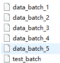

# The CIFAR-10 dataset

[CIFAR 10主页](https://www.cs.toronto.edu/~kriz/cifar.html)

> The CIFAR-10 dataset consists of 60000 32x32 colour images in 10 classes, with 6000 images per class. There are 50000 training images and 10000 test images. 
>
> The dataset is divided into five training batches and one test batch, each with 10000 images. The test batch contains exactly 1000 randomly-selected images from each class. The training batches contain the remaining images **in random order**, but some training batches may contain more images from one class than another.(这意思是不是特别平均？) Between them, the training batches contain exactly 5000 images from each class.  

文件：



类之间完全互斥，汽车与卡车之间不回存在 皮卡车。

airplane、automobile、bird、cat、deer、dog、frog、horse、ship、truck

## 数据

```python
def unpickle(file):
    import pickle
    with open(file, 'rb') as fo:
        dict = pickle.load(fo, encoding='bytes')
    return dict
```

我们得到了一个字典`dict`：

+ **data** -- a 10000×3072 numpy array of `uint8s `。每一行3072个元素，代表32×32的RGB图像，按照红绿蓝（RGB）通道排列（1024×3），图像以行为主顺序存储。
+ **labels** -- a list of 10000 numbers in the range 0-9. The number at index *i* indicates the label of the *i*th image in the array **data**.

The dataset contains another file, called `batches.meta`. It too contains a Python dictionary object. It has the following entries:

+ **label_names** -- a 10-element list which gives meaningful names to the numeric labels in the **labels** array described above. For example,` label_names[0] == "airplane"`, `label_names[1] == "automobile"`, etc.

```python
cifar10_dict.keys()
>>>
dict_keys([b'batch_label', b'labels', b'data', b'filenames'])
```

可以看到除了 data 和 labels 之外，还有 batch_label 和 filenames。

## 读取为图片

我们这里使用opencv2的库将数据转换为图像。

首先验证一个事情，`OpenCV`的基础数据类型为`numpy.ndarray`。即opencv读进来的是numpy数组，类型是uint8，0-255。是按照**BGR**的顺序读取的图片哦。

+ 目标：所以这里要搞清楚数据维度的关系，源数据的shape是（3072，），需要转换为（32，32，3）的形状。

+ 出现问题：

  reshape后仍然是按照原顺序存储，如果直接reshape为（32，32，3）的形状，那么最后一个维度（-1维）并列的三个元素不是RGB三个值，而是依顺序从 3072 依次 split 的三个值。如下程序：

  ```python
  array([ 0,  1,  2,  3,  4,  5,  6,  7,  8,  9, 10, 11])
  >>> a.reshape(2,3,2)  
  array([[[ 0,  1],  
          [ 2,  3],
          [ 4,  5]],
  
         [[ 6,  7],
          [ 8,  9],
          [10, 11]]])
  --------------------- 
  ```

  [numpy数组维度操作汇总](https://blog.csdn.net/weixin_38283159/article/details/78793277)

+ 程序，显示一张图像：

  `opencv`和`matplotlib`的区别，前者显示图像时不太好使。

  ```python
  import numpy as np
  import pickle
  import cv2
  from matplotlib import pyplot as plt
  
  def unpickle(file):
      import pickle
      with open(file, 'rb') as fo:
          dict = pickle.load(fo, encoding='bytes')
      return dict
  
  if __name__ == '__main__':
      path = r'F:\data\cifar-10-batches-py\data_batch_1'
      cifar10_dict = unpickle(path)
      print(cifar10_dict.keys())
      #dict_keys([b'batch_label', b'labels', b'data', b'filenames'])
      img1 = cifar10_dict[b'data'][58]  # python3中带b的为bytes字符串
      print(type(img1))  # <class 'numpy.ndarray'>
      print(img1.shape)  # (3072,)
      print(img1.dtype)  # uint8
      img = np.reshape(img1,(3,32,32))
      
      img1 = np.stack([img[0],img[1],img[2]],-1) # 堆叠，沿着最后一维
      img2 = img.transpose(1, 2, 0)  # 交换维度，与上一行效果相同，相当于换轴
  
      plt.imshow(img1)  # (32, 32, 3)
      plt.show()
      plt.imshow(img2)
      plt.show() 
  
      img3 = np.stack([img[2],img[1],img[0]],-1) # 记住：opencv以BGR顺序存储图像
      cv2.imshow('first',img3)
      cv2.waitKey(0)
      cv2.destroyAllWindows()
  ```

  这里还有一个问题：` img3 = np.stack([img[2],img[1],img[0]],-1)`，我通过堆叠来改变通道的顺序，有木有更好的办法，万一有512个通道呢。

  

  左下：`img2 = img.transpose(1, 2, 0) `，轴的变化：1->0, 2->1, 0->2。这是显示图像需要的。

  右下：`img2 = img.transpose(0，2)`

  


