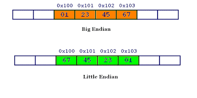

b转自：https://cuijiahua.com/blog/2018/07/trick-6.html

本文讨论字符的编码。密码学、自然语言也有编码和解码，不在讨论范围。

# 普及

## 什么是编码

**编码(encode)**是把数据从一种形式转换为另外一种形式的过程，它是一套算法，比如这里的字符 A 转换成 01000001 就是一次编码的过程，**解码(decode)**就是编码的逆过程。 

## 啥是字符集

​	字符集是一个系统支持的所有抽象字符的集合。它是各种文字和符号的总称，常见的字符集种类包括 ASCII 字符集、GBK 字符集、Unicode字符集等。不同的字符集规定了有限个字符，比如：ASCII 字符集只含有拉丁文字字母，GBK 包含了汉字，而 Unicode 字符集包含了世界上所有的文字符号。 

​	有人不禁要问，字符集与字符编码是什么关系？别急，先往下面 

## ASCII：字符集与字符编码的起源

​	世界上第一台计算机，1945年由美国宾夕法尼亚大学的两位教授-莫奇利和埃克特设计和研制出来，美国人起草了计算机的第一份字符集和编码标准，叫 ASCII（American Standard Code for Information Interchange，美国信息交换标准代码），一共规定了 128 个字符及对应的二进制转换关系，128 个字符包括了可显示的26个字母（大小写）、10个数字、标点符号以及特殊的控制符，也就是英语与西欧语言中常见的字符，这128个字符用**一个字节**来表示绰绰有余，因为一个字节可以表示256个字符，所以当前只利用了字节的7位，最高位用来当作奇偶校验。如下图所以，字符小写 a 对应 01100001，大写 A 对应 01000001。 


ASCII **字符集**是字母、数字、标点符号以及控制符（回车、换行、退格）等组成的128个字符。 

ASCII **字符编码**是将这128个字符转换为计算机可识别的二进制数据的一套规则（算法）。 

现在可以回答前面的那个问题了，通常来说，字符集同时定义了一套同名的字符编码规则，例如 ASCII 就定义了字符集以及字符编码，当然这不是绝对的，比如 Unicode 就只定义了字符集，而对应的字符编码是 UTF-8，UTF-16。 

> ASCII 由美国国家标准学会制定，1967年定案，最初是美国国家标准，后来被国际标准化组织（International Organization for Standardization, ISO）定为国际标准，称为ISO 646标准，适用于所有拉丁文字字母。 

## EASCII：扩展的ASCII

​	国际标准化组织（ISO）及国际电工委员会（IEC）联合制定的一系列8位元字符集的标准，叫 ISO 8859，全称ISO/IEC 8859，它在 ASCII 基础之上扩展而来，所以完全 ASCII，ISO 8859 字符编码方案所扩展的这128个编码中，只有0xA0~0xFF(十进制为160~255)被使用，其实 ISO 8859是一组字符集的总称，旗下共包含了15个字符集，分别是 ISO 8859-1 ~ ISO 8859-15，**ISO 8859-1** 又称之为 Latin-1，它是西欧语言，其它的分别代表 中欧、南欧、北欧等字符集。 	

## GB2312：满足国人需求的字符集

​	后来，计算机开始普及到了中国，但面临的一个问题就是字符，汉字博大精深，常用汉字有3500个，已经大大超出了 ASCII 字符集所能表示的字符范围了，即使是 EASCII 也显得杯水车薪，1981 年国家标准化管理委员会定了一套字符集叫 **GB2312**，每个汉字符号由**两个字节**组成，理论上它可以表示65536个字符，不过它只收录了7445个字符，6763个汉字和682个其他字符，同时它能够兼容 ASCII，ASCII 中定义的字符只占用一个字节的空间。 

​	GB2312 所收录的汉字已经覆盖中国大陆99.75%的使用频率，但是对一些罕见的字和繁体字还有很多少数民族使用的字符都没法处理，**于是后来就在 GB2312 的基础上创建了一种叫 GBK 的字符编码**，GBK 不仅收录了27484 个汉字，同时还收录了藏文、蒙文、维吾尔文等主要的少数民族文字。**GBK 是利用了 GB2312 中未被使用的编码空间上进行扩充，所以它能完全兼容 GB2312和 ASCII**。而 GB 18030 是现时最新的字符集，兼容 GB 2312-1980 和 GBK， 共收录汉字70244个，采用多字节编码，每个字符可以有1、2、4个字节组成，某种意义上它能容纳161 万个字符，包含繁体汉字以及日韩汉字，**单字节与ASCII兼容，双字节与GBK标准兼容**。

##  Unicode ：统一江湖的字符集

​	尽管我们有了属于自己的字符集和字符编码 GBK，可世界上还有很多国家拥有自己的语言和文字，比如日本用 JIS，台湾用 BIG5，不同国家之间交流起来就很困难，因为没有统一的编码标准，可能同一个字符，在A国家用两字字节存储，而到了B国家是3个字节，这样很容易出现编码问题，于是在 1991 年，国际标准化组织和统一码联盟组织各自开发了 **ISO/IEC 10646（USC）**和 **Unicode** 项目，这两个项目的目的都是希望用一种字符集来统一全世界所有字符，不过很快双方都意识到世界上并不需要两个不兼容的字符集。于是他们就编码问题进行了非常友好地会晤，决定彼此把工作内容合并，虽然项目还是独立存在，各自发布各自的标准，但前提是两者必须保持兼容。不过由于 Unicode 这一名字比较好记，因而它使用更为广泛，成为了事实上的统一编码标准。 

​	以上是对字符集历史的一个简要回顾，现在重点来说说Unicode，Unicode 是一个囊括了世界上所有字符的字符集，其中每一个字符都对应有唯一的**编码值（code point），注意了！它不是字符编码，仅仅是字符集而已，Unicode 字符如何进行编码，可以是 UTF-8、UTF-16、甚至用 GBK 来编码**。例如： 

```python
>>> a = u"好"
>>> a
u'\u597d'
>>> b = a.encode("utf-8")
>>> b
'\xe5\xa5\xbd'
>>>
 
>>> b = a.encode("gbk")
>>> b
'\xba\xc3'
```

​	Unicode 本身并没有规定一个字符究竟是用一个还是三个或者四个字节表示。Unicode 只规定了每个字符对应到唯一的**代码值（code point）**，代码值 从 **0000 ~ 10FFFF** 共 1114112 个值 ，真正存储的时候需要多少个字节是由具体的编码格式决定的。比如：字符 「A」用 UTF-8 的格式编码来存储就只占用1个字节，用 UTF-16 就占用2个字节，而用 UTF-32 存储就占用4个字节。 

## UTF-8：Unicode编码

> UTF（ Unicode Transformation Format）编码 和 USC（Universal Coded Character Set） 编码分别是 Unicode 、ISO/IEC 10646 编码体系里面两种编码方式，UCS 分为 UCS-2 和 UCS-4，而 UTF 常见的种类有 UTF-8、UTF-16、UTF-32。因为 Unicode 与 USC 两种字符集是相互兼容的，所以这几种编码格式也有着对应的等值关系
>
> UCS-2 使用两个定长的字节来表示一个字符，UTF-16 也是使用两个字节，不过 UTF-16 是变长的（网上很多错误的说法说 UTF-16是定长的），遇到两个字节没法表示时，会用4个字节来表示，因此 UTF-16 可以看作是在 UCS-2 的基础上扩展而来的。而 UTF-32 与 USC-4 是完全等价的，使用4个字节表示，显然，这种方式浪费的空间比较多。

​	UTF-8 的优势是：**它以单字节为单位用 1~4 个字节来表示一个字符，从首字节就可以判断一个字符的UTF-8编码有几个字节**。如果首字节以0开头，肯定是单字节编码，如果以110开头，肯定是双字节编码，如果是1110开头，肯定是三字节编码，以此类推。除了单字节外，多字节UTF-8码的后续字节均以10开头。 

1～4 字节的 UTF-8 编码看起来是这样的： 

```
0xxxxxxx
110xxxxx 10xxxxxx
1110xxxx 10xxxxxx 10xxxxxx
11110xxx 10xxxxxx 10xxxxxx 10xxxxxx
```

+ 单字节可编码的 Unicode 范围：\u0000~\u007F（0~127）

+ 双字节可编码的 Unicode 范围：\u0080~\u07FF（128~2047）

+ 三字节可编码的 Unicode 范围：\u0800~\uFFFF（2048~65535）

+ 四字节可编码的 Unicode 范围：\u10000~\u1FFFFF（65536~2097151）

   UTF-8 兼容了 ASCII，在数据传输和存储过程中节省了空间，其二是UTF-8 不需要考虑大小端问题。这两点都是 UTF-16 的劣势。不过对于中文字符，用 UTF-8 就要用3个字节，而 UTF-16 只需2个字节。而UTF-16 的优点是在计算字符串长度，执行索引操作时速度会很快。Java 内部使用 UTF-16 编码方案。而 Python3 使用 UTF-8。UTF-8 编码在互联网领域应用更加广泛 。

   ​	来看一张图，下图是Windows平台保存文件时可选择的字符编码类型，你可以指定系统以什么样的编码格式来存储文件，**ANSI 是 [ISO 8859-1](#EASCII：扩展的ASCII)的超集**，之所以在 Windows下有 Unicode 编码这样一种说法，其实是 Windows 的一种错误表示方法，或许是因为历史原因一直沿用至今，**其实它真正表示的是 UTF-16 编码**，更具体一点是 UTF-16小端，什么是大端和小端呢？ 

   


## 大端与小端

​	大小端是数据在存储器中的存放顺序，大端模式，是指数据的高字节在前，保存在内存的低地址中，与人类的读写法一致，数据的低字节在后，保存在内存的高地址中，小端与之相反，小端模式，是指数据的高字节在后，保存在内存的高地址中，而数据的低字节在前，保存在内存的低地址中例如，十六进制数值 0x1234567 的大端字节序和小端字节序的写法： 



下面的解释更加容易理解：


​	至于为什么会有大端和小端之分呢？对于 16 位或者 32 位的处理器，由于寄存器宽度大于一个字节，那么必然存在着一个如何将多个字节排放的问题，因为不同操作系统读取多字节的顺序不一样，，x86和一般的OS（如windows，FreeBSD,Linux）使用的是小端模式。但比如Mac OS是大端模式。因此就导致了大端存储模式和小端存储模式的存在，两者并没有孰优孰劣。 

### 为什么UTF-8不需要考虑大小端问题？

​	UTF-8 的编码单元是1个字节，所以就不用考虑字节序问题。而 UTF-16 是用 2个字节来编码 Unicode 字符，编码单位是两个字节，因此需要考虑字节序问题，因为2个字节哪个存高位哪个存低位需要确定。

# Python2 中的字符编码

​	现在总算把理论说完了，再来说说 Python 中的编码问题，也是每个Python开发者最关心、最经常遇到的问题，Python 的诞生时间比 Unicode 还要早几年，所以，**Python的第一个版本一直延续到Python2.7，Python 的默认编码都是 ASCII。** 

```
>>> import sys
>>> sys.getdefaultencoding()
'ascii'
```

所以在 Python 源代码，要能够正常保存中文字符就必须先指定utf8 或者 gbk 格式。 

```python
# coding=utf-8
```

或者是： 

```python
#!/usr/bin/python
# -*- coding: utf-8 -*-
```

## str 与 unicode

​	在前面我们介绍过字符，这里还有必要重复一下字符和字节的区别，字符就是一个符号，比如一个汉字、一个字母、一个数字、一个标点都可以称为一个字符，而字节就是字符就是编码之后转换而成的二进制序列，一个字节是8个比特位。例如字符 "p" 存储到硬盘是一串二进制数据 01110000，占用一个字节。字节方便存储和网络传输，而字符用于显示方便阅读。 	

​	在Python2中，字符与字节的表示很微妙，两者的界限很模糊，Python2 中把字符串分为 unicode 和 str 两种类型。本质上 str 类型是二进制字节序列， unicode 类型的字符串是字符，下面的示例代码可以看出 str 类型的 "禅" 打印出来是十六进制的 \xec\xf8 ，对应的二进制字节序列就是 '11101100 11111000'。 

```python
>>> s = '禅'
>>> s
'\xec\xf8'
>>> type(s)
<type 'str'>
```

而 unicode 类型的 u"禅" 对应的 unicode 符号是 u'\u7985'。 

```python
>>> u = u"禅"
>>> u
u'\u7985'
>>> type(u)
<type 'unicode'>
```

​	我们要把 unicode 字符保存到文件或者传输到网络就需要经过编码处理转换成二进制形式的 str 类型，于是 [python](https://cuijiahua.com/blog/tag/python/) 的字符串提供了 encode 方法，从 unicode 转换到 str，反之亦然。 


encode（python2）：

```python
>>> u = u"禅"
>>> u
u'\u7985'
>>> u.encode("utf-8")
'\xe7\xa6\x85'
```

decode（python2）：

```python
>>> s = "禅"
>>> s.decode("utf-8")
u'\u7985'
```

​	不少初学者怎么也记不住 str 与 unicode 之间的转换用 encode 还是 decode，如果你记住了 str 本质上其实是一串二进制数据，而 unicode 是字符（符号），编码（encode）就是把字符（符号）转换为 二进制数据的过程，因此 unicode 到 str 的转换要用 encode 方法，反过来就是用 decode 方法。 

> encoding always takes a Unicode string and returns a bytes sequence, and decoding always takes a bytes sequence and returns a Unicode string". 

## UnicodeEncodeError

​	UnicodeEncodeError 发生在 unicode 字符串转换成 str 字节序列的时候，来看一个例子，把一串 unicode 字符串保存到文件。 

```python
# -*- coding:utf-8 -*-
def main():
    name = u'Python之禅'
    f = open("output.txt", "w")
    f.write(name)
```

错误日志： UnicodeEncodeError: 'ascii' codec can't encode characters in position 6-7: ordinal not in range(128) 

​	为什么会出现 UnicodeEncodeError？ 

​	因为调用 write 方法时，程序会把字符经过编码转换成二进制字节序列，内部会有 unicode 到 str 的编码转换过程，程序会先判断字符串是什么类型，如果是 str，就直接写入文件，不需要编码，因为 str 类型的字符串本身就是一串二进制的字节序列了。如果字符串是 unicode 类型，那么它会先调用 encode 方法把 unicode 字符串转换成二进制形式的 str 类型，才保存到文件，而 Python2中，encode 方法默认使用 ascii 进行 encde。

​	相当于： 

```python
>>> u"Python之禅".encode("ascii")
```

​	但是，我们知道 ASCII 字符集中只包含了128个拉丁字母，不包括中文字符，因此 出现了 'ascii' codec can't encode characters 的错误。要正确地使用 encode ，就必须指定一个包含了中文字符的字符集，比如：UTF-8、GBK。 

```python
>>> u"Python之禅".encode("utf-8")
'Python\xe4\xb9\x8b\xe7\xa6\x85'

>>> u"Python之禅".encode("gbk")
'Python\xd6\xae\xec\xf8'
```

​	所以要把 unicode 字符串正确地写入文件，就应该预先把字符串进行 UTF-8 或 GBK 编码转换。  

```python
def main():
    name = u'Python之禅'
    name = name.encode('utf-8')
    with open("output.txt", "w") as f:
        f.write(name)
```

​	或者直接写str类型的字符串。 

```python
def main():
    name = 'Python之禅'
    with open("output.txt", "w") as f:
        f.write(name)
```

​	**当然，把 unicode 字符串正确地写入文件不止一种方式，但原理是一样的，这里不再介绍，把字符串写入数据库，传输到网络都是同样的原理**。 

## UnicodeDecodeError

​	UnicodeDecodeError 发生在 str 类型的字节序列解码成 unicode 类型的字符串时。 

```python
>>> a = u"禅"
>>> a
u'\u7985'
>>> b = a.encode("utf-8")
>>> b
'\xe7\xa6\x85'
>>> b.decode("gbk")
Traceback (most recent call last):
  File "<stdin>", line 1, in <module>
UnicodeDecodeError: 'gbk' codec can't decode byte 0x85 in position 2: incomplete multibyte sequence
```

​	把一个经过 UTF-8 编码后生成的字节序列 '\xe7\xa6\x85' 再用 GBK 解码转换成 unicode 字符串时，出现 UnicodeDecodeError，因为 （对于中文字符）GBK 编码只占用两个字节，而 UTF-8 占用3个字节，用 GBK 转换时，还多出一个字节，因此它没法解析。避免 UnicodeDecodeError 的关键是保持编码和解码时用的编码类型一致。 

​	这也回答了文章开头说的字符 "禅"，保存到文件中有可能占3个字节，有可能占2个字节，具体处决于 encode 的时候指定的编码格式是什么。

​	再举一个 UnicodeDecodeError 的例子：

```python
>>> x = u"Python"
>>> y = "之禅"
>>> x + y
Traceback (most recent call last):
  File "<stdin>", line 1, in <module>
UnicodeDecodeError: 'ascii' codec can't decode byte 0xe4 in position 0: ordinal not in range(128)
```

​	str 与 unicode 字符串 执行 + 操作时，Python 会把 str 类型的字节序列隐式地转换成（解码）成 和 x 一样的 unicode 类型，但Python是使用默认的 ascii 编码来转换的，而 ASCII字符集中不包含有中文，所以报错了。相当于： 

```python
>>> y.decode('ascii')
Traceback (most recent call last):
  File "<stdin>", line 1, in <module>
UnicodeDecodeError: 'ascii' codec can't decode byte 0xe4 in position 0: ordinal not in range(128)
```

​	正确地方式应该是找到一种包含有中文字符的字符编码，比如 UTF-8或者 GBK 显示地把 y 进行**解码**转换成 unicode 类型。 

# Python3中的字符串与字节序列

​	Python3对字符串和字符编码进行了很彻底的重构，完全不兼容Python2，同时也很多想迁移到Python3的项目带来了很大的麻烦，Python3 把系统默认编码设置为 UTF-8，字符和二进制字节序列区分得更清晰，分别用 str 和 bytes 表示。**文本字符全部用 str 类型表示**，str 能表示 Unicode 字符集中所有字符，而**二进制字节数据用一种全新的数据类型，用 bytes 来表示**，尽管Python2中也有bytes类型，但那只不过是str的一个别名。 

### str

```python
>>> a = "a"
>>> a
'a'
>>> type(a)
<class 'str'>

>>> b = "禅"
>>> b
'禅'
>>> type(b)
<class 'str'>
```

### bytes

​	Python3 中，在字符引号前加‘b’，明确表示这是一个 bytes 类型的对象，实际上它就是一组二进制字节序列组成的数据，**bytes 类型可以是 ASCII范围内的字符和其它十六进制形式的字符数据，但不能用中文等非ASCII字符表示**。 

```python
>>> c = b'a'
>>> c
b'a'
>>> type(c)
<class 'bytes'>

>>> d = b'\xe7\xa6\x85'
>>> d
b'\xe7\xa6\x85'
>>> type(d)
<class 'bytes'>
>>>

>>> e = b'禅'
  File "<stdin>", line 1
SyntaxError: bytes can only contain ASCII literal characters.
```

​	bytes 类型提供的操作和 str 一样，支持分片、索引、基本数值运算等操作。但是 str 与 bytes 类型的数据不能执行 `+` 操作，尽管在python2中是可行的。 

```python
>>> b"a"+b"c"
b'ac'
>>> b"a"*2
b'aa'
>>> b"abcdef\xd6"[1:]
b'bcdef\xd6'
>>> b"abcdef\xd6"[-1]
214

>>> b"a" + "b"
Traceback (most recent call last):
  File "<stdin>", line 1, in <module>
TypeError: can't concat bytes to str
```

python2 与 python3 字节与字符对比： 

