#  离散随机变量

## 0-1 分布

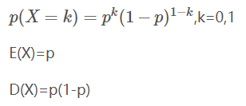

## 二项分布 X~B(n,p)

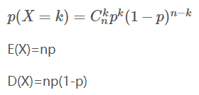

## 泊松分布 X~P(λ)

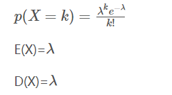

# 连续型随机变量

## 均匀分布 X~U(a,b)

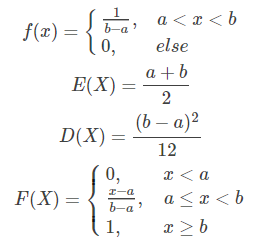

## 指数分布 X~Exp(λ)

$f(x)=λe^{-λx}$

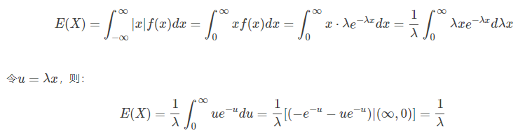

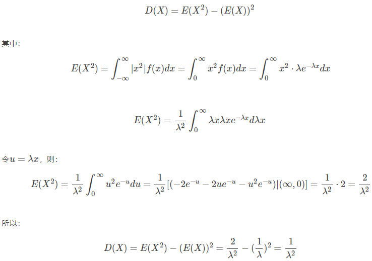

## 正态/高斯分布 X~N(μ,σ2)

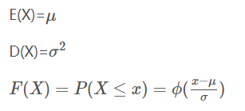

标准正太分布：N(0,1)

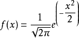

## χ2分布 χ2∼χ2(n)

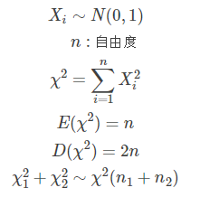

## t分布 t~t(n)

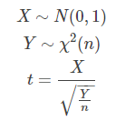

## F分布 F~F(n1,n2)

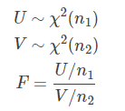

## 分布的转化

|          | N(0，1) | χ2(n) | t(n) | F(n1,n2) |
| -------- | ------- | ----- | ---- | -------- |
| N(0，1)  | χ2      | T     |      |          |
| χ2(n)    |         | F     |      |          |
| t(n)     |         |       |      |          |
| F(n1,n2) |         |       |      |          |

