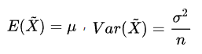
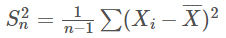

## 一些概念

总体 总体分布 个体 随机变量X  X的分布律

样本：从总体中取得一部分个体

样本容量，

容量为n的随样本（X1，X2，...，Xn），是n维随机变量。

样本的观察值（样本值）

有时样本和样本值统称为样本

由于多种原因，实际应用中，我们以样本分布来刻画总体分布。

刻画总体分布的三种形式：

+ 频数分布与频率(频数除以样本容量)分布，不适合连续性随机变量
+ 直方图
+ 经验分布函数，无论总体是离散型还是连续型。

经验分布函数，即样本分布函数。

对于样本（X1，X2，...，Xn）的不同观察值，的得到不同的经验分布函数F_n(x)。所以，经验分布函数不仅与样本容量n有关，也与的到的观察值有关。

假设样本容量固定，那么对于每个固定的x值，F_n(x) 又是样本（X1，X2，...，Xn）的函数，是一个随机变量。

当n—>无穷大，F_n(x)依概率收敛到 F(x) = P{ X≤x} 。

因此，当n很大时，可以用经验分布函数作为整体分布的估计。

## 统计量

统计量是随机变量（样本）的函数，也是一个随机变量。 

构造统计量的目的是为了估计未知的参数，最常见的是总体分布的一些参数。

+ 样本均值

  

+ 样本方差和样本标准差

  

  

+ 样本矩

  + 样本k阶原点矩
  + 样本k阶中心矩

+ 顺序统计量

+ 样本中位数

+ 样本p分位数

+ 样本极值

+ 样本极差

## 抽样分布

统计量的分布

样本是随机变量，统计量是样本的已知函数，也是随机变量，因而有其概率分布。

1. 卡方分布
2. t分布
3. F分布

## 参数估计

这里的参数指的是 总体分布中的未知参数。某些实际问题不知道总体X的分布，其数字特征：如均值、方差，对他们做出估计，把他们也叫做参数。

1. **点估计**

   构造适当的统计量，用观察值θ bar作为参数的估计值。

   + 矩估计法

     n个未知参数，求出n个求原点矩（不妨设总体X前n阶矩都存在），要求他们都是位置参数的函数。

     之后，用样本矩代替总体矩，解方程可得估计量θ bar

   + 极大似然估计法

     思想：**在一次试验中发生的事件为大概率事件。**

     第一步：似然函数（联合分布律或联合概率密度），一般转化为对数似然函数。

     第二步：选取使似然函数取得**最大值**的参数θ bar作为未知参数的估计值，即参数θ的**极大似然估计值**。

     如何求解：构造参数方程组：似然方程或对数似然方程，对似然函数关于每个参数求导，令为0。然后求解。

2. 评估量的评选标准

   + 无偏性
   + 有效性
   + 相合性

3. **区间估计**

   实际中，我们需要由样本值给出未知参数θ的一个估计范围，并且知道这个范围包含参数θ的可信程度。

   这种范围往往表现为一个区间，即置信区间，这种形式的估计叫区间估计。

   

## 假设检验

“小概率事件在少量实验中是几乎不可能出现的” 