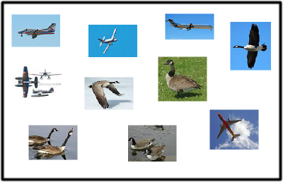
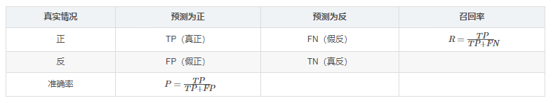
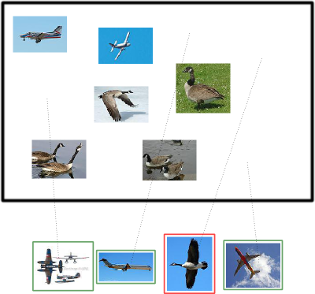
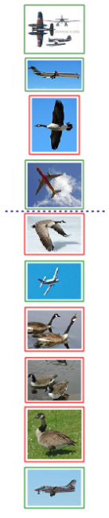
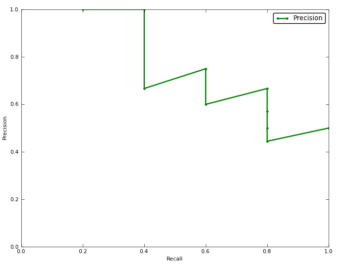
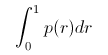
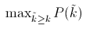
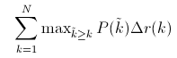
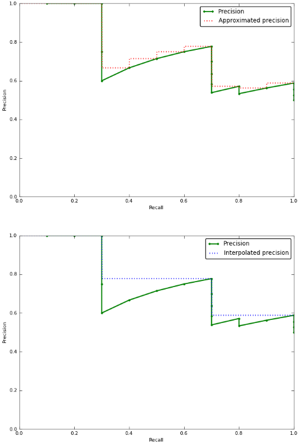
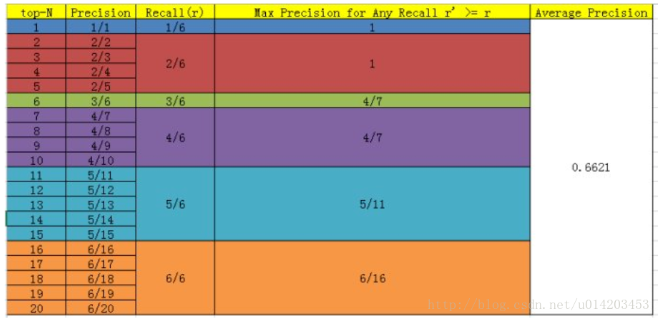

# AP

问题：

P-R曲线是怎么绘制的？为什么是那个样子？

目标检测中，比如VOC数据集，是怎么计算每一类的AP？

翻译自：[Tag: average precision](https://sanchom.wordpress.com/tag/average-precision/)

一只bird，一架plane，……，它取决与分类器的 threshold 。

信息检索系统  information retrieval system （例如搜索引擎）的评估通常侧重于两件事：、

> 1. How relevant are the retrieved results? (precision) 
> 2. Did the system retrieve many of the truly relevant documents? (recall) 

1. 检索结果的相关性（相关性：即结果是否与原意相关）如何？（precision）
2. 系统是否真正检索到了相关文件？（recall）

## Geese and airplanes

假设你有一张包含飞机和鹅的图像集。

你想检索所有的飞机图像，而不检测鹅。

给定系统从这个集合中检索到的一组图像，我们可以定义四个准确度计数：

**True positives**：系统正确检索到的飞机图像。

**True negative**：系统正确地没有检索到的鹅图像。

**False positives**：系统错误地把鹅图像检索出来，也就是说认为他们是飞机。

**False negatives**：系统没有检索出来的飞机图像，也就是说认为他们是鹅。

也就是下表：

检索出来的都叫做：positices，没有检索出来的都为：negatives。

可以看到：在此示例检索中（下边的四个图像，被认为是飞机的）：有 3 个 true positives 和 1 个 false positive。

那么有多少个 false negatives，有多少 true negatives？（上边的未检索出来的，被认为是鹅的）

数一数，有两个飞机，也就是 2 个false negatives，有四个鹅，也就是 4 个true negatives。

> Precision is the percentage true positives in the retrieved results.  
>
> Recall is the percentage of the airplanes that the system retrieves. 
>
> In our example above, with 3 true positives, 1 false positive, 4 true negatives, and 2 false negatives, precision = 0.75, and recall = 0.6.
>
> 75% of the retrieved results were airplanes, and 60% of the airplanes were retrieved.

## Adjusting the threshold

如果我们对这种表现不满意怎么办？我们可以要求系统返回更多示例。这样做可以放宽我们希望我们的系统作为飞机考虑的阈值。我们也可以要求我们的系统更严格，并返回更少的示例。在我们的示例中，系统检索了四个示例。这对应于特定阈值（下面用蓝线表示）。系统检索到的示例看起来比那个阈值更像飞机。

上图假设是我们的飞机检索系统给出的一个顺序，更像飞机的在列表的顶部，蓝线是阈值。

我们可以调整阈值或上或下来得到不同的检索集合。在每一个阈值的位置，我们都能得到不同的precision和recall值。特别的，加入我们仅仅检索顶部的例子，precision 是100%，recall是20%。假如我们检索两个例子，准确率是100%，recall 升到40%。下面的表格给出了准确率和召回率，对于所有可能的阈值。

| Retrieval cutoff | Precision | Recall |
| ---------------- | --------- | ------ |
| Top 1 image      | 100%      | 20%    |
| Top 2 images     | 100%      | 40%    |
| Top 3 images     | 66%       | 40%    |
| Top 4 images     | 75%       | 60%    |
| Top 5 images     | 60%       | 60%    |
| Top 6 images     | 66%       | 80%    |
| Top 7 images     | 57%       | 80%    |
| Top 8 images     | 50%       | 80%    |
| Top 9 images     | 44%       | 80%    |
| Top 10 images    | 50%       | 100%   |

## Precision-recall curves

一个描述分类器性能的好方法是去观察准确率和召回率是怎么随着阈值的调整而改变的。好的分类器擅长将真实的飞机图像排列在列表的上方，并且能够在错误地检索出任意的鹅之前检索出许多飞机图像：它的准确率将会随着召回率的增长一直维持在高水平。差的分类器为了得到高召回率会对准确率有大的打击。通常， a publication will present a precision-recall curve to show how this tradeoff looks for their classifier. This is a plot of precision p as a function of recall r ：

上图是我们例子中飞机分类器的P-R曲线图，它可以实现40%的召回率并且没有牺牲任何的准确率，但是为了得到100%召回率，准确率会下降到50%。

## Average precision

用一个单独的量来刻画分类器的性能是有用的，而不是只比较曲线。一般的度量准则是average precision。

### Average precision

严格的，AP是对于0-1之间所有召回率对应的准确率的平均。

这等于曲线下的面积。事实上，这个积分(integral)近似于对每一个可能阈值下（准确率×召回率的改变）的总和：

N 代表集合中图片总数量，P(k) 是在top-k情况下的准确率，*delta r(k)* 是 召回率的改变在cutoff k-1和cutoff k之间。

在我们的例子中，这就是(1 * 0.2) + (1 * 0.2) + (0.66 * 0) + (0.75 * 0.2) + (0.6 * 0) + (0.66 * 0.2) + (0.57 * 0) + (0.5 * 0) + (0.44 * 0) + (0.5 * 0.2) = 0.782。

注意到召回率没有改变的时候，对结果没有贡献（在P-R图中是垂直的那部分，竖直向下）。这是有意义的，因为当我们计算曲线下的面积时，那部分是没有增加任何面积的。

### Interpolated average precision

对于，cutoff k 我们不在使用准确率P(k)，interpolated average precision 使用：

换句话说，代替在cutoff k 观察到真正的准确率，interpolated  AP 使用在之后的召回率中最大的准确率：

可视化，近似平均准确率（approximated average precision）与以内插替换的平均准确率（interpolated average precision），为了展示更加有趣的绘制，这一次没有使用之前的例子。

可以看到，近似准确率更加接近真是的AP，而interpolated AP会得到更大的AP值。

进一步的，有许多计算interpolated AP的变种：

+ 从0到1固定11点采样，{0,  0.1,  0.2, …,  0.9,  1.0} ，AP即11个准确率的平均。
+ Others sample at every *k* where the recall changes

## Confusion

一些重要的publications 使用interpolated average percision 作为度量，但是仍然叫它 average precision。例如，the PASCAL Visual Objects Challenge （PASCAL VOC）自2007就是用这个度量标准。对于比赛，每个人都是用这个度量标准，那自然没什么问题。不过，当我们使用interpolated average percision度量成绩，而前人的工作使用非插值法，这将会导致不正确的方法性能的提高。

注意：

当然PASCAL VOC CHALLENGE自2010年后就换了另一种计算方法。新的计算方法假设这N个样本中有M个正例，那么我们会得到M个recall值（1/M, 2/M, …, M/M）,对于每个recall值r，我们可以计算出对应（r’ > r）的最大precision，然后对这M个precision值取平均即得到最后的AP值。计算方法如下：

这不是**算出对应（r’ > r）的最大precision吧，**而是在每一个召回率下，最大的准确率吧。

其他参考：

[目标检测数据集PASCAL VOC简介](https://arleyzhang.github.io/articles/1dc20586/)

[性能指标（模型评估）mAP](https://blog.csdn.net/u014203453/article/details/77598997)

