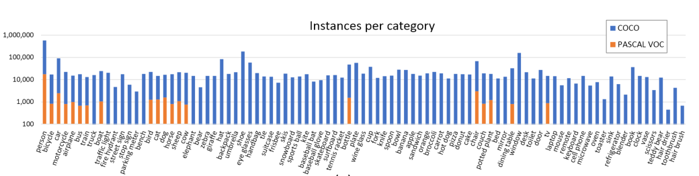
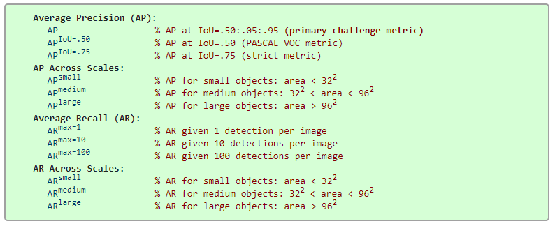

## 数据划分

> The 2014 release contains 82,783 training, 40,504 validation, and 40,775 testing images (approximately 1/2 train, 1/4 val, and /4 test). There are nearly 270k segmented people and a total of 886k segmented object instances in the 2014 train+val data alone. The cumulative 2015 release will contain a total of 165,482 train, 81,208 val, and 81,434 test images. 

与PASCAL COCO数据集相比，COCO中的图片包含了自然图片以及生活中常见的目标图片，背景比较复杂，目标数量比较多，目标尺寸更小，因此COCO数据集上的任务更难，对于检测任务来说，现在衡量一个模型好坏的标准更加倾向于使用COCO数据集上的检测结果。 

MSCOCO总共包含80个类别，每个类别的图片数量如下： 



```json
{
    person  # 1
    vehicle 交通工具 #8
        {bicycle
         car
         motorcycle
         airplane
         bus
         train
         truck
         boat}
    outdoor  #5
        {traffic light
        fire hydrant
        stop sign
        parking meter
        bench}
    animal  #10
        {bird
        cat
        dog
        horse
        sheep
        cow
        elephant
        bear
        zebra
        giraffe}
    accessory 饰品 #5
        {backpack 背包
        umbrella 雨伞
        handbag 手提包
        tie 领带
        suitcase 手提箱
        }
    sports  #10
        {frisbee
        skis
        snowboard
        sports ball
        kite
        baseball bat
        baseball glove
        skateboard
        surfboard
        tennis racket
        }
    kitchen  #7
        {bottle
        wine glass
        cup
        fork
        knife
        spoon
        bowl
        }
    food  #10
        {banana
        apple
        sandwich
        orange
        broccoli
        carrot
        hot dog
        pizza
        donut
        cake
        }
    furniture 家具 #6
        {chair
        couch
        potted plant
        bed
        dining table
        toilet
        }
    electronic 电子产品 #6
        {tv
        laptop
        mouse
        remote
        keyboard
        cell phone
        }
    appliance 家用电器 #5
        {microwave
        oven
        toaster
        sink
        refrigerator
        }
    indoor  #7
        {book
        clock
        vase
        scissors
        teddy bear
        hair drier
        toothbrush
        }
}
```


## 评估标准

 12 metrics :



+ PASCAL 中在测试mAP时，是在IOU=0.5时测的

+ COCO中的AP 是指在 10个IOU层面 以及 80个类别层面 的平均值

+ COCO的主要评价指标是AP，指 IOU从0.5到0.95 每变化 0.05 就测试一次 AP，然后求这10次测量结果的平均值作为最终的 AP

  AP@0.5 跟PASCAL VOC中的mAP是相同的含义

  AP@0.75 跟PASCAL VOC中的mAP也相同，只是IOU阈值提高到了0.75，显然这个层面更严格，精度也会更低

  IOU越高，AP就越低，所以最终的平均之后的AP要比 AP@0.5 小很多，这也就是为什么COCO的AP 超过 50%的只有寥寥几个而已，因为超过50%太难了。而且由于COCO数据集本身数据的复杂性，所以目前的 AP@0.5 最高也只有 73% 。

+ COCO数据集还针对 三种不同大小（small，medium，large） 的图片提出了测量标准，COCO中包含大约 41% 的小目标 (area<32×32area<32×32), 34% 的中等目标 (32×32<area<96×9632×32<area<96×96), 和 24% 的大目标 (area>96×96area>96×96). 小目标的AP是很难提升的。 

+ AR的度量标准：是每张图片给出多少个预测框？？？[1，10，100] 三种标准。计算与AP类似。