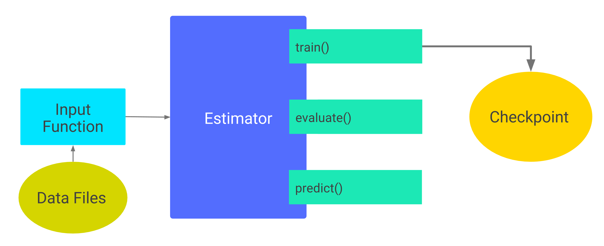

# 检查点

本文档介绍了如何保存和恢复通过 Estimator 构建的 TensorFlow 模型。TensorFlow 提供了两种模型格式：

+ 检查点：这种格式依赖于创建模型的代码。
+ SavedModel：这种格式与创建模型的代码无关。

本文档重点介绍检查点。要详细了解 `SavedModel`，请参阅[保存和恢复](https://tensorflow.google.cn/guide/saved_model)指南。

第二种都听都没听说过。。。

本文档中的大部分代码段都是在 `premade_estimator.py` 的基础上加以细微修改。

## 保存模型

Estimator 自动将以下内容写入磁盘：

+ **检查点**：训练期间所创建的模型版本。
+ **事件文件**：其中包含 TensorBoard 用于创建可视化图表的信息。

要指定 Estimator 存储其信息的顶级目录，请为任何 `Estimator` 的构造函数的可选 `model_dir`参数分配一个值。以 `DNNClassifier` 为例，以下代码将 `model_dir` 参数设置为 `models/iris` 目录： 

```python
classifier = tf.estimator.DNNClassifier(
    feature_columns=my_feature_columns,
    hidden_units=[10, 10],
    n_classes=3,
    model_dir='models/iris')
```

如下图所示，第一次调用 `train` 会将检查点和其他文件添加到 `model_dir` 目录中： 



 Estimator 在第 1 步（训练开始）和第 200 步（训练结束）创建了检查点 。

**那如何每隔几步保存一次检查点呢？？** 看[检查点频率](#检查点频率)

### 默认检查点目录

如果您未在 Estimator 的构造函数中指定 `model_dir`，则 Estimator 会将检查点文件写入由 Python 的 [tempfile.mkdtemp](https://docs.python.org/3/library/tempfile.html#tempfile.mkdtemp) 函数选择的临时目录中。

```python
classifier = tf.estimator.DNNClassifier(
    feature_columns=my_feature_columns,
    hidden_units=[10, 10],
    n_classes=3)

print(classifier.model_dir)
```

`tempfile.mkdtemp` 函数会根据您的操作系统选择安全的临时目录。例如，Mac 操作系统上的典型临时目录可能如下所示： 

```
/var/folders/0s/5q9kfzfj3gx2knj0vj8p68yc00dhcr/T/tmpYm1Rwa
```

### 检查点频率

默认情况下，Estimator 按照以下时间安排将[检查点](https://developers.google.cn/machine-learning/glossary/#checkpoint)保存到 `model_dir` 中：

+ 每 10 分钟（600 秒）写入一个检查点。
+ 在 `train` 方法开始（第一次迭代）和完成（最后一次迭代）时写入一个检查点。
+ 只在目录中保留 5 个最近写入的检查点。

您可以通过执行下列步骤来更改默认时间安排：

1. 创建一个 [`RunConfig`](https://tensorflow.google.cn/api_docs/python/tf/estimator/RunConfig) 对象来定义所需的时间安排。
2. 在实例化 Estimator 时，将该 `RunConfig` 对象传递给 Estimator 的 `config` 参数。

例如，每 20 分钟保存一次并保留 10 个最近写入的检查点： 

```python
my_checkpointing_config = tf.estimator.RunConfig(
    save_checkpoints_secs = 20*60,  # Save checkpoints every 20 minutes.
    keep_checkpoint_max = 10,       # Retain the 10 most recent checkpoints.
)

classifier = tf.estimator.DNNClassifier(
    feature_columns=my_feature_columns,
    hidden_units=[10, 10],
    n_classes=3,
    model_dir='models/iris',
    config=my_checkpointing_config)
```

## 恢复模型

第一次调用 Estimator 的 `train` 方法时，TensorFlow 会将一个检查点保存到 `model_dir` 中。随后每次调用 Estimator 的 `train`、`evaluate` 或 `predict` 方法时，都会发生下列情况：

1. Estimator 通过运行 `model_fn()` 构建模型图。（要详细了解 `model_fn()`，请参阅[创建自定义 Estimator](https://tensorflow.google.cn/guide/custom_estimators)。）
2. Estimator 根据最近写入的检查点中存储的数据来初始化新模型的权重。

换言之，如下图所示，一旦存在检查点，TensorFlow 就会在您每次调用 `train()`、`evaluate()`  或  `predict()`  时重建模型。 对 train()、evaluate() 或 predict() 的后续调用 ：


### 避免不当恢复

通过检查点恢复模型的状态这一操作仅在模型和检查点兼容时可行。例如，假设您训练了一个 `DNNClassifier` Estimator，它包含 2 个隐藏层且每层都有 10 个节点： 

在训练之后（因此已在 `models/iris` 中创建检查点），假设您将每个隐藏层中的神经元数量从 10 更改为 20，然后尝试重新训练模型： 

由于检查点中的状态与 `classifier2` 中描述的模型不兼容，因此重新训练失败并出现以下错误： 

```
...
InvalidArgumentError (see above for traceback): tensor_name =
dnn/hiddenlayer_1/bias/t_0/Adagrad; shape in shape_and_slice spec [10]
does not match the shape stored in checkpoint: [20]
```

要运行实验（训练并比较略微不同的模型版本），请保存一份创建每个 `model_dir` 所需的代码的副本，同时可能需要为每个版本创建一个单独的 git 分支。这种区分将有助于保证检查点的可恢复性。 