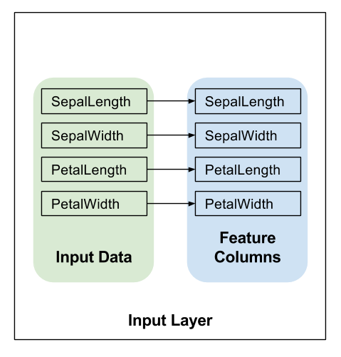
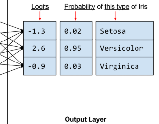

# 创建自定义 Estimator

介绍了如何创建自定义 Estimator 来模拟预创建的 Estimator `DNNClassifier` 在解决鸢尾花问题时的行为。要详细了解鸢尾花问题，请参阅预创建的 [Estimator](premade_estimator.md ) 这一章。

如果您时间并不充足，欢迎对比 [`custom_estimator.py`](https://github.com/tensorflow/models/blob/master/samples/core/get_started/custom_estimator.py) 与 [`premade_estimator.py`](https://github.com/tensorflow/models/blob/master/samples/core/get_started/premade_estimator.py)（位于同一个目录中）。 

如下图所示，预创建的 Estimator 是 [`tf.estimator.Estimator`](https://tensorflow.google.cn/api_docs/python/tf/estimator/Estimator) 基类的子类，而自定义 Estimator 是 tf.estimator.Estimator 的实例： 


预创建的 Estimator 已完全成形。**不过有时，您需要更好地控制 Estimator 的行为**。这时，自定义 Estimator 就派上用场了。您可以创建自定义 Estimator 来完成几乎任何操作。如果您需要以某种不寻常的方式连接隐藏层，则可以编写自定义 Estimator。如果您需要为模型计算独特的[指标](https://developers.google.cn/machine-learning/glossary/#metric)，也可以编写自定义 Estimator。基本而言，如果您需要一个针对具体问题进行了优化的 Estimator，就可以编写自定义 Estimator。 

模型函数（即 `model_fn`）会实现机器学习算法。采用预创建的 Estimator 和自定义 Estimator 的唯一区别是：

+ 如果采用预创建的 Estimator，则有人已为您编写了模型函数。
+ 如果采用自定义 Estimator，**则您必须自行编写模型函数**。


与输入函数一样，**所有模型函数都必须接受一组标准输入参数并返回一组标准输出值**。正如输入函数可以利用 Dataset API 一样，模型函数可以利用 Layers API 和 Metrics API。 

## 1 输入函数

与预创建时候的一致

```python
def train_input_fn(features, labels, batch_size):
    """An input function for training"""
    # Convert the inputs to a Dataset.
    dataset = tf.data.Dataset.from_tensor_slices((dict(features), labels))

    # Shuffle, repeat, and batch the examples.
    dataset = dataset.shuffle(1000).repeat().batch(batch_size)

    # Return the read end of the pipeline.
    return dataset.make_one_shot_iterator().get_next()
```

这最后返回的是一个batch了？？？

此输入函数会构建可以生成批次 `(features, labels)` 对的输入管道，其中 `features` 是字典特征。 

## 2 特征列

与预创建的一样，以下代码为每个输入特征创建一个简单的 `numeric_column`，表示**应该将输入特征的值直接用作模型的输入**： 

```python
# Feature columns describe how to use the input.
my_feature_columns = []
for key in train_x.keys():
    my_feature_columns.append(tf.feature_column.numeric_column(key=key))
```

## 3 编写函数模型

我们要使用的模型函数具有以下调用签名： 

```python
def my_model_fn(
   features, # This is batch_features from input_fn
   labels,   # This is batch_labels from input_fn
   mode,     # An instance of tf.estimator.ModeKeys
   params):  # Additional configuration
```

前两个参数是从输入函数中返回的特征和标签批次；也就是说，`features` 和 `labels` 是模型将使用的数据的句柄。`mode` 参数表示调用程序是请求训练、预测还是评估。 


调用程序可以将 `params` 传递给 Estimator 的构造函数。传递给构造函数的所有 `params` 转而又传递给 `model_fn`。在 `custom_estimator.py`中，以下行将创建 Estimator 并设置参数来配置模型。此配置步骤与我们配置 `tf.estimator.DNNClassifier`(在预创建的 Estimator中)的方式相似：

`params`——> Estimator构造函数——>`model_fn`

```python
classifier = tf.estimator.Estimator(
    model_fn=my_model_fn,
    params={
        'feature_columns': my_feature_columns,
        'hidden_units': [10, 10],
        'n_classes': 3,
    })
```

要实现一般的模型函数，您必须执行下列操作：

+ 定义模型。
+ 分别为三种不同模式指定其他计算：
  + 预测（就要有有.....有）
  + 评估（就要有准确率的计算）
  + 训练（就要有损失函数等计算）

```python
def my_model(features, labels, mode, params):
    """DNN with three hidden layers and learning_rate=0.1."""
    # Create three fully connected layers.
    # 一个输入层，两个隐藏层，由'hidden_units'参数控制
    net = tf.feature_column.input_layer(features, params['feature_columns'])
    for units in params['hidden_units']:
        net = tf.layers.dense(net, units=units, activation=tf.nn.relu)

    # Compute logits (1 per class).
    # 输出层
    logits = tf.layers.dense(net, params['n_classes'], activation=None)

    # Compute predictions.
    predicted_classes = tf.argmax(logits, 1)
    if mode == tf.estimator.ModeKeys.PREDICT:
        predictions = {
            'class_ids': predicted_classes[:, tf.newaxis],
            'probabilities': tf.nn.softmax(logits),
            'logits': logits,
        }
        return tf.estimator.EstimatorSpec(mode, predictions=predictions)

    # Compute loss.
    loss = tf.losses.sparse_softmax_cross_entropy(labels=labels, logits=logits)

    # Compute evaluation metrics.
    accuracy = tf.metrics.accuracy(labels=labels,
                                   predictions=predicted_classes,
                                   name='acc_op')
    metrics = {'accuracy': accuracy}
    tf.summary.scalar('accuracy', accuracy[1])

    if mode == tf.estimator.ModeKeys.EVAL:
        return tf.estimator.EstimatorSpec(
            mode, loss=loss, eval_metric_ops=metrics)

    # Create training op.
    assert mode == tf.estimator.ModeKeys.TRAIN

    optimizer = tf.train.AdagradOptimizer(learning_rate=0.1)
    train_op = optimizer.minimize(loss, global_step=tf.train.get_global_step())
    return tf.estimator.EstimatorSpec(mode, loss=loss, train_op=train_op)
```

在 `model_fn` 的第一行调用 [`tf.feature_column.input_layer`](https://tensorflow.google.cn/api_docs/python/tf/feature_column/input_layer)，以将特征字典和 `feature_columns`转换为模型的输入。其会应用特征列定义的转换，从而创建模型的输入层：



两个隐藏层。一个输出层，之后，[`tf.nn.softmax`](https://tensorflow.google.cn/api_docs/python/tf/nn/softmax) 函数会将这些对数转换为概率。 

## 4 实现训练、评估和预测

创建模型函数的最后一步是编写实现预测、评估和训练的分支代码。 

应该记得，模型函数的签名如下所示： 

```python
def my_model_fn(
   features, # This is batch_features from input_fn
   labels,   # This is batch_labels from input_fn
   mode,     # An instance of tf.estimator.ModeKeys, see below
   params):  # Additional configuration
```

重点关注第三个参数 mode。如下表所示，当有人调用 `train`、`evaluate` 或 `predict` 时，Estimator 框架会调用模型函数并将 mode 参数设置为如下所示的值： 

| Estimator 方法                                               | Estimator 模式                                               |
| ------------------------------------------------------------ | ------------------------------------------------------------ |
| [`train()`](https://tensorflow.google.cn/api_docs/python/tf/estimator/Estimator#train) | [`ModeKeys.TRAIN`](https://tensorflow.google.cn/api_docs/python/tf/estimator/ModeKeys#TRAIN) |
| [`evaluate()`](https://tensorflow.google.cn/api_docs/python/tf/estimator/Estimator#evaluate) | [`ModeKeys.EVAL`](https://tensorflow.google.cn/api_docs/python/tf/estimator/ModeKeys#EVAL) |
| [`predict()`](https://tensorflow.google.cn/api_docs/python/tf/estimator/Estimator#predict) | [`ModeKeys.PREDICT`](https://tensorflow.google.cn/api_docs/python/tf/estimator/ModeKeys#PREDICT) |

例如，假设您实例化自定义 Estimator 来生成名为 `classifier` 的对象。然后，您做出以下调用： 

```python
classifier = tf.estimator.Estimator(...)
classifier.train(input_fn=lambda: my_input_fn(FILE_TRAIN, True, 500))
```

然后，Estimator 框架会调用模型函数并将 mode 设为 `ModeKeys.TRAIN`。

模型函数必须提供代码来处理全部三个 mode 值。对于每个 mode 值，您的代码都必须返回  [`tf.estimator.EstimatorSpec`](https://tensorflow.google.cn/api_docs/python/tf/estimator/EstimatorSpec)  的一个实例，其中包含调用程序所需的信息。

我们来详细了解各个 mode。 

### 预测

如果调用 Estimator 的 `predict` 方法，则 `model_fn` 会收到 `mode = ModeKeys.PREDICT`。在这种情况下，模型函数必须返回一个包含预测的 [`tf.estimator.EstimatorSpec`](https://tensorflow.google.cn/api_docs/python/tf/estimator/EstimatorSpec)。 

**该模型必须经过训练才能进行预测**。经过训练的模型存储在磁盘上，位于您实例化 Estimator 时建立的 `model_dir` 目录中。 

```python
# Compute predictions.
predicted_classes = tf.argmax(logits, 1)
if mode == tf.estimator.ModeKeys.PREDICT:
    predictions = {
        'class_ids': predicted_classes[:, tf.newaxis],
        'probabilities': tf.nn.softmax(logits),
        'logits': logits,
    }
    return tf.estimator.EstimatorSpec(mode, predictions=predictions)
```




预测字典中包含模型在预测模式下运行时返回的所有内容。 

`predictions` 存储的是下列三个键值对：

+ `class_ids` 存储的是类别 ID（0、1 或 2），表示模型对此样本最有可能归属的品种做出的预测。
+ `probabilities` 存储的是三个概率（在本例中，分别是 0.02、0.95 和 0.03）
+ `logit` 存储的是原始对数值（在本例中，分别是 -1.3、2.6 和 -0.9）

我们通过 `predictions` 参数（属于 [`tf.estimator.EstimatorSpec`](https://tensorflow.google.cn/api_docs/python/tf/estimator/EstimatorSpec)）将该字典返回到调用程序。Estimator 的 `predict`方法会生成这些字典。 

### 计算损失

对于训练和评估，我们都需要计算模型的损失。这是要进行优化的目标。

对于分类损失，可以使用 [`tf.losses.sparse_softmax_cross_entropy`](https://tensorflow.google.cn/api_docs/python/tf/losses/sparse_softmax_cross_entropy) ，对于其他任务检测啊，需要自己编码损失函数。

### 评估

如果调用 Estimator 的 evaluate 方法，则 `model_fn` 会收到 `mode = ModeKeys.EVAL`。在这种情况下，模型函数必须返回一个包含模型损失和一个或多个指标（可选）的 `tf.estimator.EstimatorSpec` 。

```python
# Compute loss.
loss = tf.losses.sparse_softmax_cross_entropy(labels=labels, logits=logits)

# Compute evaluation metrics.
accuracy = tf.metrics.accuracy(labels=labels,
                               predictions=predicted_classes,
                               name='acc_op')
# 如果我们计算了其他指标，则将这些指标作为附加键值对添加到同一字典中。
metrics = {'accuracy': accuracy}
# tf.summary.scalar 会在 TRAIN 和 EVAL 模式下向 TensorBoard 提供准确率.
tf.summary.scalar('accuracy', accuracy[1])

if mode == tf.estimator.ModeKeys.EVAL:
    # 我们将在 eval_metric_ops 参数传递该metrics字典
    return tf.estimator.EstimatorSpec(
        mode, loss=loss, eval_metric_ops=metrics)
```

针对评估返回的 [`EstimatorSpec`](https://tensorflow.google.cn/api_docs/python/tf/estimator/EstimatorSpec) 通常包含以下信息：

+ `loss`：这是模型的损失
+ `eval_metric_ops`：这是可选的指标字典。

### 训练

如果调用 Estimator 的 `train` 方法，则会调用 `model_fn` 并收到 `mode = ModeKeys.TRAIN`。在这种情况下，模型函数必须返回一个包含损失和训练操作的 `EstimatorSpec`。 

训练就不仅仅需要损失，还需要优化器哦。[`tf.train`](https://tensorflow.google.cn/api_docs/python/tf/train) 文件包提供很多其他优化器，您可以随意尝试它们。 

`minimize` 方法还具有 `global_step` 参数。TensorFlow 使用此参数来计算已经处理过的训练步数（以了解何时结束训练）。此外，`global_step` 对于 TensorBoard 图能否正常运行至关重要。只需调用  [`tf.train.get_global_step`](https://tensorflow.google.cn/api_docs/python/tf/train/get_global_step)   并将结果传递给 `minimize` 的 `global_step` 参数即可。 

```python
train_op = optimizer.minimize(loss, global_step=tf.train.get_global_step())
```

针对训练返回的 [`EstimatorSpec`](https://tensorflow.google.cn/api_docs/python/tf/estimator/EstimatorSpec) 必须设置了下列字段：

+ `loss`：包含损失函数的值。
+ `train_op`：执行训练步。

```python
return tf.estimator.EstimatorSpec(mode, loss=loss, train_op=train_op)
```

## 5 实例化自定义Estimator

通过 Estimator 基类实例化自定义 Estimator，如下所示： 

```python
    # Build 2 hidden layer DNN with 10, 10 units respectively.
    classifier = tf.estimator.Estimator(
        model_fn=my_model,
        # 这些参数最终传到 my_model
        params={
            'feature_columns': my_feature_columns,
            'hidden_units': [10, 10],
            'n_classes': 3,
        })
```

借助 `params` 字典，您无需修改 `model_fn` 中的代码即可配置 Estimator。 

使用 Estimator 训练、评估和生成预测要用的其余代码与 预创建的 Estimator 一章中的相同。例如，以下行将训练模型： 

```python
# Train the Model.
classifier.train(
    input_fn=lambda:iris_data.train_input_fn(train_x, train_y, args.batch_size),
    steps=args.train_steps)
```

## TensorBoard

对于自定义 Estimator，TensorBoard 只提供一个默认日志（损失图）以及您明确告知 TensorBoard 要记录的信息。

这些 Tensorboard 图是务必要将 `global_step` 传递给优化器的 `minimize` 方法的主要原因之一。如果没有它，模型就无法记录这些图的 x 坐标。 