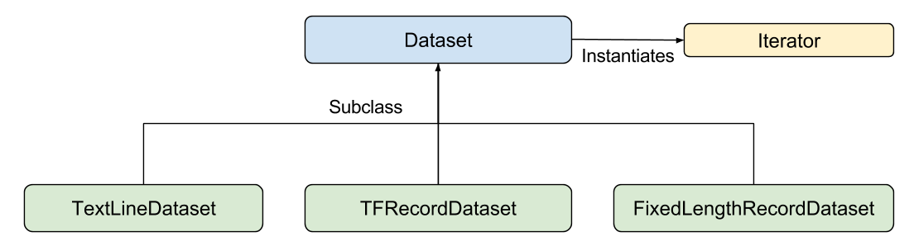

# 预创建的 Estimator

本文档介绍了 TensorFlow 编程环境，并向您展示了如何在 TensorFlow 中解决**鸢尾花（Iris）**分类问题。 

介绍的程序是 tensorflow/model下的  [`premade_estimator.py`](https://github.com/tensorflow/models/blob/master/samples/core/get_started/premade_estimator.py)。此程序使用 [`iris_data.py`](https://github.com/tensorflow/models/blob/master/samples/core/get_started/iris_data.py) 获取其训练数据。 

TensorFlow 提供一个包含多个 API 层的**编程堆栈**：


强烈建议使用下列 API 编写 TensorFlow 程序：

+ [Estimator](https://tensorflow.google.cn/guide/estimators)：代表一个完整的模型。Estimator API 提供一些方法来训练模型、判断模型的准确率并生成预测。
+ [Estimator 的数据集](https://tensorflow.google.cn/guide/datasets_for_estimators)：构建数据输入管道。Dataset API 提供一些方法来加载和操作数据，并将数据馈送到模型中。Dataset API 与 Estimator API **合作无间**。

## 鸢尾花概览

四个特征（花萼长度、花萼宽度、花瓣长度、花瓣宽度），这些特征表示为 `float32` 数值数据。 

一个标签（下列任意一种：山鸢尾 (0)、变色鸢尾 (1)、维吉尼亚鸢尾 (2)），该标签表示为 `int32` 分类数据。

例子： 

| 花萼长度 | 花萼宽度 | 花瓣长度 | 花瓣宽度 | 品种（标签）      |
| -------- | -------- | -------- | -------- | ----------------- |
| 5.1      | 3.3      | 1.7      | 0.5      | 0（山鸢尾）       |
| 5.0      | 2.3      | 3.3      | 1.0      | 1（变色鸢尾）     |
| 6.4      | 2.8      | 5.6      | 2.2      | 2（维吉尼亚鸢尾） |

## 采用 Estimator 进行编程的概览

Estimator 是 TensorFlow 对完整模型的高级表示。它会处理初始化、日志记录、保存和恢复等细节部分，并具有很多其他功能，以便您可以专注于模型。有关更多详情，请参阅

Estimator 是从 [`tf.estimator.Estimator`](https://tensorflow.google.cn/api_docs/python/tf/estimator/Estimator) 衍生而来的任何类。TensorFlow 提供一组[预创建的 Estimator](https://tensorflow.google.cn/api_docs/python/tf/estimator)（例如 `LinearRegressor`）来实现常见的机器学习算法。除此之外，可以编写**自定义 Estimator**。

根据预创建的 Estimator 编写 TensorFlow 程序，您必须执行 [Estimator](estimator)中谈到的下列任务：

+ 创建一个或多个输入函数。
+ 定义模型的特征列。
+ 实例化 Estimator，指定特征列和各种超参数。
+ 在 Estimator 对象上调用一个或多个方法（训练、评估、预测），传递适当的输入函数作为数据的来源。

### 1 数据集输入函数

您必须创建输入函数来提供用于训练、评估和预测的数据。 

**输入函数**是返回 tf.data.Dataset 对象的函数，此对象会输出下列含有两个元素的元组：

+ [`features`](https://developers.google.cn/machine-learning/glossary/#feature) - Python 字典，其中： 
  + 每个键都是特征的名称。
  + 每个值都是包含此特征所有值的数组。
+ `label` - 包含每个样本的标签值的数组。

为了理解，看下面这个简单的实现：

 ```python
def input_evaluation_set():
    features = {'SepalLength': np.array([6.4, 5.0]),
                'SepalWidth':  np.array([2.8, 2.3]),
                'PetalLength': np.array([5.6, 3.3]),
                'PetalWidth':  np.array([2.2, 1.0])}
    labels = np.array([2, 1])
    return features, labels
 ```

不过，我们建议使用 TensorFlow 的 Dataset API，它可以解析各种数据。概括来讲，Dataset API 包含下列类：



各个类如下：

+ `Dataset` - 包含创建和转换数据集的方法的基类。您还可以通过该类从内存中的数据或 Python 生成器初始化数据集。
+ `TextLineDataset` - 从文本文件中读取行。
+ `TFRecordDataset` - 从 TFRecord 文件中读取记录。
+ `FixedLengthRecordDataset` - 从二进制文件中读取具有固定大小的记录。
+ `Iterator` - 提供一次访问一个数据集元素的方法。

使用 Dataset API，您可以轻松地从大量并行文件中读取记录，并将它们合并为单个数据流。 

为了简化此示例，我们将使用 [Pandas](https://pandas.pydata.org/) 加载数据，并利用此内存中的数据构建输入管道。 

以下是用于在此程序中进行训练的输入函数（位于 [`iris_data.py`](https://github.com/tensorflow/models/blob/master/samples/core/get_started/iris_data.py) 中）：

```python
def train_input_fn(features, labels, batch_size):
    """An input function for training"""
    # Convert the inputs to a Dataset.
    dataset = tf.data.Dataset.from_tensor_slices((dict(features), labels))

    # Shuffle, repeat, and batch the examples.
    return dataset.shuffle(1000).repeat().batch(batch_size)
```


### 2 定义特征列

**特征列**是一个对象，用于说明模型应该如何使用特征字典中的原始输入数据。在构建 Estimator 模型时，您会向其传递一个特征列的列表，其中包含您希望模型使用的每个特征。[`tf.feature_column`](https://tensorflow.google.cn/api_docs/python/tf/feature_column) 模块提供很多用于在模型中表示数据的选项。 

对于鸢尾花问题，4 个原始特征是用数值表示的，因此我们会构建一个特征列的列表，以告知 Estimator 模型将这 4 个特征都表示为 32 位浮点值。因此，创建特征列的代码如下所示： 

```python
# Feature columns describe how to use the input.
my_feature_columns = []
for key in train_x.keys():  # ['SepalLength', 'SepalWidth','PetalLength', 'PetalWidth']
    my_feature_columns.append(tf.feature_column.numeric_column(key=key))
```

特征列可能比上述示例复杂得多。我们将在入门指南的[后面部分](https://tensorflow.google.cn/guide/feature_columns)详细介绍特征列。

我们已经介绍了希望模型如何表示原始特征（可以使用lamada函数），现在可以构建 Estimator 了。

### 3 实例化Estimator

鸢尾花问题是一个经典的分类问题。幸运的是，TensorFlow 提供了几个预创建的分类器 Estimator[预创建的 Estimator](https://tensorflow.google.cn/api_docs/python/tf/estimator)，对于鸢尾花问题，[`tf.estimator.DNNClassifier`](https://tensorflow.google.cn/api_docs/python/tf/estimator/DNNClassifier) 似乎是最好的选择。我们将如下所示地实例化此 Estimator ：

```python
# Build a DNN with 2 hidden layers and 10 nodes in each hidden layer.
classifier = tf.estimator.DNNClassifier(
    feature_columns=my_feature_columns,
    # Two hidden layers of 10 nodes each.
    hidden_units=[10, 10],
    # The model must choose between 3 classes.
    n_classes=3)
```

### 4 训练评估预测

我们好像并没有看到损失函数等，应该是都在预创建的模型里了。。

我们已经有一个 Estimator 对象，现在可以调用方法来执行下列操作：

+ 训练模型。
+ 评估经过训练的模型。
+ 使用经过训练的模型进行预测。

**训练**

```python
# Train the Model.
classifier.train(
    input_fn=lambda:iris_data.train_input_fn(train_x, train_y,
                                             args.batch_size),
    steps=args.train_steps)
```

没懂这句话：：：我们将 `input_fn` 调用封装在 [`lambda`](https://docs.python.org/3/tutorial/controlflow.html) 中以获取参数，同时提供一个不采用任何参数的输入函数，正如 Estimator 预计的那样。`steps` 参数告知方法在训练多步后停止训练。 

**评估**

注意这里的`input_fn`是 `eval_input_fn`，与我们对 train 方法的调用不同，我们没有传递 steps 参数来进行评估。我们的 eval_input_fn 只生成一个周期的数据。

```python
# Evaluate the model.
eval_result = classifier.evaluate(
    input_fn=lambda:iris_data.eval_input_fn(test_x, test_y, args.batch_size))

print('\nTest set accuracy: {accuracy:0.3f}\n'.format(**eval_result))
```

**利用经过训练的模型进行预测（推理）**

```python
# Generate predictions from the model
expected = ['Setosa', 'Versicolor', 'Virginica']
predict_x = {
    'SepalLength': [5.1, 5.9, 6.9],
    'SepalWidth': [3.3, 3.0, 3.1],
    'PetalLength': [1.7, 4.2, 5.4],
    'PetalWidth': [0.5, 1.5, 2.1],
}

predictions = classifier.predict(
    input_fn=lambda:iris_data.eval_input_fn(predict_x,
                                            batch_size=args.batch_size))
```

**模型的训练和推理在一个程序中完成，没有参数的保存和重载。如果需要参数的保存和重载又该如何操作？？**查看[checkpoint](checkpoint)

`predict` 方法返回一个 Python 可迭代对象，为每个样本生成一个预测结果字典。以下代码输出了一些预测及其概率： 

```python
template = ('\nPrediction is "{}" ({:.1f}%), expected "{}"')

for pred_dict, expec in zip(predictions, expected):
    class_id = pred_dict['class_ids'][0]
    probability = pred_dict['probabilities'][class_id]

    print(template.format(iris_data.SPECIES[class_id],
                          100 * probability, expec))
```

会输出：

```pyhton
...
Prediction is "Setosa" (99.6%), expected "Setosa"

Prediction is "Versicolor" (99.8%), expected "Versicolor"

Prediction is "Virginica" (97.9%), expected "Virginica"
```

