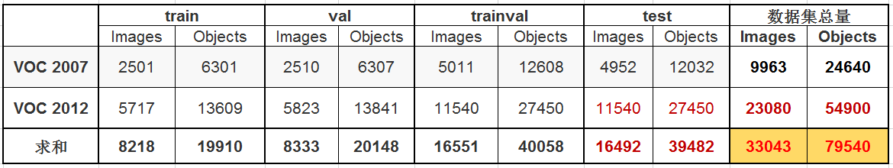

## 简介

PASCAL VOC挑战赛 （The [PASCAL](http://pascallin2.ecs.soton.ac.uk/) Visual Object Classes ）是一个世界级的计算机视觉挑战赛, [PASCAL](http://www.pascal-network.org/)全称：Pattern Analysis, Statical Modeling and Computational Learning，是一个由欧盟资助的网络组织。 

这项挑战赛已于2012年停止举办了，但是研究者仍然可以在其服务器上提交预测结果以评估模型的性能。 

对于现在的研究者来说比较重要的两个年份的数据集是 PASCAL VOC 2007 与 PASCAL VOC 2012，这两个数据集频频在现在的一些检测或分割类的论文当中出现。 

+ [PASCAL主页](http://host.robots.ox.ac.uk/pascal/VOC/) 与 [排行榜](http://host.robots.ox.ac.uk:8080/leaderboard/main_bootstrap.php) （榜上已几乎看不到传统的视觉模型了，全是基于深度学习的）
+ [PASCAL VOC 2007 挑战赛主页](http://host.robots.ox.ac.uk/pascal/VOC/voc2007/) 与 [PASCAL VOC 2012 挑战赛主页](http://host.robots.ox.ac.uk/pascal/VOC/voc2012/) 与 [PASCAL VOC Evaluation Server](http://host.robots.ox.ac.uk:8080/).


## 数据集概况

### 层级结构

PASCAL VOC 数据集的20个类别及其层级结构：

 

+ 从2007年开始，PASCAL VOC每年的数据集都是这个层级结构
+ 总共四个大类：vehicle,household,animal,person
+ **总共20个小类**，预测的时候是只输出图中黑色粗体的类别
+ **数据集主要关注分类和检测，也就是分类和检测用到的数据集相对规模较大。**关于其他任务比如分割，动作识别等，其数据集一般是分类和检测数据集的子集。


**论文中针对 VOC2007和VOC2012 的具体用法有以下几种：**

+ 只用VOC2007的trainval 训练，使用VOC2007的test测试
+ 只用VOC2012的trainval 训练，使用VOC2012的test测试，这种用法很少使用，因为大家都会结合VOC2007使用
+ 使用 VOC2007 的 train+val 和 VOC2012的 train+val 训练，然后使用 VOC2007的test测试，这个用法是论文中经常看到的 07+12 ，研究者可以自己测试在VOC2007上的结果，因为VOC2007的test是公开的。
+ 使用 VOC2007 的 train+val+test 和 VOC2012的 train+val训练，然后使用 VOC2012的test测试，这个用法是论文中经常看到的 07++12 ，这种方法需提交到VOC官方服务器上评估结果，因为VOC2012 test没有公布。
+ 先在 MS COCO 的 trainval 上预训练，再使用 VOC2007 的 train+val、 VOC2012的 train+val 微调训练，然后使用 VOC2007的test测试，这个用法是论文中经常看到的 07+12+COCO 。
+ 先在 MS COCO 的 trainval 上预训练，再使用 VOC2007 的 train+val+test 、 VOC2012的 train+val 微调训练，然后使用 VOC2012的test测试 ，这个用法是论文中经常看到的 07++12+COCO，这种方法需提交到VOC官方服务器上评估结果，因为VOC2012 test没有公布。

### VOC 2017与2012对比

黑色字体所示数字是官方给定的，由于VOC2012数据集中 test 部分没有公布，因此红色字体所示数字为估计数据，按照PASCAL 通常的划分方法，即 trainval 与test 各占总数据量的一半。




## 标注信息

```xml
<annotation>
	<folder>VOC2007</folder>
	<filename>000001.jpg</filename>
	<source>
		<database>The VOC2007 Database</database>
		<annotation>PASCAL VOC2007</annotation>
		<image>flickr</image>
		<flickrid>341012865</flickrid>
	</source>
	<owner>
		<flickrid>Fried Camels</flickrid>
		<name>Jinky the Fruit Bat</name>
	</owner>
	<size>
		<width>353</width>
		<height>500</height>
		<depth>3</depth>
	</size>
	<segmented>0</segmented>
	<object>
		<name>dog</name>
		<pose>Left</pose>
		<truncated>1</truncated>
		<difficult>0</difficult>
		<bndbox>
			<xmin>48</xmin>
			<ymin>240</ymin>
			<xmax>195</xmax>
			<ymax>371</ymax>
		</bndbox>
	</object>
	<object>
		<name>person</name>
		<pose>Left</pose>
		<truncated>1</truncated>
		<difficult>0</difficult>
		<bndbox>
			<xmin>8</xmin>
			<ymin>12</ymin>
			<xmax>352</xmax>
			<ymax>498</ymax>
		</bndbox>
	</object>
</annotation>
```

+ ilename ：文件名
+ source，owner：图片来源，及拥有者
+ size：图片大小
+ segmented：是否分割
+ object：表明这是一个目标，里面的内容是目标的相关信息
  + name：object名称，20个类别
  + pose：拍摄角度：front, rear, left, right, unspecified
  + truncated：目标是否被截断（比如在图片之外），或者被遮挡（超过15%）
  + difficult：检测难易程度，这个主要是根据目标的大小，光照变化，图片质量来判断
  + bndbox：bounding box 的左上角点和右下角点的4个坐标值。 


## 提交格式

Classification Task 例子：

comp3_det_test_car.txt: 

```
000004 0.702732 89 112 516 466
000006 0.870849 373 168 488 229
000006 0.852346 407 157 500 213
000006 0.914587 2 161 55 221
000008 0.532489 175 184 232 201
```

每一类都有一个txt文件，里面每一行都是测试集中的一张图片，每行的格式按照如下方式组织 

```
<image identifier> <confidence> <left> <top> <right> <bottom>
```

## 评估标准

参考，[AP ](AP) 和 [目标检测评价标准](目标检测评价标准mAP)


## 数据集组织结构

暂时没看


参考：

[PASCAL VOC简介](https://arleyzhang.github.io/articles/1dc20586/)

