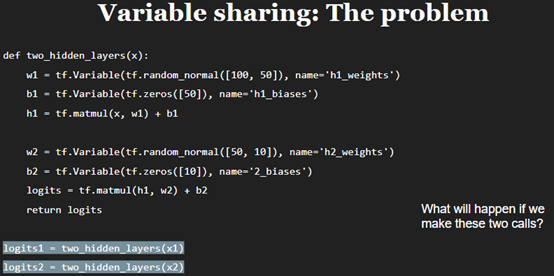
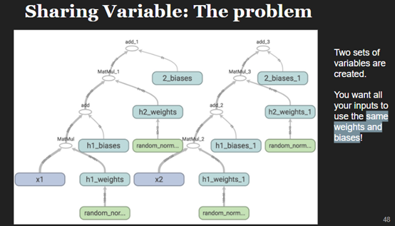
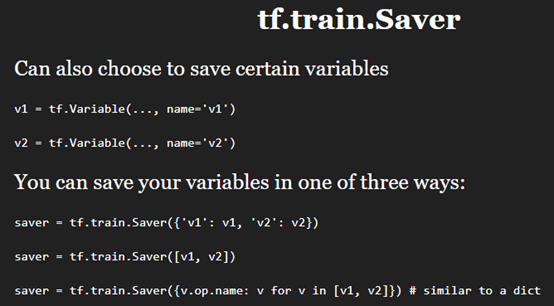
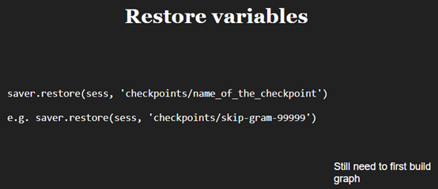
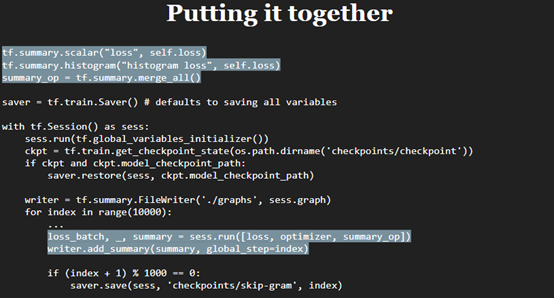
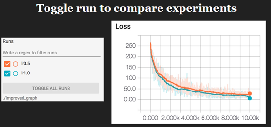
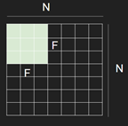
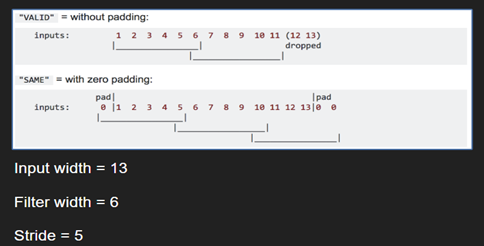
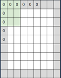
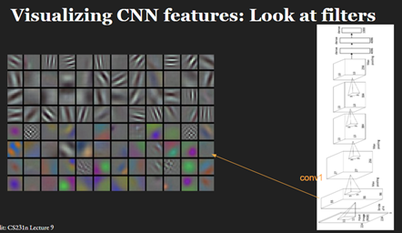

[TOC]

###  tf.Variable() shortcoming

运行图时，会有两组变量被创建。。看图：




### Global step

```python
global_step = tf.Variable(0, dtype=tf.int32, trainable=False, name='global_step')
```

Very common in TensorFlow program.

### tf.train.Saver()

#### 保存特定参数





#### 检查checkpoint


### tf.summary

#### 步骤

Visualize our summary statistics during our training

+ tf.summary.scalar
+ tf.summary.histogram
+ tf.summary.image

三步走：1、creat summarie and op 2、run it 3、write summaries to file



### Tensorboard

#### 曲线对比

If you save your summaries into different sub-folder in your graph folder, you can compare your progresses. For example, the first time we run our model with learning rate 1.0, we save it in ‘improved_graph/lr1.0’ and the second time we run our model, we save it in ‘improved_graph/lr0.5：



### TensorFlow Padding Options？

#### Valid：

可以想象，先不考虑第一个F×F的卷积（+1），（也可以倒着考虑，但由于可能要删除最后及列，故还是正方向考虑）或者说以卷积核右边为对象，它会走直到N×N的右边，走过的长度为N-F，步长是S，所以卷积出来的尺寸为(N - F) / stride，取下整。可能会droped右面，下面的像素。

或者new_height = new_width = (N– F + 1) / S，结果向上取整，从几何意义上理解不了这个公式。

#### Same(with zero padding)



Same的意思可以理解为，~~卷积出来的尺寸与原图像尺寸大小相等~~。原来不是，上面一句话仅仅适用于步长为1的情况。实际情况看上图。“SAME”尝试向左和向右均匀填充，但如果要添加的列数为奇数，则会向右添加额外的列，如本示例中的情况（只展示水平方向）。

+ stride=1，核大小F是奇数：

  积核尺寸是奇数，那么只需让卷积核的中间与图像左上角对齐，卷积直到中间与图像的右上角对齐，那么卷积核相对于图像多出来的行数即为padding的像素值。卷积后大小：（F-1）/2。

+ stride=S：

  stride=1卷积出来的尺寸与原图大小一致。

  当stride=S时，卷积（无论卷积核多大）出来的尺寸为**N / S （结果向上取整）**，这个可以从卷积核的**左边**考虑，卷积直到无法移动。这里Padding的数量要从结果往回推导。

  参考上图，现在已知卷积核大小F×F（为了简化问题，这里选长宽一样的），步长为S，卷积后的尺寸大小为N / S （结果向上取整）。补0后的问题就是Valid卷积方式而且是能整除的方式哦。

  考虑宽度：Valid的公式为(N - F) / stride + 1= N/S=new_weight，所以补0后的宽度为**(new_weight – 1) × S + F**。这里可以沿着valid公式的几何思路反过来考虑。

  左边：Pddding_left = padding_need/2  右边：Pddding = padding_need-padding_left。

### Visualizing convnet features

不知道。



### tf.transpose()

```python
 net = tf.transpose(inputs, perm=(0, 2, 3, 1))  # 转换维度，(0,1,2,3)=>(0,2,1,3))
```

### list相加

```python
import numpy as np
a = [5,10,10,3]   # shape(4,)
b =[6,4]  # shape(2,)

print(a+b)  # [5, 10, 10, 3, 6, 4]
print(np.add(a, b)) # ValueError: operands could not be broadcast together with shapes (4,) (2,) 
```

### tf.concat()

```python
t1 = [[1, 2, 3], [4, 5, 6]]
t2 = [[7, 8, 9], [10, 11, 12]]
tf.concat([t1, t2], axis=0)  # [[1, 2, 3], [4, 5, 6], [7, 8, 9], [10, 11, 12]]
tf.concat([t1, t2], axis=1)  # [[1, 2, 3, 7, 8, 9], [4, 5, 6, 10, 11, 12]]

# tensor t3 with shape [2, 3]
# tensor t4 with shape [2, 3]
tf.shape(tf.concat([t3, t4], 0))  # [4, 3]
tf.shape(tf.concat([t3, t4], 1))  # [2, 6]
```

怎么想象两个矩阵在某一维度上的连接呢？

多维度矩阵，可以想象成：从0维展开，又会得到len(Numpy[0])个多维矩阵。

```python
import numpy as np
t1 = [[1, 2, 3], [4, 5, 6]]
t2 = [[7, 8, 9], [10, 11, 12]]
print(t1[0])  # [1, 2, 3]
print(t1[1])  # [4, 5, 6]
```

axis=0的链接即：t1[0]，t1[1]...，+  t2[0]，t2[1]...也就是：t1+t2

axis=1的连接即：a\[0]+b\[0]，a[1]+b[1]

下面看一下：

```python
t1 = [[[1, 2], [2, 3]], [[4, 4], [5, 3]]]  # shape:(2,2,2)
t2 = [[[7, 4], [8, 4]], [[2, 10], [15, 11]]] # shape:(2,2,2)
tf.concat([t1, t2], -1)  # 倒数第一维，-1+rank = -1+3 = 2
>>>
[[[ 1,  2,  7,  4],
  [ 2,  3,  8,  4]],

 [[ 4,  4,  2, 10],
  [ 5,  3, 15, 11]]]
```

axis=2的连接即：a\[0]\[0]+b\[0]\[0]，a\[0]\[1]+b\[0]\[1]，a\[1]\[0]+b\[1]\[0]，a\[1]\[1]+b\[1]\[1]

尝试想象上面，令axis=1的连接。a\[0]+b\[0]，a[1]+b[1]

连接操作，形状维度不变，只是在某一维度膨胀了。

### tf.stack() and tf.unstack()

> **Note:** If you are concatenating along a new axis consider using stack. E.g. 

与concat不同，这是堆叠。

```python
import numpy as np
a = [[[1, 2], [2, 3]], [[4, 4], [5, 3]]]  # shape:(2,2,2)
b = [[[7, 4], [8, 4]], [[2, 10], [15, 11]]]
c = np.stack([a,b],-1)
print(c)
print(c.shape)
>>>
[[[[ 1  7]
   [ 2  4]]

  [[ 2  8]
   [ 3  4]]]


 [[[ 4  2]
   [ 4 10]]

  [[ 5 15]
   [ 3 11]]]]

(2, 2, 2, 2)
```

### tf.gfile.FastGFile

```
image_data = tf.gfile.FastGFile('img/a.jpg', 'rb').read()
>>>
b'\x89PNG\r\n\x1a\n\x00\x00\x00\rIHDR\x00\x00\x00O\x00\x00\x00\x17\x08\x06\x00\x00\x00J\xe9\x12\x1c\x00\x00\x00\x01sRGB\x00\xae\xce\x1c\xe9\x00……
```

返回什么呢？image_data: string, JPEG encoding of RGB image

### TensorFlow-Slim Data

[TensorFlow-Slim Data](https://github.com/tensorflow/tensorflow/tree/master/tensorflow/contrib/slim/python/slim/data)

